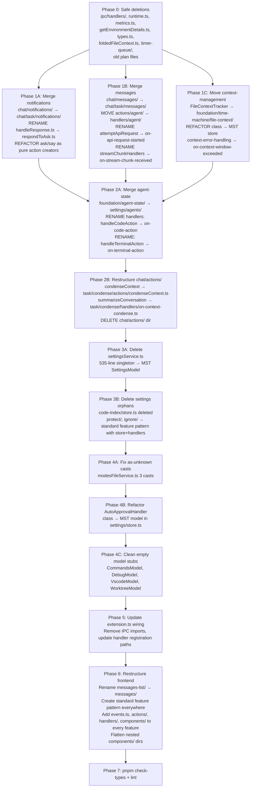

# Architectural Restructure v2 — FINAL PLAN (Revised 2026-05-30)

> ⚠️ **WHITELIST RULE**: If a file or folder is NOT listed in the target structure below, it MUST NOT exist in the filesystem. Any file found outside this structure must be deleted, refactored, or migrated into the paths described here.

---

## Core Principles

1. **No pipeline state machine** — no string-based `pipelineState` enum. Pure `Action → Intent → Handler → Event` pattern.
2. **No factories** — MST/MobX reactive stores only. No `createJabberwockApi`, no `Task.create`.
3. **No `as unknown` casts** — strict typing. Zero casts in `src/`.
4. **Each event type has its own intent handler** — extensible by adding new intent types and handlers.
5. **Reactive programming** — Intents flow through IntentBus. Intents stored in MST `IntentStore`, dispatched by `IntentBus` to feature handlers. No imperative pipeline loops.
6. **IntentBus with dynamic handler registration** — each feature exports `register*Handlers(bus)` called at startup. Handlers are pure functions.
7. **No chat reactions.ts** — replaced by `setupIntents()`.
8. **No streaming MST model** — streaming state is ephemeral, not stored.
9. **No topic/ dir** — topic is a field in `TaskStore`, nothing more.
10. **No message queue dir** — messages store IS the queue.
11. **EventBridge is the SOLE IPC channel** — no `ipc/handlers/` layer. EventBridge is ONLY for frontend↔backend communication (typed Events, not Intents).
12. **Intents are per-side** — frontend and backend each have their own `IntentBus` + `IntentStore`. Intents NEVER cross the EventBridge.
13. **EventBridge transports Events** — Events are the typed protocol between frontend↔backend.
14. **Action Creators** — `ask()`, `say()`, and all other actions are action creators (like Redux actionCreators). They create Intents via `intentStore.createIntent()`, NOT callbacks. One action creator can create multiple Intents.
15. **ALL state in MST** — zero module-level state variables (`let` state outside MST is forbidden). No singletons, no global `_taskRegistry`, no `lastUsedTs`.
16. **No callbacks** — only Intents dispatched through IntentBus. No `pWaitFor`, no `callback` in payload.
17. **Task owns Messages and Notifications** — `task/messages/` and `task/notifications/` are _per-task sub-models_, NOT at `chat/` level.
18. **Entity hierarchy**: History → Chat → Task → Messages | Notifications. Intents is standalone (global, per-side).
19. **Standardized feature pattern** — every feature follows:

---

## NAMING CONVENTIONS (MUST FOLLOW)

### File naming per concern

| Concern                  | Naming Rule          | Examples                                                                                            |
| ------------------------ | -------------------- | --------------------------------------------------------------------------------------------------- |
| **MST Store**            | `store.ts`           | Feature state model                                                                                 |
| **Events**               | `events.ts`          | Event type definitions (EventBridge protocol)                                                       |
| **Barrel**               | `index.ts`           | Re-exports all public API of the feature                                                            |
| **Action Creator**       | `actionName.ts`      | Imperative verb — "do something". Pure function that calls `intentStore.createIntent()`             |
| **Intent Handler**       | `on-<past-event>.ts` | "on something happened". Registered on IntentBus, dispatched when Intent of matching type is queued |
| **Component** (frontend) | `ComponentName.tsx`  | PascalCase React component                                                                          |
| **Helper/Utility**       | `helperName.ts`      | camelCase, placed in `helpers/` subfolder of the feature                                            |

### What goes where

```
actions/              ← Action creators (imperative verb: do something)
  ├── sendMessage.ts       export function sendMessage(...) { intentStore.createIntent(...) }
  ├── approveAsk.ts        export function approveAsk(...) { intentStore.createIntent(...) }
  └── index.ts

handlers/             ← Intent handlers (on-<past-event>: react to something that happened)
  ├── on-message-received.ts    export function onMessageReceived(intent, ctx) { ... }
  ├── on-response-received.ts   export function onResponseReceived(intent, ctx) { ... }
  ├── helpers/                  ← Helper/utility functions used by handlers
  │   ├── backoff.ts
  │   └── index.ts
  └── index.ts                 ← register*Handlers(bus)

components/ (frontend only)  ← React UI components
  ├── MessageArea.tsx
  ├── row/
  │   └── View.tsx
  └── index.ts
```

### Action creator vs Handler — how to tell

| Criterion                   | Action Creator (actions/)                                 | Intent Handler (handlers/)                           |
| --------------------------- | --------------------------------------------------------- | ---------------------------------------------------- |
| Naming                      | Imperative verb: `startTask`, `sendMessage`, `approveAsk` | Past event: `on-task-started`, `on-message-received` |
| Calls                       | `intentStore.createIntent(...)`                           | Reads intent payload, calls action creators          |
| Return                      | `void` (creates Intents)                                  | `Promise<void>` (processes intent)                   |
| Who calls it                | App code, other action creators, handlers                 | IntentBus (via dispatch reaction)                    |
| Can create multiple Intents | Yes (one action = multiple Intents)                       | No (one handler = one intent processed)              |
| Has side effects            | No (only creates Intents)                                 | Yes (calls APIs, writes files, etc.)                 |

### Naming examples

**WRONG ❌** (mixed concerns):

```
actions/handleResponse.ts       ← "handle" sounds like a handler, but it's in actions/
actions/agent/attemptApiRequest.ts ← imperative verb, but it's called by IntentBus (it's a handler!)
```

**CORRECT ✅**:

```
actions/respondToAsk.ts         ← action creator
actions/approveAsk.ts           ← action creator
actions/denyAsk.ts              ← action creator
handlers/agent/on-api-request-started.ts  ← handler (was attemptApiRequest.ts)
handlers/agent/on-stream-chunk-received.ts ← handler (was streamChunkHandlers.ts)
```

---

## STANDARD FEATURE PATTERN

### Backend feature

```
feature/
├── store.ts           MST model. Define state, actions, views, volatility.
├── events.ts          Event type definitions (sent over EventBridge).
├── index.ts           Barrel. Re-export public symbols.
├── actions/           Action creators. Pure functions that create Intents.
│   ├── doSomething.ts
│   └── index.ts
├── handlers/          Intent handlers. Registered on IntentBus via `register*Handlers(bus)`.
│   ├── on-something-happened.ts
│   ├── helpers/       (optional) Helper/utility functions.
│   └── index.ts
[sub-feature]/         Same pattern recursively (store, events, index, actions, handlers).
```

### Frontend feature

```
feature/
├── store.ts           MST model (same as backend).
├── events.ts          Event type definitions (same as backend).
├── index.ts           Barrel.
├── actions/           Action creators (same pattern as backend).
├── handlers/          Intent handlers (same pattern as backend).
├── components/        React components. Sub-dirs for logical grouping.
│   ├── FeatureView.tsx
│   ├── sub-group/
│   │   └── ...
│   └── index.ts
[sub-feature]/         Same pattern recursively.
```

---

## 🔴 THE 4 ENTITIES — DEFINITION (MUST READ)

These are the ONLY 4 communication entities in the system. Everything maps to one of them.

### 1. 🎯 Intent — Internal reactive communication (PER-SIDE)

**"What needs to be done."** Based on reactive programming. Created via `intentStore.createIntent()` and processed by handlers registered per feature.

- `IntentStore` stores pending intents (id, type, payload, status, createdAt, traceId, parentId)
- `IntentBus` observes the store via MobX reaction, dispatches to handlers by `intent.type`
- Handlers live in feature dirs, registered via `register*Handlers(bus)` at startup
- Intents are **per-side**: frontend has its own IntentBus+IntentStore, backend has its own. Intents NEVER cross EventBridge.
- Examples: `user.message.received`, `tool.execution.required`, `ask.notification.created`, `message.display.requested`

### 2. 📣 Notification — Communication with user

**UI signals for the user.** Dialog, popup, log, error, ask question, show message.

- Lives in `task/notifications/` as MST sub-model (NOT at `chat/` level)
- Types: `ask` (same as `prompt()` in browser), `say` (common notification), `vscode` (VS Code popup/modal), `log` (console)
- Created via action creators: `ask()` creates 3 Intents (ask.notification + message.display + log.write)

### 3. 💬 Message — Chat messages in task context

**What's visible in the chat feed.** Bot responses, user messages, MCP tool calls, script output.

- Lives in `task/messages/` as MST sub-model (NOT at `chat/` level)
- Everything that appears in the task chat log
- Examples: assistant response, user message, tool result, API conversation history

### 4. 🔄 Event — Frontend ↔ Backend communication ONLY

**Typed IPC between webview and backend.** Serialized, sent via `postMessage()`.

- Defined in `packages/types/src/event-registry.ts`
- Handled by `EventBridge` class (sole IPC channel)
- Events are the transport layer between frontend and backend Intents
- NOT for internal reactive logic — that's what Intents are for

---

### Architecture diagram — Two IntentBuses, One EventBridge

```
┌─────────────────────────────────────────────────────────────────┐
│  FRONTEND (webview-ui)                                          │
│                                                                 │
│  User Action → Action Creator (actions/)                         │
│                  ├─ intentStore.createIntent(ask.notification)    │
│                  ├─ intentStore.createIntent(message.display)     │
│                  └─ intentStore.createIntent(log.write)          │
│                       ↓                                          │
│                  IntentBus (frontend)                             │
│                       ↓                                          │
│                  ┌───┼───────┐                                   │
│                  ↓   ↓       ↓                                   │
│           notif    msg    settings                                │
│           handlers handlers handlers                              │
│               ↓                                                  │
│          EventBridge.postMessage(EVENT) ──────────────────┐      │
└─────────────────────────────────────────────────────────│──┘      │
                                                           │        │
                                                           ▼        │
┌─────────────────────────────────────────────────────────│──┐      │
│  BACKEND (extension)                                     │  │    │
│                                                          │  │    │
│  EventBridge receives EVENT ──────────────────────────────┘      │
│       ↓                                                          │
│  Action Creator (actions/, creates Intents)                       │
│       └─ intentStore.createIntent(task.created)                   │
│            ↓                                                      │
│       IntentBus (backend)                                         │
│            ↓                                                      │
│       ┌───┼───────┐                                              │
│       ↓   ↓       ↓                                              │
│    task   msg    settings                                         │
│    handlers handlers handlers                                     │
│         ↓                                                        │
│    EventBridge.postMessage(EVENT) ←───────────────────────────────┘
└──────────────────────────────────────────────────────────────────┘
```

### Key flow rules

1. **Frontend**: User action → Action Creator (actions/) creates Intents → IntentBus dispatches → Handlers (handlers/) run → **EventBridge.postMessage(EVENT)** to backend
2. **Backend**: EventBridge receives EVENT → Action Creator (actions/) creates Intents → IntentBus dispatches → Handlers (handlers/) run → **EventBridge.postMessage(EVENT)** to frontend
3. **Intents NEVER cross EventBridge** — only Events do
4. **EventBridge is a pure pipe** — `postMessageToWebview()` is its only responsibility
5. **Action Creators create Intents** — they are NOT callbacks. One action creator can create multiple Intents

---

## TARGET DIRECTORY STRUCTURE — BACKEND (src/features/)

```
src/features/
│
├── intents/                                       ← 🎯 INTENT — GLOBAL core (BACKEND)
│   ├── store.ts                                   IntentStoreModel MST — stays
│   ├── bus.ts                                     IntentBus — stays
│   ├── context.ts                                 IntentHandlerContext — stays
│   └── index.ts                                   setupIntents() — stays
│
├── history/                                       ← 💬 MESSAGE — chat history (NOT task history)
│   ├── store.ts                                   HistoryModel MST — stays
│   ├── events.ts                                  stays
│   ├── index.ts                                   stays
│   └── handlers/
│       ├── on-history.ts                          stays
│       └── index.ts                               stays
│
├── chat/                                          ← 💬 MESSAGE + 📣 NOTIFICATION — per-chat container
│   ├── store.ts                                   ChatModel MST — stays
│   ├── events.ts                                  stays
│   ├── index.ts                                   stays
│   │
│   ├── task/                                      ← 💬 MESSAGE — task execution context (per-chat)
│   │   ├── store.ts                               TaskModel MST — stays
│   │   ├── events.ts                              stays
│   │   ├── index.ts                               stays
│   │   │
│   │   ├── handlers/                              ← 🎯 INTENT handlers (task lifecycle)
│   │   │   ├── on-task-created.ts                 stays (was src/features/chat/task/handlers/on-task-created.ts)
│   │   │   ├── on-task-cancelled.ts               stays
│   │   │   ├── on-task-resumed.ts                 stays
│   │   │   ├── on-tool-execution-required.ts      stays
│   │   │   ├── on-script-finished.ts              stays
│   │   │   ├── on-cancel-requested.ts             stays
│   │   │   ├── on-clear-requested.ts              stays
│   │   │   ├── on-commands-requested.ts           stays
│   │   │   ├── on-condense-context-requested.ts   stays
│   │   │   ├── on-new-requested.ts                stays
│   │   │   ├── on-resume-requested.ts             stays
│   │   │   ├── on-sync-enabled-set.ts             stays
│   │   │   ├── on-textarea-enhance-requested.ts   stays
│   │   │   ├── on-textarea-files-search-requested.ts stays
│   │   │   ├── on-textarea-images-dragged.ts      stays
│   │   │   ├── on-textarea-images-select-requested.ts stays
│   │   │   ├── on-todolist-update.ts              stays
│   │   │   ├── on-webview-launched.ts             stays
│   │   │   └── index.ts                           registerAllTaskHandlers() — stays
│   │   │
│   │   ├── actions/                               ← Action creators (create Intents)
│   │   │   ├── startTask.ts                       stays (was src/features/chat/task/actions/startTask.ts)
│   │   │   ├── resumeTask.ts                      stays (was src/features/chat/task/actions/resumeTask.ts)
│   │   │   ├── abortRunningTask.ts                stays
│   │   │   ├── abortTask.ts                       stays
│   │   │   ├── delegateTask.ts                    stays
│   │   │   ├── taskRegistry.ts                    stays
│   │   │   ├── aggregateTaskCosts.ts              stays
│   │   │   ├── createTaskModel.ts                 stays
│   │   │   └── index.ts                           stays
│   │   │
│   │   ├── messages/                              ← 💬 MESSAGE — core entity (per-task sub-model)
│   │   │   │                                        MOVED from src/features/chat/messages/
│   │   │   ├── store.ts                           MessagesModel MST — stays
│   │   │   ├── events.ts                          MOVED from src/features/chat/messages/events.ts
│   │   │   ├── index.ts                           MOVED from src/features/chat/messages/index.ts
│   │   │   │
│   │   │   ├── actions/                           ← Action creators (message operations)
│   │   │   │   │                                    MOVED from src/features/chat/messages/actions/
│   │   │   │   ├── addMessage.ts                  MOVED
│   │   │   │   ├── sendMessage.ts                 MOVED
│   │   │   │   ├── updateMessage.ts               MOVED
│   │   │   │   ├── saveMessages.ts                MOVED
│   │   │   │   ├── persistMessages.ts             MOVED
│   │   │   │   ├── presentAssistantMessage.ts     MOVED
│   │   │   │   ├── saveApiConversation.ts         MOVED
│   │   │   │   ├── getSavedMessages.ts            MOVED
│   │   │   │   ├── apiHistoryPersistence.ts       MOVED
│   │   │   │   ├── handleNotificationMessage.ts   MOVED
│   │   │   │   ├── mentions.ts                    MOVED
│   │   │   │   ├── processUserContentMentions.ts  MOVED
│   │   │   │   ├── resolveImageMentions.ts        MOVED
│   │   │   │   ├── messageManager.ts              MOVED (service class, stays as helper in actions/)
│   │   │   │   ├── types.ts                       MOVED
│   │   │   │   └── index.ts                       MOVED
│   │   │   │
│   │   │   ├── handlers/                          ← 🎯 INTENT handlers (message-specific)
│   │   │   │   │                                    MOVED from src/features/chat/messages/handlers/
│   │   │   │   │                                    + MERGED from src/features/chat/messages/actions/agent/
│   │   │   │   │                                    (actions/agent/ files were NOT action creators — they are handlers)
│   │   │   │   ├── user/
│   │   │   │   │   ├── on-message-received.ts     MOVED from messages/handlers/user/
│   │   │   │   │   └── index.ts
│   │   │   │   ├── agent/
│   │   │   │   │   ├── on-api-request-started.ts  ← RENAMED from messages/actions/agent/attemptApiRequest.ts
│   │   │   │   │   │                                  (IntentBus dispatches api.request.started here)
│   │   │   │   │   ├── on-response-received.ts    MOVED from messages/handlers/agent/
│   │   │   │   │   ├── on-request-failed.ts       MOVED from messages/handlers/agent/
│   │   │   │   │   ├── on-stream-chunk-received.ts ← RENAMED from messages/actions/agent/streamChunkHandlers.ts
│   │   │   │   │   │                                  (handler for stream.chunk.received Intent)
│   │   │   │   │   ├── helpers/                    ← helpers used by handlers above
│   │   │   │   │   │   ├── backoff.ts              MOVED from messages/actions/agent/
│   │   │   │   │   │   ├── contextWindow.ts        MOVED from messages/actions/agent/
│   │   │   │   │   │   ├── handleStream.ts         MOVED from messages/actions/agent/
│   │   │   │   │   │   ├── mergeConsecutiveApiMessages.ts  MOVED from messages/actions/agent/
│   │   │   │   │   │   ├── prepareApiRequest.ts    MOVED from messages/actions/agent/
│   │   │   │   │   │   ├── rateLimit.ts            MOVED from messages/actions/agent/
│   │   │   │   │   │   ├── rawChunkProcessor.ts    MOVED from messages/actions/agent/
│   │   │   │   │   │   ├── requestAbortManager.ts  MOVED from messages/actions/agent/
│   │   │   │   │   │   ├── store.ts                MOVED from messages/actions/agent/ (StreamingModel MST)
│   │   │   │   │   │   ├── streaming.ts            MOVED from messages/actions/agent/
│   │   │   │   │   │   └── index.ts
│   │   │   │   │   └── index.ts
│   │   │   │   ├── mcp/
│   │   │   │   │   ├── on-tool-result.ts           MOVED from messages/handlers/mcp/
│   │   │   │   │   └── index.ts
│   │   │   │   ├── on-message-delete-confirmed.ts  MOVED from messages/handlers/
│   │   │   │   ├── on-message-delete-requested.ts  MOVED
│   │   │   │   ├── on-message-edit-confirmed.ts    MOVED
│   │   │   │   ├── on-message-edit-requested.ts    MOVED
│   │   │   │   ├── on-send-message-requested.ts    MOVED
│   │   │   │   ├── helpers/
│   │   │   │   │   ├── deleteOperations.ts         MOVED from messages/handlers/helpers/
│   │   │   │   │   ├── editOperations.ts           MOVED
│   │   │   │   │   ├── findMessageIndices.ts       MOVED
│   │   │   │   │   └── resolveIncomingImages.ts    MOVED
│   │   │   │   └── index.ts                        registerAllMessageHandlers()
│   │   │   │
│   │   │   └── index.ts
│   │   │
│   │   ├── notifications/                          ← 📣 NOTIFICATION — core entity (per-task sub-model)
│   │   │   │                                        MOVED from src/features/chat/notifications/
│   │   │   │                                        MERGED with existing src/features/chat/task/notifications/
│   │   │   ├── store.ts                            NotificationsModel MST — stays
│   │   │   ├── events.ts                           MOVED from src/features/chat/notifications/events.ts
│   │   │   ├── index.ts
│   │   │   │
│   │   │   ├── actions/                            ← Action creators (create Intents, NOT callbacks)
│   │   │   │   ├── ask.ts                          ← RENAMED from chat/notifications/actions/ask.ts
│   │   │   │   │                                      Now creates 3 Intents:
│   │   │   │   │                                        1. ask.notification → notification handler
│   │   │   │   │                                        2. message.display → message handler
│   │   │   │   │                                        3. log.write → settings handler
│   │   │   │   ├── say.ts                          ← RENAMED from chat/notifications/actions/say.ts
│   │   │   │   │                                      Now creates 2 Intents:
│   │   │   │   │                                        1. say.notification → notification handler
│   │   │   │   │                                        2. message.display → message handler
│   │   │   │   ├── respondToAsk.ts                 ← RENAMED from chat/notifications/actions/handleResponse.ts
│   │   │   │   │                                      Was named "handle" but is an action creator.
│   │   │   │   │                                      Contains: approveAsk, denyAsk, handleWebviewAskResponse (all action creators)
│   │   │   │   │                                      Creates AskResponseReceived Intent (not callback)
│   │   │   │   ├── AskIgnoredError.ts              MOVED from chat/notifications/actions/
│   │   │   │   ├── addNotification.ts              MOVED from chat/task/notifications/actions/
│   │   │   │   ├── findNotification.ts             MOVED from chat/task/notifications/actions/
│   │   │   │   ├── overwriteNotifications.ts       MOVED from chat/task/notifications/actions/
│   │   │   │   ├── updateNotification.ts           MOVED from chat/task/notifications/actions/
│   │   │   │   └── index.ts
│   │   │   │
│   │   │   ├── handlers/                           ← 🎯 INTENT handlers
│   │   │   │   │                                    MOVED from src/features/chat/notifications/handlers/
│   │   │   │   │                                    MERGED with existing src/features/chat/task/notifications/
│   │   │   │   ├── on-ask-response-received.ts     MOVED from notifications/handlers/
│   │   │   │   ├── on-notification-persist.ts      MOVED from notifications/handlers/
│   │   │   │   ├── on-checkpoint-diff-requested.ts MOVED from notifications/handlers/
│   │   │   │   ├── on-checkpoint-restore-requested.ts MOVED from notifications/handlers/
│   │   │   │   ├── on-elicitation-response.ts      MOVED from notifications/handlers/
│   │   │   │   ├── on-tts-enabled-set.ts           MOVED from notifications/handlers/
│   │   │   │   ├── on-tts-play.ts                  MOVED from notifications/handlers/
│   │   │   │   ├── on-tts-speed-set.ts             MOVED from notifications/handlers/
│   │   │   │   ├── on-tts-stop.ts                  MOVED from notifications/handlers/
│   │   │   │   └── index.ts                        registerAllNotificationHandlers()
│   │   │   │
│   │   │   └── index.ts
│   │   │
│   │   ├── tools/                                  ← 🛠 EXECUTION — tool implementations
│   │   │   ├── store.ts                            ToolModel MST — stays
│   │   │   ├── index.ts
│   │   │   ├── actions/
│   │   │   │   ├── executeTools.ts                 stays
│   │   │   │   ├── finalizeToolCalls.ts            stays
│   │   │   │   ├── flushPendingToolResults.ts      stays
│   │   │   │   ├── toolCallExecutor.ts             stays
│   │   │   │   ├── tool-parser.ts                  stays
│   │   │   │   ├── validateToolResultIds.ts        stays
│   │   │   │   ├── buildToolDefinitions.ts         stays
│   │   │   │   └── index.ts
│   │   │   ├── helpers/
│   │   │   │   ├── imageHelpers.ts                 stays
│   │   │   │   └── toolResultFormatting.ts         stays
│   │   │   ├── tool classes (15+ files)
│   │   │   │   (AttemptCompletionTool, ReadFileTool, ApplyDiffTool,
│   │   │   │    WriteToFileTool, ExecuteCommandTool, ListFilesTool,
│   │   │   │    SearchFilesTool, SearchReplaceTool, CodebaseSearchTool,
│   │   │   │    UseMcpToolTool, AskFollowupQuestionTool, RunSlashCommandTool,
│   │   │   │    GenerateImageTool, AwaitBatchCompletionTool,
│   │   │   │    SearchAndReplaceTool, validateToolUse.ts)
│   │   │   │                                   — stays (was src/features/chat/tools/)
│   │   │   └── ToolRepetitionDetector.ts          stays
│   │   │
│   │   └── condense/                               ← context condensing
│   │       ├── store.ts                            NEW — MST model for condensing state
│   │       ├── events.ts                           NEW
│   │       ├── index.ts
│   │       ├── actions/
│   │       │   ├── condenseContext.ts              ← RENAMED from src/features/chat/actions/condenseContext.ts
│   │       │   │                                      (was at chat/actions/, now action creator in task/condense/actions/)
│   │       │   └── index.ts
│   │       └── handlers/
│   │           ├── on-context-condense.ts           ← RENAMED from src/features/chat/actions/summarizeConversation.ts
│   │           │                                      (was at chat/actions/, now handler in task/condense/handlers/)
│   │           └── index.ts
│   │
│   └── text-area/                                  ← text area UI state
│       ├── store.ts                                stays
│       ├── events.ts                               stays
│       ├── index.ts
│       ├── actions/
│       │   └── index.ts                            (empty barrel for future)
│       └── handlers/
│           ├── handlers.ts                         stays (contains text-area intent handlers)
│           └── index.ts
│
├── settings/                                       ← ⚙ CONFIG
│   ├── store.ts                                    SettingsModel MST — stays, ABSORBS settingsService.ts
│   ├── events.ts                                   stays
│   ├── index.ts                                    stays
│   ├── actions/
│   │   ├── export.ts                               stays
│   │   ├── import.ts                               stays
│   │   └── index.ts
│   ├── handlers/                                   ← 🎯 INTENT handlers (settings)
│   │   ├── on-settings-opened.ts                   stays
│   │   ├── on-settings-changed.ts                  stays
│   │   ├── on-diagnostics.ts                       stays
│   │   ├── on-mode-switch-requested.ts             stays
│   │   ├── on-settings-agents.ts                   stays
│   │   ├── on-settings-api-config.ts               stays
│   │   ├── on-settings-code-index.ts               stays
│   │   ├── on-settings-context.ts                  stays
│   │   ├── on-settings-core.ts                     stays
│   │   ├── on-settings-files.ts                    stays
│   │   ├── on-settings-mcp.ts                      stays
│   │   ├── on-settings-models.ts                   stays
│   │   ├── on-settings-skills.ts                   stays
│   │   ├── on-settings-vscode.ts                   stays
│   │   ├── on-settings-webview.ts                  stays
│   │   ├── on-settings-worktree.ts                 stays
│   │   └── index.ts                                registerAllSettingsHandlers()
│   │
│   ├── agents/                                     ← source of truth for agents
│   │   ├── store.ts                                AgentStore MST — stays
│   │   │                                              ABSORBS: foundation/agent-state/store.ts
│   │   ├── events.ts                               stays
│   │   ├── index.ts
│   │   ├── actions/
│   │   │   └── index.ts
│   │   ├── handlers/
│   │   │   ├── on-modes-file-changed.ts            stays
│   │   │   ├── on-code-action.ts                   ← RENAMED from foundation/agent-state/handlers.ts (handleCodeAction)
│   │   │   ├── on-terminal-action.ts               ← RENAMED from foundation/agent-state/handlers.ts (handleTerminalAction)
│   │   │   └── index.ts
│   │   └── modesFileService.ts                     stays — REFACTOR: remove 3 `as unknown` casts
│   │
│   ├── models/                                     ← LLM model config
│   │   ├── store.ts                                stays
│   │   ├── events.ts                               stays
│   │   ├── index.ts
│   │   ├── api-config-store.ts                     stays
│   │   ├── ProviderSettingsManager.ts              stays
│   │   └── handlers/
│   │       └── handlers.ts                         stays
│   │
│   ├── mcp/                                        ← MCP server config
│   │   ├── store.ts                                stays
│   │   ├── events.ts                               stays
│   │   ├── index.ts
│   │   ├── mcpIntegration.ts                       stays
│   │   └── handlers/
│   │       └── handlers.ts                         stays
│   │
│   ├── skills/
│   │   ├── store.ts                                stays
│   │   ├── events.ts                               NEW
│   │   ├── index.ts
│   │   └── handlers/
│   │       └── index.ts                            (empty barrel for future)
│   │
│   ├── context/                                    ← system prompt assembly
│   │   ├── store.ts                                stays
│   │   ├── events.ts                               stays
│   │   ├── index.ts
│   │   ├── systemPrompt.ts                         stays
│   │   ├── system.ts                               stays
│   │   ├── types.ts                                stays
│   │   ├── responses.ts                            stays
│   │   ├── sections/                               stays (10+ files)
│   │   ├── tools/
│   │   │   ├── filter-tools-for-mode.ts            stays
│   │   │   ├── native-tools/                       stays (15+ files)
│   │   │   └── index.ts
│   │   └── handlers/
│   │       └── handlers.ts                         stays
│   │
│   ├── webview/                                    ← webview-specific settings
│   │   ├── store.ts                                stays
│   │   ├── events.ts                               NEW
│   │   ├── index.ts
│   │   └── handlers/
│   │       └── index.ts                            (empty barrel for future)
│   │
│   ├── worktree/
│   │   ├── store.ts                                stays
│   │   ├── events.ts                               stays
│   │   ├── index.ts
│   │   └── handlers/
│   │       └── handlers.ts                         stays
│   │
│   ├── protect/
│   │   ├── store.ts                                NEW — MST model for protection rules
│   │   ├── events.ts                               NEW
│   │   ├── index.ts
│   │   ├── actions/
│   │   │   └── index.ts
│   │   └── handlers/
│   │       └── protection.ts                       ← RE-CREATED from settings/protect/protection.ts (pure functions)
│   │
│   └── ignore/
│       ├── store.ts                                NEW — MST model for ignore rules
│       ├── events.ts                               NEW
│       ├── index.ts
│       ├── actions/
│       │   └── index.ts
│       └── handlers/
│           └── ignore.ts                           ← RE-CREATED from settings/ignore/ignore.ts (pure functions)
│
├── cloud/                                          ← 🔄 EVENT — cloud auth/sync
│   ├── store.ts                                    stays
│   ├── events.ts                                   stays
│   ├── index.ts                                    stays
│   └── handlers/
│       ├── on-cloud.ts                             stays
│       └── index.ts                                stays
│
├── marketplace/                                    ← 🔄 EVENT — marketplace (placeholder)
│   ├── store.ts                                    stays
│   ├── events.ts                                   stays
│   ├── index.ts                                    stays
│   └── handlers/
│       ├── on-marketplace.ts                       stays
│       └── index.ts                                stays
│
├── foundation/
│   ├── store.ts                                    stays
│   ├── events.ts                                   stays
│   ├── index.ts                                    stays
│   │
│   ├── window-manager/                             ← 🔄 EVENT — window/tab management
│   │   ├── store.ts                                stays
│   │   ├── events.ts                               stays
│   │   ├── index.ts
│   │   ├── actions/
│   │   │   └── ready.ts                            stays
│   │   └── handlers/                               stays (9 files)
│   │
│   ├── time-machine/                               ← 🛠 UTILITY — file system + checkpoints
│   │   ├── store.ts                                CheckpointStoreModel MST — stays
│   │   ├── events.ts                               stays
│   │   ├── index.ts
│   │   ├── actions/
│   │   │   ├── checkpoints.ts                      stays
│   │   │   ├── getTimeMachine.ts                   stays
│   │   │   ├── stats.ts                            stays
│   │   │   └── strategies/multi-search-replace.ts  stays
│   │   ├── VirtualWorkspace.ts                     stays
│   │   ├── files/store.ts                          stays
│   │   ├── apply/                                  ← patch application (stays)
│   │   │   ├── apply.ts, parser.ts, seek-sequence.ts, index.ts
│   │   │
│   │   └── file-context/                           ← MOVED from src/features/chat/context-management/
│   │       ├── store.ts                            NEW — MST model (was FileContextTracker class with mutable state)
│   │       ├── events.ts                           NEW
│   │       ├── index.ts
│   │       ├── actions/
│   │       │   └── FileContextTracker.ts            ← REFACTORED from chat/context-management/FileContextTracker.ts
│   │       │                                            Class → MST store actions
│   │       ├── handlers/
│   │       │   ├── on-context-management-required.ts  MOVED from chat/context-management/handlers/
│   │       │   ├── on-context-window-exceeded.ts   ← RENAMED from chat/context-management/context-error-handling.ts
│   │       │   └── index.ts
│   │       └── helpers/
│   │           └── FileContextTrackerTypes.ts      MOVED from chat/context-management/
│   │
│   ├── mst/                                        ← 🛠 UTILITY — MST foundation
│   │   ├── store.ts                                stays
│   │   └── events.ts                               stays
│   │
│   └── webview/
│       ├── EventBridge.ts                          🔄 EVENT — typed IPC bridge (SOLE channel)
│       │                                              stays, ABSORBS ipc/handlers/ functionality
│       ├── store.ts                                stays
│       ├── events.ts                               stays
│       ├── index.ts
│       ├── actions/
│       │   ├── generateSystemPrompt.ts             stays
│       │   ├── messageEnhancer.ts                  stays
│       │   └── index.ts
│       ├── handlers/
│       │   ├── webviewMessageHandler.ts            stays
│       │   ├── checkpointRestoreHandler.ts         stays
│       │   └── index.ts
│       └── types.ts                                stays
│
├── store.ts                                        RootStore MST composition — stays
├── events.ts                                       global event definitions — stays
├── constants.ts                                    stays
└── mst-custom-types.ts                             stays
```

---

## TARGET DIRECTORY STRUCTURE — FRONTEND (webview-ui/src/features/)

The frontend MUST mirror the backend's entity structure. Every feature follows the same pattern as backend, PLUS `components/` for React UI.

**Standard frontend feature pattern:**

```
feature/
├── store.ts           MST model
├── events.ts          Event type definitions
├── index.ts           Barrel
├── actions/           Action creators
├── handlers/          Intent handlers
├── components/        React components
[sub-feature]/         Same pattern recursively (with components/)
```

```
webview-ui/src/features/
│
├── intents/                                       ← 🎯 INTENT — frontend-side (NEW)
│   ├── store.ts                                   IntentStoreModel MST — NEW
│   ├── bus.ts                                     IntentBus — NEW
│   ├── context.ts                                 IntentHandlerContext — NEW
│   └── index.ts                                   setupIntents() for frontend — NEW
│
├── history/                                       ← 💬 MESSAGE — chat history
│   ├── store.ts                                   stays (was history/store.ts)
│   ├── events.ts                                  NEW
│   ├── index.ts                                   stays
│   ├── components/
│   │   └── index.ts                               (empty, future UI)
│   ├── actions/
│   │   └── index.ts
│   └── handlers/
│       └── index.ts
│
├── chat/                                          ← 💬 MESSAGE + 📣 NOTIFICATION — main chat session UI
│   ├── store.ts                                   ChatUIContext — stays (was chat/store.tsx)
│   ├── events.ts                                  stays
│   ├── index.ts                                   stays
│   ├── components/
│   │   └── index.ts                               (empty, top-level chat components)
│   ├── actions/
│   │   └── index.ts
│   ├── handlers/
│   │   └── index.ts
│   │
│   ├── task/                                      ← task state (mirrors backend TaskModel)
│   │   ├── store.ts                               stays (was chat/task/store.ts)
│   │   ├── events.ts                              NEW
│   │   ├── index.ts                               NEW
│   │   ├── components/
│   │   │   └── index.ts                           (empty, future task UI components)
│   │   ├── actions/
│   │   │   └── index.ts
│   │   └── handlers/
│   │       └── index.ts
│   │
│   ├── messages/                                  ← 💬 MESSAGE — message rendering UI
│   │   │                                            RENAMED from messages-list/
│   │   ├── store.tsx                               stays (was messages-list/store.tsx)
│   │   ├── events.ts                              NEW
│   │   ├── index.ts                               stays (was messages-list/index.ts)
│   │   ├── actions/
│   │   │   └── index.ts                           NEW (empty barrel, future action creators)
│   │   ├── handlers/
│   │   │   └── index.ts                           NEW (empty barrel, future intent handlers)
│   │   ├── components/                            ← MOVED from messages-list/ flat files
│   │   │   ├── AskResponder.tsx                   MOVED (was messages-list/ask-responder.tsx)
│   │   │   ├── AssistantMessage.tsx               MOVED (was messages-list/assistant-message.tsx)
│   │   │   ├── HomeScreen.tsx                     MOVED (was messages-list/home-screen.tsx)
│   │   │   ├── MessageArea.tsx                    MOVED (was messages-list/message-area.tsx)
│   │   │   ├── UserMessage.tsx                    MOVED (was messages-list/user-message.tsx)
│   │   │   ├── Sidebar.tsx                        MOVED (was messages-list/sidebar.tsx)
│   │   │   ├── TaskActions.tsx                    MOVED (was messages-list/task-actions.tsx)
│   │   │   ├── ToolRenderer.tsx                   MOVED (was messages-list/tool-renderer.tsx)
│   │   │   ├── TerminalOutput.tsx                 MOVED (was messages-list/terminal-output.tsx)
│   │   │   ├── ProgressIndicator.tsx              MOVED (was messages-list/progress-indicator.tsx)
│   │   │   ├── ReasoningBlock.tsx                 MOVED (was messages-list/reasoning-block.tsx)
│   │   │   ├── Markdown.tsx                       MOVED (was messages-list/markdown.tsx)
│   │   │   ├── FileChangesPanel.tsx               MOVED (was messages-list/file-changes-panel.tsx)
│   │   │   ├── ParentContextPanel.tsx             MOVED (was messages-list/parent-context-panel.tsx)
│   │   │   ├── KeyboardShortcuts.tsx              MOVED (was messages-list/keyboard-shortcuts.tsx)
│   │   │   ├── SlashCommandItemSimple.tsx         MOVED (was messages-list/slash-command-item-simple.tsx)
│   │   │   ├── OpenMarkdownPreviewButton.tsx      MOVED (was messages-list/open-markdown-preview-button.tsx)
│   │   │   ├── Utils.ts                           MOVED (was messages-list/utils.ts)
│   │   │   ├── Constants.ts                       MOVED (was messages-list/constants.ts)
│   │   │   ├── command/                           MOVED (was messages-list/command/)
│   │   │   │   ├── CommandExecutionError.tsx
│   │   │   │   ├── CommandExecution.tsx
│   │   │   │   └── CommandPatternSelector.tsx
│   │   │   ├── context-management/                MOVED (was messages-list/context-management/)
│   │   │   ├── hooks/
│   │   │   │   └── useRowDisplay.tsx              MOVED (was messages-list/hooks/)
│   │   │   ├── row/                               MOVED (was messages-list/row/)
│   │   │   │   ├── View.tsx
│   │   │   │   ├── ErrorRow.tsx
│   │   │   │   ├── WarningRow.tsx
│   │   │   │   ├── InProgressRow.tsx
│   │   │   │   ├── CondensationErrorRow.tsx
│   │   │   │   ├── CondensationResultRow.tsx
│   │   │   │   ├── TruncationResultRow.tsx
│   │   │   │   ├── TooManyToolsWarning.tsx
│   │   │   │   ├── ProfileViolationWarning.tsx
│   │   │   │   ├── ContextManagementIndex.ts
│   │   │   │   └── index.ts
│   │   │   ├── tool/                              MOVED (was messages-list/tool/)
│   │   │   │   ├── FileEditTool.tsx
│   │   │   │   ├── MiscTool.tsx
│   │   │   │   ├── ModeTaskTool.tsx
│   │   │   │   ├── ReadFileTool.tsx
│   │   │   │   ├── SearchTool.tsx
│   │   │   │   ├── SkillCommandTool.tsx
│   │   │   │   └── index.ts
│   │   │   ├── utils/                             MOVED (was messages-list/utils/)
│   │   │   │   ├── file-changes-from-messages.ts
│   │   │   │   ├── grouped-messages.ts
│   │   │   │   └── visible-messages.ts
│   │   │   └── index.ts
│   │   └── view.tsx                               stays (was messages-list/view.tsx — top-level view)
│   │
│   ├── notifications/                             ← 📣 NOTIFICATION UI (per-task)
│   │   ├── store.tsx                              stays (was notifications/store.tsx)
│   │   ├── events.ts                              NEW
│   │   ├── index.ts                               stays
│   │   ├── actions/
│   │   │   └── index.ts                           (empty barrel for future action creators)
│   │   ├── handlers/
│   │   │   └── index.ts                           (empty barrel for future intent handlers)
│   │   ├── components/                            ← MOVED from notifications/ flat files
│   │   │   ├── Constants.ts                       MOVED (was notifications/constants.ts)
│   │   │   ├── Announcement.tsx                   MOVED (was notifications/announcement.tsx)
│   │   │   ├── AutoApprovedRequestLimitWarning.tsx MOVED
│   │   │   ├── FollowUpSuggest.tsx                MOVED
│   │   │   ├── MessageModificationConfirmationDialog.tsx MOVED
│   │   │   ├── QueuedMessages.tsx                 MOVED
│   │   │   ├── ask/                               MOVED (was notifications/ask/)
│   │   │   │   ├── AskResponder.tsx
│   │   │   │   ├── AutoApprovalWarningAsk.tsx
│   │   │   │   ├── CommandAsk.tsx
│   │   │   │   ├── CompletionResultAsk.tsx
│   │   │   │   ├── FollowUpAsk.tsx
│   │   │   │   ├── InteractiveAppAsk.tsx
│   │   │   │   ├── MistakeLimitAsk.tsx
│   │   │   │   ├── UseMcpServerAsk.tsx
│   │   │   │   ├── View.tsx
│   │   │   │   ├── store.ts
│   │   │   │   ├── components/ (was nested — MERGE into this dir)
│   │   │   │   └── index.ts
│   │   │   ├── say/                               MOVED (was notifications/say/)
│   │   │   │   ├── ApiReqSay.tsx
│   │   │   │   ├── ErrorSay.tsx
│   │   │   │   ├── FeedbackSay.tsx
│   │   │   │   ├── MiscSay.tsx
│   │   │   │   ├── SayTool.tsx
│   │   │   │   ├── TextSay.tsx
│   │   │   │   ├── View.tsx
│   │   │   │   ├── components/ (was nested — MERGE into this dir)
│   │   │   │   └── index.ts
│   │   │   ├── batch/                             MOVED (was notifications/batch/)
│   │   │   │   ├── BatchDiffApproval.tsx
│   │   │   │   ├── BatchFilePermission.tsx
│   │   │   │   ├── BatchListFilesPermission.tsx
│   │   │   │   ├── components/ (was nested — MERGE into this dir)
│   │   │   │   └── index.ts
│   │   │   ├── checkpoint/                        MOVED (was notifications/checkpoint/)
│   │   │   │   ├── CheckpointMenu.tsx
│   │   │   │   ├── CheckpointRestoreDialog.tsx
│   │   │   │   ├── CheckpointSaved.tsx
│   │   │   │   ├── CheckpointWarning.tsx
│   │   │   │   ├── schema.ts
│   │   │   │   ├── components/ (was nested — MERGE into this dir)
│   │   │   │   └── index.ts
│   │   │   ├── mcp/                               MOVED (was notifications/mcp/)
│   │   │   │   ├── McpExecution.tsx
│   │   │   │   ├── store.ts
│   │   │   │   ├── components/ (was nested — MERGE into this dir)
│   │   │   │   └── index.ts
│   │   │   └── index.ts
│   │   └── index.ts
│   │
│   ├── text-area/                                 ← text area UI
│   │   ├── store.ts                               stays (was text-area/store.ts)
│   │   ├── events.ts                              NEW
│   │   ├── index.ts                               stays
│   │   ├── actions/
│   │   │   └── index.ts
│   │   ├── handlers/
│   │   │   └── index.ts
│   │   ├── components/
│   │   │   ├── View.tsx                           MOVED (was text-area/view.tsx)
│   │   │   ├── ShareButton.tsx                    MOVED (was text-area/share-button.tsx)
│   │   │   ├── WorktreeSelector.tsx               MOVED (was text-area/worktree-selector.tsx)
│   │   │   ├── context-drag-drop/                 MOVED (was text-area/context-drag-drop/)
│   │   │   │   ├── ChatDropZoneOverlay.tsx
│   │   │   │   └── useChatDragAndDrop.ts
│   │   │   ├── hooks/
│   │   │   │   └── use-prompt-history.tsx         MOVED (was text-area/hooks/)
│   │   │   ├── mention/                           MOVED (was text-area/mention/)
│   │   │   │   ├── ContextMenu.tsx
│   │   │   │   └── Mention.tsx
│   │   │   └── utils/                             MOVED (was text-area/utils/)
│   │   │       ├── clipboard.ts
│   │   │       ├── context-mentions.ts
│   │   │       ├── dropUtils.ts
│   │   │       ├── image-utils.ts
│   │   │       ├── index.ts
│   │   │       ├── inputUtils.ts
│   │   │       ├── pasteUtils.ts
│   │   │       ├── path-mentions.ts
│   │   │       └── textUtils.ts
│   │   └── index.ts
│   │
│   ├── topic/                                     ← topic rendering UI
│   │   ├── store.ts                               stays (was topic/store.ts)
│   │   ├── events.ts                              NEW
│   │   ├── index.ts                               stays
│   │   ├── actions/
│   │   │   └── index.ts
│   │   ├── handlers/
│   │   │   └── index.ts
│   │   ├── components/
│   │   │   ├── View.tsx                           MOVED (was topic/view.tsx)
│   │   │   ├── ChangeDisplay.tsx                  MOVED (was topic/change-display.tsx)
│   │   │   ├── ListDisplay.tsx                    MOVED (was topic/list-display.tsx)
│   │   │   ├── ParentContextPanel.tsx             MOVED
│   │   │   ├── UpdateTodoListToolBlock.tsx        MOVED
│   │   │   ├── progress/
│   │   │   │   └── ContextWindowProgress.tsx      MOVED
│   │   │   ├── todo/
│   │   │   │   ├── TodoChangeDisplay.tsx
│   │   │   │   ├── TodoListDisplay.tsx
│   │   │   │   └── UpdateTodoListToolBlock.tsx
│   │   │   └── utils/
│   │   │       └── cost-formatting.ts             MOVED
│   │   └── index.ts
│   │
│   ├── message-handler/                           ← 🛠 utility — message handling for frontend
│   │   ├── store.ts                               stays (was message-handler/store.ts)
│   │   ├── events.ts                              NEW
│   │   ├── index.ts                               NEW
│   │   ├── actions/
│   │   │   └── index.ts
│   │   ├── handlers/
│   │   │   └── index.ts
│   │   └── components/
│   │       └── index.ts                           (empty, no UI)
│   │
│   └── extension-state/                           ← extension connection state
│       ├── store.ts                               stays (was extension-state/store.ts)
│       ├── events.ts                              NEW
│       ├── index.ts                               NEW
│       ├── actions/
│       │   └── index.ts
│       ├── handlers/
│       │   └── index.ts
│       └── components/
│           └── index.ts
│
├── cloud/                                         ← 🔄 EVENT — cloud UI
│   ├── store.ts                                   stays (was cloud/store.ts)
│   ├── events.ts                                  NEW
│   ├── index.ts                                   NEW
│   ├── actions/
│   │   └── index.ts
│   ├── handlers/
│   │   └── index.ts
│   └── components/
│       └── utils/
│           └── TelemetryClient.ts                 stays
│
├── diagnostics/                                   ← ❌ UI for error diagnostics
│   ├── store.ts                                   stays (was diagnostics/store.ts)
│   ├── events.ts                                  NEW
│   ├── index.ts                                   NEW
│   ├── actions/
│   │   └── index.ts
│   ├── handlers/
│   │   └── index.ts
│   └── components/
│       └── index.ts
│
├── foundation/
│   ├── agent-state/                               ← corresponds to backend settings/agents/
│   │   ├── store.ts                               stays (was foundation/agent-state/store.ts)
│   │   ├── events.ts                              NEW
│   │   ├── index.ts                               stays
│   │   ├── actions/
│   │   │   └── index.ts
│   │   ├── handlers/
│   │   │   └── index.ts
│   │   └── components/
│   │       ├── api-config/                        stays
│   │       ├── auto-approve/                      stays
│   │       ├── indexing/                          stays
│   │       └── mode-selector/                     stays
│   │
│   ├── mst-bridge/
│   │   ├── bridge.ts                              stays
│   │   ├── events.ts                              NEW
│   │   ├── index.ts                               NEW
│   │   └── components/
│   │       └── index.ts
│   │
│   └── window-manager/
│       ├── store.tsx                              stays
│       ├── events.ts                              NEW
│       ├── index.ts                               stays
│       ├── actions/
│       │   └── index.ts
│       ├── handlers/
│       │   └── index.ts
│       └── components/
│           ├── WindowLayer.tsx                    MOVED (was window-manager/window-layer.tsx)
│           └── index.ts
│
├── history/
│   ├── store.ts                                   stays (was history/store.ts)
│   ├── events.ts                                  NEW
│   ├── index.ts                                   NEW
│   ├── actions/
│   │   └── index.ts
│   ├── handlers/
│   │   └── index.ts
│   └── components/
│       └── index.ts
│
├── marketplace/
│   ├── store.ts                                   stays (was marketplace/store.ts)
│   ├── events.ts                                  NEW
│   ├── index.ts                                   NEW
│   ├── actions/
│   │   └── index.ts
│   ├── handlers/
│   │   └── index.ts
│   └── components/
│       └── index.ts
│
├── settings/
│   ├── store.ts                                   stays (was settings/store.ts)
│   ├── events.ts                                  NEW
│   ├── index.ts                                   NEW
│   ├── actions/
│   │   └── index.ts
│   ├── handlers/
│   │   └── index.ts
│   ├── components/
│   │   └── index.ts
│   ├── mcp/
│   │   ├── store.ts                               stays
│   │   ├── events.ts                              NEW
│   │   ├── index.ts
│   │   └── components/
│   │       ├── McpExecution.tsx                   stays
│   │       └── McpIframeRenderer.tsx              stays
│   ├── mcp-servers/
│   │   ├── store.ts                               stays
│   │   ├── events.ts                              NEW
│   │   ├── index.ts
│   │   └── components/
│   │       └── index.ts
│   ├── models/
│   │   ├── store.ts                               stays
│   │   ├── events.ts                              NEW
│   │   ├── index.ts
│   │   └── components/
│   │       └── index.ts
│   └── skills/
│       ├── store.ts                               stays
│       ├── events.ts                              NEW
│       ├── index.ts
│       └── components/
│           └── index.ts
│
├── root-store.ts                                  stays
│
└── index.ts
```

---

## WHAT MUST BE DELETED

The following files and directories currently exist but are NOT in the target structure above.

### Phase 0 — Safe Deletions (backup-free)

| #    | Path                                                 | Reason                                                                |
| ---- | ---------------------------------------------------- | --------------------------------------------------------------------- |
| 0.1  | `src/features/ipc/handlers/index.ts`                 | EventBridge is sole channel. DELETE entirely.                         |
| 0.2  | `src/features/chat/actions/runtime.ts`               | Module-level state violation (4 vars). All state → TaskModel. DELETE. |
| 0.3  | `src/features/chat/actions/metrics.ts`               | Not proper actions. Migrate to TaskModel store actions. DELETE.       |
| 0.4  | `src/features/chat/actions/getEnvironmentDetails.ts` | Already planned deletion. Inline in consumers. DELETE.                |
| 0.5  | `src/features/chat/actions/types.ts`                 | Legacy callback types. Replaced by Intent patterns. DELETE.           |
| 0.6  | `src/features/chat/actions/index.ts`                 | Barrel for deleted files. DELETE.                                     |
| 0.7  | `src/features/chat/actions/foldedFileContext.ts`     | MOVED to `foundation/time-machine/file-context/`. DELETE old.         |
| 0.8  | `src/features/foundation/timer-queue/` entire dir    | Singleton + empty MST model. DELETE.                                  |
| 0.9  | `plans/migration-plan-v3.md`                         | Outdated. DELETE.                                                     |
| 0.10 | `plans/migration-v4-comprehensive-audit-and-plan.md` | Outdated. DELETE.                                                     |
| 0.11 | `plans/audit-and-migration-v5.md`                    | Outdated. DELETE.                                                     |

### Phase 1 — Delete After Migration

| #    | Path                                                   | Action                                                                     |
| ---- | ------------------------------------------------------ | -------------------------------------------------------------------------- |
| 1.1  | `src/features/chat/context-management/` entire dir     | Contents → `foundation/time-machine/file-context/`. DELETE old.            |
| 1.2  | `src/features/chat/notifications/` entire dir          | Contents → `chat/task/notifications/`. DELETE old.                         |
| 1.3  | `src/features/chat/messages/` entire dir               | Contents → `chat/task/messages/`. DELETE old.                              |
| 1.4  | `src/features/chat/messages/actions/agent/` entire dir | Files → `messages/handlers/agent/` (as handlers or helpers). DELETE old.   |
| 1.5  | `src/features/foundation/agent-state/` entire dir      | Contents → `settings/agents/`. DELETE old.                                 |
| 1.6  | `src/features/settings/settingsService.ts`             | 535-line singleton. ALL state → MST SettingsModel. DELETE after migration. |
| 1.7  | `src/features/settings/code-index/store.ts`            | DELETE entirely. Migrate to MST or Intent pattern.                         |
| 1.8  | `src/features/chat/actions/condenseContext.ts`         | → `task/condense/actions/condenseContext.ts`. DELETE old.                  |
| 1.9  | `src/features/chat/actions/summarizeConversation.ts`   | → `task/condense/handlers/on-context-condense.ts`. DELETE old.             |
| 1.10 | `src/features/chat/store.ts`                           | Stays — but file at `src/features/chat/store.ts` stays, NOT moved          |
| 1.11 | `src/features/settings/ignore/ignore.ts`               | Re-created under `settings/ignore/handlers/ignore.ts`. DELETE old.         |
| 1.12 | `src/features/settings/protect/protection.ts`          | Re-created under `settings/protect/handlers/protection.ts`. DELETE old.    |

### Frontend deletions (after migration)

| #   | Path                                                     | Action                                                     |
| --- | -------------------------------------------------------- | ---------------------------------------------------------- |
| F.1 | `webview-ui/src/features/chat/messages-list/` entire dir | Renamed to `messages/`. DELETE old.                        |
| F.2 | `webview-ui/src/features/chat/notifications/store.tsx`   | → `notifications/store.tsx`. Stays, just path same.        |
| F.3 | `webview-ui/src/features/foundation/agent-state/`        | Mirrors backend. Stays as-is (but ensure events.ts added). |

---

## MIGRATION PHASES (Dependency-Safe Order)



---

## DETAILED MIGRATION STEPS

### Phase 1A — Merge Notifications: `chat/notifications/` → `chat/task/notifications/`

1. Move all files from `src/features/chat/notifications/` into `src/features/chat/task/notifications/`
2. RENAME `handleResponse.ts` → `respondToAsk.ts` (because it's an action creator, not a handler)
3. REFACTOR `ask.ts` — rewrite as pure action creator that creates 3 Intents:
    - `ask.notification` → notification handler → shows UI
    - `message.display` → message handler → adds to chat feed
    - `log.write` → settings handler → writes to log
4. REFACTOR `say.ts` — rewrite as pure action creator that creates 2 Intents:
    - `say.notification` → notification handler
    - `message.display` → message handler
5. REFACTOR `respondToAsk.ts` — creates `ask.response.received` Intent instead of calling callbacks
6. Merge `chat/task/notifications/actions/` (addNotification etc.) with moved actions
7. **After migration:** Delete `src/features/chat/notifications/` directory

### Phase 1B — Merge Messages: `chat/messages/` → `chat/task/messages/`

1. Move all files from `src/features/chat/messages/` into `src/features/chat/task/messages/`
2. **Critical: merge `actions/agent/` into `handlers/agent/` with renames:**
    - `actions/agent/attemptApiRequest.ts` → `handlers/agent/on-api-request-started.ts` (INTENT HANDLER — IntentBus dispatches here)
    - `actions/agent/streamChunkHandlers.ts` → `handlers/agent/on-stream-chunk-received.ts` (INTENT HANDLER)
    - All other files in `actions/agent/`: backoff.ts, contextWindow.ts, handleStream.ts, etc. → `handlers/agent/helpers/`
3. `actions/agent/index.ts` → DELETE (replaced by handlers/agent/index.ts)
4. Update all imports from `../../chat/messages/` to `../../chat/task/messages/`
5. **After migration:** Delete `src/features/chat/messages/` directory

### Phase 1C — Move Context Management

1. `FileContextTracker.ts` → REFACTOR from class to MST store + actions at `foundation/time-machine/file-context/store.ts`
2. `FileContextTrackerTypes.ts` → `foundation/time-machine/file-context/helpers/`
3. `context-error-handling.ts` → `foundation/time-machine/file-context/handlers/on-context-window-exceeded.ts`
4. `handlers/` → `foundation/time-machine/file-context/handlers/`
5. **After migration:** Delete `src/features/chat/context-management/` directory

### Phase 2A — Merge Agent State

1. `foundation/agent-state/store.ts` → merge into `settings/agents/store.ts`
2. `foundation/agent-state/handlers.ts` → split into:
    - `settings/agents/handlers/on-code-action.ts` (was handleCodeAction)
    - `settings/agents/handlers/on-terminal-action.ts` (was handleTerminalAction)
3. **After migration:** Delete `src/features/foundation/agent-state/` directory

### Phase 2B — Restructure `chat/actions/`

1. `condenseContext.ts` → `task/condense/actions/condenseContext.ts`
2. `summarizeConversation.ts` → `task/condense/handlers/on-context-condense.ts`
3. `foldedFileContext.ts` → already moved in 1C
4. **After migration:** Delete `src/features/chat/actions/` directory

### Phase 3A — Delete `settingsService.ts`

Migrate each concern to MST `settings/store.ts`:

- Module-level `let` state → MST model properties
- `initSettingsService()` → `afterCreate()` in SettingsModel
- All getters/setters → MST computed views + actions
- Migration helpers → initialization phase in `afterCreate()`
- **After migration:** Delete `settingsService.ts`, update all 15+ consumer files

### Phase 5 — Update `extension.ts` Wiring

1. Remove: `import { getIpcHandler, registerAllIpcHandlers }` (line 75)
2. Remove: `registerAllIpcHandlers()` (line 707)
3. Replace: `const handler = getIpcHandler(command.commandName)` (line 718) — webview creates Intents via EventBridge
4. Update handler registration paths:
    - `registerAllTaskHandlers` → `chat/task/handlers/` (stays)
    - `registerAllMessageHandlers` → `chat/task/messages/handlers/` (was messages/handlers/)
    - `registerAllNotificationHandlers` → `chat/task/notifications/handlers/` (was notifications/handlers/)
    - `registerAllSettingsHandlers` → `settings/handlers/` (stays)

### Phase 6 — Restructure Frontend

1. **Rename `messages-list/` → `messages/`** and apply standard pattern:
    - All `.tsx` flat files → `messages/components/` with PascalCase names
    - Add `events.ts`, `actions/index.ts`, `handlers/index.ts`
2. **Every feature** must follow the standard pattern:
    - Ensure `events.ts` exists (even if empty barrel)
    - Ensure `actions/index.ts` exists (even if empty barrel)
    - Ensure `handlers/index.ts` exists (even if empty barrel)
    - Ensure `components/index.ts` exists (even if empty barrel)
3. **Flatten nested `components/` dirs** — `ask/components/`, `say/components/`, `batch/components/`, `checkpoint/components/`, `mcp/components/` → merge into parent `components/`
4. Create frontend `IntentsBus` + `IntentStore` (NEW files)

---

## CORRECT INTENT FLOWS (WITH EXAMPLES)

### Flow 1: User clicks "new task" (Frontend → Backend)

```
FRONTEND:
User clicks "new task" button
  → Action creator (actions/) calls intentStore.createIntent({type: "task.ui.new.clicked"})
    → Frontend IntentBus dispatches to frontend handler (handlers/)
      → Handler calls EventBridge.postMessage({type: "task.create.request", taskId, ...})

BACKEND:
  → EventBridge receives EVENT
    → Backend action creator (actions/) calls intentStore.createIntent({type: "task.created"})
      → Backend IntentBus → chat/task/handlers/on-task-created.ts
        → Handler creates TaskModel in MST
          → EventBridge.postMessage({type: "task.state.synced", taskId, state})
            → Frontend receives Event → re-renders UI
```

### Flow 2: `ask()` action creator (creates 3 Intents)

```
Some handler needs user approval → calls ask("Approve tool X?", details)

ask() ACTION CREATOR (actions/):
  │  (pure function, no callbacks)
  │
  ├─► intentStore.createIntent({type: "ask.notification", payload: {taskId, text, ...}})
  │     → IntentBus → task/notifications/handlers/on-notification-persist.ts
  │       → adds to task.notifications store
  │       → EventBridge.postMessage({type: "notification.created", ...})
  │
  ├─► intentStore.createIntent({type: "message.display", payload: {taskId, content, role: "agent"}})
  │     → IntentBus → task/messages/handlers/agent/on-response-received.ts
  │       → adds to task.messages store
  │       → EventBridge.postMessage({type: "message.added", ...})
  │
  └─► intentStore.createIntent({type: "log.write", payload: {level: "info", message: "Ask shown"}})
        → IntentBus → settings/handlers/on-setting-changed.ts
          → writes to settings store
```

### Flow 3: User responds to ask (Webview → Backend → Continue)

```
FRONTEND:
User clicks "Approve"
  → Action creator (actions/respondToAsk.ts) creates Intent({type: "ask.user.approved"})
    → Frontend IntentBus dispatches
      → Handler calls EventBridge.postMessage({type: "ask.response", approval: true, askId})

BACKEND:
  → EventBridge receives EVENT
    → Action creator (actions/) creates Intent({type: "ask.response.received"})
      → Backend IntentBus → task/notifications/handlers/on-ask-response-received.ts
        → Updates ask notification status
        → Creates next Intent({type: "tool.execution.continue"})
          → IntentBus → task/handlers/on-tool-execution-required.ts
            → Continues execution
```

### Flow 4: Stream/API flow (Backend)

```
prepareApiRequest() action creator (actions/):
  → intentStore.createIntent({type: "api.request.started", payload})
    → IntentBus → task/messages/handlers/agent/on-api-request-started.ts  (HANDLER)
      → Uses helpers/ to prepare request, make API call, receive stream
        → Stream chunk: creates Intent({type: "stream.chunk.received"})
          → IntentBus → task/messages/handlers/agent/on-stream-chunk-received.ts (HANDLER)
            → processes chunk via helpers/rawChunkProcessor.ts etc.
            → EventBridge.postMessage({type: "stream.chunk", chunk})
        → On completion: creates Intent({type: "stream.completed"})
          → IntentBus → task/messages/handlers/agent/helpers/handleStream.ts
            → Creates Intent({type: "tool.execution.required"})
              → IntentBus → task/handlers/on-tool-execution-required.ts
                → Executes tool
```

---

## SUCCESS CRITERIA

1. `pnpm check-types` exits with 0 — zero TypeScript compilation errors
2. Zero `as unknown` casts in `src/`
3. `src/features/ipc/handlers/` deleted — EventBridge is sole channel
4. `chat/actions/runtime.ts` deleted — state migrated to TaskModel
5. `chat/actions/metrics.ts` deleted — tool tracking in store actions
6. `chat/actions/getEnvironmentDetails.ts` deleted — inlined in consumers
7. `chat/actions/` directory deleted entirely
8. `chat/context-management/` deleted — migrated to `foundation/time-machine/file-context/`
9. `chat/notifications/` deleted — all contents in `chat/task/notifications/`
10. `chat/messages/` deleted — all contents in `chat/task/messages/`
11. `foundation/timer-queue/` deleted
12. `foundation/agent-state/` deleted — merged into `settings/agents/`
13. `settings/settingsService.ts` deleted — all state in MST SettingsModel
14. `settings/code-index/store.ts` deleted
15. `AutoApprovalHandler` class → MST model (zero class mutable state)
16. Empty model stubs (CommandsModel, DebugModel, VscodeModel, WorktreeModel) resolved
17. IPC imports removed from `extension.ts` — EventBridge is sole channel
18. Frontend has its own `IntentBus` + `IntentStore` (NEW)
19. `chat/messages-list/` → `chat/messages/` with standard feature pattern
20. Every frontend feature follows standard pattern (store, events, index, actions, handlers, components)
21. `ask()` and `say()` are pure action creators creating Intents, NOT callbacks
22. `actions/agent/attemptApiRequest.ts` → `handlers/agent/on-api-request-started.ts` (properly named handler)
23. `actions/agent/streamChunkHandlers.ts` → `handlers/agent/on-stream-chunk-received.ts` (properly named handler)
24. No file in `src/features/` or `webview-ui/src/features/` outside target structure
