# Architectural Restructure v2 — Events Action Creators Architecture (Revised 2026-05-31)

> ⚠️ **WHITELIST RULE**: If a file or folder is NOT listed in the target structure below, it MUST NOT exist in the filesystem. Any file found outside this structure must be deleted, refactored, or migrated into the paths described here.

---

## Core Principles

1. **No pipeline state machine** — no string-based `pipelineState` enum. Pure `Event → Intent → Handler` pattern.
2. **No factories** — MST/MobX reactive stores only. No `createJabberwockApi`, no `Task.create`.
3. **No `as unknown` casts** — strict typing. Zero casts in `src/`.
4. **Each event type has its own intent handler** — extensible by adding new intent types and handlers.
5. **Reactive programming** — Intents flow through IntentBus. Intents stored in MST `IntentStore`, dispatched by `IntentBus` to feature handlers. No imperative pipeline loops.
6. **IntentBus with dynamic handler registration** — each feature exports `register*Handlers(bus)` called at startup. Handlers are pure functions.
7. **No chat reactions.ts** — replaced by `setupIntents()`.
8. **No streaming MST model** — streaming state is ephemeral, not stored.
9. **No topic/ dir** — topic is a field in `TaskStore`, nothing more.
10. **No message queue dir** — messages store IS the queue.
11. **EventBridge is the SOLE IPC channel** — no `ipc/handlers/` layer. EventBridge is ONLY for frontend↔backend communication (typed Events, not Intents).
12. **Intents are per-side** — frontend and backend each have their own `IntentBus` + `IntentStore`. Intents NEVER cross the EventBridge.
13. **EventBridge transports Events** — Events are the typed protocol between frontend↔backend.
14. **Action Creators** — `ask()`, and all other actions are action creators (like Redux actionCreators). They create Intents via `intentStore.createIntent()`, NOT callbacks. One action creator can create multiple Intents.
15. **ALL state in MST** — zero module-level state variables (`let` state outside MST is forbidden). No singletons, no global `_taskRegistry`, no `lastUsedTs`.
16. **No callbacks** — only Intents dispatched through IntentBus. No `pWaitFor`, no `callback` in payload.
17. **Task owns Messages and Notifications** — `task/messages/` and `task/notifications/` are _per-task sub-models_, NOT at `chat/` level.
18. **Entity hierarchy**: History → Chat → Task → Messages | Notifications. Intents is standalone (global, per-side).
19. **Events layer does ALL cross-side communication** — `events/actions/` send events to the other side (call `EventBridge.postMessage`), `events/handlers/` receive events from the other side (create Intents). Local handlers NEVER touch EventBridge directly.
20. **STREAMING EXCEPTION** — `events/actions/sendStreamChunk()` is the ONLY place that calls `EventBridge.postMessage` directly from a handler context. Streaming chunks (1-5 bytes) bypass EventConstants and IntentBus to avoid spamming MST store with per-byte updates. This is the SINGLE documented exception to rule #19.
21. **Messages is the SINGLE collection** — `task/messages/` stores ALL chat content discriminated by `type: "user" | "agent" | "mcp_tool" | "system"`. No separate collection for agent output. Common base: `ts`, `text?`, `images?`, `type`. Unique fields per type.
22. **Notification only for "ask"** — `task/notifications/` stores ONLY `type: "ask"` (user action required). No "say" type. All previous "say" content migrates to `Messages` with appropriate type.
23. **`events/` folder follows the same `actions|handlers` sub-pattern** as the main feature — `events/actions/sendAskResponse.ts` (sends to other side), `events/handlers/on-ask-response-received.ts` (receives from other side, creates Intents).
24. **Event action creators can create MULTIPLE Intents** — just like regular action creators. A single incoming event may trigger 1, 2, or more Intents depending on the event's payload and semantics.
25. **Events `on-*-received` naming** — event handlers use past-tense `on-<event-name>-received.ts` because they handle events that HAVE BEEN received from the other side.
26. **Events `send*` naming** — event actions use imperative `send<EventName>.ts` because they SEND events to the other side.
27. **EventConstants — shared between frontend and backend** — all event type strings are defined in a shared `EventConstants` object (aggregated per-feature), never hardcoded as string literals. Both sides import from the same source.
28. **IntentConstants — per-side** — frontend and backend each have their own `IntentConstants.ts` file (intents are internal per-side, so their constants are unique per side).
29. **`events/constants.ts` per feature** — each feature's `events/` folder contains a `constants.ts` file defining that feature's event key constants (e.g., `ASK_RESPONSE = "ask.response"`). These are aggregated into the shared `EventConstants`.
30. **No string literals in Event or Intent flows** — always use `EventConstants.feature.KEY` or `IntentConstants.feature.KEY`. Zero inline strings for event types or intent types.

---

## NAMING CONVENTIONS (MUST FOLLOW)

### File naming per concern

| Concern                       | Naming Rule                   | Examples                                                                                                                                                                   |
| ----------------------------- | ----------------------------- | -------------------------------------------------------------------------------------------------------------------------------------------------------------------------- | --- | -------------------------- | -------------------------------------------------------------------------------- |
| **MST Store**                 | `store.ts`                    | Feature state model                                                                                                                                                        |
| **Events folder**             | `events/`                     | Directory with `constants.ts` + `actions/` + `handlers/` subdirs                                                                                                           |
| **Event constants**           | `constants.ts`                | Feature-specific event key constants, exported for aggregation into shared `EventConstants`                                                                                |
| **Event action (send)**       | `send<EventName>.ts`          | `sendAskResponse.ts` — calls `EventBridge.postMessage({type: EventConstants.chat.ASK_RESPONSE, ...})`                                                                      |
| **Event handler (receive)**   | `on-<event-name>-received.ts` | `on-ask-response-received.ts` — receives event via EventBridge using `EventConstants.chat.ASK_RESPONSE`, creates Intent using `IntentConstants.chat.ASK_RESPONSE_RECEIVED` |
| **Event registration barrel** | `events/handlers/index.ts`    | `register*Events(bus, eventBridge)` — wires all `eventBridge.on()` subscriptions                                                                                           |     | `events/handlers/index.ts` | `register*Events(bus, eventBridge)` — wires all `eventBridge.on()` subscriptions |
| **Barrel**                    | `index.ts`                    | Re-exports all public API of the feature                                                                                                                                   |
| **Action Creator**            | `actionName.ts`               | Imperative verb — "do something". Pure function that calls `intentStore.createIntent()`                                                                                    |
| **Intent Handler**            | `on-<past-event>.ts`          | "on something happened". Registered on IntentBus, dispatched when Intent of matching type is queued                                                                        |
| **Component** (frontend)      | `ComponentName.tsx`           | PascalCase React component                                                                                                                                                 |
| **Helper/Utility**            | `helperName.ts`               | camelCase, placed in `helpers/` subfolder of the feature                                                                                                                   |

### What goes where

```
feature/events/
├── constants.ts          ← Feature-specific event key constants (e.g., ASK_RESPONSE = "ask.response")
│                           Used by both actions/ and handlers/, aggregated into shared EventConstants
│
├── actions/              ← SEND events to the other side (call EventBridge.postMessage)
│   │                       Uses EventConstants for event type keys
│   ├── sendAskResponse.ts    export function sendAskResponse(eb: EventBridge, payload)
│   │                             → eb.postMessage({type: EventConstants.chat.ASK_RESPONSE, ...payload})
│   ├── sendChatTreePatch.ts  export function sendChatTreePatch(eb: EventBridge, patch)
│   │                             → eb.postMessage({type: EventConstants.chat.CHAT_TREE_PATCH, ...patch})
│   └── index.ts              barrel re-exporting all send* functions
│
├── handlers/             ← RECEIVE events from the other side (create Intents via IntentBus)
│   │                       Uses EventConstants for event matching, IntentConstants for intent creation
│   ├── on-ask-response-received.ts   export function onAskResponseReceived(eb, bus)
│   │                                     → eb.on(EventConstants.chat.ASK_RESPONSE, msg => {
│   │                                         bus.createIntent({type: IntentConstants.chat.ASK_RESPONSE_RECEIVED, ...})
│   │                                         // can create MULTIPLE intents
│   │                                       })
│   ├── on-delete-message-received.ts export function onDeleteMessageReceived(eb, bus)
│   │                                     → eb.on(EventConstants.chat.DELETE_MESSAGE, msg => {
│   │                                         bus.createIntent({type: IntentConstants.chat.MESSAGE_DELETE_REQUESTED})
│   │                                       })
│   └── index.ts              ← register*Events(bus, eventBridge) — calls each on-* function
│
└── index.ts              ← barrel, re-exports constants, actions, AND registration function

feature/actions/              ← Action creators (imperative verb: do something, local logic)
│                               Uses IntentConstants for intent type keys
│   ├── doSomething.ts        export function doSomething(...) { intentStore.createIntent({type: IntentConstants.feature.SOMETHING, ...}) }
│   └── index.ts

feature/handlers/             ← Intent handlers (on-<past-event>: react to something that happened)
│                               Uses IntentConstants for intent type matching
│   ├── on-message-received.ts    export function onMessageReceived(intent, ctx) { ... }
│   ├── helpers/                  ← Helper/utility functions used by handlers
│   │   ├── backoff.ts
│   │   └── index.ts
│   └── index.ts                 ← register*Handlers(bus)
```

feature/actions/ ← Action creators (imperative verb: do something, local logic)
│ ├── doSomething.ts export function doSomething(...) { intentStore.createIntent(...) }
│ └── index.ts

feature/handlers/ ← Intent handlers (on-<past-event>: react to something that happened)
│ ├── on-message-received.ts export function onMessageReceived(intent, ctx) { ... }
│ ├── helpers/ ← Helper/utility functions used by handlers
│ │ ├── backoff.ts
│ │ └── index.ts
│ └── index.ts ← register\*Handlers(bus)

components/ (frontend only) ← React UI components
├── MessageArea.tsx
└── index.ts

```

### Action creator vs Handler — how to tell

| Criterion | Event Action (events/actions/) | Event Handler (events/handlers/) | Action Creator (actions/) | Intent Handler (handlers/) |
|-----------|-------------------------------|----------------------------------|--------------------------|---------------------------|
| **Role** | **SENDER** — sends events to the other side | **RECEIVER** — receives events from the other side | **CREATOR** — creates Intents locally | **PROCESSOR** — processes an Intent |
| **Triggers** | Called by local handlers needing cross-side sync | Incoming event from other side (EventBridge.on) | App code, other action creators, handlers | IntentBus dispatch reaction |
| **Purpose** | Send event to other side via EventBridge (`events/actions` sends — that's their job) | Receive event from other side, create Intents (`events/handlers` receives — that's their job) | Create Intents for local logic | Process an Intent |
| **Naming** | `send<Event>.ts` — imperative + "send" prefix | `on-<event>-received.ts` — past tense, "received" suffix | Imperative verb: `startTask`, `sendMessage` | Past event: `on-task-started`, `on-message-received` |
| **Uses constants** | `EventConstants.feature.EVENT_KEY` for postMessage type | `EventConstants.feature.EVENT_KEY` for eventBridge.on() + `IntentConstants.feature.INTENT_KEY` for createIntent | `IntentConstants.feature.INTENT_KEY` for createIntent | `IntentConstants.feature.INTENT_KEY` for registration |
| **Calls** | `EventBridge.postMessage(...)` | `intentStore.createIntent(...)` | `intentStore.createIntent(...)` | Reads intent payload, calls event actions or action creators |
| **Return** | `void` | `void` (creates Intents) | `void` (creates Intents) | `Promise<void>` (processes intent) |
| **Can create multiple Intents** | N/A (sends one event) | Yes (one incoming event → multiple Intents) | Yes | No (one handler = one intent processed) |
| **Has side effects** | No (only sends IPC) | No (only creates Intents) | No (only creates Intents) | Yes (calls APIs, writes files, etc.) |
| **File pattern** | `events/actions/send<Name>.ts` | `events/handlers/on-<name>-received.ts` | `actions/<name>.ts` | `handlers/on-<past-event>.ts` |

### Naming examples

**WRONG ❌** (mixed concerns):
```

events/on-ask-response.ts ← Wrong! Flat file, no actions|handlers subpattern AND no "received" suffix
events/on-response-received.ts ← Past tense but in events/ without subpattern
events/sendAskResponse.ts ← Bare file in events/ — should be in events/actions/
actions/handleResponse.ts ← "handle" sounds like a handler, but it's in actions/
actions/agent/attemptApiRequest.ts ← Called by IntentBus (it's a handler!), not an action creator
events/events.ts ← Should be events/ folder, not events.ts file

```

**CORRECT ✅**:
```

events/actions/sendAskResponse.ts ← Event action — sends "ask.response" to other side
events/actions/sendChatTreePatch.ts ← Event action — sends "chat.tree.patch" to other side
events/handlers/on-ask-response-received.ts ← Event handler — receives "ask.response", creates Intent
events/handlers/on-delete-message-received.ts ← Event handler — receives "delete.message", creates Intent
events/actions/sendChatStarted.ts ← Event action — sends "chat.started" to other side
actions/respondToAsk.ts ← Action creator — local intent creation
actions/approveAsk.ts ← Action creator — local intent creation
handlers/agent/on-api-request-started.ts ← Handler (was attemptApiRequest.ts)
handlers/agent/on-stream-chunk-received.ts ← Handler (was streamChunkHandlers.ts)

```

---

## STANDARD FEATURE PATTERN

### Backend feature

```

feature/
├── store.ts MST model. Define state, actions, views, volatility.
├── events/ Cross-side communication layer.
│ ├── constants.ts Feature-specific event key constants (e.g., ASK_RESPONSE = "ask.response")
│ │ Exported for aggregation into shared EventConstants
│ ├── actions/ Send events TO the frontend (via EventBridge.postMessage).
│ │ │ Uses EventConstants.feature.KEY for event type
│ │ ├── sendSomething.ts export function sendSomething(eb: EventBridge, payload)
│ │ │ → eb.postMessage({type: EventConstants.feature.SOMETHING, ...payload})
│ │ └── index.ts
│ ├── handlers/ Handle events FROM the frontend (create Intents).
│ │ │ Uses EventConstants.feature.KEY for matching, IntentConstants for intent type
│ │ ├── on-event-received.ts export function onEventReceived(eb: EventBridge, bus: IntentBus)
│ │ │ → eb.on(EventConstants.feature.KEY, msg => bus.createIntent({type: IntentConstants.feature.INTENT, ...}))
│ │ └── index.ts ← register*Events(bus, eventBridge)
│ └── index.ts Barrel. Re-exports constants, all send* actions + register*Events function.
├── index.ts Barrel. Re-export public symbols.
├── actions/ Action creators. Pure functions that create Intents.
│ │ Uses IntentConstants.feature.KEY for intent type
│ ├── doSomething.ts
│ └── index.ts
├── handlers/ Intent handlers. Registered on IntentBus via `register*Handlers(bus)`.
│ │ Uses IntentConstants.feature.KEY for registration
│ ├── on-something-happened.ts
│ ├── helpers/ (optional) Helper/utility functions.
│ └── index.ts
[sub-feature]/ Same pattern recursively (store, events/, index, actions/, handlers/).

````

### How Event Registration Works

Each feature exports a registration function that wires up incoming events from EventBridge to the Intent system.
**All event/intent type keys use constants — never string literals.**

```typescript
// events/constants.ts — feature-specific event key constants
export const chatEventConstants = {
  ASK_RESPONSE: "ask.response" as const,
  DELETE_MESSAGE: "delete.message" as const,
  DELETE_MESSAGE_CONFIRM: "delete.message.confirm" as const,
  SUBMIT_EDITED_MESSAGE: "submit.edited.message" as const,
  EDIT_MESSAGE_CONFIRM: "edit.message.confirm" as const,
} as const
````

```typescript
// events/handlers/on-ask-response-received.ts
import type { EventBridge } from "../../../foundation/webview/EventBridge"
import type { IntentBus } from "../../../intents/bus"
import { EventConstants } from "@jabberwock/types" // shared between frontend and backend
import { IntentConstants } from "../../../intents/constants" // per-side

export function onAskResponseReceived(eventBridge: EventBridge, bus: IntentBus): void {
	eventBridge.on(EventConstants.chat.ASK_RESPONSE, (msg) => {
		// Event handler can create MULTIPLE intents from one event
		bus.createIntent({
			type: IntentConstants.chat.ASK_RESPONSE_RECEIVED,
			payload: msg,
		})

		// Additional context — second intent from the same event
		if (msg.text) {
			bus.createIntent({
				type: IntentConstants.chat.MESSAGE_DISPLAY,
				payload: { text: msg.text },
			})
		}
	})
}
```

```typescript
// events/actions/sendAskResponse.ts
import type { EventBridge } from "../../../foundation/webview/EventBridge"
import type { AskResponseValue } from "@jabberwock/types"
import { EventConstants } from "@jabberwock/types"

export function sendAskResponse(
	eventBridge: EventBridge,
	payload: { askResponse: AskResponseValue; text?: string; images?: string[] },
): void {
	eventBridge.postMessage({ type: EventConstants.chat.ASK_RESPONSE, ...payload })
}
```

```typescript
// events/handlers/index.ts
import type { EventBridge } from "../../../foundation/webview/EventBridge"
import type { IntentBus } from "../../../intents/bus"

export function registerChatEvents(eventBridge: EventBridge, bus: IntentBus): void {
	onAskResponseReceived(eventBridge, bus)
	onDeleteMessageReceived(eventBridge, bus)
	// ... each on-* handler registers its eventBridge.on() subscription
}
```

```typescript
// events/index.ts
// Barrel — re-exports constants, send* functions, and registration
export { chatEventConstants } from "./constants"
export { sendAskResponse } from "./actions/sendAskResponse"
export { sendChatTreePatch } from "./actions/sendChatTreePatch"
// ...
export { registerChatEvents } from "./handlers/index"
```

### Frontend feature

```
feature/
├── store.ts            MST model (same as backend).
├── events/             Cross-side communication layer (mirrors backend pattern).
│   ├── constants.ts    Feature-specific event key constants (mirrors backend constants.ts)
│   │                     Exported for aggregation into shared EventConstants
│   ├── actions/        Send events TO the backend (via EventBridge.postMessage).
│   │   │                 Uses EventConstants.feature.KEY for event type
│   │   ├── sendAskResponse.ts      export function sendAskResponse(eb, payload)
│   │   └── index.ts
│   ├── handlers/       Handle events FROM the backend (create Intents).
│   │   │                 Uses EventConstants.feature.KEY for matching, IntentConstants for intent type
│   │   ├── on-chat-tree-snapshot-received.ts   export function onChatTreeSnapshotReceived(eb, bus)
│   │   │                                           → eb.on(EventConstants.chat.CHAT_TREE_SNAPSHOT, msg => bus.createIntent({...}))
│   │   └── index.ts               ← register*Events(bus, eventBridge)
│   └── index.ts         Barrel. Re-exports constants, actions, and registration.
├── index.ts            Barrel.
├── actions/            Action creators (same pattern as backend).
├── handlers/           Intent handlers (same pattern as backend).
├── components/         React components. Sub-dirs for logical grouping.
│   ├── FeatureView.tsx
│   └── index.ts
[sub-feature]/          Same pattern recursively.
```

**Important**: The frontend's `events/actions/` and `events/handlers/` mirror the backend's but in reverse direction:

- Frontend `events/actions/send*()` → calls `EventBridge.postMessage()` to send TO the backend
- Frontend `events/handlers/on-*-received()` → listens for events FROM the backend (EventBridge received backend messages)

---

## 🔴 THE 4 ENTITIES — DEFINITION \(MUST READ\)

These are the ONLY 4 communication entities in the system\. Everything maps to one of them\.

### 1\. 🎯 Intent — Internal reactive communication \(PER\-SIDE\)

\*\*"What needs to be done\."\*\* Based on reactive programming\. Created via `intentStore\.createIntent\(\)` and processed by handlers registered per feature\.

- `IntentStore` stores pending intents \(id, type, payload, status, createdAt, traceId, parentId\)
- `IntentBus` observes the store via MobX reaction, dispatches to handlers by `intent\.type`
- Handlers live in feature `handlers/` dirs, registered via `register\*Handlers\(bus\)` at startup
- Intents are \*\*per\-side\*\*: frontend has its own IntentBus\+IntentStore, backend has its own\. Intents NEVER cross EventBridge\.
- Examples: `user\.message\.received`, `tool\.execution\.required`, `ask\.notification\.created`, `message\.display\.requested`

### 2\. 📣 Notification — Communication with user \(ONLY "ask"\)

\*\*UI signals requiring user action\.\*\* Dialog, popup, log, error, ask question\.

- Lives in `task/notifications/` as MST sub\-model \(NOT at `chat/` level\)
- Types: `"ask"` \(user action required — approve/reject tool, follow\-up question\), `"vscode"` \(VS Code popup/modal\), `"log"` \(console\)
- \*\*NO "say" type\*\* — all previous "say" content migrates to `Messages` with appropriate type \(see Message\)
- Created via action creators: `ask\(\)` creates 3 Intents \(ask\.notification \+ message\.display \+ log\.write\)

### 3\. 💬 Message — Chat messages in task context \(SINGLE COLLECTION, DISCRIMINATED\)

\*\*What's visible in the chat feed\.\*\* This is the \*\*single\*\* collection for ALL chat content — user messages, agent responses, MCP tool calls/results, system messages, streaming text\.

- Lives in `task/messages/` as MST sub\-model
- \*\*Common base fields\*\* \(ALL message types\):
    ```typescript
    interface MessageBase {
    	ts: number // timestamp — single ordering field
    	type: "user" | "agent" | "mcp_tool" | "system"
    	text?: string // partial during streaming, complete when done
    	images?: string[]
    }
    ```
- \*\*Unique fields per type\*\* \(discriminated by `type`\):

    ```typescript
    interface UserMessage extends MessageBase {
    	type: "user"
    	// no unique fields — user sends text + images directly
    }

    interface AgentMessage extends MessageBase {
    	type: "agent"
    	role: "agent"
    	toolCalls: ToolCall[]
    	toolResults: ToolResult[]
    	cost: number
    	tokensUsed: TokenCount
    	finishReason: "completed" | "error" | "cancelled"
    }

    interface McpToolMessage extends MessageBase {
    	type: "mcp_tool"
    	serverName: string
    	toolName: string
    	input: McpToolInput
    	output: McpToolOutput
    	isError: boolean
    }

    interface SystemMessage extends MessageBase {
    	type: "system"
    	subsystem: "checkpoint" | "condense" | "task_control"
    }

    type ChatMessage = UserMessage | AgentMessage | McpToolMessage | SystemMessage
    ```

- \*\*Streaming\*\*: During active streaming, `AgentMessage\.text` contains partial text\. Frontend renders it reactively from the MST store \(`text` updates on each patch\)\. The MST store receives only 2 intents: `streaming_started` \(creates AgentMessage with text=""\) and `streaming_ended` \(finalizes text, sets finishReason\)\. Between them, chunks arrive via direct `postMessage` \(see Streaming Architecture\)\.
- \*\*No separate collection for "say"\*\* — say\(\) is refactored into 4 action creators:
    - `agentBroadcast\(\)` → creates `AgentMessage` \(type: "agent"\)
    - `systemBroadcast\(\)` → creates `SystemMessage` \(type: "system"\)
    - `mcpBroadcast\(\)` → creates `McpToolMessage` \(type: "mcp_tool"\)
    - `userBroadcast\(\)` → creates `UserMessage` \(type: "user"\)

### 4\. 🔄 Event — Frontend ↔ Backend communication ONLY

**Typed IPC between webview and backend.** Serialized, sent via `postMessage()`.

- Defined in `packages/types/src/event-registry.ts`
- **EventConstants** — shared between frontend and backend, aggregated from per-feature `events/constants.ts` files
- **Events NEVER use string literals** — always reference `EventConstants.feature.KEY`
- Transported by `EventBridge` class (sole IPC channel)
- **Events layer does ALL cross-side communication**:
    - `events/actions/send*()` — **SEND** events TO the other side (call `EventBridge.postMessage` with `EventConstants.feature.KEY`)
    - `events/handlers/on-*-received()` — **RECEIVE** events FROM the other side (match with `EventConstants.feature.KEY`, create Intents with `IntentConstants.feature.KEY`)
- **Local handlers NEVER call EventBridge directly** — they call `events/actions/send*()` functions
- **Events can create multiple Intents** — a single incoming event may trigger multiple Intents
- **Unified style**: Events actions send, events handlers receive. Same pattern as Intents (actions create, handlers process).

---

### Architecture diagram — Two IntentBuses, One EventBridge, Events Layer

> **UNIFIED STYLE**: `events/actions` = **SENDER** (sole job: call EventBridge.postMessage). `events/handlers` = **RECEIVER** (sole job: subscribe to EventBridge.on, create Intents). Same pattern for Intents (actions create, handlers process). Handlers call action functions; action functions perform the send/receive.

```
┌──────────────────────────────────────────────────────────────────────────────┐
│  FRONTEND (webview-ui)                                                        │
│                                                                               │
│  ┌─ EVENTS LAYER ─────────────────────────────────────────────────────┐      │
│  │  RECEIVER: events/handlers/on-*-received.ts                        │      │
│  │    subscribes to EventBridge.on(EventConstants.backend.KEY)         │      │
│  │    creates Intent({type: IntentConstants.frontend.KEY})             │      │
│  │    can create MULTIPLE intents from one event                       │      │
│  │                                                                     │      │
│  │  SENDER: events/actions/send*()  ← sole job: EventBridge.postMessage│      │
│  │    called by local handlers when cross-side sync needed             │      │
│  │    uses EventConstants.chat.KEY for event type                      │      │
│  └─────────────────────────────────────────────────────────────────────┘      │
│       ↓                                                                       │
│  IntentBus (frontend) — dispatches to local handlers                          │
│       ↓                                                                       │
│  ┌───┼───────┐                                                                │
│  ↓   ↓       ↓                                                                │
│ notif  msg  settings                                                           │
│ handlers handlers handlers                                                     │
│       ↓                                                                        │
│  Handler needs to notify backend:                                              │
│    → calls events/actions/sendChatTreePatch(eb, payload)  ← calls ACTION      │
│      events/actions SEND ─ that is their job                                  │
│                                                                                 │
│  User Action → Action Creator (actions/) — creates Intent                      │
│    └─ IntentBus → handler → events/actions/send*(eb, payload) ────────────┐   │
│                                                                            │   │
│  THESE NEVER CALL EventBridge DIRECTLY:                                    │   │
│    ❌ handlers/on-message-received.ts  (calls events/actions/send*() instead)  │
│    ❌ actions/sendMessage.ts                                                  │
│    ✅ events/actions/sendChatTreePatch.ts  (ONLY these call postMessage)      │
└──────────────────────────────────────────────────────────────────────┘───────┘ │
                                                                     │           │
                                                                     ▼           │
┌────────────────────────────────────────────────────────────────────┘─────────┐ │
│  BACKEND (extension)                                                           │ │
│                                                                                │ │
│  ┌─ EVENTS LAYER ───────────────────────────────────────────────────────┐    │ │
│  │  RECEIVER: events/handlers/on-*-received.ts                           │    │ │
│  │    subscribes to EventBridge.on(EventConstants.frontend.KEY)          │    │ │
│  │    creates Intent({type: IntentConstants.backend.KEY})                │    │ │
│  │    can create MULTIPLE intents from one event                         │    │ │
│  │                                                                       │    │ │
│  │  SENDER: events/actions/send*()  ← sole job: EventBridge.postMessage │    │ │
│  │    called by local handlers when cross-side sync needed               │    │ │
│  │    uses EventConstants.backend.KEY for event type                     │    │ │
│  └───────────────────────────────────────────────────────────────────────┘    │ │
│       ↓                                                                       │ │
│  IntentBus (backend) — dispatches to local handlers                           │ │
│       ↓                                                                       │ │
│  ┌───┼───────┐                                                                │ │
│  ↓   ↓       ↓                                                                │ │
│ task  msg  settings                                                           │ │
│ handlers handlers handlers                                                    │ │
│       ↓                                                                       │ │
│  Handler needs to notify frontend:                                            │ │
│    → calls events/actions/sendState(eb, payload)  ← calls ACTION              │ │
│      events/actions SEND ─ that is their job                                  │ │
│                                                                                │ │
│  Action Creator (actions/) — creates Intent                                    │ │
│    └─ IntentBus → handler → events/actions/send*(eb, payload) ────────────────┘ │
│                                                                                  │ │
│  THESE NEVER CALL EventBridge DIRECTLY:                                          │ │
│    ❌ handlers/on-task-created.ts  (calls events/actions/send*() instead)         │ │
│    ❌ actions/startTask.ts                                                         │ │
│    ✅ events/actions/sendState.ts  (ONLY these call postMessage)                  │ │
└────────────────────────────────────────────────────────────────────────────────────┘
```

### Key flow rules

1\. \*\*Frontend → Backend\*\*: User action → Action Creator \(actions/\) creates Intents → IntentBus dispatches → Handlers \(handlers/\) run → Handler calls `events/actions/send\*\(eb, payload\)` → `EventBridge\.postMessage\(EVENT\)` → Backend `events/handlers/on-\*-received\.ts` → creates Intent → IntentBus → local Handlers
2\. \*\*Backend → Frontend\*\*: Backend handler → calls `events/actions/send\*\(eb, payload\)` → `EventBridge\.postMessage\(EVENT\)` → Frontend `events/handlers/on-\*-received\.ts` → creates Intent → IntentBus → Handlers → UI re\-render
3\. \*\*Intents NEVER cross EventBridge\*\* — only Events do
4\. \*\*EventBridge is a pure pipe\*\* — `postMessageToWebview\(\)` / `onDidReceiveMessage\(\)\)` is its only responsibility
5\. \*\*Local handlers NEVER call EventBridge directly\*\* — they call `events/actions/send\*\(\)` functions
6\. \*\*`events/handlers/on-\*-received\.ts` files are sync action creators\*\* — they receive events FROM the other side and create Intents\. They can create MULTIPLE intents from one event\.
7\. \*\*Action Creators \(actions/\) create Intents\*\* — they are NOT callbacks\. One action creator can create multiple Intents\.
8\. \*\*STREAMING EXCEPTION — `events/actions/sendStreamChunk\(\)` bypasses EventConstants\*\*: See \[Streaming Architecture\]\(\#streaming\-architecture\) below\. This is the SINGLE documented exception to rule \#5\.

---

## 📡 Streaming Architecture \(EXCEPTION PATTERN\)

The streaming architecture is the \*\*single documented exception\*\* to rule \#5 \("local handlers NEVER call EventBridge directly"\)\. It exists because:

1\. \*\*VS Code limitation\*\*: The only IPC channel between Extension Host and Webview is `postMessage\(\)` — no SharedArrayBuffer, no shared memory, no direct byte streaming across processes
2\. \*\*Per\-byte chunks\*\*: API responses arrive 1\-5 bytes at a time — dispatching an Intent per byte would spam the MST store with thousands of updates
3\. \*\*UI smoothness\*\*: Debounce/heartbeat approaches were rejected because they "дёргаются" \(jerk\) in the UI

### Architecture Overview

```
                     BACKEND \(extension host\)                              FRONTEND \(webview\)
                     ──────────────────────                               ──────────────────

Handler starts streaming:
  → Creates Intent\(type: IntentConstants\.api\.STREAMING_STARTED\)
    → IntentBus → api/handlers/on\-api\-request\-started\.ts
      → Creates AgentMessage\(text: ""\) in task\.messages store
      → calls events/actions/sendChatTreePatch\(eb, \{patch\}\)
        → EventBridge\.postMessage\(EventConstants\.chat\.CHAT_TREE_PATCH\)
          → Frontend receives → creates AgentMessage\(text: ""\) in UI

  → API starts returning bytes 1\-5 at a time:
    → Handler accumulates chunks in a local buffer \(NOT in MST\)
    → Handler calls events/actions/sendStreamChunk\(webview, \{taskId, text: accumulatedText\}\)
      → \*\*THIS calls webview\.postMessage\(\) directly\*\* \(see sendStreamChunk\.ts below\)
        → Webview receives \{type: "streamChunk", text, taskId\}

  → Stream completes:
    → Creates Intent\(type: IntentConstants\.api\.STREAMING_ENDED\)
      → IntentBus → api/handlers/on\-stream\-completed\.ts
        → Updates AgentMessage\(text: finalText, finishReason: "completed"\)
        → calls events/actions/sendChatTreePatch\(eb, \{patch\}\)
          → EventBridge\.postMessage\(EventConstants\.chat\.CHAT_TREE_PATCH\)
            → Frontend finalizes AgentMessage in UI
```

### Exception File: `events/actions/sendStreamChunk.ts`

This is the \*\*ONLY\*\* file that calls `EventBridge\.postMessage` directly from a handler context, bypassing EventConstants:

```typescript
// src/features/api/events/actions/sendStreamChunk.ts
// STREAMING EXCEPTION — bypasses EventConstants to avoid per-byte Intent spam
// This is the SINGLE documented exception to the architecture rule \#19/\#5

import type { WebviewView } from "vscode"

export function sendStreamChunk\(
  webview: WebviewView,
  payload: \{ taskId: string; text: string \},
\): void \{
  webview\.webview\.postMessage\(\{
    type: "streamChunk",        // ← NOT an EventConstant — hardcoded literal \(intentional\)
    taskId: payload\.taskId,
    text: payload\.text,
  \}\)
\}
```

**Why hardcoded `"streamChunk"` type?**: Because this event bypasses the entire events layer. It is not a standard Event — it's a raw IPC message. Adding it to EventConstants would suggest it follows the normal flow, which it does not.

### Frontend Early\-Return: `messageBus.ts`

The frontend `messageBus\.ts` has a special early\-return for `streamChunk` messages — they never touch the IntentBus or MST:

```typescript
// webview-ui/src/core/messageBus.ts
// EARLY RETURN for streaming chunks — bypasses IntentBus entirely

function routeExtensionMessage\(msg: Record<string, unknown>\): void \{
  // STREAMING EXCEPTION: streamChunk bypasses IntentBus
  if \(msg\.type === "streamChunk"\) \{
    streamingStore\.appendChunk\(msg\.text as string\)
    return
  \}

  // Normal flow: route through events/handlers/ → IntentBus
  // ... existing routing logic ...
\}
```

### Frontend StreamingStore \(non\-MST\)

The `streamingStore` is a simple reactive store \*\*outside MST\*\* — it exists only during active streaming and is garbage\-collected when streaming ends:

```typescript
// webview-ui/src/features/streaming/store.ts
// NON\-MST reactive store — ephemeral, exists only during streaming
// Not part of MST because:
//   1\. Receives 1000\+ updates per second — MST snapshots would be expensive
//   2\. State is ephemeral — no need for persistence or undo
//   3\. Only one stream active at a time

type StreamingState = \{
  taskId: string | null
  text: string
  isActive: boolean
  error: string | null
\}

class StreamingStore \{
  private state: StreamingState = \{
    taskId: null,
    text: "",
    isActive: false,
    error: null,
  \}

  private listeners: Set<\(state: StreamingState\) => void> = new Set\(\)

  appendChunk\(chunk: string\): void \{
    this\.state\.text += chunk
    this\.notify\(\)
  \}

  start\(taskId: string\): void \{
    this\.state = \{ taskId, text: "", isActive: true, error: null \}
    this\.notify\(\)
  \}

  end\(finalText: string, error?: string\): void \{
    this\.state\.text = finalText
    this\.state\.isActive = false
    this\.state\.error = error ?? null
    this\.notify\(\)
  \}

  subscribe\(listener: \(state: StreamingState\) => void\): \(\) => void \{
    this\.listeners\.add\(listener\)
    return \(\) => this\.listeners\.delete\(listener\)
  \}

  private notify\(\): void \{
    for \(const listener of this\.listeners\) \{
      listener\(\{ \.\.\.this\.state \}\)
    \}
  \}
\}

export const streamingStore = new StreamingStore\(\)
```

### MST Store Entries \(Only 2\)

The MST MessagesModel receives only 2 updates during streaming:

| Event               | Intent                                    | MST Action                                                                  |
| ------------------- | ----------------------------------------- | --------------------------------------------------------------------------- |
| `STREAMING_STARTED` | `IntentConstants\.api\.STREAMING_STARTED` | Adds `AgentMessage\(text: ""\)` to `task\.messages`                         |
| `STREAMING_ENDED`   | `IntentConstants\.api\.STREAMING_ENDED`   | Updates `AgentMessage\(text: finalText, finishReason\)` in `task\.messages` |

Between these two intents, the MST store sees zero updates — all intermediate chunks go through the `StreamingStore` \(non\-MST\) and are rendered directly in the UI.

### Rendering in React Components

```typescript
// In a React component that renders agent messages
const streamingState = useStreamingStore\(\)  // custom hook subscribing to StreamingStore

// When message type is "agent" and taskId matches active stream:
//   → render streamingState\.text directly \(not from MST\)
// When streaming ends:
//   → MST has the final AgentMessage\.text — render from MST
```

---

## EventConstants — Shared Between Frontend and Backend

**EventConstants** is the single source of truth for all event type string keys. It is shared between frontend and backend to ensure consistency — both sides use the exact same constant values for matching events.

### Structure

Each feature's `events/constants.ts` exports feature-specific constants. These are aggregated into a single `EventConstants` object in a shared location (e.g., `packages/types/src/EventConstants.ts`):

```typescript
// packages/types/src/EventConstants.ts
import { chatEventConstants } from "../../src/features/chat/events/constants"
import { taskEventConstants } from "../../src/features/chat/task/events/constants"
import { settingsEventConstants } from "../../src/features/settings/events/constants"
// ... etc.

export const EventConstants = {
	chat: chatEventConstants,
	task: taskEventConstants,
	settings: settingsEventConstants,
	// ... etc.
} as const
```

### Per-feature constants.ts example

```typescript
// src/features/chat/events/constants.ts
export const chatEventConstants = {
	ASK_RESPONSE: "ask.response" as const,
	DELETE_MESSAGE: "delete.message" as const,
	DELETE_MESSAGE_CONFIRM: "delete.message.confirm" as const,
	SUBMIT_EDITED_MESSAGE: "submit.edited.message" as const,
	EDIT_MESSAGE_CONFIRM: "edit.message.confirm" as const,
	CHAT_TREE_PATCH: "chat.tree.patch" as const,
	MESSAGE_UPDATED: "message.updated" as const,
	SHOW_EDIT_DIALOG: "show.edit.dialog" as const,
	SHOW_DELETE_DIALOG: "show.delete.dialog" as const,
	CHAT_TREE_SNAPSHOT: "chat.tree.snapshot" as const,
} as const
```

### Usage

```typescript
// events/actions/sendAskResponse.ts — uses EventConstants for event type
import { EventConstants } from "@jabberwock/types"
eventBridge.postMessage({ type: EventConstants.chat.ASK_RESPONSE, ...payload })

// events/handlers/on-ask-response-received.ts — uses EventConstants for matching
import { EventConstants } from "@jabberwock/types"
eventBridge.on(EventConstants.chat.ASK_RESPONSE, (msg) => { ... })
```

**Rules:**

- Event type strings are **NEVER** hardcoded as string literals — always reference `EventConstants.feature.KEY`
- Both frontend and backend import from the same `EventConstants` source for consistency
- Per-feature `events/constants.ts` files define the actual values
- Each `events/constants.ts` is re-exported from the feature's `events/index.ts` barrel

---

## IntentConstants — Per-Side (Frontend + Backend)

**IntentConstants** define all intent type string keys. Unlike EventConstants, IntentConstants are **per-side** — frontend and backend each have their own file because intents are internal and unique per side.

### Frontend IntentConstants

```typescript
// webview-ui/src/features/intents/constants.ts
export const IntentConstants = {
	chat: {
		ASK_RESPONSE_RECEIVED: "chat.ask.response.received" as const,
		CHAT_TREE_SNAPSHOT_RECEIVED: "chat.tree.snapshot.received" as const,
		CHAT_TREE_PATCH_RECEIVED: "chat.tree.patch.received" as const,
		MESSAGE_UPDATED: "chat.message.updated" as const,
		MESSAGE_DISPLAY: "chat.message.display" as const,
	},
	task: {
		STATE_RECEIVED: "task.state.received" as const,
		ACTION_RECEIVED: "task.action.received" as const,
	},
	settings: {
		THEME_UPDATED: "settings.theme.updated" as const,
		CONFIG_UPDATED: "settings.config.updated" as const,
	},
	api: {
		STREAMING_STARTED: "api.streaming.started" as const,
		STREAMING_ENDED: "api.streaming.ended" as const,
	},
	// ... per-feature intent constants
} as const
```

### Backend IntentConstants

```typescript
// src/features/intents/constants.ts
export const IntentConstants = {
	chat: {
		ASK_RESPONSE_RECEIVED: "chat.ask.response.received" as const,
		MESSAGE_DELETE_REQUESTED: "chat.message.delete.requested" as const,
		MESSAGE_EDIT_REQUESTED: "chat.message.edit.requested" as const,
		MESSAGE_DISPLAY: "chat.message.display" as const,
	},
	task: {
		NEW_REQUESTED: "task.new.requested" as const,
		CANCEL_REQUESTED: "task.cancel.requested" as const,
		CLEAR_REQUESTED: "task.clear.requested" as const,
		TOOL_EXECUTION_REQUIRED: "task.tool.execution.required" as const,
	},
	api: {
		STREAMING_STARTED: "api.streaming.started" as const,
		STREAMING_ENDED: "api.streaming.ended" as const,
		STREAM_CHUNK_RECEIVED: "api.stream.chunk.received" as const,
	},
	messages: {
		AGENT_BROADCAST: "messages.agent.broadcast" as const,
		SYSTEM_BROADCAST: "messages.system.broadcast" as const,
		MCP_BROADCAST: "messages.mcp.broadcast" as const,
		USER_BROADCAST: "messages.user.broadcast" as const,
	},
	// ... per-feature intent constants (unique to backend)
} as const
```

### Rules

- **IntentConstants are per-side** — frontend and backend have different files
- **EventConstants is shared** — one file, imported by both sides
- **No string literals** — every intent type in `bus.createIntent()`, `bus.register()`, and handler registration uses `IntentConstants.feature.KEY`
- IntentConstants live in the `intents/` folder of each side: `src/features/intents/constants.ts` (backend) and `webview-ui/src/features/intents/constants.ts` (frontend)

---

## Path Aliases for Constants

To avoid messy relative imports (e.g., `../../../../intents/constants`), use TypeScript path aliases:

### tsconfig.json (backend — src/tsconfig.json)

```json
{
	"compilerOptions": {
		"paths": {
			"@eventConstants": ["./features/events/EventConstants"],
			"@intentConstants": ["./features/intents/constants"]
		}
	}
}
```

### tsconfig.json (frontend — webview-ui/tsconfig.json)

```json
{
	"compilerOptions": {
		"paths": {
			"@eventConstants": ["../packages/types/src/EventConstants"],
			"@intentConstants": ["./src/features/intents/constants"]
		}
	}
}
```

### Usage

```typescript
// Instead of:
import { EventConstants } from "../../../../packages/types/src/EventConstants"
import { IntentConstants } from "../../../../intents/constants"

// Use:
import { EventConstants } from "@eventConstants"
import { IntentConstants } from "@intentConstants"
```

**Rules:**

- `@eventConstants` → resolves to the shared `EventConstants` file (aggregated from per-feature `events/constants.ts`)
- `@intentConstants` → resolves to the per-side `IntentConstants` file (frontend or backend depending on context)
- These aliases are used across ALL feature files — never use relative paths for constants imports

---

## TARGET DIRECTORY STRUCTURE — BACKEND (src/features/)

```
src/features/
│
├── intents/                                       ← 🎯 INTENT — GLOBAL core (BACKEND)
│   ├── store.ts                                   IntentStoreModel MST — stays
│   ├── bus.ts                                     IntentBus — stays
│   ├── context.ts                                 IntentHandlerContext — stays
│   ├── constants.ts                               IntentConstants — NEW (intent type constants per-side)
│   └── index.ts                                   setupIntents() — stays
│
├── api/                                           ← 🔌 EXTERNAL API — wrapper around src/api/providers/ + src/api/transform/
│   │                                                Uses intents for orchestration (actions create, handlers process)
│   │                                                src/api/providers/ and src/api/transform/ stay in place — this is a thin layer
│   ├── store.ts                                   ApiModel MST — NEW (error counters: timeout, rate_limited, auth_failed, etc.)
│   ├── events/                                    NEW — events folder
│   │   ├── constants.ts                           Feature-specific event key constants — NEW
│   │   │                                            e.g., API_REQUEST_STARTED: "api.request.started" as const
│   │   │                                            STREAMING_STARTED: "api.streaming.started" as const
│   │   │                                            STREAMING_ENDED: "api.streaming.ended" as const
│   │   ├── actions/                               Send events TO frontend
│   │   │   ├── sendStreamChunk.ts                 **STREAMING EXCEPTION** — calls webview.postMessage directly
│   │   │   │                                        (bypasses EventConstants, see Streaming Architecture section)
│   │   │   └── index.ts
│   │   ├── handlers/                              Handle events FROM frontend
│   │   │   └── index.ts
│   │   └── index.ts                               barrel
│   ├── index.ts                                   barrel
│   │
│   ├── actions/                                   ← Action creators (create Intents for API calls)
│   │   ├── requestApi.ts                          creates Intent to start API request
│   │   └── index.ts
│   │
│   ├── handlers/                                  ← Intent handlers (process API request lifecycle)
│   │   ├── on-api-request-started.ts              ← HANDLER (was actions/agent/attemptApiRequest.ts)
│   │   │                                            Makes the actual API call via src/api/providers/
│   │   ├── on-api-response-received.ts            ← Handles API response, creates response intents
│   │   ├── on-api-error.ts                        ← Creates error-specific intents (timeout, rate_limited, auth_failed)
│   │   ├── helpers/
│   │   │   ├── handleStream.ts                    ← MOVED from actions/agent/handleStream.ts
│   │   │   ├── streamChunkHandlers.ts             ← MOVED from actions/agent/streamChunkHandlers.ts
│   │   │   ├── rawChunkProcessor.ts               ← MOVED from actions/agent/rawChunkProcessor.ts
│   │   │   ├── backoff.ts                         ← MOVED from actions/agent/
│   │   │   ├── contextWindow.ts                   ← MOVED from actions/agent/
│   │   │   ├── mergeConsecutiveApiMessages.ts     ← MOVED from actions/agent/
│   │   │   ├── prepareApiRequest.ts               ← MOVED from actions/agent/
│   │   │   ├── rateLimit.ts                       ← MOVED from actions/agent/
│   │   │   ├── requestAbortManager.ts             ← MOVED from actions/agent/
│   │   │   ├── streaming.ts                       ← MOVED from actions/agent/
│   │   │   └── index.ts
│   │   ├── stream/                                ← 2-INTENT STREAMING (chunks are 1-5 bytes)
│   │   │   │                                         Only 2 MST intents: STREAMING_STARTED, STREAMING_ENDED
│   │   │   │                                         Intermediate chunks go via sendStreamChunk.ts exception
│   │   │   │                                         (direct postMessage, see Streaming Architecture section)
│   │   │   ├── on-streaming-started.ts            ← Creates IntentConstants.api.STREAMING_STARTED
│   │   │   │                                         → Adds AgentMessage(text: "") to task.messages
│   │   │   ├── on-streaming-ended.ts              ← Creates IntentConstants.api.STREAMING_ENDED
│   │   │   │                                         → Updates AgentMessage with final text + finishReason
│   │   │   └── index.ts
│   │   └── index.ts                               registerApiHandlers()
│
├── history/                                       ← 💬 MESSAGE — chat history (NOT task history)
│   ├── store.ts                                   HistoryModel MST — stays
│   ├── events/                                    NEW — events folder (was events.ts)
│   │   ├── constants.ts                           Feature-specific event key constants — NEW
│   │   ├── actions/                               Send events TO frontend
│   │   │   ├── sendSearchCommits.ts               export function sendSearchCommits(eb, payload)
│   │   │   ├── sendImportSettings.ts              export function sendImportSettings(eb, payload)
│   │   │   ├── sendExportSettings.ts              export function sendExportSettings(eb, payload)
│   │   │   ├── sendResetState.ts                  export function sendResetState(eb, payload)
│   │   │   ├── sendHistoryButtonClicked.ts        export function sendHistoryButtonClicked(eb, payload)
│   │   │   └── index.ts
│   │   ├── handlers/                              Handle events FROM frontend
│   │   │   ├── on-search-commits-received.ts      receives "searchCommits" → creates Intent
│   │   │   ├── on-import-settings-received.ts     receives "importSettings" → creates Intent
│   │   │   ├── on-export-settings-received.ts     receives "exportSettings" → creates Intent
│   │   │   ├── on-reset-state-received.ts         receives "resetState" → creates Intent
│   │   │   ├── on-history-button-clicked-received.ts receives "historyButtonClicked" → creates Intent
│   │   │   └── index.ts                           registerHistoryEvents()
│   │   └── index.ts                               barrel
│   ├── index.ts                                   stays
│   └── handlers/
│       ├── on-history.ts                          stays
│       └── index.ts                               stays
│
├── chat/                                          ← 💬 MESSAGE + 📣 NOTIFICATION — per-chat container
│   ├── store.ts                                   ChatModel MST — stays
│   ├── events/                                    NEW — events folder (was events.ts)
│   │   ├── constants.ts                           Feature-specific event key constants — NEW
│   │   ├── actions/                               Send events TO frontend
│   │   │   └── index.ts
│   │   ├── handlers/                              Handle events FROM frontend
│   │   │   └── index.ts                           registerChatEvents()
│   │   └── index.ts                               barrel
│   ├── index.ts                                   stays
│   │
│   ├── task/                                      ← 💬 MESSAGE — task execution context (per-chat)
│   │   ├── store.ts                               TaskModel MST — stays
│   │   ├── events/                                NEW — events folder (was events.ts)
│   │   │   ├── constants.ts                       Feature-specific event key constants — NEW
│   │   │   ├── actions/                           Send events TO frontend
│   │   │   │   ├── sendState.ts                   export function sendState(eb, state)
│   │   │   │   ├── sendAction.ts                  export function sendAction(eb, action)
│   │   │   │   └── index.ts
│   │   │   ├── handlers/                          Handle events FROM frontend
│   │   │   │   ├── on-new-task-received.ts        receives "new.task" → creates Intent
│   │   │   │   ├── on-cancel-task-received.ts     receives "cancelTask" → creates Intent
│   │   │   │   ├── on-clear-task-received.ts      receives "clearTask" → creates Intent
│   │   │   │   ├── on-task-sync-enabled-received.ts receives "taskSyncEnabled" → creates Intent
│   │   │   │   ├── on-condense-context-received.ts receives "condenseTaskContextRequest" → creates Intent
│   │   │   │   ├── on-webview-launched-received.ts receives "webviewDidLaunch" → creates Intent
│   │   │   │   └── index.ts                       registerTaskEvents()
│   │   │   └── index.ts                           barrel
│   │   ├── index.ts                               stays
│   │   │
│   │   ├── handlers/                              ← 🎯 INTENT handlers (task lifecycle)
│   │   │   ├── on-task-created.ts                 stays
│   │   │   ├── on-task-cancelled.ts               stays
│   │   │   ├── on-task-resumed.ts                 stays
│   │   │   ├── on-tool-execution-required.ts      stays
│   │   │   ├── on-script-finished.ts              stays
│   │   │   ├── on-cancel-requested.ts             stays
│   │   │   ├── on-clear-requested.ts              stays
│   │   │   ├── on-commands-requested.ts           stays
│   │   │   ├── on-condense-context-requested.ts   stays
│   │   │   ├── on-new-requested.ts                stays
│   │   │   ├── on-resume-requested.ts             stays
│   │   │   ├── on-sync-enabled-set.ts             stays
│   │   │   ├── on-textarea-enhance-requested.ts   stays
│   │   │   ├── on-textarea-files-search-requested.ts stays
│   │   │   ├── on-textarea-images-dragged.ts      stays
│   │   │   ├── on-textarea-images-select-requested.ts stays
│   │   │   ├── on-todolist-update.ts              stays
│   │   │   ├── on-webview-launched.ts             stays
│   │   │   └── index.ts                           registerAllTaskHandlers() — stays
│   │   │
│   │   ├── actions/                               ← Action creators (create Intents)
│   │   │   ├── startTask.ts                       stays
│   │   │   ├── resumeTask.ts                      stays
│   │   │   ├── abortRunningTask.ts                stays
│   │   │   ├── abortTask.ts                       stays
│   │   │   ├── delegateTask.ts                    stays
│   │   │   ├── taskRegistry.ts                    stays
│   │   │   ├── aggregateTaskCosts.ts              stays
│   │   │   ├── createTaskModel.ts                 stays
│   │   │   └── index.ts                           stays
│   │   │
│   │   ├── messages/                              ← 💬 MESSAGE — core entity (per-task sub-model)
│   │   │   │                                        MOVED from src/features/chat/messages/
│   │   │   ├── store.ts                           MessagesModel MST — stays
│   │   │   ├── events/                            NEW — events folder (was events.ts)
│   │   │   │   ├── constants.ts                   Feature-specific event key constants — NEW
│   │   │   │   ├── actions/                       Send events TO frontend
│   │   │   │   │   ├── sendChatTreePatch.ts       export function sendChatTreePatch(eb, patch)
│   │   │   │   │   ├── sendMessageUpdated.ts      export function sendMessageUpdated(eb, msg)
│   │   │   │   │   ├── sendShowEditDialog.ts      export function sendShowEditDialog(eb, payload)
│   │   │   │   │   ├── sendShowDeleteDialog.ts    export function sendShowDeleteDialog(eb, payload)
│   │   │   │   │   └── index.ts
│   │   │   │   ├── handlers/                      Handle events FROM frontend
│   │   │   │   │   ├── on-ask-response-received.ts     receives "ask.response" → creates Intent(s)
│   │   │   │   │   ├── on-delete-message-received.ts   receives "delete.message" → creates Intent
│   │   │   │   │   ├── on-delete-confirm-received.ts   receives "deleteMessageConfirm" → creates Intent
│   │   │   │   │   ├── on-edit-submit-received.ts      receives "submitEditedMessage" → creates Intent
│   │   │   │   │   ├── on-edit-confirm-received.ts     receives "editMessageConfirm" → creates Intent
│   │   │   │   │   └── index.ts                         registerMessageEvents()
│   │   │   │   └── index.ts                       barrel
│   │   │   ├── index.ts                           MOVED from src/features/chat/messages/index.ts
│   │   │   │
│   │   │   ├── actions/                           ← Action creators (message operations)
│   │   │   │   │                                    MOVED from src/features/chat/messages/actions/
│   │   │   │   ├── addMessage.ts                  MOVED
│   │   │   │   ├── sendMessage.ts                 MOVED
│   │   │   │   ├── updateMessage.ts               MOVED
│   │   │   │   ├── saveMessages.ts                MOVED
│   │   │   │   ├── persistMessages.ts             MOVED
│   │   │   │   ├── presentAssistantMessage.ts     MOVED
│   │   │   │   ├── saveApiConversation.ts         MOVED
│   │   │   │   ├── getSavedMessages.ts            MOVED
│   │   │   │   ├── apiHistoryPersistence.ts       MOVED
│   │   │   │   ├── handleNotificationMessage.ts   MOVED
│   │   │   │   ├── mentions.ts                    MOVED
│   │   │   │   ├── processUserContentMentions.ts  MOVED
│   │   │   │   ├── resolveImageMentions.ts        MOVED
│   │   │   │   ├── say/                            NEW — say() REFACTORED into 4 action creators
│   │   │   │   │   │                                **say() is split by message type, NOT by notification type**
│   │   │   │   │   │                                Each action creator creates the correct Message type directly:
│   │   │   │   │   ├── agentBroadcast.ts            creates AgentMessage (type: "agent")
│   │   │   │   │   │                                  → intentStore.createIntent({type: IntentConstants.messages.AGENT_BROADCAST, ...})
│   │   │   │   │   │                                  → handler adds AgentMessage to task.messages
│   │   │   │   │   ├── systemBroadcast.ts           creates SystemMessage (type: "system")
│   │   │   │   │   │                                  → intentStore.createIntent({type: IntentConstants.messages.SYSTEM_BROADCAST, ...})
│   │   │   │   │   │                                  → handler adds SystemMessage to task.messages
│   │   │   │   │   ├── mcpBroadcast.ts              creates McpToolMessage (type: "mcp_tool")
│   │   │   │   │   │                                  → intentStore.createIntent({type: IntentConstants.messages.MCP_BROADCAST, ...})
│   │   │   │   │   │                                  → handler adds McpToolMessage to task.messages
│   │   │   │   │   ├── userBroadcast.ts             creates UserMessage (type: "user")
│   │   │   │   │   │                                  → intentStore.createIntent({type: IntentConstants.messages.USER_BROADCAST, ...})
│   │   │   │   │   │                                  → handler adds UserMessage to task.messages
│   │   │   │   │   └── index.ts
│   │   │   │   ├── messageManager.ts              MOVED
│   │   │   │   ├── types.ts                       MOVED
│   │   │   │   └── index.ts                       MOVED
│   │   │   │
│   │   │   ├── handlers/                          ← 🎯 INTENT handlers (message-specific)
│   │   │   │   │                                    MOVED from src/features/chat/messages/handlers/
│   │   │   │   │                                    + MERGED from src/features/chat/messages/actions/agent/
│   │   │   │   │                                    (actions/agent/ files were NOT action creators — they are handlers)
│   │   │   │   ├── user/
│   │   │   │   │   ├── on-message-received.ts     MOVED from messages/handlers/user/
│   │   │   │   │   └── index.ts
│   │   │   │   ├── agent/
│   │   │   │   │   ├── on-api-request-started.ts  ← RENAMED from messages/actions/agent/attemptApiRequest.ts
│   │   │   │   │   ├── on-response-received.ts    MOVED from messages/handlers/agent/
│   │   │   │   │   ├── on-request-failed.ts       MOVED from messages/handlers/agent/
│   │   │   │   │   ├── on-stream-chunk-received.ts ← RENAMED from messages/actions/agent/streamChunkHandlers.ts
│   │   │   │   │   ├── helpers/
│   │   │   │   │   │   ├── backoff.ts              MOVED from messages/actions/agent/
│   │   │   │   │   │   ├── contextWindow.ts        MOVED from messages/actions/agent/
│   │   │   │   │   │   ├── handleStream.ts         MOVED from messages/actions/agent/
│   │   │   │   │   │   ├── mergeConsecutiveApiMessages.ts  MOVED
│   │   │   │   │   │   ├── prepareApiRequest.ts    MOVED
│   │   │   │   │   │   ├── rateLimit.ts            MOVED
│   │   │   │   │   │   ├── rawChunkProcessor.ts    MOVED
│   │   │   │   │   │   ├── requestAbortManager.ts  MOVED
│   │   │   │   │   │   ├── store.ts                MOVED (StreamingModel MST)
│   │   │   │   │   │   ├── streaming.ts            MOVED
│   │   │   │   │   │   └── index.ts
│   │   │   │   │   └── index.ts
│   │   │   │   ├── mcp/
│   │   │   │   │   ├── on-tool-result.ts           MOVED from messages/handlers/mcp/
│   │   │   │   │   └── index.ts
│   │   │   │   ├── on-message-delete-confirmed.ts  MOVED from messages/handlers/
│   │   │   │   ├── on-message-delete-requested.ts  MOVED
│   │   │   │   ├── on-message-edit-confirmed.ts    MOVED
│   │   │   │   ├── on-message-edit-requested.ts    MOVED
│   │   │   │   ├── on-send-message-requested.ts    MOVED
│   │   │   │   ├── helpers/
│   │   │   │   │   ├── deleteOperations.ts         MOVED from messages/handlers/helpers/
│   │   │   │   │   ├── editOperations.ts           MOVED
│   │   │   │   │   ├── findMessageIndices.ts       MOVED
│   │   │   │   │   └── resolveIncomingImages.ts    MOVED
│   │   │   │   └── index.ts                        registerAllMessageHandlers()
│   │   │   │
│   │   │   └── index.ts
│   │   │
│   │   ├── notifications/                          ← 📣 NOTIFICATION — core entity (per-task sub-model)
│   │   │   │                                        MOVED from src/features/chat/notifications/
│   │   │   │                                        MERGED with existing src/features/chat/task/notifications/
│   │   │   ├── store.ts                            NotificationsModel MST — stays
│   │   │   ├── events/                             NEW — events folder (was events.ts)
│   │   │   │   ├── constants.ts                    Feature-specific event key constants — NEW
│   │   │   │   ├── actions/                        Send events TO frontend
│   │   │   │   │   ├── sendTtsStart.ts             export function sendTtsStart(eb, payload)
│   │   │   │   │   ├── sendTtsStop.ts              export function sendTtsStop(eb, payload)
│   │   │   │   │   ├── sendCheckpointUpdated.ts    export function sendCheckpointUpdated(eb, payload)
│   │   │   │   │   ├── sendMcpExecutionStatus.ts   export function sendMcpExecutionStatus(eb, payload)
│   │   │   │   │   └── index.ts
│   │   │   │   ├── handlers/                       Handle events FROM frontend
│   │   │   │   │   ├── on-checkpoint-diff-received.ts    receives "checkpointDiff" → creates Intent
│   │   │   │   │   ├── on-checkpoint-restore-received.ts receives "checkpointRestore" → creates Intent
│   │   │   │   │   ├── on-play-sound-received.ts         receives "playSound" → creates Intent
│   │   │   │   │   ├── on-tts-play-received.ts           receives "playTts" → creates Intent
│   │   │   │   │   ├── on-tts-stop-received.ts           receives "stopTts" → creates Intent
│   │   │   │   │   ├── on-tts-enabled-received.ts        receives "ttsEnabled" → creates Intent
│   │   │   │   │   ├── on-tts-speed-received.ts          receives "ttsSpeed" → creates Intent
│   │   │   │   │   ├── on-queue-message-received.ts      receives "queueMessage" → creates Intent
│   │   │   │   │   ├── on-remove-queued-received.ts      receives "removeQueuedMessage" → creates Intent
│   │   │   │   │   ├── on-edit-queued-received.ts        receives "editQueuedMessage" → creates Intent
│   │   │   │   │   ├── on-elicitation-response-received.ts receives "elicitationResponse" → creates Intent
│   │   │   │   │   └── index.ts                          registerNotificationEvents()
│   │   │   │   └── index.ts
│   │   │   ├── index.ts
│   │   │   │
│   │   │   ├── actions/                            ← Action creators (create Intents, NOT callbacks)
│   │   │   │   ├── ask.ts                          ← REFACTORED from chat/notifications/actions/ask.ts
│   │   │   │   │                                      Now creates 3 Intents:
│   │   │   │   │                                        1. ask.notification → notification handler
│   │   │   │   │                                        2. message.display → message handler
│   │   │   │   │                                        3. log.write → settings handler
│   │   │   │   │                                      ask() is further split into 3 specialized action creators:
│   │   │   │   │                                        - askToolApproval()  — tool approval (yes/no)
│   │   │   │   │                                        - askFollowUp()      — follow-up question to user
│   │   │   │   │                                        - askSubTask()       — sub-task completion approval
│   │   │   │   │                                     **say() REFACTORED into 4 action creators in messages/**
│   │   │   │   │                                     (see messages/actions/say/ section below)
│   │   │   │   ├── respondToAsk.ts                 ← RENAMED from chat/notifications/actions/handleResponse.ts
│   │   │   │   │                                      Creates AskResponseReceived Intent (not callback)
│   │   │   │   ├── AskIgnoredError.ts              MOVED from chat/notifications/actions/
│   │   │   │   ├── addNotification.ts              MOVED from chat/task/notifications/actions/
│   │   │   │   ├── findNotification.ts             MOVED
│   │   │   │   ├── overwriteNotifications.ts       MOVED
│   │   │   │   ├── updateNotification.ts           MOVED
│   │   │   │   └── index.ts
│   │   │   │
│   │   │   ├── handlers/                           ← 🎯 INTENT handlers
│   │   │   │   │                                    MOVED from src/features/chat/notifications/handlers/
│   │   │   │   │                                    MERGED with existing src/features/chat/task/notifications/
│   │   │   │   ├── on-ask-response-received.ts     MOVED from notifications/handlers/
│   │   │   │   ├── on-notification-persist.ts      MOVED
│   │   │   │   ├── on-checkpoint-diff-requested.ts MOVED
│   │   │   │   ├── on-checkpoint-restore-requested.ts MOVED
│   │   │   │   ├── on-elicitation-response.ts      MOVED
│   │   │   │   ├── on-tts-enabled-set.ts           MOVED
│   │   │   │   ├── on-tts-play.ts                  MOVED
│   │   │   │   ├── on-tts-speed-set.ts             MOVED
│   │   │   │   ├── on-tts-stop.ts                  MOVED
│   │   │   │   └── index.ts                        registerAllNotificationHandlers()
│   │   │   │
│   │   │   └── index.ts
│   │   │
│   │   ├── condense/                               ← New — context condense feature (extracted from chat/actions/)
│   │   │   ├── store.ts                            CondenseModel MST — to be created
│   │   │   ├── events/
│   │   │   │   ├── actions/
│   │   │   │   │   └── index.ts
│   │   │   │   ├── handlers/
│   │   │   │   │   ├── on-condense-context-received.ts  receives "condenseTaskContextRequest" → creates Intent
│   │   │   │   │   └── index.ts
│   │   │   │   └── index.ts
│   │   │   ├── index.ts                            barrel
│   │   │   ├── actions/
│   │   │   │   ├── condenseContext.ts               MOVED from chat/actions/condenseContext.ts
│   │   │   │   └── index.ts
│   │   │   └── handlers/
│   │   │       ├── on-context-condense.ts           MOVED from chat/actions/summarizeConversation.ts
│   │   │       └── index.ts
│   │   │
│   │   └── index.ts                                stays
│   │
│   ├── text-area/                                  ← 💬 MESSAGE — text area input (per-chat)
│   │   ├── store.ts                                TextAreaModel MST — stays
│   │   ├── events/
│   │   │   ├── constants.ts                           Feature-specific event key constants — NEW
│   │   │   ├── actions/
│   │   │   │   └── index.ts
│   │   │   ├── handlers/
│   │   │   │   ├── on-enhanced-prompt-received.ts  receives "enhancedPrompt" → creates Intent
│   │   │   │   ├── on-file-search-received.ts      receives "fileSearchResults" → creates Intent
│   │   │   │   ├── on-insert-text-received.ts      receives "insertTextIntoTextarea" → creates Intent
│   │   │   │   └── index.ts
│   │   │   └── index.ts
│   │   ├── index.ts                                stays
│   │   └── components/ (frontend only)             N/A for backend
│   │
│   └── topic/                                      ← 💬 MESSAGE — topic selector (per-chat)
│       ├── store.ts                                TopicModel MST — stays
│       ├── events/
│       │   ├── constants.ts                           Feature-specific event key constants — NEW
│       │   ├── actions/
│       │   │   └── index.ts
│       │   ├── handlers/
│       │   │   ├── on-task-history-updated-received.ts  receives "taskHistoryUpdated" → creates Intent
│       │   │   ├── on-task-history-item-received.ts     receives "taskHistoryItemUpdated" → creates Intent
│       │   │   ├── on-commands-received.ts              receives "commands" → creates Intent
│       │   │   ├── on-modes-received.ts                 receives "modes" → creates Intent
│       │   │   └── index.ts
│       │   └── index.ts
│       └── index.ts
│
├── settings/                                      ← Various settings stores
│   ├── store.ts                                   SettingsModel MST — stays
│   ├── events/                                    NEW — events folder (was events.ts)
│   │   ├── constants.ts                           Feature-specific event key constants — NEW
│   │   ├── actions/                               Send events TO frontend
│   │   │   ├── sendSettingsChanged.ts             export function sendSettingsChanged(eb, payload)
│   │   │   ├── sendTheme.ts                       export function sendTheme(eb, payload)
│   │   │   └── index.ts
│   │   ├── handlers/                              Handle events FROM frontend
│   │   │   ├── on-api-config-received.ts           receives "apiConfig" webview event → creates Intent
│   │   │   ├── on-code-index-received.ts           receives "codeIndex" webview event → creates Intent
│   │   │   ├── on-files-received.ts                receives "files" webview event → creates Intent
│   │   │   ├── ... (50+ event handlers, one per event-constants.ts entry)
│   │   │   └── index.ts                           registerSettingsEvents()
│   │   └── index.ts                               barrel
│   ├── index.ts                                   stays
│   ├── handlers/
│   │   ├── on-setting-changed.ts                  stays
│   │   └── index.ts                               stays
│   │
│   ├── agents/                                    ← 🎯 INTENT handlers + settings for modes
│   │   ├── store.ts                               CustomModesManager MST — stays
│   │   ├── events/                                NEW — events folder (was events.ts)
│   │   │   ├── constants.ts                       Feature-specific event key constants — NEW
│   │   │   ├── actions/
│   │   │   │   └── index.ts
│   │   │   ├── handlers/
│   │   │   │   ├── on-code-action-received.ts     receives "codeAction" → creates Intent
│   │   │   │   ├── on-terminal-action-received.ts receives "terminalAction" → creates Intent
│   │   │   │   └── ... (40+ agent state event handlers)
│   │   │   └── index.ts
│   │   ├── index.ts                               stays
│   │   └── handlers/
│   │       ├── on-code-action.ts                  stays (renamed from handleCodeAction)
│   │       ├── on-terminal-action.ts              stays (renamed from handleTerminalAction)
│   │       └── index.ts                           stays
│   │
│   ├── ignore/
│   │   ├── store.ts                               IgnoreModel MST — NEW
│   │   ├── events/
│   │   │   ├── constants.ts                           Feature-specific event key constants — NEW
│   │   │   ├── actions/
│   │   │   │   └── index.ts
│   │   │   ├── handlers/
│   │   │   │   └── index.ts
│   │   │   └── index.ts
│   │   ├── index.ts
│   │   └── handlers/
│   │       └── ignore.ts                          MOVED from settings/ignore/ignore.ts
│   │
│   ├── protect/
│   │   ├── store.ts                               ProtectModel MST — NEW
│   │   ├── events/
│   │   │   ├── constants.ts                           Feature-specific event key constants — NEW
│   │   │   ├── actions/
│   │   │   │   └── index.ts
│   │   │   ├── handlers/
│   │   │   │   └── index.ts
│   │   │   └── index.ts
│   │   ├── index.ts
│   │   └── handlers/
│   │       └── protection.ts                      MOVED from settings/protect/protection.ts
│   │
│   ├── skills/
│   │   ├── store.ts                               SkillsModel MST — stays
│   │   ├── events/
│   │   │   ├── constants.ts                           Feature-specific event key constants — NEW
│   │   │   ├── actions/
│   │   │   │   └── index.ts
│   │   │   ├── handlers/
│   │   │   │   └── index.ts
│   │   │   └── index.ts
│   │   └── index.ts
│   │
│   ├── mcp/
│   │   ├── store.ts                               McpModel MST — stays
│   │   ├── events/
│   │   │   ├── constants.ts                           Feature-specific event key constants — NEW
│   │   │   ├── actions/
│   │   │   │   └── index.ts
│   │   │   ├── handlers/
│   │   │   │   └── index.ts
│   │   │   └── index.ts
│   │   └── index.ts
│   │
│   ├── models/
│   │   ├── store.ts                               ModelsModel MST — stays
│   │   ├── events/
│   │   │   ├── constants.ts                           Feature-specific event key constants — NEW
│   │   │   ├── actions/
│   │   │   │   └── index.ts
│   │   │   ├── handlers/
│   │   │   │   └── index.ts
│   │   │   └── index.ts
│   │   └── index.ts
│   │
│   ├── webview/
│   │   ├── store.ts                               WebviewModel MST — stays
│   │   ├── events/
│   │   │   ├── constants.ts                           Feature-specific event key constants — NEW
│   │   │   ├── actions/
│   │   │   │   └── index.ts
│   │   │   ├── handlers/
│   │   │   │   └── index.ts
│   │   │   └── index.ts
│   │   └── index.ts
│   │
│   ├── worktree/
│   │   ├── store.ts                               WorktreeModel MST — NEW (was empty stub)
│   │   ├── events/
│   │   │   ├── constants.ts                           Feature-specific event key constants — NEW
│   │   │   ├── actions/
│   │   │   │   └── index.ts
│   │   │   ├── handlers/
│   │   │   │   └── index.ts
│   │   │   └── index.ts
│   │   └── index.ts
│   │
│   └── vscode/
│       ├── store.ts                               VscodeModel MST — stays
│       ├── events/
│       │   ├── constants.ts                       Feature-specific event key constants — NEW
│       │   ├── actions/
│       │   │   └── index.ts
│       │   ├── handlers/
│       │   │   └── index.ts
│       │   └── index.ts
│       └── index.ts
│
├── cloud/
│   ├── store.ts                                   CloudModel MST — stays
│   ├── events/                                    NEW — events folder (was events.ts)
│   │   ├── constants.ts                           Feature-specific event key constants — NEW
│   │   ├── actions/
│   │   │   └── index.ts
│   │   ├── handlers/
│   │   │   ├── on-account-login-received.ts       receives "accountLogin" → creates Intent
│   │   │   ├── on-account-logout-received.ts      receives "accountLogout" → creates Intent
│   │   │   ├── ... (9 cloud event handlers)
│   │   │   └── index.ts
│   │   └── index.ts
│   ├── index.ts                                   stays
│   └── handlers/
│       └── index.ts                               stays
│
├── marketplace/
│   ├── store.ts                                   MarketplaceModel MST — stays
│   ├── events/                                    NEW — events folder (was events.ts)
│   │   ├── constants.ts                           Feature-specific event key constants — NEW
│   │   ├── actions/
│   │   │   └── index.ts
│   │   ├── handlers/
│   │   │   ├── on-install-extension-received.ts   receives "installExtension" → creates Intent
│   │   │   ├── on-uninstall-extension-received.ts receives "uninstallExtension" → creates Intent
│   │   │   ├── ... (14 marketplace event handlers)
│   │   │   └── index.ts
│   │   └── index.ts
│   ├── index.ts                                   stays
│   └── handlers/
│       └── index.ts                               stays
│
├── foundation/                                    ← Foundation features
│   ├── events/                                    NEW — events folder (was events.ts)
│   │   ├── constants.ts                           Feature-specific event key constants — NEW
│   │   ├── actions/
│   │   │   └── index.ts
│   │   ├── handlers/
│   │   │   └── index.ts
│   │   └── index.ts
│   ├── index.ts                                   stays
│   │
│   ├── webview/
│   │   ├── EventBridge.ts                         Pure IPC EventEmitter — stays (92 lines, NOT changed)
│   │   ├── webviewMessageHandler.ts               Registration-based dispatch — REFACTORED
│   │   └── index.ts                               stays
│   │
│   ├── mst/
│   │   ├── store.ts                               MstBridge MST — stays
│   │   └── index.ts
│   │
│   ├── time-machine/
│   │   ├── store.ts                               TimeMachineModel MST — stays
│   │   ├── events/
│   │   │   ├── constants.ts                           Feature-specific event key constants — NEW
│   │   │   ├── actions/
│   │   │   │   └── index.ts
│   │   │   ├── handlers/
│   │   │   │   └── index.ts
│   │   │   └── index.ts
│   │   ├── index.ts
│   │   └── file-context/
│   │       ├── store.ts                           FileContextTrackerModel MST — REWRITTEN from class
│   │       ├── events/
│   │       │   ├── constants.ts                           Feature-specific event key constants — NEW
│   │       │   ├── actions/
│   │       │   │   └── index.ts
│   │       │   ├── handlers/
│   │       │   │   └── index.ts
│   │       │   └── index.ts
│   │       └── index.ts
│   │
│   └── window-manager/
│       ├── store.ts                               WindowManagerModel MST — stays
│       ├── events/                                NEW — events folder (was events.ts)
│       │   ├── constants.ts                       Feature-specific event key constants — NEW
│       │   ├── actions/
│       │   │   └── index.ts
│       │   ├── handlers/
│       │   │   ├── on-window-state-received.ts    receives "windowState" → creates Intent
│       │   │   ├── ... (9 window manager event handlers)
│       │   │   └── index.ts
│       │   └── index.ts
│       ├── index.ts                               stays
│       └── handlers/
│           └── index.ts                           stays
│
└── events.ts                                      Kept for type-only re-exports (BackendToWebview, etc.)
                                                   Feature event registrations moved to extension.ts
```

---

## TARGET DIRECTORY STRUCTURE — FRONTEND (webview-ui/src/features/)

```
webview-ui/src/features/
│
├── intents/                                       ← 🎯 INTENT — NEW (frontend event-reactive layer)
│   ├── store.ts                                   IntentStoreModel MST — NEW (mirrors backend)
│   ├── bus.ts                                     IntentBus — NEW (mirrors backend)
│   ├── context.ts                                 IntentHandlerContext — NEW
│   ├── constants.ts                               IntentConstants — NEW (intent type constants per-side)
│   └── index.ts                                   setupIntents() — NEW
│
├── api/                                           ← 🔌 EXTERNAL API — connection/streaming/error UI state
│   │                                                NEW — frontend counterpart to backend features/api/
│   │                                                Includes streaming/ sub-feature (non-MST exception)
│   ├── store.ts                                   ApiModel MST — NEW (connection state, error state, streaming state)
│   ├── streaming/                                 ← 📡 STREAMING EXCEPTION — non-MST reactive store
│   │   │                                            Ephemeral store outside MST
│   │   │                                            Not part of MST because:
│   │   │                                            1. Receives 1000+ updates per second
│   │   │                                            2. State is ephemeral (only during active stream)
│   │   │                                            3. Only one stream active at a time
│   │   ├── store.ts                               StreamingStore class (non-MST reactive) — NEW
│   │   ├── hooks/
│   │   │   └── useStreamingStore.ts               React hook — NEW
│   │   └── index.ts                               barrel — NEW
│   ├── events/                                    NEW — events folder
│   │   ├── constants.ts                           Feature-specific event key constants — NEW
│   │   ├── actions/                               Send events TO backend
│   │   │   └── index.ts
│   │   ├── handlers/                              Handle events FROM backend
│   │   │   └── index.ts
│   │   └── index.ts
│   ├── index.ts                                   barrel
│   ├── actions/
│   │   └── index.ts
│   ├── handlers/
│   │   └── index.ts
│   └── components/
│       └── index.ts
│
├── chat/                                          ← 💬 MESSAGE — chat container
│   ├── store.ts                                   ChatModel MST — stays
│   ├── events/                                    NEW — events folder (was events.ts)
│   │   ├── constants.ts                           Feature-specific event key constants — NEW
│   │   ├── actions/                               Send events TO backend
│   │   │   ├── sendChatTreeSnapshot.ts            export function sendChatTreeSnapshot(eb, payload)
│   │   │   ├── sendChatTreePatch.ts               export function sendChatTreePatch(eb, payload)
│   │   │   ├── sendMessageUpdated.ts              export function sendMessageUpdated(eb, payload)
│   │   │   ├── sendShowEditDialog.ts              export function sendShowEditDialog(eb, payload)
│   │   │   ├── sendShowDeleteDialog.ts            export function sendShowDeleteDialog(eb, payload)
│   │   │   └── index.ts
│   │   ├── handlers/                              Handle events FROM backend
│   │   │   ├── on-chat-tree-snapshot-received.ts  receives "chatTreeSnapshot" → creates Intent
│   │   │   ├── on-chat-tree-patch-received.ts     receives "chat.tree.patch" → creates Intent
│   │   │   ├── on-message-updated-received.ts     receives "messageUpdated" → creates Intent
│   │   │   ├── on-edit-dialog-received.ts         receives "showEditMessageDialog" → creates Intent
│   │   │   ├── on-delete-dialog-received.ts       receives "showDeleteMessageDialog" → creates Intent
│   │   │   └── index.ts                           registerChatEvents()
│   │   └── index.ts                               barrel
│   ├── index.ts                                   stays
│   ├── actions/                                   NEW barrel (empty or with action creators)
│   │   └── index.ts
│   ├── handlers/                                  NEW barrel (empty or with intent handlers)
│   │   └── index.ts
│   │
│   ├── task/                                      ← 🎯 INTENT — task lifecycle
│   │   ├── store.ts                               TaskModel MST — stays
│   │   ├── events/
│   │   │   ├── constants.ts                       Feature-specific event key constants — NEW
│   │   │   ├── actions/                           Send events TO backend
│   │   │   │   └── index.ts
│   │   │   ├── handlers/                          Handle events FROM backend
│   │   │   │   ├── on-action-received.ts          receives "action" → creates Intent
│   │   │   │   ├── on-state-received.ts           receives "state" → creates Intent
│   │   │   │   ├── on-condense-started-received.ts receives "condenseTaskContextStarted" → creates Intent
│   │   │   │   ├── on-condense-response-received.ts receives "condenseTaskContextResponse" → creates Intent
│   │   │   │   ├── on-accept-input-received.ts    receives "acceptInput" → creates Intent
│   │   │   │   └── index.ts
│   │   │   └── index.ts
│   │   ├── index.ts
│   │   ├── actions/
│   │   │   └── index.ts
│   │   └── handlers/
│   │       └── index.ts
│   │
│   ├── messages/                                  ← 💬 MESSAGE — renamed from messages-list/
│   │   ├── store.tsx                              MessagesModel MST — MOVED from messages-list/
│   │   ├── events/
│   │   │   ├── constants.ts                           Feature-specific event key constants — NEW
│   │   │   ├── actions/
│   │   │   │   └── index.ts
│   │   │   ├── handlers/
│   │   │   │   └── index.ts
│   │   │   └── index.ts
│   │   ├── index.ts                               barrel
│   │   ├── actions/
│   │   │   └── index.ts
│   │   ├── handlers/
│   │   │   └── index.ts
│   │   └── components/
│   │       ├── MessageArea.tsx                    MOVED from messages-list/message-area.tsx
│   │       ├── AskResponder.tsx                   MOVED from messages-list/ask-responder.tsx
│   │       ├── AssistantMessage.tsx               MOVED from messages-list/assistant-message.tsx
│   │       ├── HomeScreen.tsx                     MOVED from messages-list/home-screen.tsx
│   │       ├── UserMessage.tsx                    MOVED from messages-list/user-message.tsx
│   │       ├── Sidebar.tsx                        MOVED from messages-list/sidebar.tsx
│   │       ├── row/
│   │       │   └── View.tsx
│   │       ├── command/
│   │       ├── context-management/
│   │       ├── hooks/
│   │       ├── tool/
│   │       ├── utils/
│   │       └── index.ts
│   │
│   ├── notifications/                             ← 📣 NOTIFICATION
│   │   ├── store.tsx                              NotificationsModel MST — stays
│   │   ├── events/
│   │   │   ├── constants.ts                       Feature-specific event key constants — NEW
│   │   │   ├── actions/                           Send events TO backend
│   │   │   │   ├── sendCheckpointDiff.ts          export function sendCheckpointDiff(eb, payload)
│   │   │   │   ├── sendCheckpointRestore.ts       export function sendCheckpointRestore(eb, payload)
│   │   │   │   ├── sendPlaySound.ts               export function sendPlaySound(eb, payload)
│   │   │   │   ├── sendTtsPlay.ts                 export function sendTtsPlay(eb, payload)
│   │   │   │   ├── sendTtsStop.ts                 export function sendTtsStop(eb, payload)
│   │   │   │   ├── sendTtsEnabled.ts              export function sendTtsEnabled(eb, payload)
│   │   │   │   ├── sendTtsSpeed.ts                export function sendTtsSpeed(eb, payload)
│   │   │   │   ├── sendQueueMessage.ts            export function sendQueueMessage(eb, payload)
│   │   │   │   ├── sendRemoveQueued.ts            export function sendRemoveQueued(eb, payload)
│   │   │   │   ├── sendEditQueued.ts              export function sendEditQueued(eb, payload)
│   │   │   │   └── index.ts
│   │   │   ├── handlers/                          Handle events FROM backend
│   │   │   │   ├── on-checkpoint-updated-received.ts receives "currentCheckpointUpdated" → creates Intent
│   │   │   │   ├── on-checkpoint-warning-received.ts receives "checkpointInitWarning" → creates Intent
│   │   │   │   ├── on-tts-start-received.ts       receives "ttsStart" → creates Intent
│   │   │   │   ├── on-tts-stop-received.ts        receives "ttsStop" → creates Intent
│   │   │   │   ├── on-command-status-received.ts  receives "commandExecutionStatus" → creates Intent
│   │   │   │   ├── on-mcp-status-received.ts      receives "mcpExecutionStatus" → creates Intent
│   │   │   │   └── index.ts
│   │   │   └── index.ts
│   │   ├── index.ts
│   │   ├── actions/
│   │   │   └── index.ts
│   │   ├── handlers/
│   │   │   └── index.ts
│   │   └── components/
│   │       ├── ask/
│   │       ├── batch/
│   │       ├── checkpoint/
│   │       ├── mcp/
│   │       └── index.ts
│   │
│   ├── text-area/
│   │   ├── store.ts
│   │   ├── events/
│   │   │   ├── constants.ts                           Feature-specific event key constants — NEW
│   │   │   ├── actions/
│   │   │   │   └── index.ts
│   │   │   ├── handlers/
│   │   │   │   ├── on-enhanced-prompt-received.ts receives "enhancedPrompt" → creates Intent
│   │   │   │   ├── on-file-search-received.ts     receives "fileSearchResults" → creates Intent
│   │   │   │   ├── on-insert-text-received.ts     receives "insertTextIntoTextarea" → creates Intent
│   │   │   │   └── index.ts
│   │   │   └── index.ts
│   │   ├── index.ts
│   │   ├── actions/
│   │   │   └── index.ts
│   │   └── handlers/
│   │       └── index.ts
│   │
│   ├── topic/
│   │   ├── store.ts
│   │   ├── events/
│   │   │   ├── constants.ts                           Feature-specific event key constants — NEW
│   │   │   ├── actions/
│   │   │   │   └── index.ts
│   │   │   ├── handlers/
│   │   │   │   ├── on-task-history-updated-received.ts receives "taskHistoryUpdated" → creates Intent
│   │   │   │   ├── on-history-item-received.ts     receives "taskHistoryItemUpdated" → creates Intent
│   │   │   │   ├── on-commands-received.ts         receives "commands" → creates Intent
│   │   │   │   ├── on-modes-received.ts            receives "modes" → creates Intent
│   │   │   │   └── index.ts
│   │   │   └── index.ts
│   │   ├── index.ts
│   │   ├── actions/
│   │   │   └── index.ts
│   │   └── handlers/
│   │       └── index.ts
│   │
│   ├── message-handler/
│   │   ├── store.ts
│   │   ├── events/
│   │   │   ├── constants.ts                           Feature-specific event key constants — NEW
│   │   │   ├── actions/
│   │   │   │   └── index.ts
│   │   │   ├── handlers/
│   │   │   │   └── index.ts
│   │   │   └── index.ts
│   │   ├── index.ts
│   │   ├── actions/
│   │   │   └── index.ts
│   │   └── handlers/
│   │       └── index.ts
│   │
│   └── extension-state/
│       ├── store.ts
│       ├── events/
│       │   ├── constants.ts                           Feature-specific event key constants — NEW
│       │   ├── actions/
│       │   │   └── index.ts
│       │   ├── handlers/
│       │   │   └── index.ts
│       │   └── index.ts
│       ├── index.ts
│       ├── actions/
│       │   └── index.ts
│       └── handlers/
│           └── index.ts
│
├── settings/
│   ├── store.ts                                   SettingsModel MST — stays
│   ├── events/                                    NEW — events folder (was events.ts)
│   │   ├── constants.ts                           Feature-specific event key constants — NEW
│   │   ├── actions/                               Send events TO backend
│   │   │   ├── sendApiConfig.ts                   export function sendApiConfig(eb, payload)
│   │   │   ├── sendCodeIndex.ts                   export function sendCodeIndex(eb, payload)
│   │   │   ├── ... (50+ send* functions matching event-registry.ts)
│   │   │   └── index.ts
│   │   ├── handlers/                              Handle events FROM backend
│   │   │   ├── on-settings-changed-received.ts    receives settings backend events → creates Intent
│   │   │   └── index.ts
│   │   └── index.ts
│   ├── index.ts
│   ├── actions/
│   │   └── index.ts
│   ├── handlers/
│   │   └── index.ts
│   │
│   ├── mcp/
│   ├── mcp-servers/
│   ├── models/
│   ├── skills/
│   └── ... (other settings sub-features follow same pattern)
│
├── cloud/
├── diagnostics/
├── history/
├── marketplace/
│
└── foundation/
    ├── events/
    │   ├── constants.ts                       Feature-specific event key constants — NEW
    │   ├── actions/
    │   │   └── index.ts
    │   ├── handlers/
    │   │   └── index.ts
    │   └── index.ts
    │
    ├── agent-state/
    │   ├── store.ts
    │   ├── events/
    │   │   ├── actions/                           Send events TO backend
    │   │   │   ├── sendAgentState.ts
    │   │   │   └── index.ts
    │   │   ├── handlers/                          Handle events FROM backend
    │   │   │   └── index.ts
    │   │   └── index.ts
    │   ├── index.ts
    │   ├── actions/
    │   │   └── index.ts
    │   └── handlers/
    │       └── index.ts
    │
    ├── mst-bridge/
    │   ├── store.ts
    │   ├── events/
    │   │   ├── handlers/
    │   │   │   ├── on-mst-snapshot-received.ts    receives "mstSnapshotBatch" → creates Intent
    │   │   │   └── index.ts
    │   │   └── index.ts
    │   └── index.ts
    │
    └── window-manager/
        ├── store.ts
        ├── events/
        │   ├── actions/                           Send events TO backend
        │   │   ├── sendWindowStateChanged.ts
        │   │   └── index.ts
        │   ├── handlers/                          Handle events FROM backend
        │   │   └── index.ts
        │   └── index.ts
        └── index.ts
```

---

## WHAT MUST BE DELETED

The following files and directories currently exist but are NOT in the target structure above.

### Phase 0 — Safe Deletions (backup-free)

| #    | Path                                                 | Reason                                                                |
| ---- | ---------------------------------------------------- | --------------------------------------------------------------------- |
| 0.1  | `src/features/ipc/handlers/index.ts`                 | EventBridge is sole channel. DELETE entirely.                         |
| 0.2  | `src/features/chat/actions/runtime.ts`               | Module-level state violation (4 vars). All state → TaskModel. DELETE. |
| 0.3  | `src/features/chat/actions/metrics.ts`               | Not proper actions. Migrate to TaskModel store actions. DELETE.       |
| 0.4  | `src/features/chat/actions/getEnvironmentDetails.ts` | Already planned deletion. Inline in consumers. DELETE.                |
| 0.5  | `src/features/chat/actions/types.ts`                 | Legacy callback types. Replaced by Intent patterns. DELETE.           |
| 0.6  | `src/features/chat/actions/index.ts`                 | Barrel for deleted files. DELETE.                                     |
| 0.7  | `src/features/chat/actions/foldedFileContext.ts`     | MOVED to `foundation/time-machine/file-context/`. DELETE old.         |
| 0.8  | `src/features/foundation/timer-queue/` entire dir    | Singleton + empty MST model. DELETE.                                  |
| 0.9  | `plans/migration-plan-v3.md`                         | Outdated. DELETE.                                                     |
| 0.10 | `plans/migration-v4-comprehensive-audit-and-plan.md` | Outdated. DELETE.                                                     |
| 0.11 | `plans/audit-and-migration-v5.md`                    | Outdated. DELETE.                                                     |

### Phase 1 — Delete After Migration

| #    | Path                                                   | Action                                                                                      |
| ---- | ------------------------------------------------------ | ------------------------------------------------------------------------------------------- |
| 1.1  | `src/features/chat/context-management/` entire dir     | Contents → `foundation/time-machine/file-context/`. DELETE old.                             |
| 1.2  | `src/features/chat/notifications/` entire dir          | Contents → `chat/task/notifications/`. DELETE old.                                          |
| 1.3  | `src/features/chat/messages/` entire dir               | Contents → `chat/task/messages/`. DELETE old.                                               |
| 1.4  | `src/features/chat/messages/actions/agent/` entire dir | Files → `messages/handlers/agent/` (as handlers or helpers). DELETE old.                    |
| 1.5  | `src/features/foundation/agent-state/` entire dir      | Contents → `settings/agents/`. DELETE old.                                                  |
| 1.6  | `src/features/settings/settingsService.ts`             | 535-line singleton. ALL state → MST SettingsModel. DELETE after migration.                  |
| 1.7  | `src/features/settings/code-index/store.ts`            | DELETE entirely. Migrate to MST or Intent pattern.                                          |
| 1.8  | `src/features/chat/actions/condenseContext.ts`         | → `task/condense/actions/condenseContext.ts`. DELETE old.                                   |
| 1.9  | `src/features/chat/actions/summarizeConversation.ts`   | → `task/condense/handlers/on-context-condense.ts`. DELETE old.                              |
| 1.10 | `src/features/chat/store.ts`                           | Stays in place. NOT moved.                                                                  |
| 1.11 | `src/features/settings/ignore/ignore.ts`               | Re-created under `settings/ignore/handlers/ignore.ts`. DELETE old.                          |
| 1.12 | `src/features/settings/protect/protection.ts`          | Re-created under `settings/protect/handlers/protection.ts`. DELETE old.                     |
| 1.13 | ALL `src/features/**/events.ts` files                  | Replaced by `events/` folders. DELETE each old events.ts after creating the events/ folder. |

### Frontend deletions (after migration)

| #   | Path                                                         | Action                                                                                        |
| --- | ------------------------------------------------------------ | --------------------------------------------------------------------------------------------- |
| F.1 | `webview-ui/src/features/chat/messages-list/` entire dir     | Renamed to `messages/`. DELETE old.                                                           |
| F.2 | `webview-ui/src/features/chat/notifications/store.tsx`       | → `notifications/store.tsx`. Stays, just path same.                                           |
| F.3 | `webview-ui/src/features/foundation/agent-state/`            | Mirrors backend. Stays as-is (but events.ts → events/ folder).                                |
| F.4 | ALL `webview-ui/src/features/**/events.ts` files             | Replaced by `events/` folders. DELETE each old events.ts after creating the events/ folder.   |
| F.5 | `webview-ui/src/features/chat/notifications/components/say/` | Content migrated to `messages/components/`. DELETE old `say/` dir.                            |
| F.6 | `src/features/chat/task/notifications/actions/say.ts`        | Split into `messages/actions/say/` (4 files). DELETE old say-related code from notifications. |

> **NOTE**: `api/streaming/store.ts` is NON-MST and lives outside the `events/` folder pattern intentionally. It is NOT deletable — it is the NEW exception store nested inside the `api/` feature. Do NOT add `events/` folder to `api/streaming/` sub-feature.

---

## MIGRATION PHASES (Dependency-Safe Order)

```mermaid
flowchart TD
    P0["Phase 0: Safe deletions\nipc/handlers/, runtime.ts, metrics.ts,\ngetEnvironmentDetails.ts, types.ts,\nfoldedFileContext.ts, timer-queue/,\nold plan files"]

    P1["Phase 1: Frontend Intents Layer\nCREATE frontend IntentBus + IntentStore\nstore.ts, bus.ts, context.ts, index.ts"]

    P2["Phase 2: Convert ALL backend events.ts → events/ folders\nCREATE events/actions/ + events/handlers/\nCREATE send* + on-*-received files\nREFACTOR webviewMessageHandler.ts to registration system\nUPDATE extension.ts to call register*Events()"]

    P3["Phase 3: Create ALL frontend events/ folders\nCREATE events/actions/ + events/handlers/ for frontend\nCREATE send* + on-*-received files\nREFACTOR messageBus.ts to route through events/handlers/"]

    P4["Phase 4: Fix module-level state violations\nmcpExecutionStore, skillsStore,\nmcpServersStore, agentStateStore:\n.create{} → attach to RootStore"]

    P5["Phase 5: Migrate actions/agent/ → handlers/agent/\nRENAME attemptApiRequest → on-api-request-started\nRENAME streamChunkHandlers → on-stream-chunk-received\nMOVE helpers/ alongside"]

    P6["Phase 6: Rename messages-list/ → messages/ (frontend)\nMOVE all files, flatten components/\nUPDATE all imports"]

    P7["Phase 7: FileContextTracker class → MST store\nREWRITE class as MST store actions\nCREATE handlers for context events"]

    P8["Phase 8: Fix 3 as unknown casts in modesFileService.ts"]

    P9["Phase 9: Standard feature pattern compliance\nAdd actions/ + handlers/ barrels to ALL frontend features\nFlatten nested components/ dirs\nMerge chat/notifications/ → chat/task/notifications/\nMerge chat/messages/ → chat/task/messages/\nMerge foundation/agent-state/ → settings/agents/\nRestructure chat/actions/ → task/condense/"]

    P10["Phase 10: Replace messageBus.ts pipeline\nRefactor from channel-based pipeline to IntentBus\nRoute extension messages through events/handlers/"]

    P11["Phase 11: Backend settings compliance\nsettingsService.ts → MST\nDelete code-index/store.ts\nprotect/ + ignore/ → standard pattern"]

    P12["Phase 12: Cleanup & verification\nUpdate all imports\nDelete orphaned directories\npnpm check-types\nFinal audit"]

    P0 --> P1
    P1 --> P2
    P2 --> P3
    P3 --> P4
    P4 --> P5
    P5 --> P6
    P6 --> P7
    P7 --> P8
    P8 --> P9
    P9 --> P10
    P10 --> P11
    P11 --> P12
```



---

## DETAILED MIGRATION STEPS

### Phase 1 — Frontend Intents Layer + IntentConstants [CRITICAL]

Frontend MUST have its own `IntentBus` + `IntentStore` before any events/ folders can be created.

1. CREATE `webview-ui/src/features/intents/store.ts` — `IntentStoreModel` MST (mirrors backend)
2. CREATE `webview-ui/src/features/intents/bus.ts` — `IntentBus` with MobX reaction (mirrors backend)
3. CREATE `webview-ui/src/features/intents/context.ts` — `IntentHandlerContext` type
4. CREATE `webview-ui/src/features/intents/constants.ts` — `IntentConstants` (intent type constants, UNIQUE to frontend)
5. CREATE `webview-ui/src/features/intents/index.ts` — `setupIntents()` for frontend
6. WIRE into frontend root store (attach IntentStore to root MST)

### Phase 2 — Convert ALL Backend `events.ts` → `events/` Folders + EventConstants [CRITICAL]

Every feature's `events.ts` becomes an `events/` directory with:

- `events/constants.ts` — Feature-specific event key constants (imported by EventConstants)
- `events/actions/` — `send*()` functions that call `EventBridge.postMessage()` to send events TO the frontend
- `events/handlers/` — `on-*-received.ts` files that subscribe to `EventBridge.on()` to receive events FROM the frontend
- `events/index.ts` — barrel re-exporting constants, actions + registration function

**Event handler pattern** (receives event, creates Intent — uses constants):

```typescript
// events/handlers/on-ask-response-received.ts
import type { EventBridge } from "../../../foundation/webview/EventBridge"
import type { IntentBus } from "../../../intents/bus"
import { EventConstants } from "@jabberwock/types" // ← shared EventConstants
import { IntentConstants } from "../../../intents/constants" // ← backend IntentConstants

export function onAskResponseReceived(eventBridge: EventBridge, bus: IntentBus): void {
	eventBridge.on(EventConstants.chat.ASK_RESPONSE, (msg) => {
		// Create primary intent — uses IntentConstants
		bus.createIntent({ type: IntentConstants.chat.ASK_RESPONSE_RECEIVED, payload: msg })

		// Can create additional intents based on payload
		if (msg.text) {
			bus.createIntent({ type: IntentConstants.messages.DISPLAY, payload: { text: msg.text } })
		}
	})
}
```

**Event action pattern** (sends event to other side — uses EventConstants):

```typescript
// events/actions/sendChatTreePatch.ts
import type { EventBridge } from "../../../foundation/webview/EventBridge"
import type { MstPatch } from "@jabberwock/types"
import { EventConstants } from "@jabberwock/types" // ← shared EventConstants

export function sendChatTreePatch(eventBridge: EventBridge, patch: { snapshot?: unknown; patch?: MstPatch[] }): void {
	eventBridge.postMessage({ type: EventConstants.chat.messages.CHAT_TREE_PATCH, ...patch })
}
```

**Registration barrel pattern** (unifies all on-\* handlers, NO duplication):

```typescript
// events/handlers/index.ts
import type { EventBridge } from "../../../foundation/webview/EventBridge"
import type { IntentBus } from "../../../intents/bus"

export function registerChatEvents(eventBridge: EventBridge, bus: IntentBus): void {
	onAskResponseReceived(eventBridge, bus)
	onDeleteMessageReceived(eventBridge, bus)
	onDeleteConfirmReceived(eventBridge, bus)
	onEditSubmitReceived(eventBridge, bus)
	onEditConfirmReceived(eventBridge, bus)
}
```

**Per-feature breakdown:**

| #    | Feature                             | Events TO Frontend (actions/)                                                                                 | Events FROM Frontend (handlers/)                                                                                                                                                                                                                                                                                       |
| ---- | ----------------------------------- | ------------------------------------------------------------------------------------------------------------- | ---------------------------------------------------------------------------------------------------------------------------------------------------------------------------------------------------------------------------------------------------------------------------------------------------------------------- |
| 2.1  | `chat/events/`                      | Chat-level events                                                                                             | Chat-level frontend events                                                                                                                                                                                                                                                                                             |
| 2.2  | `chat/task/events/`                 | `sendState`, `sendAction`                                                                                     | `on-new-task-received`, `on-cancel-task-received`, `on-clear-task-received`, `on-task-sync-enabled-received`, `on-condense-context-received`, `on-webview-launched-received`                                                                                                                                           |
| 2.3  | `chat/task/messages/events/`        | `sendChatTreePatch`, `sendMessageUpdated`, `sendShowEditDialog`, `sendShowDeleteDialog`                       | `on-ask-response-received`, `on-delete-message-received`, `on-delete-confirm-received`, `on-edit-submit-received`, `on-edit-confirm-received`                                                                                                                                                                          |
| 2.4  | `chat/task/notifications/events/`   | `sendTtsStart`, `sendTtsStop`, `sendCheckpointUpdated`, `sendMcpExecutionStatus`                              | `on-checkpoint-diff-received`, `on-checkpoint-restore-received`, `on-play-sound-received`, `on-tts-play-received`, `on-tts-stop-received`, `on-tts-enabled-received`, `on-tts-speed-received`, `on-queue-message-received`, `on-remove-queued-received`, `on-edit-queued-received`, `on-elicitation-response-received` |
| 2.5  | `settings/events/`                  | `sendSettingsChanged`, `sendTheme`                                                                            | 50+ settings event handlers                                                                                                                                                                                                                                                                                            |
| 2.6  | `settings/agents/events/`           | Agent state changes                                                                                           | 40+ agent state event handlers                                                                                                                                                                                                                                                                                         |
| 2.7  | `cloud/events/`                     | —                                                                                                             | 9 cloud event handlers                                                                                                                                                                                                                                                                                                 |
| 2.8  | `marketplace/events/`               | —                                                                                                             | 14 marketplace event handlers                                                                                                                                                                                                                                                                                          |
| 2.9  | `history/events/`                   | `sendSearchCommits`, `sendImportSettings`, `sendExportSettings`, `sendResetState`, `sendHistoryButtonClicked` | 5 history event handlers                                                                                                                                                                                                                                                                                               |
| 2.10 | `foundation/events/`                | Foundation-level events                                                                                       | Foundation-level event handlers                                                                                                                                                                                                                                                                                        |
| 2.11 | `foundation/window-manager/events/` | Window state events                                                                                           | 9 window manager event handlers                                                                                                                                                                                                                                                                                        |
| 2.12 | `chat/text-area/events/`            | —                                                                                                             | 4 text area event handlers                                                                                                                                                                                                                                                                                             |
| 2.13 | `chat/topic/events/`                | —                                                                                                             | 4 topic event handlers                                                                                                                                                                                                                                                                                                 |

2.14 **REFACTOR** `webviewMessageHandler.ts`:

- Replace the monolithic `WEBVIEW_TO_INTENT` Record (120+ entries) with a registration-based system
- Add `onWebviewMessage(type, handler)` export that features call during registration
- The handler function subscribes to `EventBridge.on()` and calls each feature's `register*Events(eventBridge, bus)` during init
- No more one big switch/map — features self-register their slices

    2.15 **UPDATE** `extension.ts`:

- After `initFeatures()`, call each `register*Events(eventBridge, intentBus)` function
- Remove legacy IPC handler registration

    2.16 **UPDATE** root `src/features/events/` — re-export from all feature events/ folders

### Phase 3 — Create Frontend `events/` Folders [CRITICAL]

Frontend events/ folders mirror the backend pattern but in reverse direction:

- `events/actions/send*()` — send events TO the backend via `EventBridge.postMessage()`
- `events/handlers/on-*-received()` — receive events FROM the backend via `EventBridge.on()`

**Per-feature breakdown (14 features):**

| #    | Feature                             | Events TO Backend (actions/)                                                                                                                                                             | Events FROM Backend (handlers/)                                                                                                                                             |
| ---- | ----------------------------------- | ---------------------------------------------------------------------------------------------------------------------------------------------------------------------------------------- | --------------------------------------------------------------------------------------------------------------------------------------------------------------------------- |
| 3.1  | `chat/events/`                      | —                                                                                                                                                                                        | `on-chat-tree-snapshot-received`, `on-chat-tree-patch-received`, `on-message-updated-received`, `on-edit-dialog-received`, `on-delete-dialog-received`                      |
| 3.2  | `chat/task/events/`                 | —                                                                                                                                                                                        | `on-action-received`, `on-state-received`, `on-condense-started-received`, `on-condense-response-received`, `on-accept-input-received`                                      |
| 3.3  | `chat/messages/events/`             | —                                                                                                                                                                                        | (handlers in 3.1 cover message events)                                                                                                                                      |
| 3.4  | `chat/notifications/events/`        | `sendCheckpointDiff`, `sendCheckpointRestore`, `sendPlaySound`, `sendTtsPlay`, `sendTtsStop`, `sendTtsEnabled`, `sendTtsSpeed`, `sendQueueMessage`, `sendRemoveQueued`, `sendEditQueued` | `on-checkpoint-updated-received`, `on-checkpoint-warning-received`, `on-tts-start-received`, `on-tts-stop-received`, `on-command-status-received`, `on-mcp-status-received` |
| 3.5  | `chat/text-area/events/`            | —                                                                                                                                                                                        | `on-enhanced-prompt-received`, `on-file-search-received`, `on-insert-text-received`                                                                                         |
| 3.6  | `chat/topic/events/`                | —                                                                                                                                                                                        | `on-task-history-updated-received`, `on-history-item-received`, `on-commands-received`, `on-modes-received`                                                                 |
| 3.7  | `foundation/agent-state/events/`    | `sendAgentState`                                                                                                                                                                         | 20+ agent state backend events                                                                                                                                              |
| 3.8  | `foundation/window-manager/events/` | `sendWindowStateChanged`                                                                                                                                                                 | 4 window manager backend events                                                                                                                                             |
| 3.9  | `foundation/mst-bridge/events/`     | —                                                                                                                                                                                        | `on-mst-snapshot-received`                                                                                                                                                  |
| 3.10 | `settings/events/`                  | `sendApiConfig`, `sendCodeIndex`, `sendFiles`, ... (50+ send\* functions)                                                                                                                | `on-settings-changed-received`                                                                                                                                              |
| 3.11 | `cloud/events/`                     | —                                                                                                                                                                                        | 4 cloud backend events                                                                                                                                                      |
| 3.12 | `diagnostics/events/`               | —                                                                                                                                                                                        | `on-diagnostics-received`                                                                                                                                                   |
| 3.13 | `history/events/`                   | —                                                                                                                                                                                        | `on-commit-search-received`, `on-workspace-updated-received`                                                                                                                |
| 3.14 | `marketplace/events/`               | —                                                                                                                                                                                        | 5 marketplace backend events                                                                                                                                                |

### Phase 4 — Fix Module-Level State Violations [CRITICAL]

Convert 4 module-level `.create({})` singletons to proper MST composition:

1. `mcpExecutionStore` — singleton `.create({})` → attach to RootStore
2. `skillsStore` — singleton `.create({})` → attach to RootStore
3. `mcpServersStore` — singleton `.create({})` → attach to RootStore
4. `agentStateStore` — singleton `.create({})` → attach to RootStore

Each: Remove `create({})` call at module level, add to RootStore model, update all imports and consumers.

### Phase 5 — Create `features/api/` (Backend) + Migrate `actions/agent/` Into It

The `actions/agent/` directory contains API-calling logic (handlers, not action creators). It moves into the new `features/api/` feature which wraps `src/api/providers/` + `src/api/transform/` with intent-based orchestration.

**Streaming architecture uses the EXCEPTION PATTERN** (see Streaming Architecture section):

- Only 2 intents: `STREAMING_STARTED` (creates AgentMessage with text="") + `STREAMING_ENDED` (finalizes text + finishReason)
- Between them, chunks go through `events/actions/sendStreamChunk.ts` → direct `webview.postMessage()`
- Frontend `StreamingStore` (non-MST) receives chunks, bypasses IntentBus and MST
- `sendStreamChunk.ts` is the SINGLE documented exception — it calls `webview.postMessage()` directly, NOT through EventConstants

1. CREATE `src/features/api/` — new feature with standard pattern:
    - `store.ts` — `ApiModel` MST with error counters (timeout, rate_limited, auth_failed, etc.)
    - `events/` — standard actions|handlers sub-pattern
    - `actions/` — `requestApi.ts` action creator
    - `handlers/` — intent handlers for API lifecycle
2. MOVE + RENAME `attemptApiRequest.ts` → `handlers/on-api-request-started.ts`
3. MOVE + RENAME `streamChunkHandlers.ts` → `handlers/stream/streamChunkHandlers.ts`
4. MOVE helpers to `handlers/helpers/`: `backoff.ts`, `contextWindow.ts`, `handleStream.ts`, `mergeConsecutiveApiMessages.ts`, `prepareApiRequest.ts`, `rateLimit.ts`, `rawChunkProcessor.ts`, `requestAbortManager.ts`, `streaming.ts`
5. MOVE `store.ts` (StreamingStoreModel) → `handlers/helpers/store.ts`
6. CREATE `events/actions/sendStreamChunk.ts` — STREAMING EXCEPTION:
    - Wraps `webview.webview.postMessage()` directly with `{type: "streamChunk", taskId, text}`
    - Uses hardcoded `"streamChunk"` type string (NOT EventConstants — intentional exception)
    - This is the ONLY file in the entire codebase that calls `postMessage()` from handler context
7. REFACTOR `handleStream.ts`:
    - On stream start: dispatch Intent `STREAMING_STARTED` → handler creates AgentMessage(text: "") + MST snapshot
    - During stream: accumulate chunks in local buffer, call `sendStreamChunk(webview, ...)` for UI updates
    - On stream end: dispatch Intent `STREAMING_ENDED` → handler sets final text + finishReason + MST snapshot
8. UPDATE `handlers/index.ts` barrel
9. DELETE old `actions/agent/` directory

### Phase 6 — Rename `messages-list/` → `messages/` (Frontend)

1. CREATE `messages/` directory with `store.tsx`, `events/`, `actions/`, `handlers/`, `components/`, `index.ts`
2. MOVE all files from `messages-list/` → `messages/components/` with PascalCase names
3. MOVE `messages-list/store.tsx` → `messages/store.tsx`
4. MOVE `messages-list/index.ts` → `messages/index.ts`
5. CREATE `events/` folder with standard `actions/|handlers/` sub-pattern
6. CREATE `actions/index.ts` and `handlers/index.ts` as empty barrels
7. UPDATE all imports in moved files
8. DELETE old `messages-list/` directory

### Phase 7 — FileContextTracker Class → MST Store

1. REWRITE `FileContextTracker.ts` class → MST store actions in `foundation/time-machine/file-context/store.ts`
2. CREATE handler file for context events
3. UPDATE all consumers

### Phase 8 — Fix `as unknown` Casts

1. `modesFileService.ts` — remove 3 `as unknown` casts with proper type narrowing

### Phase 9 — Standard Feature Pattern Compliance

1. Merge `chat/notifications/` → `chat/task/notifications/`:
    - RENAME `handleResponse.ts` → `respondToAsk.ts`
    - **REFACTOR `say.ts` → 4 action creators in `messages/actions/say/`**:
        - `agentBroadcast.ts` — creates `AgentMessage` (type: "agent") for agent responses
        - `systemBroadcast.ts` — creates `SystemMessage` (type: "system") for system events
        - `mcpBroadcast.ts` — creates `McpToolMessage` (type: "mcp_tool") for tool calls/results
        - `userBroadcast.ts` — creates `UserMessage` (type: "user") for user content
        - `index.ts` — barrel re-export
    - **REFACTOR `ask.ts` → 3 specialization action creators in `notifications/actions/`**:
        - `askToolApproval.ts` — yes/no tool approval (e.g., "Approve read File X?")
        - `askFollowUp.ts` — follow-up question to user (e.g., "What's your goal?")
        - `askSubTask.ts` — sub-task completion approval (e.g., "Approve sub-task result?")
        - `index.ts` — barrel re-export
    - REFACTOR `respondToAsk.ts` creating `ask.response.received` Intent
2. Merge `chat/messages/` → `chat/task/messages/`:
    - All files moved, handlers merged properly
3. Merge `foundation/agent-state/` → `settings/agents/`:
    - RENAME `handleCodeAction` → `on-code-action.ts`
    - RENAME `handleTerminalAction` → `on-terminal-action.ts`
4. Restructure `chat/actions/`:
    - `condenseContext.ts` → `task/condense/actions/condenseContext.ts`
    - `summarizeConversation.ts` → `task/condense/handlers/on-context-condense.ts`
5. Add `actions/index.ts` + `handlers/index.ts` to every frontend feature (empty barrels if none exist yet)
6. Flatten nested `components/` dirs in notifications (`ask/components/`, `say/components/`, etc.)

### Phase 10 — Replace `messageBus.ts` Pipeline

1. REFACTOR `webview-ui/src/core/messageBus.ts` from channel-based pipeline to IntentBus-based
2. Route extension messages through `events/handlers/` (each event type → `events/handlers/on-*.ts` → creates Intent)

### Phase 11 — Backend Settings Compliance

1. `settingsService.ts` → MST SettingsModel (absorb into `settings/store.ts`)
2. DELETE `settings/code-index/store.ts`
3. `protect/` + `ignore/` → standard feature pattern (store + handlers)

### Phase 12 — Cleanup & Verification

1. UPDATE all imports across affected files
2. DELETE orphaned directories (chat/notifications/, chat/messages/, foundation/agent-state/, etc.)
3. `pnpm check-types` — zero TypeScript compilation errors
4. **RENAME `cline` → `task` or `model`**: 108 occurrences of legacy Cline-fork naming across codebase
    - Parameter names: `presentAssistantMessage(cline: ITaskModel)` → `task`
    - Variable names: `task.clineMessages` → `task.messages`
    - Comments referencing "cline/cline" → "jabberwock/jabberwock"
    - Use `rename_symbol` per file (not bulk find-replace)
5. **FIX `rawChunkProcessor.ts` module-level state**: `rawChunkTracker = new Map<>()` at line 23
    - Move into MST store or pass via handler context
    - No module-level `let`/`const` mutable state outside MST
6. Final audit: verify no files outside target structure

---

## CORRECT INTENT FLOWS (WITH EXAMPLES)

### Flow 1: User clicks "new task" \(Frontend → Backend\) - uses constants

```
FRONTEND:
User clicks "new task" button
  → Action creator (actions/) calls intentStore.createIntent({type: IntentConstants.task.UI_NEW_CLICKED})
    → Frontend IntentBus dispatches to frontend handler (handlers/)
      → Handler calls events/actions/sendAction(eb, {taskId, text, ...})
        → EventBridge.postMessage({type: EventConstants.chat.NEW_TASK, taskId, text, ...})

BACKEND:
  → EventBridge receives EVENT {type: EventConstants.chat.NEW_TASK}
    → chat/task/events/handlers/on-new-task-received.ts  (receives event, creates Intent)
      → bus.createIntent({type: IntentConstants.task.NEW_REQUESTED})
        → Backend IntentBus → chat/task/handlers/on-task-created.ts
          → Handler creates TaskModel in MST
            → Handler calls events/actions/sendState(eb, {taskId, state})
              → EventBridge.postMessage({type: EventConstants.task.STATE, taskId, state})
                → Frontend receives Event → frontend chat/task/events/handlers/on-state-received.ts
                  → creates Intent → IntentBus → handler → re-renders UI
```

KEY RULE: The backend handler never calls EventBridge.postMessage directly. It calls `events/actions/sendState()`.

### Flow 2: 3 specialized `ask*()` action creators (each creates 2 Intents)

`ask()` is split into 3 specialized action creators, each creating the same 2 Intents:

1. Notification Intent (for UI dialog/approval UI)
2. Message Intent (for chat feed via the appropriate broadcast)

```
askToolApproval("Approve read File X?", details)

askToolApproval() ACTION CREATOR (notifications/actions/):
  │  (pure function, no callbacks)
  │
  ├─► intentStore.createIntent({type: IntentConstants.notifications.ASK_TOOL_APPROVAL, payload: {taskId, text, ...}})
  │     → IntentBus → task/notifications/handlers/on-notification-persist.ts
  │       → adds to task.notifications store (type: "ask" for tool approval)
  │       → calls events/actions/sendMcpExecutionStatus(eb, ...)
  │         → EventBridge.postMessage({type: EventConstants.notifications.MCP_EXECUTION_STATUS, ...})
  │
  └─► intentStore.createIntent({type: IntentConstants.messages.MCP_BROADCAST, payload: {taskId, serverName, toolName, input, ...}})
        → IntentBus → task/messages/handlers/on-mcp-broadcast.ts
          → creates McpToolMessage (type: "mcp_tool") in task.messages store
          → calls events/actions/sendChatTreePatch(eb, {patch})
            → EventBridge.postMessage({type: EventConstants.messages.CHAT_TREE_PATCH, ...})
```

```
askFollowUp("What's your goal?", details)

askFollowUp() ACTION CREATOR (notifications/actions/):
  │
  ├─► intentStore.createIntent({type: IntentConstants.notifications.ASK_FOLLOW_UP, payload: {taskId, question, ...}})
  │     → IntentBus → task/notifications/handlers/on-notification-persist.ts
  │       → adds to task.notifications store (type: "ask" for follow-up)
  │       → calls events/actions/sendTtsStart(eb, ...)
  │         → EventBridge.postMessage({type: EventConstants.notifications.PLAY_TTS, ...})
  │
  └─► intentStore.createIntent({type: IntentConstants.messages.AGENT_BROADCAST, payload: {taskId, text: question, ...}})
        → IntentBus → task/messages/handlers/on-agent-broadcast.ts
          → creates AgentMessage (type: "agent") in task.messages store
          → calls events/actions/sendChatTreePatch(eb, {patch})
            → EventBridge.postMessage({type: EventConstants.messages.CHAT_TREE_PATCH, ...})
```

```
askSubTask("Approve sub-task result?", result)

askSubTask() ACTION CREATOR (notifications/actions/):
  │
  ├─► intentStore.createIntent({type: IntentConstants.notifications.ASK_SUB_TASK, payload: {taskId, result, ...}})
  │     → IntentBus → task/notifications/handlers/on-notification-persist.ts
  │       → adds to task.notifications store (type: "ask" for sub-task)
  │
  └─► intentStore.createIntent({type: IntentConstants.messages.AGENT_BROADCAST, payload: {taskId, text: result, ...}})
        → IntentBus → task/messages/handlers/on-agent-broadcast.ts
          → creates AgentMessage (type: "agent") in task.messages store
          → calls events/actions/sendChatTreePatch(eb, {patch})
            → EventBridge.postMessage({type: EventConstants.messages.CHAT_TREE_PATCH, ...})

FRONTEND (receives events for any ask* variant):
  → EventBridge receives EventConstants.notifications.PLAY_TTS → chat/notifications/events/handlers/on-tts-start-received.ts
    → creates Intent → handler plays TTS/notifies user
  → EventBridge receives EventConstants.messages.CHAT_TREE_PATCH → chat/messages/events/handlers/on-chat-tree-patch-received.ts
    → creates Intent → handler updates UI with new message + notification dialog
```

KEY RULE: Each `ask*`() specialization creates 2 Intents (notification + message broadcast). The notification type is always `"ask"` — never `"say"`. The message type discriminator matches the content (agent|mcp_tool|system|user).

### Flow 3: User responds to ask (Webview → Backend → Continue)

```
FRONTEND:
User clicks "Approve"
  → Local action creator (actions/respondToAsk.ts) creates Intent({type: IntentConstants.chat.ASK_USER_APPROVED})
    → Frontend IntentBus dispatches to local handler
      → Handler calls events/actions/sendAskResponse(eb, {askResponse: "yesButtonClicked"})
        → EventBridge.postMessage({type: EventConstants.chat.ASK_RESPONSE, askResponse: "yesButtonClicked"})

BACKEND:
  → EventBridge receives EVENT {type: EventConstants.chat.ASK_RESPONSE}
    → chat/task/messages/events/handlers/on-ask-response-received.ts  (receives event)
      → bus.createIntent({type: IntentConstants.chat.ASK_RESPONSE_RECEIVED, payload: {askResponse: "yesButtonClicked"}})
        → Backend IntentBus → task/notifications/handlers/on-ask-response-received.ts
          → Updates ask notification status
          → Creates next Intent({type: IntentConstants.task.TOOL_EXECUTION_CONTINUE})
            → IntentBus → task/handlers/on-tool-execution-required.ts
              → Continues execution
```

### Flow 4: Stream/API flow — EXCEPTION PATTERN (Backend)

Uses the streaming exception pattern (see Streaming Architecture section). Only 2 intents go through MST — chunks use direct `webview.postMessage()`.

```
A backend handler (e.g., on-api-request-started) needs to stream an API response:

  → Creates Intent({type: IntentConstants.api.STREAMING_STARTED, payload: {taskId, text: ""}})
    → IntentBus → features/api/handlers/on-api-request-started.ts  (HANDLER)
      → Creates AgentMessage(type: "agent", text: "", finishReason: undefined) in task.messages MST store
      → calls events/actions/sendChatTreePatch(eb, {patch})
        → EventBridge.postMessage({type: EventConstants.messages.CHAT_TREE_PATCH, ...})
          → FRONTEND: MST creates AgentMessage with text: "" in the UI

  → Handler starts receiving stream bytes (1-5 bytes at a time):
    → Accumulates in a local buffer (NOT in MST — no per-byte updates)
    → Every N ms (practical refresh rate ~50ms):
      → calls events/actions/sendStreamChunk(webview, {taskId, text: accumulatedText})
        → ** DIRECT CALL ** webview.webview.postMessage({type: "streamChunk", taskId, text})
          → FRONTEND: routeExtensionMessage() checks msg.type === "streamChunk"
            → streamingStore.appendChunk(text) — non-MST, bypasses IntentBus
              → React component re-renders streaming text from StreamingStore

  → Stream completes or errors:
    → Handler finalizes accumulated text
    → Creates Intent({type: IntentConstants.api.STREAMING_ENDED, payload: {taskId, text: finalText, finishReason}})
      → IntentBus → features/api/handlers/on-stream-completed.ts
        → Updates AgentMessage(text: finalText, finishReason: "completed"|"error"|"cancelled") in MST
        → calls events/actions/sendChatTreePatch(eb, {patch})
          → EventBridge.postMessage({type: EventConstants.messages.CHAT_TREE_PATCH, ...})
            → FRONTEND: MST updates AgentMessage with final text + finishReason
              → StreamingStore.stop() — garbage collects streaming state
              → React switches from StreamingStore to MST for rendering
```

### Flow 5: Full MCP flow (User → Agent → MCP Server → Response)

Shows the complete end-to-end flow: user sends a message, agent decides to use MCP, calls the MCP server, gets the result, and responds.

```
USER sends a message in the text area:
  → Frontend action creator creates Intent({type: IntentConstants.messages.USER_BROADCAST, payload: {text, images?}})
    → Frontend IntentBus → task/messages/handlers/on-user-broadcast.ts
      → Creates UserMessage(type: "user", text, images) in frontend task.messages MST store
      → calls events/actions/sendChatTreePatch(eb, {patch})
        → EventBridge.postMessage({type: EventConstants.messages.CHAT_TREE_PATCH, ...})
          → BACKEND: chat/messages/events/handlers/on-chat-tree-patch-received.ts
            → Creates UserMessage in backend MST (mirrored for task state)

  → Frontend also calls events/actions/sendAction(eb, {taskId, text, actionType: "message"})
    → EventBridge.postMessage({type: EventConstants.task.ACTION, taskId, text, ...})
      → BACKEND: chat/task/events/handlers/on-action-received.ts
        → Creates Intent({type: IntentConstants.task.MESSAGE_RECEIVED, payload: {taskId, text}})
          → Backend IntentBus → task/handlers/on-user-message-received.ts
            → Agent processes message and decides to call an MCP tool
            → Creates Intent({type: IntentConstants.messages.MCP_BROADCAST, payload: {serverName, toolName, input}})
              → IntentBus → task/messages/handlers/on-mcp-broadcast.ts
                → Creates McpToolMessage(type: "mcp_tool", serverName, toolName, input, isError: false) in MST
                → calls events/actions/sendChatTreePatch(eb, {patch})
                  → EventBridge.postMessage({type: EventConstants.messages.CHAT_TREE_PATCH, ...})
                    → FRONTEND: MST shows MCP tool call in chat feed

  → Agent calls askToolApproval("Approve use_mcp_tool on server X?", details)
    → (See Flow 2 — creates notification + message intents)

  → User approves tool call:
    → Frontend → EventBridge → Backend (see Flow 3)
    → Backend executes MCP tool via McpServerManager
    → Tool result arrives

    → Creates Intent({type: IntentConstants.messages.MCP_BROADCAST, payload: {serverName, toolName, output, isError}})
      → IntentBus → task/messages/handlers/on-mcp-broadcast.ts
        → Creates McpToolMessage(type: "mcp_tool", output, isError) in MST
        → calls events/actions/sendChatTreePatch(eb, {patch})
          → EventBridge.postMessage({type: EventConstants.messages.CHAT_TREE_PATCH, ...})
            → FRONTEND: MST shows MCP tool result in chat feed

  → Agent processes tool result and generates a response:
    → Creates Intent({type: IntentConstants.messages.AGENT_BROADCAST, payload: {text: response, toolCalls, toolResults, ...}})
      → IntentBus → task/messages/handlers/on-agent-broadcast.ts
        → Creates AgentMessage(type: "agent", text, toolCalls, toolResults, finishReason: "completed") in MST
        → calls events/actions/sendChatTreePatch(eb, {patch})
          → EventBridge.postMessage({type: EventConstants.messages.CHAT_TREE_PATCH, ...})
            → FRONTEND: MST shows agent response in chat feed

FRONTEND CHAT FEED (renders all messages from task.messages MST store):
  [UserMessage]  "search for docs about X"                    ← type: "user"
  [AgentMessage] "I'll search using MCP tool..."              ← type: "agent"
  [McpToolMessage] "use_mcp_tool docs-search input..."        ← type: "mcp_tool"
  [McpToolMessage] "Result: found 3 documents..."              ← type: "mcp_tool" (isError: false)
  [AgentMessage] "Here's what I found: ..."                    ← type: "agent" (finishReason: "completed")
```

KEY RULE: The MCP flow uses `mcpBroadcast()` → `McpToolMessage` for both tool calls AND tool results. The `isError` boolean differentiates success vs failure. All messages live in the same `task.messages` MST collection — no separate "tool" or "MCP" collection.

### Flow 6: Backend sends snapshot to frontend (Backend → Frontend)

```
BACKEND:
Settings store changes (e.g., theme updated)
  → MST observes change
    → Handler calls events/actions/sendTheme(eb, {text: "dark"})
      → EventBridge.postMessage({type: EventConstants.settings.THEME, text: "dark"})

FRONTEND:
  → EventBridge receives EVENT {type: EventConstants.settings.THEME}
    → messageBus.ts routes to
      → settings/events/handlers/on-settings-changed-received.ts  (receives event)
        → bus.createIntent({type: IntentConstants.settings.THEME_UPDATED, payload: {text: "dark"}})
          → Frontend IntentBus → settings/handlers/on-settings-changed.ts
            → Updates frontend SettingsModel
              → React re-renders with new theme
```

---

## SUCCESS CRITERIA

1. `pnpm check-types` exits with 0 — zero TypeScript compilation errors
2. Zero `as unknown` casts in `src/`
3. `src/features/ipc/handlers/` deleted — EventBridge is sole channel
4. `chat/actions/runtime.ts` deleted — state migrated to TaskModel
5. `chat/actions/metrics.ts` deleted — tool tracking in store actions
6. `chat/actions/getEnvironmentDetails.ts` deleted — inlined in consumers
7. `chat/actions/` directory deleted entirely
8. `chat/context-management/` deleted — migrated to `foundation/time-machine/file-context/`
9. `chat/notifications/` deleted — all contents in `chat/task/notifications/`
10. `chat/messages/` deleted — all contents in `chat/task/messages/`
11. `foundation/timer-queue/` deleted
12. `foundation/agent-state/` deleted — merged into `settings/agents/`
13. `settings/settingsService.ts` deleted — all state in MST SettingsModel
14. `settings/code-index/store.ts` deleted
15. `AutoApprovalHandler` class → MST model (zero class mutable state)
16. Empty model stubs (CommandsModel, DebugModel, VscodeModel, WorktreeModel) resolved
17. IPC imports removed from `extension.ts` — EventBridge is sole channel
18. Frontend has its own `IntentBus` + `IntentStore` (NEW)
19. **Every backend feature has `events/` folder** with `actions/|handlers/` sub-pattern — no `events.ts` files remain anywhere in `src/features/`
20. **Every frontend feature has `events/` folder** with `actions/|handlers/` sub-pattern — no `events.ts` files remain anywhere in `webview-ui/src/features/`
21. `webviewMessageHandler.ts` uses registration-based dispatch, not monolithic `WEBVIEW_TO_INTENT` map
22. **No file outside target structure** in `src/features/` or `webview-ui/src/features/`
23. `chat/messages-list/` → `chat/messages/` with standard feature pattern
24. Every frontend feature follows standard pattern (store, events/actions/, events/handlers/, index, actions/, handlers/, components/)
25. **`say.ts` deleted from notifications — replaced by 4 action creators** in `messages/actions/say/`: `agentBroadcast`, `systemBroadcast`, `mcpBroadcast`, `userBroadcast`
26. **`ask.ts` refactored into 3 specializations** in `notifications/actions/`: `askToolApproval`, `askFollowUp`, `askSubTask`
27. **Notification type ONLY has `"ask"`** — no `"say"` type exists. All previous "say" content uses Messages with appropriate discriminators.
28. **Messages use discriminated union types**: `UserMessage | AgentMessage | McpToolMessage | SystemMessage` — each with type-specific fields, all in single `task.messages` MST collection
29. **`streamingStore` (in `api/streaming/`) is non-MST reactive store** — NOT an MST model. Exists only during active streaming. Garbage collected when streaming ends. Nested inside `api/` for naming consistency with backend.
30. **`sendStreamChunk.ts` is the SINGLE documented exception** to rule #5 — calls `webview.postMessage()` directly from handler context. Uses hardcoded `"streamChunk"` type (NOT EventConstants).
31. **Frontend `routeExtensionMessage()` has early-return for `streamChunk`** — bypasses IntentBus and MST entirely, routes to StreamingStore.
32. `actions/agent/attemptApiRequest.ts` → `features/api/handlers/on-api-request-started.ts` (properly named handler)
33. `actions/agent/streamChunkHandlers.ts` → `features/api/handlers/stream/on-stream-chunk-received.ts` (properly named handler)
34. **STREAMING EXCEPTION** (criteria #30) is the ONLY place where `EventBridge.postMessage` is called from handler context — zero other violations
35. **All `events/handlers/on-*-received.ts` follow naming convention**: `on-<event-name>-received.ts` matching `event-constants.ts` values
36. **All `events/actions/send*()` follow naming convention**: `send<EventName>.ts` matching `event-constants.ts` values
37. **Event action creators can create multiple Intents** documented and implemented — not limited to 1:1 mapping
38. **Registration pattern has NO duplication** — each `events/handlers/index.ts` calls individual `on-*-received.ts` setup functions, no duplicate registration logic
39. **Frontend `api/streaming/` sub-feature exists** with non-MST `StreamingStore` class + `useStreamingStore` hook + barrel — nested inside `api/` for consistency, no `events/` folder inside it
