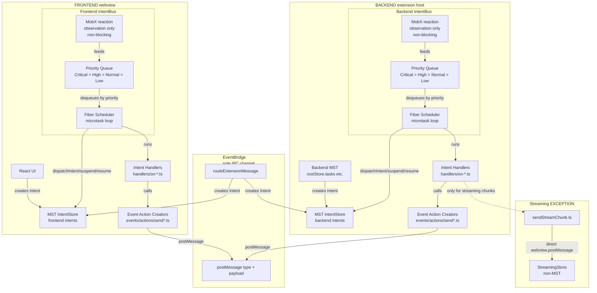

# Architectural Restructure v2 — Events Action Creators Architecture with Fiber Priority Dispatch (Revised 2026-07-14)

---

> **WHITELIST RULE**: If a file or folder is NOT listed in the target structure below, it MUST NOT exist in the filesystem. Any file found outside this structure must be deleted, refactored, or migrated into the paths described here.

---

## Core Principles

1. **EventBridge is the SOLE IPC channel** — frontend and backend communicate ONLY through `EventBridge.postMessage()`. No direct `webview.postMessage()` calls (except the single documented streaming exception). No `vscode.postMessage()` bypasses.

2. **Every event is sent through an action creator** — handlers NEVER call `EventBridge.postMessage()` directly. They call `events/actions/sendEventName()`. Action creators can create multiple Intents.

3. **Every event is received through a handler** — `events/handlers/on-event-name-received.ts` receives the event, creates an Intent, and returns. The handler name matches the event constant name.

4. **ALL state in MST** — zero module-level mutable state. No `let`/`const` mutable variables outside MST stores. State lives in MST models, mutations happen through MST actions.

5. **Handler creates Intent, NOT an Event directly** — handlers process intents and may create new intents or call event action creators. They NEVER call EventBridge directly. Action creators are the sole bridge to the IPC layer.

6. **IntentBus uses fiber-style priority dispatch** — observation (MobX reaction) and execution (scheduler) are decoupled. The reaction feeds a priority queue; the scheduler dispatches from the queue in priority order. High-priority intents (cancel, system failure) preempt lower-priority work.

7. **Handlers yield at explicit points** — long-running handlers (streaming, MCP tool calls) declare yield points where the scheduler can pause the current fiber, dispatch a higher-priority intent, and resume. Yielding is opt-in per handler.

8. **No synchronous bypass for urgent intents** — the priority queue and preemption mechanism replace the current pattern of direct synchronous state mutations for Stop/Cancel. Cancel goes through IntentBus with highest priority.

9. **Intents are per-side** — frontend and backend each have their own IntentBus + IntentStore + IntentConstants. An intent NEVER crosses the EventBridge. Only Events cross.

10. **Registration pattern is NOT monolithic** — no `handler.ts` that registers everything. Each `events/handlers/on-*.ts` file calls its own registration function. Each intent handler file calls `bus.register()` directly. Registration is scattered by design.

11. **One action creator file per Event constant** — `events/actions/send<EventName>.ts` exports one action creator function. The filename matches the Event constant name in PascalCase. The function name is `send<EventName>`.

12. **One handler file per Event/Intent type** — `events/handlers/on-<event-name>-received.ts` handles one event type. Intent handlers follow the same pattern in `handlers/` directories.

13. **Event action creators can create multiple Intents** — not limited to 1:1 mapping. For example, `sendAskToolApproval` creates both a notification Intent and a message broadcast Intent.

14. **Streaming is an EXCEPTION PATTERN** — most chunks bypass MST and IntentBus entirely, going directly `webview.postMessage()` → `StreamingStore`. Only START and END go through MST. This is the only documented exception to rule #1.

15. **Every feature has `events/` folder** — no `events.ts` files anywhere. Events are always in `events/actions/` + `events/handlers/` subdirectories.

16. **All files PascalCase except handlers** — handlers are kebab-case (`on-*-received.ts`) to match event constant naming. Everything else is PascalCase.

17. **Constants are shared between frontend and backend** — EventConstants in a shared location. IntentConstants are per-side (frontend has its own, backend has its own).

18. **Import from barrel** — features export through `index.ts`. Consumers import from the feature barrel, never from deep paths.

19. **Handlers are stateless** — no class instances as handlers. Pure async functions receiving `(intent, ctx)` or `(event, ctx)`.

20. **`ctx` carries root store + intentStore + provider** — the handler context is the only dependency injection. No singleton imports inside handlers.

21. **Notifications have ONLY `"ask"` type** — no `"say"` type exists. All previous "say" content uses Messages with appropriate type discriminators (`"agent"`, `"system"`, `"mcp_tool"`, `"user"`).

22. **Messages use discriminated union** — `UserMessage | AgentMessage | McpToolMessage | SystemMessage` in a single `task.messages` MST collection. Each type has specific fields.

23. **Registration has NO duplication** — each `events/handlers/index.ts` calls individual `on-*-received.ts` setup functions. No duplicate registration logic.

24. **StreamingStore is non-MST** — the `api/streaming/` sub-feature has a non-MST reactive store that exists only during active streaming. Garbage collected when streaming ends.

25. **The MobX reaction layer is OBSERVATION only** — it feeds the scheduler's priority queue. It does NOT execute handlers. Execution is the scheduler's responsibility.

26. **MST snapshots are preserved 100%** — the scheduler calls MST actions (`dispatchIntent`, `suspendIntent`, `resumeIntent`, `markSuccess`, `failIntent`). Every state mutation creates an MST snapshot. The DevTool undo/redo sees the same timeline as before, with additional Suspend/Resume entries for preemption points.

27. **Priority is expressed as buckets, not numeric values** — intents belong to one of: `Critical` (cancel, system failure), `High` (user input, UI events), `Normal` (stream end, notifications), `Low` (log writes, analytics). Buckets are defined in IntentConstants per feature group.

28. **Handlers must be yield-safe** — handlers that yield (via `await`) must handle the case where their intent was suspended and resumed. They check `intentStore.getById(id)?.status` after resume to detect if they were cancelled while suspended.

---

## File naming per concern

| Concern               | Convention                                    | Example                                     |
| --------------------- | --------------------------------------------- | ------------------------------------------- |
| MST store             | `store.ts`                                    | `chat/task/store.ts`                        |
| Feature barrel        | `index.ts`                                    | `chat/task/index.ts`                        |
| Event handler         | `events/handlers/on-<event-name>-received.ts` | `events/handlers/on-api-request-started.ts` |
| Event action creator  | `events/actions/send<EventName>.ts`           | `events/actions/sendApiRequest.ts`          |
| Intent handler        | `handlers/on-<intent-name>.ts`                | `handlers/on-user-message-received.ts`      |
| Intent action creator | `actions/<IntentName>.ts`                     | `actions/createUserMessage.ts`              |
| Component             | `<ComponentName>.tsx`                         | `chat/task/components/ChatTree.tsx`         |
| Constants file        | `constants.ts`                                | `chat/task/constants.ts`                    |
| Constants type def    | `types.ts`                                    | `chat/task/types.ts`                        |

### What goes where

```
feature/
├── store.ts                    # MST store model (MUST be named store.ts)
├── index.ts                    # Barrel — re-exports public API
├── types.ts                    # TypeScript types/interfaces (if not in store)
├── constants.ts                # Feature-specific constants (NOT EventConstants or IntentConstants)
├── events/
│   ├── actions/
│   │   ├── send<EventName>.ts  # ONE action creator per Event constant
│   │   └── index.ts            # Barrel
│   └── handlers/
│       ├── on-<event-name>-received.ts  # ONE handler per Event constant
│       └── index.ts            # Barrel — calls individual setup functions
├── actions/
│   └── <IntentName>.ts         # Pure action creators that create Intents
├── handlers/
│   ├── on-<intent-name>.ts     # ONE handler per Intent type
│   └── index.ts                # Barrel — calls individual bus.register() calls
└── components/
    └── <ComponentName>.tsx      # React components
```

### Action creator vs Handler — how to tell

|                  | Action creator                                               | Handler                                                 |
| ---------------- | ------------------------------------------------------------ | ------------------------------------------------------- |
| **Location**     | `actions/` directory                                         | `handlers/` directory                                   |
| **What it does** | Creates one or more Intents via `intentStore.createIntent()` | Receives an Intent (or Event) and performs side effects |
| **Side effects** | None — pure intent creation                                  | Allowed — MST mutations, event sending, IO              |
| **Returns**      | `void` (fire-and-forget)                                     | `Promise<void>` (async handler)                         |
| **Naming**       | PascalCase filename matching Intent name                     | `on-<intent-name>.ts`                                   |

### Naming examples

| Intent Type                      | Action Creator File                         | Handler File                  |
| -------------------------------- | ------------------------------------------- | ----------------------------- |
| `notification.ask.tool_approval` | `askToolApproval.ts`                        | `on-notification-persist.ts`  |
| `message.agent.broadcast`        | `agentBroadcast.ts`                         | `on-agent-broadcast.ts`       |
| `user.message.received`          | N/A (created by Event handler)              | `on-user-message-received.ts` |
| `system.failure`                 | N/A (created by IntentBus on handler error) | `on-system-failure.ts`        |

---

## Backend feature

```
src/features/<feature-name>/
├── store.ts
├── index.ts
├── types.ts              (optional)
├── constants.ts           (optional)
├── events/
│   ├── actions/
│   │   ├── send<EventName>.ts
│   │   └── index.ts
│   └── handlers/
│       ├── on-<event-name>-received.ts
│       └── index.ts
├── actions/
│   ├── <IntentName>.ts
│   └── index.ts
├── handlers/
│   ├── on-<intent-name>.ts
│   └── index.ts
├── components/           (only if feature renders in webview — rare for backend)
└── utils/                (optional, non-MST helpers)
```

### How Event Registration Works

When an Event arrives from the EventBridge, it follows this flow:

```
EventBridge receives message
  → routes to events/handlers/on-<event-name>-received.ts
    → handler creates Intent in IntentStore
      → IntentBus picks it up (via MobX reaction)
        → scheduler dispatches to feature's handlers/on-<intent-name>.ts
```

Each `events/handlers/index.ts` is responsible for registering its own event handlers:

```typescript
// events/handlers/index.ts
import { setupOnApiRequestStarted } from "./on-api-request-started"
import { setupOnStreamChunkReceived } from "./on-stream-chunk-received"

export function registerEventHandlers(bus: EventBridge, intentStore: IIntentStore): void {
	setupOnApiRequestStarted(bus, intentStore)
	setupOnStreamChunkReceived(bus, intentStore)
}
```

Each `handlers/index.ts` registers its intent handlers:

```typescript
// handlers/index.ts
import { registerOnUserMessageReceived } from "./on-user-message-received"
import { registerOnAgentResponseReceived } from "./on-agent-response-received"

export function registerIntentHandlers(bus: IntentBus): void {
	registerOnUserMessageReceived(bus)
	registerOnAgentResponseReceived(bus)
}
```

---

## Frontend feature

```
webview-ui/src/features/<feature-name>/
├── store.ts
├── index.ts
├── types.ts              (optional)
├── constants.ts           (optional)
├── events/
│   ├── actions/
│   │   ├── send<EventName>.ts
│   │   └── index.ts
│   └── handlers/
│       ├── on-<event-name>-received.ts
│       └── index.ts
├── actions/
│   ├── <IntentType>.ts
│   └── index.ts
├── handlers/
│   ├── on-<intent-name>.ts
│   └── index.ts
└── components/
    └── <ComponentName>.tsx
```

---

## 🔴 THE 4 ENTITIES — DEFINITION (MUST READ)

### 1. 🎯 Intent — Internal reactive communication (PER-SIDE)

| Property        | Value                                                                                                                       |
| --------------- | --------------------------------------------------------------------------------------------------------------------------- |
| **Scope**       | Per-side (frontend OR backend, never both)                                                                                  |
| **Transport**   | In-memory MST store + MobX reaction                                                                                         |
| **Purpose**     | Internal reactive communication within one side                                                                             |
| **Creation**    | `intentStore.createIntent()` from action creators                                                                           |
| **Consumption** | IntentBus dispatches to registered handlers                                                                                 |
| **Lifecycle**   | `Queued → Processing → Success/Failed` (or `Queued → Processing → Suspended → Processing → Success/Failed` with preemption) |
| **Persistence** | MST store — survives within session, not persisted across sessions                                                          |
| **Testing**     | Direct handler invocation with mock intent                                                                                  |

An Intent is a reactive entity stored in the MST IntentStore. When an Intent is created with `Queued` status, the IntentBus's MobX reaction detects it and feeds it into a **priority queue**. The scheduler dequeues intents by priority bucket and dispatches them to handlers.

Intents have a **priority bucket** assigned at creation time based on their type. Priority buckets are defined in IntentConstants and determine scheduling order:

| Bucket     | Intent types                                                                 | Behavior                                                      |
| ---------- | ---------------------------------------------------------------------------- | ------------------------------------------------------------- |
| `Critical` | `task.cancel.*`, `system.failure`                                            | Always dispatched immediately. Preempts current fiber.        |
| `High`     | `user.message.received`, `ask.response.received`, `webview.event`            | Dispatched before any Normal/Low intent.                      |
| `Normal`   | `message.*.broadcast`, `notification.*`, `settings.*`, `api.streaming.ended` | Default bucket. Normal FIFO within bucket.                    |
| `Low`      | `log.write`, `diagnostics.*`, analytics                                      | Dispatched only when no Critical/High/Normal intents pending. |

**Intent lifecycle with preemption:**

```
createIntent(priority=Critical)
  → MobX reaction enqueues into priority queue
    → scheduler: dequeue highest-priority item
      → dispatchIntent(id)        [MST action → snapshot]
        → handler runs as fiber
          → yield point
            → check: higher-priority work pending?
              → YES: suspendIntent(id)  [MST action → snapshot]
                → scheduler dispatches higher-priority intent
                  → resumeIntent(id)    [MST action → snapshot]
                    → handler resumes
          → markSuccess(id)       [MST action → snapshot]
```

**Intent statuses:**

| Status       | Meaning                                     | MST action                             |
| ------------ | ------------------------------------------- | -------------------------------------- |
| `Queued`     | Created, waiting for scheduler              | `createIntent()`                       |
| `Processing` | Scheduler dispatched to handler             | `setProcessing()` / `dispatchIntent()` |
| `Suspended`  | Handler preempted by higher-priority intent | `suspendIntent()`                      |
| `Success`    | Handler completed successfully              | `markSuccess()`                        |
| `Failed`     | Handler threw an error                      | `failIntent()`                         |

### 2. 📣 Notification — Communication with user (ONLY "ask")

| Property        | Value                                                            |
| --------------- | ---------------------------------------------------------------- |
| **Scope**       | Per-side (frontend receives, backend creates)                    |
| **Transport**   | Event (backend → frontend via EventBridge)                       |
| **Purpose**     | Ask user for approval/input (tool approval, follow-up, sub-task) |
| **Creation**    | `ask*()` action creators in `chat/task/notifications/actions/`   |
| **Consumption** | Frontend renders notification dialog                             |
| **Type**        | Always `"ask"` — NEVER `"say"`                                   |
| **Persistence** | MST store — `task.notifications` collection                      |

### 3. 💬 Message — Chat messages in task context (SINGLE COLLECTION, DISCRIMINATED)

| Property           | Value                                                               |
| ------------------ | ------------------------------------------------------------------- | --------- | ------------ | ---------- |
| **Scope**          | Per-side (frontend MST mirrors backend MST)                         |
| **Transport**      | Event (backend → frontend via `sendChatTreePatch`)                  |
| **Purpose**        | Display chat messages in the task feed                              |
| **Creation**       | `*Broadcast()` action creators in `chat/task/messages/actions/say/` |
| **Consumption**    | React renders `ChatTree` from `task.messages`                       |
| **Discriminators** | `"user"`                                                            | `"agent"` | `"mcp_tool"` | `"system"` |
| **Persistence**    | MST store — `task.messages` collection                              |

### 4. 🔄 Event — Frontend ↔ Backend communication ONLY

| Property        | Value                                                        |
| --------------- | ------------------------------------------------------------ |
| **Scope**       | Cross-side (frontend → backend OR backend → frontend)        |
| **Transport**   | EventBridge.postMessage()                                    |
| **Purpose**     | Cross-side communication                                     |
| **Creation**    | `events/actions/send<EventName>()` from intent handlers      |
| **Consumption** | `events/handlers/on-<event-name>-received.ts` creates Intent |

---

### Architecture diagram — Two IntentBuses, One EventBridge, Events Layer



### Key flow rules

```
FRONTEND:
  User action → action creator → intentStore.createIntent()
    → Frontend IntentBus reaction (non-blocking) → priority queue
      → scheduler dispatches → handler → events/actions/sendEvent()
        → EventBridge.postMessage()

BACKEND:
  EventBridge receives event → events/handlers/on-*-received.ts
    → intentStore.createIntent()
      → Backend IntentBus reaction (non-blocking) → priority queue
        → scheduler dispatches → handler
          → MAY create more intents (chaining)
          → MAY call events/actions/sendEvent() (to send result to frontend)
          → MAY yield (yield point where scheduler can preempt)
```

**CRITICAL RULES:**

1. Handler NEVER calls EventBridge.postMessage directly. It calls `events/actions/sendEvent()`.
2. Handler CAN create multiple intents (chaining).
3. Handler CANNOT assume it runs to completion without preemption — after a yield point, the intent may have been suspended or even cancelled.
4. The streaming exception (`sendStreamChunk.ts`) is the ONLY place where `webview.postMessage()` is called from handler context.
5. Cancel intents are `Critical` priority — they always jump the queue and preempt the current fiber at the next yield point.
6. The MobX reaction is synchronous and non-blocking — it only feeds the queue, never awaits handlers.

---

## 📡 Streaming Architecture (EXCEPTION PATTERN)

### Architecture Overview

Streaming is the ONLY exception to the rule "handler calls action creator, action creator calls EventBridge." This is a deliberate, documented optimization to avoid creating an MST snapshot for every 1-5 byte chunk.

Key design decisions:

- **Only START and END go through MST** — two intents total (STREAMING_STARTED, STREAMING_ENDED)
- **Chunks bypass MST** — direct `webview.postMessage()` → frontend `StreamingStore` (non-MST)
- **The handler owning the stream has YIELD POINTS** — the chunk accumulation + send loop is the natural yield point where the scheduler can preempt for a Cancel intent
- **`sendStreamChunk.ts` is the SINGLE documented exception** — calls `webview.webview.postMessage()` with hardcoded `"streamChunk"` type

### Exception File: `events/actions/sendStreamChunk.ts`

```typescript
// This file is the SINGLE documented exception to Core Principle #2.
// It calls webview.postMessage() directly from handler context.
// Everywhere else, use events/actions/send*() → EventBridge.
//
// Rationale: Streaming chunks are 1-5 bytes at 50ms intervals.
// Each chunk would create an MST snapshot, bloating the DevTool timeline
// with thousands of useless snapshots. Instead, chunks bypass MST entirely
// and are handled by a lightweight non-MST StreamingStore on the frontend.

import type Webview from "vscode"

export function sendStreamChunk(webview: Webview, taskId: string, text: string): void {
	webview.postMessage({ type: "streamChunk", taskId, text })
}
```

### Frontend Early-Return: `messageBus.ts`

```typescript
// In webview-ui message routing (routeExtensionMessage or equivalent):
// This check MUST happen BEFORE any IntentBus or MST processing.

if (msg.type === "streamChunk") {
	streamingStore.appendChunk(msg.taskId, msg.text)
	return // Early return — bypass IntentBus and MST
}
```

### Frontend StreamingStore (non-MST)

```typescript
// webview-ui/src/features/api/streaming/StreamingStore.ts
// Non-MST reactive store — exists only during active streaming.
// Garbage collected by stop() / dispose() when streaming ends.

class StreamingStore {
	private chunks = new Map<string, string>()

	appendChunk(taskId: string, text: string): void {
		const existing = this.chunks.get(taskId) ?? ""
		this.chunks.set(taskId, existing + text)
		// Trigger React re-render (MobX observable or setState)
	}

	getText(taskId: string): string {
		return this.chunks.get(taskId) ?? ""
	}

	stop(taskId: string): void {
		this.chunks.delete(taskId)
	}
}
```

### MST Store Entries (Only 2)

```typescript
// In the MST store, only two intents track streaming state:
IntentConstants.api.STREAMING_STARTED // → sets task.streaming = true
IntentConstants.api.STREAMING_ENDED // → sets task.streaming = false + finalizes text
```

### Rendering in React Components

```typescript
function MessageText({ taskId, message }: { taskId: string; message: AgentMessage }) {
	const streamingText = useStreamingStore(taskId)

	if (streamingText && !message.finishReason) {
		// Stream is active — render from StreamingStore (fast, no MST)
		return <span>{streamingText}</span>
	}

	// Stream completed — render from MST (final text + metadata)
	return <span>{message.text}</span>
}
```

---

## EventConstants — Shared Between Frontend and Backend

EventConstants are defined in a shared location accessible to both frontend and backend. They NEVER change per-side — the same constant value is used on both ends of the EventBridge.

### Structure

```
packages/types/src/events/
├── constants.ts          # ALL EventConstants — single flat namespace
├── types.ts              # Event type definitions (discriminated union by type field)
├── chat/
│   ├── constants.ts      # Chat-feature EventConstants (legacy, being migrated to flat)
│   └── types.ts
├── foundation/
│   ├── constants.ts      # Foundation-feature EventConstants
│   └── types.ts
├── settings/
│   ├── constants.ts      # Settings-feature EventConstants
│   └── types.ts
└── ...per-feature
```

### Per-feature constants.ts example

```typescript
// packages/types/src/events/settings/constants.ts
export const EventConstantsSettings = {
	THEME: "settings.theme",
	CONFIG_UPDATED: "settings.config.updated",
	LIST_API_CONFIG: "settings.list.api.config",
	ROUTER_MODELS: "settings.router.models",
	MCP_SERVERS: "settings.mcp.servers",
	SKILLS: "settings.skills",
	AGENTS_REQUEST: "settings.agents.request",
} as const
```

### Usage

```typescript
// Backend: events/actions/sendTheme.ts
import { EventConstants } from "@jabberwock/types"
import type { ProviderHandle } from "@features/foundation/webview/EventBridge"

export function sendTheme(eb: ProviderHandle, text: string): void {
	eb.postMessage({ type: EventConstants.settings.THEME, text })
}

// Frontend: events/handlers/on-theme-received.ts
import { EventConstants } from "@jabberwock/types"

export function setupOnThemeReceived(bus: EventBridge, intentStore: IIntentStore): void {
	bus.on(EventConstants.settings.THEME, (event) => {
		intentStore.createIntent({
			id: crypto.randomUUID(),
			type: IntentConstants.settings.THEME_UPDATED,
			payload: { text: event.text },
			createdAt: Date.now(),
		})
	})
}
```

---

## IntentConstants — Per-Side (Frontend + Backend)

IntentConstants are defined per-side because frontend and backend have DIFFERENT intent types. Each side has its own IntentBus, its own IntentStore, and its own handlers.

**Priority buckets are defined alongside IntentConstants** — each intent type constant maps to a priority bucket:

### Frontend IntentConstants

```typescript
// webview-ui/src/features/intents/IntentConstants.ts

export const IntentPriority = {
	Critical: 0,
	High: 1,
	Normal: 2,
	Low: 3,
} as const

export type IntentPriority = (typeof IntentPriority)[keyof typeof IntentPriority]

/**
 * Priority map — every intent type gets a priority bucket.
 * Used by the Fiber scheduler to order dispatch.
 */
export const INTENT_PRIORITY: Record<string, IntentPriority> = {
	// ── Critical — always preempt
	"task.cancel.requested": IntentPriority.Critical,
	"system.failure": IntentPriority.Critical,

	// ── High — user-facing
	"user.message.received": IntentPriority.High,
	"chat.ask.response.received": IntentPriority.High,
	"webview.event": IntentPriority.High,

	// ── Normal — standard operations
	"message.agent.broadcast": IntentPriority.Normal,
	"message.system.broadcast": IntentPriority.Normal,
	"message.mcp.broadcast": IntentPriority.Normal,
	"message.user.broadcast": IntentPriority.Normal,
	"notification.ask.tool_approval": IntentPriority.Normal,
	"notification.ask.follow_up": IntentPriority.Normal,
	"notification.ask.sub_task": IntentPriority.Normal,
	"api.streaming.started": IntentPriority.Normal,
	"api.streaming.ended": IntentPriority.Normal,
	"settings.*": IntentPriority.Normal,

	// ── Low — background
	"log.write": IntentPriority.Low,
	"diagnostics.*": IntentPriority.Low,
}
```

### Backend IntentConstants

```typescript
// src/features/intents/IntentConstants.ts

export const IntentPriority = {
	Critical: 0,
	High: 1,
	Normal: 2,
	Low: 3,
} as const

export type IntentPriority = (typeof IntentPriority)[keyof typeof IntentPriority]

export const INTENT_PRIORITY: Record<string, IntentPriority> = {
	// ── Critical — always preempt
	"task.cancel.requested": IntentPriority.Critical,
	"system.failure": IntentPriority.Critical,

	// ── High — user-facing
	"user.message.received": IntentPriority.High,
	"ask.response.received": IntentPriority.High,
	"tool.execution.required": IntentPriority.High,

	// ── Normal — standard operations
	"message.agent.broadcast": IntentPriority.Normal,
	"message.system.broadcast": IntentPriority.Normal,
	"message.mcp.broadcast": IntentPriority.Normal,
	"message.user.broadcast": IntentPriority.Normal,
	"notification.ask.tool_approval": IntentPriority.Normal,
	"notification.ask.follow_up": IntentPriority.Normal,
	"notification.ask.sub_task": IntentPriority.Normal,
	"notification.persist": IntentPriority.Normal,
	"api.streaming.started": IntentPriority.Normal,
	"api.streaming.ended": IntentPriority.Normal,
	"file.context.tracked": IntentPriority.Normal,
	"settings.*": IntentPriority.Normal,

	// ── Low — background
	"log.write": IntentPriority.Low,
	"agent.request.failed": IntentPriority.Low,
	"mcp.tool.result": IntentPriority.Low,
}
```

### Rules

1. `*` wildcard in priority map matches any intent type starting with the prefix before `.*`.
2. If no match is found, the intent gets `Normal` priority (safe default).
3. Priority is assigned at `createIntent()` time and stored on the intent model for scheduler use.
4. Critical intents cause the scheduler to preempt the current fiber at the next yield point.
5. Yield points are declared by handlers via `await scheduler.yield()` — handlers that never yield cannot be preempted mid-execution, but they also cannot be cancelled.

---

## Path Aliases for Constants

### tsconfig.json (backend — src/tsconfig.json)

```json
{
	"compilerOptions": {
		"paths": {
			"@intentConstants": ["./features/intents/IntentConstants.ts"],
			"@intentStore": ["./features/intents/store.ts"],
			"@intentBus": ["./features/intents/bus.ts"],
			"@intentContext": ["./features/intents/context.ts"]
		}
	}
}
```

### tsconfig.json (frontend — webview-ui/tsconfig.json)

```json
{
	"compilerOptions": {
		"paths": {
			"@intentConstants": ["./src/features/intents/IntentConstants.ts"],
			"@intentStore": ["./src/features/intents/store.ts"],
			"@intentBus": ["./src/features/intents/bus.ts"],
			"@intentContext": ["./src/features/intents/context.ts"]
		}
	}
}
```

### Usage

```typescript
// Instead of:
// import { IntentConstants } from "../../../../features/intents/IntentConstants"
// Use:
import { IntentConstants } from "@intentConstants"
```

---

## TARGET DIRECTORY STRUCTURE — BACKEND (src/features/)

```
src/features/
├── intents/                          # Intent system layer
│   ├── IntentConstants.ts            # Backend IntentConstants + INTENT_PRIORITY map
│   ├── store.ts                      # IntentStoreModel MST
│   ├── bus.ts                        # IntentBus with Fiber scheduler
│   └── context.ts                    # IntentHandlerContext type

├── foundation/
│   ├── window-manager/               # Webview window management
│   │   ├── store.ts
│   │   ├── index.ts
│   │   ├── events/
│   │   │   ├── actions/
│   │   │   │   ├── sendActivePage.ts
│   │   │   │   ├── sendFocusPanel.ts
│   │   │   │   ├── sendTabSwitch.ts
│   │   │   │   ├── sendTaskState.ts
│   │   │   │   └── index.ts
│   │   │   └── handlers/
│   │   │       ├── on-webview-message.ts   # Entry point for all webview messages
│   │   │       └── index.ts
│   │   └── components/
│   │       └── ...
│   ├── webview/
│   │   └── EventBridge.ts                 # SOLE IPC channel — EventBridge class
│   ├── time-machine/
│   │   ├── store.ts                       # TimeMachine MST store
│   │   └── file-context/
│   │       ├── store.ts                   # FileContextTracker MST store
│   │       ├── index.ts
│   │       ├── events/
│   │       │   ├── actions/
│   │       │   │   ├── sendFileContext.ts
│   │       │   │   └── index.ts
│   │       │   └── handlers/
│   │       │       ├── on-file-context-received.ts
│   │       │       └── index.ts
│   │       └── handlers/
│   │           ├── on-file-context-tracked.ts
│   │           └── index.ts

├── settings/
│   ├── store.ts                       # MST SettingsModel (replaces settingsService.ts)
│   ├── index.ts
│   ├── types.ts
│   ├── events/
│   │   ├── actions/
│   │   │   ├── sendTheme.ts
│   │   │   ├── sendConfigUpdated.ts
│   │   │   ├── sendMcpServers.ts
│   │   │   ├── sendApiConfig.ts
│   │   │   ├── sendRouterModels.ts
│   │   │   ├── sendSkills.ts
│   │   │   └── index.ts
│   │   └── handlers/
│   │       ├── on-settings-changed-received.ts
│   │       ├── on-settings-opened-received.ts
│   │       └── index.ts
│   ├── actions/
│   │   ├── updateSetting.ts
│   │   ├── setAnnouncement.ts
│   │   ├── setTelemetry.ts
│   │   ├── dismissUpsell.ts
│   │   └── index.ts
│   ├── handlers/
│   │   ├── on-settings-update.ts
│   │   └── index.ts
│   ├── agents/
│   │   ├── store.ts                   # AgentState/AgentModel MST (merged from foundation/agent-state/)
│   │   ├── index.ts
│   │   ├── events/
│   │   │   ├── actions/
│   │   │   │   ├── sendModeSelector.ts
│   │   │   │   ├── sendModeCustom.ts
│   │   │   │   └── index.ts
│   │   │   └── handlers/
│   │   │       ├── on-custom-mode-update-received.ts
│   │   │       ├── on-mode-export-received.ts
│   │   │       ├── on-mode-import-received.ts
│   │   │       ├── on-mode-selector-opened-received.ts
│   │   │       └── index.ts
│   │   └── handlers/
│   │       ├── on-code-action.ts
│   │       ├── on-terminal-action.ts
│   │       └── index.ts
│   ├── code-index/
│   │   ├── store.ts                   # CodeIndex MST store
│   │   ├── index.ts
│   │   ├── events/
│   │   │   ├── actions/
│   │   │   │   ├── sendCodeIndexSave.ts
│   │   │   │   ├── sendCodeIndexStatus.ts
│   │   │   │   ├── sendCodeIndexSecretStatus.ts
│   │   │   │   ├── sendCodeIndexStart.ts
│   │   │   │   ├── sendCodeIndexStop.ts
│   │   │   │   ├── sendCodeIndexAutoEnable.ts
│   │   │   │   ├── sendCodeIndexClear.ts
│   │   │   │   └── index.ts
│   │   │   └── handlers/
│   │   │       ├── on-code-index-request-received.ts
│   │   │       └── index.ts
│   │   └── handlers/
│   │       ├── on-code-index-save.ts
│   │       └── index.ts
│   ├── protect/
│   │   ├── store.ts
│   │   ├── index.ts
│   │   ├── events/
│   │   │   ├── actions/
│   │   │   │   └── ...
│   │   │   └── handlers/
│   │   │       └── ...
│   │   ├── actions/
│   │   │   └── ...
│   │   └── handlers/
│   │       └── ...
│   └── ignore/
│       ├── store.ts
│       ├── index.ts
│       ├── events/
│       │   ├── actions/
│       │   │   └── ...
│       │   └── handlers/
│       │       └── ...
│       ├── actions/
│       │   └── ...
│       └── handlers/
│           └── ...

├── history/
│   ├── store.ts
│   ├── index.ts
│   ├── events/
│   │   ├── actions/
│   │   │   ├── sendHistory.ts
│   │   │   ├── sendHistoryItem.ts
│   │   │   └── index.ts
│   │   └── handlers/
│   │       ├── on-history-request-received.ts
│   │       └── index.ts
│   ├── actions/
│   │   ├── searchCommits.ts
│   │   ├── importSettings.ts
│   │   ├── exportSettings.ts
│   │   ├── resetState.ts
│   │   └── index.ts
│   ├── handlers/
│   │   ├── on-history-commits-search.ts
│   │   ├── on-history-settings-import.ts
│   │   ├── on-history-settings-export.ts
│   │   ├── on-history-state-reset.ts
│   │   └── index.ts
│   └── components/

├── diagnostics/
│   ├── store.ts
│   ├── index.ts
│   ├── events/
│   │   ├── actions/
│   │   │   ├── sendDiagnostics.ts
│   │   │   └── index.ts
│   │   └── handlers/
│   │       ├── on-diagnostics-request-received.ts
│   │       └── index.ts
│   ├── actions/
│   │   ├── clearDiagnostics.ts
│   │   └── index.ts
│   ├── handlers/
│   │   ├── on-diagnostics-clear.ts
│   │   └── index.ts
│   └── components/

├── cloud/
│   ├── store.ts
│   ├── index.ts
│   ├── events/
│   │   ├── actions/
│   │   │   ├── sendAuthChanged.ts
│   │   │   └── index.ts
│   │   └── handlers/
│   │       ├── on-cloud-auth-request-received.ts
│   │       └── index.ts
│   ├── actions/
│   │   ├── signIn.ts
│   │   ├── signOut.ts
│   │   ├── switchOrganization.ts
│   │   └── index.ts
│   ├── handlers/
│   │   ├── on-cloud-sign-in.ts
│   │   ├── on-cloud-sign-out.ts
│   │   ├── on-cloud-switch-organization.ts
│   │   └── index.ts
│   └── components/

├── marketplace/
│   ├── store.ts
│   ├── index.ts
│   ├── events/
│   │   ├── actions/
│   │   │   ├── sendMarketplaceData.ts
│   │   │   └── index.ts
│   │   └── handlers/
│   │       ├── on-marketplace-request-received.ts
│   │       └── index.ts
│   ├── actions/
│   │   ├── filterItems.ts
│   │   ├── installItem.ts
│   │   ├── removeItem.ts
│   │   ├── fetchData.ts
│   │   ├── refreshTools.ts
│   │   └── index.ts
│   ├── handlers/
│   │   ├── on-marketplace-items-filter.ts
│   │   ├── on-marketplace-item-install.ts
│   │   ├── on-marketplace-item-remove.ts
│   │   ├── on-marketplace-data-fetch.ts
│   │   ├── on-marketplace-tools-refresh.ts
│   │   └── index.ts
│   └── components/

├── chat/
│   ├── store.ts                    # Chat MST store
│   ├── index.ts
│   ├── actions/
│   │   ├── chatStore.actions.ts     # Store actions (setAbort, setIsRunning, etc.)
│   │   ├── setActiveTask.ts
│   │   └── index.ts
│   ├── events/
│   │   ├── actions/
│   │   │   ├── sendAskResponse.ts
│   │   │   ├── sendNewTask.ts
│   │   │   ├── sendClearTask.ts
│   │   │   └── index.ts
│   │   └── handlers/
│   │       ├── on-task-state-received.ts
│   │       ├── on-messages-updated-received.ts
│   │       └── index.ts
│   ├── task/
│   │   ├── store.ts                 # Task MST store
│   │   ├── index.ts
│   │   ├── task-store/              # TaskModel (state, messages, etc.)
│   │   │   ├── task-model/
│   │   │   │   ├── TaskModel.ts
│   │   │   │   ├── actions/
│   │   │   │   │   ├── task-model-actions-lifecycle.ts
│   │   │   │   │   ├── task-model-actions-stream.ts
│   │   │   │   │   └── index.ts
│   │   │   │   └── views/
│   │   │   └── ...
│   │   ├── handlers/
│   │   │   ├── on-task-created.ts
│   │   │   ├── on-task-cancelled.ts
│   │   │   ├── on-task-goal-add.ts
│   │   │   ├── on-task-goal-remove.ts
│   │   │   ├── on-task-goal-update.ts
│   │   │   ├── on-task-goal-reorder.ts
│   │   │   ├── on-task-resume.ts
│   │   │   ├── on-task-clear.ts
│   │   │   ├── on-task-completion.ts
│   │   │   └── index.ts
│   │   ├── actions/
│   │   │   ├── startTask/
│   │   │   │   ├── start-task.ts     # Creates UserMessageReceived intent
│   │   │   │   └── index.ts
│   │   │   ├── abortTask.ts          # Global abort (sets task._state.abort + store.chat.abort)
│   │   │   └── index.ts
│   │   ├── messages/
│   │   │   ├── store.ts
│   │   │   ├── index.ts
│   │   │   ├── events/
│   │   │   │   ├── actions/
│   │   │   │   │   ├── sendChatTreePatch.ts
│   │   │   │   │   └── index.ts
│   │   │   │   └── handlers/
│   │   │   │       ├── on-chat-tree-patch-received.ts
│   │   │   │       ├── on-chat-tree-snapshot-received.ts
│   │   │   │       └── index.ts
│   │   │   ├── actions/
│   │   │   │   ├── say/                  # 4 specialized broadcasts
│   │   │   │   │   ├── agentBroadcast.ts
│   │   │   │   │   ├── systemBroadcast.ts
│   │   │   │   │   ├── mcpBroadcast.ts
│   │   │   │   │   ├── userBroadcast.ts
│   │   │   │   │   └── index.ts
│   │   │   │   └── index.ts
│   │   │   └── handlers/
│   │   │       ├── user/
│   │   │       │   ├── on-message-received.ts    # Guard → process/abort
│   │   │       │   └── index.ts
│   │   │       ├── on-agent-broadcast.ts
│   │   │       ├── on-system-broadcast.ts
│   │   │       ├── on-mcp-broadcast.ts
│   │   │       ├── on-user-broadcast.ts
│   │   │       ├── on-message-delete-requested.ts
│   │   │       ├── on-message-delete-confirmed.ts
│   │   │       ├── on-message-edit-requested.ts
│   │   │       ├── on-message-edit-confirmed.ts
│   │   │       └── index.ts
│   │   ├── notifications/
│   │   │   ├── store.ts
│   │   │   ├── index.ts
│   │   │   ├── actions/
│   │   │   │   ├── askToolApproval.ts
│   │   │   │   ├── askFollowUp.ts
│   │   │   │   ├── askSubTask.ts
│   │   │   │   └── index.ts
│   │   │   ├── handlers/
│   │   │   │   ├── on-notification-persist.ts
│   │   │   │   ├── on-ask-response-received.ts
│   │   │   │   └── index.ts
│   │   │   └── components/
│   │   ├── condense/
│   │   │   ├── store.ts
│   │   │   ├── index.ts
│   │   │   ├── actions/
│   │   │   │   └── condenseContext.ts
│   │   │   └── handlers/
│   │   │       ├── on-context-condense.ts
│   │   │       └── index.ts
│   │   └── events/
│   │       ├── actions/
│   │       │   ├── sendTaskAction.ts      # For task-level events
│   │       │   ├── sendTaskState.ts
│   │       │   └── index.ts
│   │       └── handlers/
│   │           ├── on-action-received.ts   # Creates UserMessageReceived intent
│   │           ├── on-state-received.ts
│   │           └── index.ts
│   └── tools/
│       ├── store.ts
│       ├── index.ts
│       ├── actions/
│       │   └── executeTools.ts
│       └── handlers/
│           └── on-tool-execution-required.ts

├── api/
│   ├── store.ts
│   ├── index.ts
│   ├── events/
│   │   ├── actions/
│   │   │   ├── sendApiRequest.ts
│   │   │   ├── sendStreamChunk.ts         # ⚠️ EXCEPTION — direct webview.postMessage
│   │   │   └── index.ts
│   │   └── handlers/
│   │       ├── on-api-request-started.ts   # Handles streaming start
│   │       └── index.ts
│   ├── handlers/
│   │   ├── on-api-start-streaming.ts
│   │   ├── on-api-end-streaming.ts
│   │   └── index.ts
│   └── streaming/
│       └── ...                             # Streaming utilities

├── mcp/
│   ├── store.ts
│   ├── index.ts
│   ├── events/
│   │   ├── actions/
│   │   │   └── ...
│   │   └── handlers/
│   │       └── ...
│   ├── actions/
│   └── handlers/

└── integrations/
    ├── terminal/
    ├── file-system/
    └── vscode-commands/
```

---

## TARGET DIRECTORY STRUCTURE — FRONTEND (webview-ui/src/features/)

```
webview-ui/src/features/
├── intents/                          # Intent system layer
│   ├── IntentConstants.ts            # Frontend IntentConstants + INTENT_PRIORITY map
│   ├── store.ts                      # IntentStoreModel MST (frontend)
│   ├── bus.ts                        # IntentBus with Fiber scheduler (frontend)
│   └── context.ts                    # IntentHandlerContext type (frontend)

├── foundation/
│   ├── store.ts
│   ├── index.ts
│   ├── events/
│   │   ├── actions/
│   │   │   ├── sendActivePage.ts
│   │   │   ├── sendFocusPanel.ts
│   │   │   ├── sendTabSwitch.ts
│   │   │   ├── sendTaskCosts.ts
│   │   │   └── index.ts
│   │   └── handlers/
│   │       ├── on-active-page-received.ts
│   │       ├── on-focus-panel-received.ts
│   │       ├── on-tab-switch-received.ts
│   │       ├── on-state-requested-received.ts
│   │       ├── on-task-aggregated-costs-received.ts
│   │       ├── on-task-show-received.ts
│   │       ├── on-task-delete-received.ts
│   │       ├── on-task-export-received.ts
│   │       └── index.ts
│   ├── actions/
│   │   ├── focusPanel.ts
│   │   ├── switchTab.ts
│   │   ├── stateRequested.ts
│   │   └── index.ts
│   ├── handlers/
│   │   ├── on-foundation-focus-panel-requested.ts
│   │   ├── on-foundation-tab-switch.ts
│   │   ├── on-foundation-active-page-response.ts
│   │   ├── on-foundation-state-requested.ts
│   │   ├── on-foundation-task-aggregated-costs.ts
│   │   ├── on-foundation-task-show.ts
│   │   ├── on-foundation-task-delete.ts
│   │   ├── on-foundation-task-export.ts
│   │   └── index.ts

├── settings/
│   ├── store.ts
│   ├── index.ts
│   ├── types.ts
│   ├── events/
│   │   ├── actions/
│   │   │   ├── sendSettingsUpdate.ts
│   │   │   ├── sendApiConfigSave.ts
│   │   │   └── index.ts
│   │   └── handlers/
│   │       ├── on-theme-received.ts
│   │       ├── on-config-updated-received.ts
│   │       ├── on-list-api-config-received.ts
│   │       ├── on-router-models-received.ts
│   │       ├── on-mcp-servers-received.ts
│   │       ├── on-skills-received.ts
│   │       └── index.ts
│   ├── actions/
│   │   ├── updateSetting.ts
│   │   ├── openKeyboardShortcuts.ts
│   │   ├── openMarkdownPreview.ts
│   │   ├── setTelemetry.ts
│   │   ├── saveApiConfig.ts
│   │   └── index.ts
│   ├── handlers/
│   │   ├── on-settings-update.ts
│   │   ├── on-settings-api-config-save.ts
│   │   └── index.ts
│   └── components/
│       ├── ApiConfigList.tsx
│       ├── KeyboardShortcuts.tsx
│       └── ...

├── history/
│   ├── store.ts
│   ├── index.ts
│   ├── events/
│   │   ├── actions/
│   │   │   ├── sendHistoryRequest.ts
│   │   │   └── index.ts
│   │   └── handlers/
│   │       ├── on-history-updated-received.ts
│   │       ├── on-history-item-updated-received.ts
│   │       └── index.ts
│   ├── handlers/
│   │   ├── on-history-updated.ts
│   │   ├── on-history-item-updated.ts
│   │   └── index.ts
│   └── components/

├── diagnostics/
│   ├── store.ts
│   ├── index.ts
│   ├── events/
│   │   ├── actions/
│   │   │   └── ...
│   │   └── handlers/
│   │       ├── on-diagnostics-received.ts
│   │       └── index.ts
│   ├── handlers/
│   │   ├── on-diagnostics-received.ts
│   │   └── index.ts
│   └── components/

├── marketplace/
│   ├── store.ts
│   ├── index.ts
│   ├── events/
│   │   ├── actions/
│   │   │   └── ...
│   │   └── handlers/
│   │       ├── on-marketplace-data-received.ts
│   │       └── index.ts
│   ├── handlers/
│   │   ├── on-marketplace-items-filter.ts
│   │   ├── on-marketplace-item-install.ts
│   │   ├── on-marketplace-item-remove.ts
│   │   ├── on-marketplace-data-fetch.ts
│   │   ├── on-marketplace-tools-refresh.ts
│   │   └── index.ts
│   └── components/

├── cloud/
│   ├── store.ts
│   ├── index.ts
│   ├── events/
│   │   ├── actions/
│   │   │   └── ...
│   │   └── handlers/
│   │       ├── on-cloud-auth-changed-received.ts
│   │       └── index.ts
│   ├── handlers/
│   │   ├── on-cloud-button-clicked.ts
│   │   ├── on-cloud-sign-in.ts
│   │   ├── on-cloud-sign-out.ts
│   │   ├── on-cloud-switch-organization.ts
│   │   └── index.ts
│   └── components/

├── chat/
│   ├── store.ts                    # Frontend ChatStore
│   ├── index.ts
│   ├── events/
│   │   ├── actions/
│   │   │   ├── sendAskResponse.ts  # User clicks Approve/Reject in UI
│   │   │   └── index.ts
│   │   └── handlers/
│   │       ├── on-ask-response-received.ts
│   │       ├── on-task-state-received.ts
│   │       ├── on-messages-updated-received.ts
│   │       ├── on-invoke-received.ts
│   │       ├── on-interaction-required-received.ts
│   │       └── index.ts
│   ├── task/
│   │   ├── store.ts                 # Frontend TaskStore
│   │   ├── index.ts
│   │   ├── events/
│   │   │   ├── actions/
│   │   │   │   ├── sendNewTask.ts
│   │   │   │   ├── sendClearTask.ts
│   │   │   │   └── index.ts
│   │   │   └── handlers/
│   │   │       ├── on-state-received.ts
│   │   │       ├── on-action-received.ts
│   │   │       ├── on-messages-updated-received.ts
│   │   │       ├── on-checkpoint-updated-received.ts
│   │   │       ├── on-checkpoint-init-warning-received.ts
│   │   │       ├── on-condense-started-received.ts
│   │   │       ├── on-condense-response-received.ts
│   │   │       ├── on-selected-images-received.ts
│   │   │       └── index.ts
│   │   ├── actions/
│   │   │   ├── newTask.ts
│   │   │   ├── clearTask.ts
│   │   │   ├── cancelTask.ts
│   │   │   ├── resumeTask.ts
│   │   │   ├── setSyncEnabled.ts
│   │   │   └── index.ts
│   │   ├── handlers/
│   │   │   ├── on-task-new-requested.ts
│   │   │   ├── on-task-cancel-requested.ts
│   │   │   ├── on-task-clear-requested.ts
│   │   │   ├── on-task-resume-requested.ts
│   │   │   ├── on-task-sync-enabled-set.ts
│   │   │   ├── on-task-condense-context-requested.ts
│   │   │   ├── on-task-completion-requested.ts
│   │   │   └── index.ts
│   │   ├── messages/
│   │   │   ├── store.ts
│   │   │   ├── index.ts
│   │   │   ├── events/
│   │   │   │   ├── actions/
│   │   │   │   │   └── ...
│   │   │   │   └── handlers/
│   │   │   │       ├── on-chat-tree-patch-received.ts
│   │   │   │       ├── on-chat-tree-snapshot-received.ts
│   │   │   │       └── index.ts
│   │   │   ├── actions/
│   │   │   │   └── ...
│   │   │   ├── handlers/
│   │   │   │   └── ...
│   │   │   └── components/
│   │   └── components/
│   │       ├── ChatTree.tsx
│   │       └── ...
│   ├── notifications/
│   │   ├── store.ts
│   │   ├── index.ts
│   │   ├── events/
│   │   │   └── handlers/
│   │   │       ├── on-tts-play-received.ts
│   │   │       ├── on-tts-stop-received.ts
│   │   │       └── index.ts
│   │   ├── actions/
│   │   │   ├── respondToAsk.ts
│   │   │   └── index.ts
│   │   ├── handlers/
│   │   │   ├── on-ask-notification.ts
│   │   │   ├── on-notification-add.ts
│   │   │   ├── on-notification-tts-play.ts
│   │   │   ├── on-notification-tts-stop.ts
│   │   │   └── index.ts
│   │   └── components/
│   │       ├── AskDialog.tsx
│   │       ├── PermissionRequest.tsx
│   │       └── ...
│   └── components/
│       ├── ChatView.tsx
│       └── ...

├── api/
│   └── streaming/
│       ├── StreamingStore.ts         # Non-MST reactive store
│       ├── useStreamingStore.ts      # React hook
│       └── index.ts

└── messaging/
    └── ... (non-MST messaging utilities)
```

---

## WHAT MUST BE DELETED

### Phase 0 — Safe Deletions (backup-free)

These are already migrated or dead code:

1. `src/features/ipc/handlers/` — EventBridge is sole channel
2. `chat/actions/runtime.ts` — state migrated to TaskModel
3. `chat/actions/metrics.ts` — tool tracking in store actions
4. `chat/actions/getEnvironmentDetails.ts` — inlined in consumers
5. `chat/events/webview-message-router.ts` — all message routing through EventBridge webview handler
6. `foundation/timer-queue/` — replaced by scheduler microtask loop
7. Old `webview-ui/src/utils/` utils already absorbed into features
8. `ChatActionsProvider.tsx` — actions go through IntentBus, not React context
9. `webview-ui/src/features/chat/context-management/` — migrated to foundation

### Phase 1 — Delete After Migration

1. `chat/actions/` directory — all actions refactored into individual `actions/` files
2. `chat/notifications/` — merged into `chat/task/notifications/`
3. `chat/messages/` — merged into `chat/task/messages/`
4. `chat/messages-list/` — renamed to `chat/task/messages/`
5. `foundation/agent-state/` — merged into `settings/agents/`
6. `settings/settingsService.ts` — all state in MST SettingsModel
7. `settings/code-index/store.ts` — all state in `settings/code-index/store.ts` MST
8. Old `actions/agent/attemptApiRequest.ts` — migrated to `features/api/handlers/`
9. Old `actions/agent/streamChunkHandlers.ts` — migrated to `features/api/handlers/stream/`

### Frontend deletions (after migration)

1. Old `webview-ui/src/features/chat/task/*` files outside the new structure
2. `webview-ui/src/core/messageBus.ts` — migrated to IntentBus-based routing
3. Legacy `webview-ui/src/features/chat/context-management/` files

---

## MIGRATION PHASES (Dependency-Safe Order)

### Phase 0 — Fiber IntentBus [CRITICAL — DO FIRST]

This phase is the foundation for everything else. The FIFO-blocking IntentBus must be replaced with the fiber-style priority dispatch BEFORE any other migration, because the synchronous bypass workaround for Stop/Cancel depends on the blocking behavior.

1. **Add `IntentStatus.Suspended` to shared types** (`packages/types/src/intents/types.ts`):

    ```typescript
    export enum IntentStatus {
    	Queued = "queued",
    	Processing = "processing",
    	Suspended = "suspended", // NEW
    	Success = "success",
    	Failed = "failed",
    }
    ```

2. **Add priority to IntentModel** — add optional `priority` field to IntentModel in both frontend and backend `store.ts`:

    ```typescript
    priority: types.maybe(types.number),  // 0=Critical, 1=High, 2=Normal, 3=Low
    ```

3. **Add MST actions** to both frontend and backend `IntentStoreModel`:

    - `dispatchIntent(id)` — sets status to Processing (replaces `setProcessing` for scheduler use)
    - `suspendIntent(id)` — sets status to Suspended
    - `resumeIntent(id)` — sets status back to Processing

4. **Rewrite `bus.ts`** — replace the blocking `processQueue()` with:

    - MobX `reaction()` that only feeds the priority queue (non-blocking, no `await`)
    - `PriorityQueue` class (simple array-based, sorted by priority on enqueue)
    - `FiberScheduler` — microtask-based loop that dequeues from priority queue, calls `dispatchIntent()`, runs handler, yields at yield points, checks for preemption, suspends/resumes as needed
    - `yield()` method on scheduler — handlers call `await scheduler.yield()` at safe points

5. **Add `INTENT_PRIORITY` map** to both frontend and backend `IntentConstants.ts`

6. **Add `priority` to `createIntent()` call signature** — `createIntent()` assigns priority from the map based on intent type

7. **Remove synchronous bypass** for Stop/Cancel — the Stop handler now creates a `Critical`-priority `task.cancel.requested` intent instead of directly mutating store state

8. **Update `abortTask.ts`** — keep task-level abort (`task._state.setAbort(true)` + `abortController.abort()`), but remove `store.chat.setAbort(true)` — the store-level abort flag is no longer needed because cancel intents always preempt via priority

9. **Add yield points to long-running handlers** — `on-user-message-received.ts` adds `await scheduler.yield()` before `executeTools()` and before each tool execution loop iteration

10. **Update StoreModel** — add `IntentStatus.Suspended` to the MST enum in both frontend and backend `store.ts`:
    ```typescript
    status: types.enumeration("IntentStatus", [
      IntentStatus.Queued,
      IntentStatus.Processing,
      IntentStatus.Suspended,  // NEW
      IntentStatus.Success,
      IntentStatus.Failed,
    ]),
    ```

### Phase 1 — Frontend Intents Layer + IntentConstants [CRITICAL]

1. CREATE `webview-ui/src/features/intents/IntentConstants.ts` with INTENT_PRIORITY map
2. CREATE `webview-ui/src/features/intents/store.ts` (IntentStoreModel) with priority field + new actions
3. CREATE `webview-ui/src/features/intents/bus.ts` (Fiber IntentBus)
4. CREATE `webview-ui/src/features/intents/context.ts` (IntentHandlerContext)
5. REGISTER frontend IntentBus in webview entry point

### Phase 2 — Convert ALL Backend `events.ts` → `events/` Folders + EventConstants [CRITICAL]

1. ADD EventConstants for every un-constant literal event type
2. CONVERT each `events.ts` → `events/actions/send*.ts` + `events/handlers/on-*.ts`
3. REGISTER each event handler in `events/handlers/index.ts`
4. BROADCAST intent from each event handler

### Phase 3 — Create Frontend `events/` Folders [CRITICAL]

1. CREATE `events/actions/send*.ts` for every Event the frontend sends
2. CREATE `events/handlers/on-*.ts` for every Event the frontend receives
3. REGISTER each in `events/handlers/index.ts`
4. BROADCAST intent from each event handler

### Phase 4 — Fix Module-Level State Violations [CRITICAL]

1. `rawChunkProcessor.ts` — `rawChunkTracker = new Map<>()` at line 23 → MST store

### Phase 5 — Create `features/api/` (Backend) + Migrate `actions/agent/` Into It

1. CREATE `features/api/` with standard feature pattern
2. MOVE `attemptApiRequest.ts` → `api/handlers/on-api-request-started.ts`
3. MOVE `streamChunkHandlers.ts` → `api/handlers/stream/on-stream-chunk-received.ts`
4. DELETE old `actions/agent/` directory

### Phase 6 — Rename `messages-list/` → `messages/` (Frontend)

1. CREATE `messages/` directory with `store.tsx`, `events/`, `actions/`, `handlers/`, `components/`, `index.ts`
2. MOVE all files from `messages-list/` → `messages/components/` with PascalCase names
3. MOVE `messages-list/store.tsx` → `messages/store.tsx`
4. MOVE `messages-list/index.ts` → `messages/index.ts`
5. CREATE `events/` folder with standard `actions/|handlers/` sub-pattern
6. CREATE `actions/index.ts` and `handlers/index.ts` as empty barrels
7. UPDATE all imports in moved files
8. DELETE old `messages-list/` directory

### Phase 7 — FileContextTracker Class → MST Store

1. REWRITE `FileContextTracker.ts` class → MST store actions in `foundation/time-machine/file-context/store.ts`
2. CREATE handler file for context events
3. UPDATE all consumers

### Phase 8 — Fix `as unknown` Casts

1. `modesFileService.ts` — remove 3 `as unknown` casts with proper type narrowing

### Phase 9 — Standard Feature Pattern Compliance

1. Merge `chat/notifications/` → `chat/task/notifications/`:
    - RENAME `handleResponse.ts` → `respondToAsk.ts`
    - **REFACTOR `say.ts` → 4 action creators in `messages/actions/say/`**:
        - `agentBroadcast.ts` — creates `AgentMessage` (type: "agent") for agent responses
        - `systemBroadcast.ts` — creates `SystemMessage` (type: "system") for system events
        - `mcpBroadcast.ts` — creates `McpToolMessage` (type: "mcp_tool") for tool calls/results
        - `userBroadcast.ts` — creates `UserMessage` (type: "user") for user content
        - `index.ts` — barrel re-export
    - **REFACTOR `ask.ts` → 3 specialization action creators in `notifications/actions/`**:
        - `askToolApproval.ts` — yes/no tool approval (e.g., "Approve read File X?")
        - `askFollowUp.ts` — follow-up question to user (e.g., "What's your goal?")
        - `askSubTask.ts` — sub-task completion approval (e.g., "Approve sub-task result?")
        - `index.ts` — barrel re-export
    - REFACTOR `respondToAsk.ts` creating `ask.response.received` Intent
2. Merge `chat/messages/` → `chat/task/messages/`:
    - All files moved, handlers merged properly
3. Merge `foundation/agent-state/` → `settings/agents/`:
    - RENAME `handleCodeAction` → `on-code-action.ts`
    - RENAME `handleTerminalAction` → `on-terminal-action.ts`
4. Restructure `chat/actions/`:
    - `condenseContext.ts` → `task/condense/actions/condenseContext.ts`
    - `summarizeConversation.ts` → `task/condense/handlers/on-context-condense.ts`
5. Add `actions/index.ts` + `handlers/index.ts` to every frontend feature (empty barrels if none exist yet)
6. Flatten nested `components/` dirs in notifications (`ask/components/`, `say/components/`, etc.)

### Phase 10 — Replace `messageBus.ts` Pipeline

1. REFACTOR `webview-ui/src/core/messageBus.ts` from channel-based pipeline to IntentBus-based
2. Route extension messages through `events/handlers/` (each event type → `events/handlers/on-*.ts` → creates Intent)

### Phase 11 — Backend Settings Compliance

1. `settingsService.ts` → MST SettingsModel (absorb into `settings/store.ts`)
2. DELETE `settings/code-index/store.ts`
3. `protect/` + `ignore/` → standard feature pattern (store + handlers)

### Phase 12 — Cleanup & Verification

1. UPDATE all imports across affected files
2. DELETE orphaned directories (chat/notifications/, chat/messages/, foundation/agent-state/, etc.)
3. `pnpm check-types` — zero TypeScript compilation errors
4. **RENAME `cline` → `task` or `model`**: 108 occurrences of legacy Cline-fork naming across codebase
    - Parameter names: `presentAssistantMessage(cline: ITaskModel)` → `task`
    - Variable names: `task.clineMessages` → `task.messages`
    - Comments referencing "cline/cline" → "jabberwock/jabberwock"
    - Use `rename_symbol` per file (not bulk find-replace)
5. **FIX `rawChunkProcessor.ts` module-level state**: `rawChunkTracker = new Map<>()` at line 23
    - Move into MST store or pass via handler context
    - No module-level `let`/`const` mutable state outside MST
6. Final audit: verify no files outside target structure

---

## CORRECT INTENT FLOWS (WITH EXAMPLES)

### Flow 1: User clicks "new task" (Frontend → Backend) — uses constants

```
FRONTEND:
User clicks "new task" button
  → Action creator (actions/) calls intentStore.createIntent({type: IntentConstants.task.UI_NEW_CLICKED})
    → Frontend IntentBus reaction (non-blocking) feeds priority queue
      → Scheduler: Normal priority, dispatches to frontend handler (handlers/)
        → Handler calls events/actions/sendAction(eb, {taskId, text, ...})
          → EventBridge.postMessage({type: EventConstants.chat.NEW_TASK, taskId, text, ...})

BACKEND:
  → EventBridge receives EVENT {type: EventConstants.chat.NEW_TASK}
    → chat/task/events/handlers/on-new-task-received.ts  (receives event, creates Intent)
      → bus.createIntent({type: IntentConstants.task.NEW_REQUESTED, priority: IntentPriority.High})
        → Backend IntentBus reaction (non-blocking) → priority queue
          → Scheduler: High priority, dispatches → chat/task/handlers/on-task-created.ts
            → Handler creates TaskModel in MST
              → Handler calls events/actions/sendState(eb, {taskId, state})
                → EventBridge.postMessage({type: EventConstants.task.STATE, taskId, state})
                  → Frontend receives Event → frontend chat/task/events/handlers/on-state-received.ts
                    → creates Intent → IntentBus reaction → priority queue → scheduler → handler → re-renders UI
```

KEY RULE: The backend handler never calls EventBridge.postMessage directly. It calls `events/actions/sendState()`.

### Flow 2: 3 specialized `ask*()` action creators (each creates 2 Intents)

`ask()` is split into 3 specialized action creators, each creating the same 2 Intents:

1. Notification Intent (for UI dialog/approval UI)
2. Message Intent (for chat feed via the appropriate broadcast)

```
askToolApproval("Approve read File X?", details)

askToolApproval() ACTION CREATOR (notifications/actions/):
  │  (pure function, no callbacks)
  │
  ├─► intentStore.createIntent({type: IntentConstants.notifications.ASK_TOOL_APPROVAL, priority: Normal, ...})
  │     → IntentBus → task/notifications/handlers/on-notification-persist.ts
  │       → adds to task.notifications store (type: "ask" for tool approval)
  │       → calls events/actions/sendMcpExecutionStatus(eb, ...)
  │         → EventBridge.postMessage({type: EventConstants.notifications.MCP_EXECUTION_STATUS, ...})
  │
  └─► intentStore.createIntent({type: IntentConstants.messages.MCP_BROADCAST, priority: Normal, ...})
        → IntentBus → task/messages/handlers/on-mcp-broadcast.ts
          → creates McpToolMessage (type: "mcp_tool") in task.messages store
          → calls events/actions/sendChatTreePatch(eb, {patch})
            → EventBridge.postMessage({type: EventConstants.messages.CHAT_TREE_PATCH, ...})
```

```
askFollowUp("What's your goal?", details)

askFollowUp() ACTION CREATOR (notifications/actions/):
  │
  ├─► intentStore.createIntent({type: IntentConstants.notifications.ASK_FOLLOW_UP, priority: Normal, ...})
  │     → IntentBus → task/notifications/handlers/on-notification-persist.ts
  │       → adds to task.notifications store (type: "ask" for follow-up)
  │       → calls events/actions/sendTtsStart(eb, ...)
  │         → EventBridge.postMessage({type: EventConstants.notifications.PLAY_TTS, ...})
  │
  └─► intentStore.createIntent({type: IntentConstants.messages.AGENT_BROADCAST, priority: Normal, ...})
        → IntentBus → task/messages/handlers/on-agent-broadcast.ts
          → creates AgentMessage (type: "agent") in task.messages store
          → calls events/actions/sendChatTreePatch(eb, {patch})
            → EventBridge.postMessage({type: EventConstants.messages.CHAT_TREE_PATCH, ...})
```

```
askSubTask("Approve sub-task result?", result)

askSubTask() ACTION CREATOR (notifications/actions/):
  │
  ├─► intentStore.createIntent({type: IntentConstants.notifications.ASK_SUB_TASK, priority: Normal, ...})
  │     → IntentBus → task/notifications/handlers/on-notification-persist.ts
  │       → adds to task.notifications store (type: "ask" for sub-task)
  │
  └─► intentStore.createIntent({type: IntentConstants.messages.AGENT_BROADCAST, priority: Normal, ...})
        → IntentBus → task/messages/handlers/on-agent-broadcast.ts
          → creates AgentMessage (type: "agent") in task.messages store
          → calls events/actions/sendChatTreePatch(eb, {patch})
            → EventBridge.postMessage({type: EventConstants.messages.CHAT_TREE_PATCH, ...})

FRONTEND (receives events for any ask* variant):
  → EventBridge receives EventConstants.notifications.PLAY_TTS → chat/notifications/events/handlers/on-tts-start-received.ts
    → creates Intent → handler plays TTS/notifies user
  → EventBridge receives EventConstants.messages.CHAT_TREE_PATCH → chat/messages/events/handlers/on-chat-tree-patch-received.ts
    → creates Intent → handler updates UI with new message + notification dialog
```

KEY RULE: Each `ask*`() specialization creates 2 Intents (notification + message broadcast). The notification type is always `"ask"` — never `"say"`. The message type discriminator matches the content (agent|mcp_tool|system|user).

### Flow 3: User responds to ask (Webview → Backend → Continue)

```
FRONTEND:
User clicks "Approve"
  → Local action creator (actions/respondToAsk.ts) creates Intent({type: IntentConstants.chat.ASK_USER_APPROVED, priority: High})
    → Frontend IntentBus reaction (non-blocking) → priority queue
      → Scheduler: High priority, dispatches to local handler
        → Handler calls events/actions/sendAskResponse(eb, {askResponse: "yesButtonClicked"})
          → EventBridge.postMessage({type: EventConstants.chat.ASK_RESPONSE, askResponse: "yesButtonClicked"})

BACKEND:
  → EventBridge receives EVENT {type: EventConstants.chat.ASK_RESPONSE}
    → chat/task/messages/events/handlers/on-ask-response-received.ts  (receives event)
      → bus.createIntent({type: IntentConstants.chat.ASK_RESPONSE_RECEIVED, priority: High, ...})
        → Backend IntentBus reaction → priority queue
          → Scheduler: High priority, dispatches → task/notifications/handlers/on-ask-response-received.ts
            → Updates ask notification status
            → Creates next Intent({type: IntentConstants.task.TOOL_EXECUTION_CONTINUE, priority: High})
              → IntentBus → task/handlers/on-tool-execution-required.ts
                → Continues execution
```

### Flow 4: Stream/API flow — EXCEPTION PATTERN (Backend)

Uses the streaming exception pattern (see Streaming Architecture section). Only 2 intents go through MST — chunks use direct `webview.postMessage()`.

```
A backend handler (e.g., on-api-request-started) needs to stream an API response:

  → Creates Intent({type: IntentConstants.api.STREAMING_STARTED, priority: Normal, payload: {taskId, text: ""}})
    → IntentBus → features/api/handlers/on-api-request-started.ts  (HANDLER)
      → Creates AgentMessage(type: "agent", text: "", finishReason: undefined) in task.messages MST store
      → calls events/actions/sendChatTreePatch(eb, {patch})
        → EventBridge.postMessage({type: EventConstants.messages.CHAT_TREE_PATCH, ...})
          → FRONTEND: MST creates AgentMessage with text: "" in the UI

  → Handler starts receiving stream bytes (1-5 bytes at a time):
    → Accumulates in a local buffer (NOT in MST — no per-byte updates)
    → Every N ms (practical refresh rate ~50ms):
      → calls events/actions/sendStreamChunk(webview, {taskId, text: accumulatedText})
        → ** DIRECT CALL ** webview.webview.postMessage({type: "streamChunk", taskId, text})
          → FRONTEND: routeExtensionMessage() checks msg.type === "streamChunk"
            → streamingStore.appendChunk(text) — non-MST, bypasses IntentBus
              → React component re-renders streaming text from StreamingStore

    → Handler YIELDS via await scheduler.yield():
      → Scheduler checks: any Critical/High priority intent pending?
        → YES (e.g., task.cancel.requested):
          → suspendIntent(currentId) → dispatchIntent(cancelId) → markSuccess(cancelId) → resumeIntent(currentId)
        → NO: continue streaming

  → Stream completes or errors:
    → Handler finalizes accumulated text
    → Creates Intent({type: IntentConstants.api.STREAMING_ENDED, priority: Normal, payload: {taskId, text: finalText, finishReason}})
      → IntentBus → features/api/handlers/on-stream-completed.ts
        → Updates AgentMessage(text: finalText, finishReason: "completed"|"error"|"cancelled") in MST
        → calls events/actions/sendChatTreePatch(eb, {patch})
          → EventBridge.postMessage({type: EventConstants.messages.CHAT_TREE_PATCH, ...})
            → FRONTEND: MST updates AgentMessage with final text + finishReason
              → StreamingStore.stop() — garbage collects streaming state
              → React switches from StreamingStore to MST for rendering
```

### Flow 5: Full MCP flow (User → Agent → MCP Server → Response)

Shows the complete end-to-end flow: user sends a message, agent decides to use MCP, calls the MCP server, gets the result, and responds.

```
USER sends a message in the text area:
  → Frontend action creator creates Intent({type: IntentConstants.messages.USER_BROADCAST, priority: Normal})
    → Frontend IntentBus → task/messages/handlers/on-user-broadcast.ts
      → Creates UserMessage(type: "user", text, images) in frontend task.messages MST store
      → calls events/actions/sendChatTreePatch(eb, {patch})
        → EventBridge.postMessage({type: EventConstants.messages.CHAT_TREE_PATCH, ...})
          → BACKEND: chat/messages/events/handlers/on-chat-tree-patch-received.ts
            → Creates UserMessage in backend MST (mirrored for task state)

  → Frontend also calls events/actions/sendAction(eb, {taskId, text, actionType: "message"})
    → EventBridge.postMessage({type: EventConstants.task.ACTION, taskId, text, ...})
      → BACKEND: chat/task/events/handlers/on-action-received.ts
        → Creates Intent({type: IntentConstants.task.MESSAGE_RECEIVED, priority: High, payload: {taskId, text}})
          → Backend IntentBus → task/handlers/on-user-message-received.ts
            → Agent processes message and decides to call an MCP tool
            → Creates Intent({type: IntentConstants.messages.MCP_BROADCAST, priority: Normal, payload: {serverName, toolName, input}})
              → IntentBus → task/messages/handlers/on-mcp-broadcast.ts
                → Creates McpToolMessage(type: "mcp_tool", serverName, toolName, input, isError: false) in MST
                → calls events/actions/sendChatTreePatch(eb, {patch})
                  → EventBridge.postMessage({type: EventConstants.messages.CHAT_TREE_PATCH, ...})
                    → FRONTEND: MST shows MCP tool call in chat feed

  → Agent calls askToolApproval("Approve use_mcp_tool on server X?", details)
    → (See Flow 2 — creates notification + message intents)

  → User approves tool call:
    → Frontend → EventBridge → Backend (see Flow 3)
    → Backend executes MCP tool via McpServerManager
    → Tool result arrives

    → Creates Intent({type: IntentConstants.messages.MCP_BROADCAST, priority: Normal, payload: {serverName, toolName, output, isError}})
      → IntentBus → task/messages/handlers/on-mcp-broadcast.ts
        → Creates McpToolMessage(type: "mcp_tool", output, isError) in MST
        → calls events/actions/sendChatTreePatch(eb, {patch})
          → EventBridge.postMessage({type: EventConstants.messages.CHAT_TREE_PATCH, ...})
            → FRONTEND: MST shows MCP tool result in chat feed

  → Agent processes tool result and generates a response:
    → Creates Intent({type: IntentConstants.messages.AGENT_BROADCAST, priority: Normal, payload: {text: response, toolCalls, toolResults, ...}})
      → IntentBus → task/messages/handlers/on-agent-broadcast.ts
        → Creates AgentMessage(type: "agent", text, toolCalls, toolResults, finishReason: "completed") in MST
        → calls events/actions/sendChatTreePatch(eb, {patch})
          → EventBridge.postMessage({type: EventConstants.messages.CHAT_TREE_PATCH, ...})
            → FRONTEND: MST shows agent response in chat feed

FRONTEND CHAT FEED (renders all messages from task.messages MST store):
  [UserMessage]  "search for docs about X"                    ← type: "user"
  [AgentMessage] "I'll search using MCP tool..."              ← type: "agent"
  [McpToolMessage] "use_mcp_tool docs-search input..."        ← type: "mcp_tool"
  [McpToolMessage] "Result: found 3 documents..."              ← type: "mcp_tool" (isError: false)
  [AgentMessage] "Here's what I found: ..."                    ← type: "agent" (finishReason: "completed")
```

KEY RULE: The MCP flow uses `mcpBroadcast()` → `McpToolMessage` for both tool calls AND tool results. The `isError` boolean differentiates success vs failure. All messages live in the same `task.messages` MST collection — no separate "tool" or "MCP" collection.

### Flow 6: Cancel/Stop — Priority Preemption (Frontend → Backend)

```
FRONTEND:
User clicks Stop button
  → Action creator (actions/cancelTask.ts) creates Intent({type: IntentConstants.task.TASK_CANCEL_REQUESTED, priority: Critical})
    → Frontend IntentBus reaction (non-blocking) → priority queue
      → Scheduler: Critical priority — jumps to front of queue
        → Dispatches to frontend handler → calls sendCancelTask(eb, {taskId})
          → EventBridge.postMessage({type: EventConstants.task.CANCEL, taskId})

BACKEND:
  → EventBridge receives EVENT {type: EventConstants.task.CANCEL}
    → chat/task/events/handlers/on-cancel-received.ts
      → bus.createIntent({type: IntentConstants.task.TASK_CANCEL_REQUESTED, priority: Critical})

  → Backend IntentBus reaction (non-blocking) → priority queue (Critical):
    → Scheduler: Critical intent in queue. Current fiber (on-user-message-received) running.
    → At next yield point (await scheduler.yield()):
      → Scheduler checks queue → Critical priority found → PREEMPTS
      → suspendIntent(userMsgId)        [MST snapshot: userMsg → Suspended]
      → dispatchIntent(cancelId)        [MST snapshot: cancel → Processing]
        → Handler: abortTask() — sets task._state.abort = true, calls abortController.abort()
        → markSuccess(cancelId)         [MST snapshot: cancel → Success]
      → resumeIntent(userMsgId)         [MST snapshot: userMsg → Processing]
        → Handler resumes → checks intentStore.getById(userMsgId)?.status
          → Status is Processing (resumed, not cancelled)
          → Handler continues: checks taskModel?._state.abort === true
            → Abort branch: taskModel.setIsProcessing(false)
            → Return (no new UserMessageReceived intents created)
        → markSuccess(userMsgId)        [MST snapshot: userMsg → Success]
```

KEY RULE: Cancel goes through IntentBus with Critical priority. The synchronous bypass workaround is eliminated. The store-level `store.chat.abort` flag is no longer needed for the cancel flow — task-level `_state.abort` and the `AbortController` handle the actual cancellation.

### Flow 7: Backend sends snapshot to frontend (Backend → Frontend)

```
BACKEND:
Settings store changes (e.g., theme updated)
  → MST observes change
    → Handler calls events/actions/sendTheme(eb, {text: "dark"})
      → EventBridge.postMessage({type: EventConstants.settings.THEME, text: "dark"})

FRONTEND:
  → EventBridge receives EVENT {type: EventConstants.settings.THEME}
    → messageBus.ts routes to
      → settings/events/handlers/on-settings-changed-received.ts  (receives event)
        → bus.createIntent({type: IntentConstants.settings.THEME_UPDATED, priority: Normal, ...})
          → Frontend IntentBus → settings/handlers/on-settings-changed.ts
            → Updates frontend SettingsModel
              → React re-renders with new theme
```

---

## SUCCESS CRITERIA

### Fiber IntentBus Criteria

1. `IntentStatus.Suspended` exists in `@jabberwock/types` and is recognized by both MST models
2. Both frontend and backend `IntentStoreModel` have `dispatchIntent()`, `suspendIntent()`, `resumeIntent()` actions
3. Both `IntentModel` definitions include optional `priority: number` field
4. Both `IntentConstants.ts` files export `INTENT_PRIORITY` map covering all intent types
5. `bus.ts` on both sides uses non-blocking MobX reaction (feeds queue, no `await` in reaction callback)
6. `bus.ts` has a `PriorityQueue` class that sorts by priority on enqueue
7. `bus.ts` scheduler runs as microtask loop (not blocking the main thread)
8. Cancel intents (`task.cancel.requested`) have `Critical` priority (0)
9. `abortTask.ts` no longer sets `store.chat.abort` — task-level abort + AbortController suffice
10. Stop handler creates a `Critical`-priority cancel intent instead of directly mutating store state
11. Long-running handlers (`on-user-message-received.ts`) call `await scheduler.yield()` at safe points
12. Handlers after yield check `intentStore.getById(id)?.status` to detect suspension/cancellation
13. `pnpm check-types` exits with 0

### Architecture Compliance Criteria

14. `pnpm check-types` exits with 0 — zero TypeScript compilation errors
15. Zero `as unknown` casts in `src/`
16. `src/features/ipc/handlers/` deleted — EventBridge is sole channel
17. `chat/actions/runtime.ts` deleted — state migrated to TaskModel
18. `chat/actions/metrics.ts` deleted — tool tracking in store actions
19. `chat/actions/getEnvironmentDetails.ts` deleted — inlined in consumers
20. `chat/actions/` directory deleted entirely
21. `chat/context-management/` deleted — migrated to `foundation/time-machine/file-context/`
22. `chat/notifications/` deleted — all contents in `chat/task/notifications/`
23. `chat/messages/` deleted — all contents in `chat/task/messages/`
24. `foundation/timer-queue/` deleted
25. `foundation/agent-state/` deleted — merged into `settings/agents/`
26. `settings/settingsService.ts` deleted — all state in MST SettingsModel
27. `settings/code-index/store.ts` deleted
28. `AutoApprovalHandler` class → MST model (zero class mutable state)
29. Empty model stubs (CommandsModel, DebugModel, VscodeModel, WorktreeModel) resolved
30. IPC imports removed from `extension.ts` — EventBridge is sole channel
31. Frontend has its own `IntentBus` + `IntentStore` (NEW)
32. **Every backend feature has `events/` folder** with `actions/|handlers/` sub-pattern — no `events.ts` files remain anywhere in `src/features/`
33. **Every frontend feature has `events/` folder** with `actions/|handlers/` sub-pattern — no `events.ts` files remain anywhere in `webview-ui/src/features/`
34. `webviewMessageHandler.ts` uses registration-based dispatch, not monolithic `WEBVIEW_TO_INTENT` map
35. **No file outside target structure** in `src/features/` or `webview-ui/src/features/`
36. `chat/messages-list/` → `chat/messages/` with standard feature pattern
37. Every frontend feature follows standard pattern (store, events/actions/, events/handlers/, index, actions/, handlers/, components/)
38. **`say.ts` deleted from notifications — replaced by 4 action creators** in `messages/actions/say/`: `agentBroadcast`, `systemBroadcast`, `mcpBroadcast`, `userBroadcast`
39. **`ask.ts` refactored into 3 specializations** in `notifications/actions/`: `askToolApproval`, `askFollowUp`, `askSubTask`
40. **Notification type ONLY has `"ask"`** — no `"say"` type exists. All previous "say" content uses Messages with appropriate discriminators.
41. **Messages use discriminated union types**: `UserMessage | AgentMessage | McpToolMessage | SystemMessage` — each with type-specific fields, all in single `task.messages` MST collection
42. **`streamingStore` (in `api/streaming/`) is non-MST reactive store** — NOT an MST model. Exists only during active streaming. Garbage collected when streaming ends. Nested inside `api/` for naming consistency with backend.
43. **`sendStreamChunk.ts` is the SINGLE documented exception** to rule #5 — calls `webview.postMessage()` directly from handler context. Uses hardcoded `"streamChunk"` type (NOT EventConstants).
44. **Frontend `routeExtensionMessage()` has early-return for `streamChunk`** — bypasses IntentBus and MST entirely, routes to StreamingStore.
45. `actions/agent/attemptApiRequest.ts` → `features/api/handlers/on-api-request-started.ts` (properly named handler)
46. `actions/agent/streamChunkHandlers.ts` → `features/api/handlers/stream/on-stream-chunk-received.ts` (properly named handler)
47. **STREAMING EXCEPTION** (criteria #43) is the ONLY place where `EventBridge.postMessage` is called from handler context — zero other violations
48. **All `events/handlers/on-*-received.ts` follow naming convention**: `on-<event-name>-received.ts` matching `event-constants.ts` values
49. **All `events/actions/send*()` follow naming convention**: `send<EventName>.ts` matching `event-constants.ts` values
50. **Event action creators can create multiple Intents** documented and implemented — not limited to 1:1 mapping
51. **Registration pattern has NO duplication** — each `events/handlers/index.ts` calls individual `on-*-received.ts` setup functions, no duplicate registration logic
52. **Frontend `api/streaming/` sub-feature exists** with non-MST `StreamingStore` class + `useStreamingStore` hook + barrel — nested inside `api/` for consistency, no `events/` folder inside it
