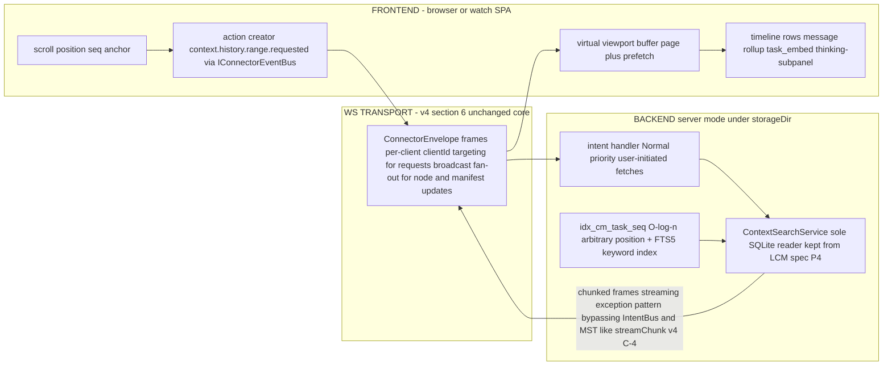
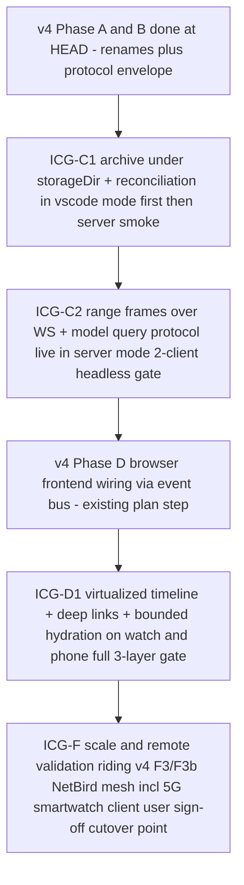

# Infinite Context Graph Storage — Lossless Server-Side Archive, Query Protocol & Display Layer for Compressed History (v4 extension)

**Status:** PLANNING ONLY. This document does not modify source code; it is the target design + rollout plan for lossless server-side storage of the whole chat (including thinking blocks), query protocol for content behind compression, and display strategy at arbitrary history positions in web mode — as an extension of [`plans/architecture-v4-connector-abstraction.md`](architecture-v4-connector-abstraction.md) ("v4"). It explicitly extends/reconciles the deleted spec `plans/architecture-lossless-context-management.md` (recovered read-only from git commit `2574bd280`; cited below as **LCM spec**) — see §2 for what is kept, changed, or superseded. All code-state claims are verified via Serena LSP at HEAD `087ca9acb` on 2026-08-28 and cite file:line; anything not statically re-verified this session is marked **ASSUMPTION**.

**Scope guard (binding):** self-compression is a GIVEN mechanism that exists/will exist elsewhere. This document does NOT redesign the compressor — it consumes its output contract (§4.5) and owns exactly: **(a)** lossless server-side graph storage of the whole chat incl. thinking blocks; **(b)** optimization for >1000 MB contexts; **(c)** how MODELS query content behind compression (token-budgeted); **(d)** how USERS see/display pre-compression content at arbitrary positions in web UI — beginning / middle / 2–3rds — especially outside VS Code (watch/phone via the web provider).

**Key decisions of this document:**
- **Position addressing = `(taskId, seq)`**: every archived message gets a stable monotonic `seq` per task at ingest; it is THE canonical address for arbitrary-position access (model recall AND user display), survives any number of compression cycles because leaves are immutable. NodeIds give DAG-level identity: ULID for messages, deterministic content+range hash for summaries → idempotent re-compression (§4.3).
- **Thinking blocks are first-class archived content**: stored verbatim inside the message row's parts array (never stripped), included in FTS extraction by default [Q3], returned verbatim on recall with token-budget parity to what was originally sent to the model — "the server must return ALL context behind compression, including thinking blocks" is a testable invariant (§4.2, §6.4).
- **Storage: single better-sqlite3 + FTS5 file under `IHostContext.storageDir`** (kept from LCM spec §4.6 decision and DDL verbatim); >1000 MB scale handled by transfer pagination over seq-range pages (default 10 messages or ≤256 KB per frame), O(log n) index access, RAM bounded to O(model contextWindow) regardless of archive size (§5).
- **Model query protocol = native tools `context_search` / `context_recall` (+ optional `context_describe`) → High-priority Fiber intents** (kept from LCM spec §5.4/§7 shapes verbatim), riding the v4 §4.1 ConnectorEnvelope; token budgeting clamps returned slices to remaining window space (§6).
- **Web display = virtualized full-history timeline over server-side range fetches**: new `context.history.range.requested` → chunked `.chunk`/`.completed` frames on the streaming exception pattern (bypass IntentBus/MST like streamChunk); per-client targeted responses + idempotent dedup; deep links `#task=<id>&seq=N[&node=...]`; hello→state stays BOUNDED with minimal context metadata — heavy content arrives after handshake (§7).
- **Rollout maps onto v4 Phase C/D/F** as steps ICG-C1 / ICG-C2 / ICG-D1 / ICG-F, each with §9-style scope/files/acceptance/gate tables; gate discipline unchanged (`pnpm check-all` per step; runtime only after `pnpm build --force`; 3-layer devtool+DebugMCP for UI) (§9).

**Related plans:**
- [`plans/architecture-v4-connector-abstraction.md`](architecture-v4-connector-abstraction.md) — foundation: layout, capability DI (`hostContext.storageDir`), fiber IntentBus (ch5, PRESERVED UNCHANGED), WS transport protocol §6, entrypoints §7, phases §11.
- Deleted `plans/architecture-lossless-context-management.md` @ git `2574bd280` — PRIMARY spec material for the storage/query layer; reconciled in §2.

---

## 0. Context-integrity anchor (verbatim)

> "If at any point you find yourself working on LM Studio / Roo-Code / max_tokens=65536 / reasoning_effort / Task.ts cleanConversationHistory / an lm-studio branch — STOP immediately and report CORRUPTED CONTEXT in your completion. This is a single session; no other windows exist."

Any agent implementing from this plan: encountering the topics above while working on THIS design indicates corrupted context, not related work. Stop and report.

---

## 1. Scope and requirement mapping

### 1.1 In scope (exactly) — new requirements S1–S4 → sections

| # | Requirement | Where closed |
| - | ----------- | ------------ |
| S1 | Store the WHOLE chat server-side in a graph structure, including thinking blocks; compressed summaries must reference original nodes so expansion back to full content works losslessly on demand | §4 (graph model), §5.2–5.3 (schema/indexes) |
| S2 | Optimization for >1000 MB contexts: chunking/pagination strategy, index structures for fast arbitrary-position access with a defined position-addressing scheme, memory-vs-disk split under `IHostContext.storageDir`, caching layers, write path during live streaming | §5 (all subsections) |
| S3 | How MODELS query content behind compression ("what did we discuss at the start"): concrete flow through Fiber IntentBus + backend API surface, message shapes consistent with v4 §4.1 envelope conventions, token-budgeting rules for returned slices — including thinking blocks | §6 (all subsections) |
| S4 | How USERS see/display pre-compression content in web UI at arbitrary positions of history — beginning / middle / 2–3rds — especially outside VS Code (watch/phone via web provider): virtual scroll + server-side range fetches over WS, deep-linking, progressive hydration, UX for jumping into and expanding compressed regions incl. thinking blocks | §7 (all subsections) |

### 1.2 Given / out of scope

- **GIVEN: the self-compression mechanism.** Trigger policy, escalation ladder, summary generation — designed in LCM spec §4.2/§4.5 by its own plan and owned elsewhere. This document consumes only its output contract (§4.5) and does not re-derive or modify it. Values such as soft/hard thresholds, leaf chunk size, fan-in, fresh-tail length are carried forward as **ASSUMPTIONS of that mechanism's configuration**, not design decisions here.
- Kept non-goals from LCM spec §1.2 (unchanged): no semantic/embeddings retrieval in v1 (FTS5/BM25 keyword; hybrid = follow-up behind the same API); no cross-task/cross-session memory consolidation; provider/MCP-hub/checkpoint-time-machine mechanics untouched; single process, one writer (multi-client web mode = several readers of ONE backend).
- No code changes anywhere by this document. Only writable artifact: this file under `plans/`.

---

## 2. Reconciliation with the deleted LCM spec (keep / change / supersede)

The LCM spec was recovered via read-only git history (`git log --all -- <path>` → deletion in HEAD `087ca9acb`; last content at `2574bd280`). It is treated as PRIMARY material. Per-section disposition:

| LCM spec section | Disposition | Why / what changes |
| ---------------- | ----------- | ------------------ |
| §1 requirements R1–R8 + non-goals | **KEPT** (referenced, not re-listed) | Still the requirement base; this doc adds S1–S4 on top (§1.1). Non-goals unchanged (§1.2 here). |
| §2 current state of code | **REBASED** | Phase A rename has landed at HEAD: `src/` → `backend/`, `webview-ui/` → `frontend/`. All path citations re-based and re-verified this session — see §3 table (file:line). REV notes remain valid except where noted in §3. |
| P1–P5 principles (§4.1) | **KEPT verbatim** | Append-only archive; summaries are views; bounded by device not window; one search API for model and human; complement existing mechanics. These directly implement S1/S2/S3. |
| Trigger policy §4.2 + escalation ladder §4.5 (compressor internals) | **SUPERSEDED as design scope** → now GIVEN per user directive (§1.2). This doc references only the output contract in §4.5 here; no re-derivation of thresholds/ladder. |
| ContextNode DAG schema §4.3 | **KEPT + EXTENDED** | Schema kept (kinds `message`/`topic_group`/`rollup`/`task_embed`, ordered children, seq ranges). Extended with: explicit thinking-block handling (§4.2 here), formalized position-addressing scheme and deep-link format (§4.3 here), expansion invariant as testable acceptance criterion (§4.4 here). |
| Memory/disk split §4.4 (MST working set vs SQLite) | **KEPT + EXTENDED** | Split kept; extended with >1 GB scale budgeting, explicit caching layers and pragmas, streaming write path decisions — all new in this doc's scope (§5.3–§5.6). |
| Storage+search tech decision §4.6 (better-sqlite3 + FTS5 BM25, WAL; rationale vs node:sqlite / embeddings / polyglot) and full DDL | **KEPT verbatim** | Decision unchanged at Node 20.19.2 pinned by v4 (§9.1/R5). DDL reused as-is in §5.3 here + scale pragmas added in §5.6. The "why not embeddings-first" argument stands and is inherited, not re-argued. |
| Fiber intent table + preemption safety §5 (Low compression / High recall; yield points at LLM-wait; atomic transactions; hash idempotency) | **KEPT** (+ display-layer additions in §8.1 here: `context.history.range.requested` = Normal, chunk frames on streaming exception pattern). Scheduler/bus code untouched — v4 ch5 invariant preserved exactly (buckets Critical=0/High=1/Normal=2/Low=3; unknown types default to Normal at the priority lookup site). |
| Recall/search/describe API shapes §5.4 + protocol message table §7.2 | **KEPT verbatim as the model query protocol** (§6.2 here) **+ EXTENDED**: token-budgeting clamp rule and thinking-parity rule are new (§6.3–§6.4); display-layer messages added in §8.2 (additive, same naming family). Envelope consistency with v4 §4.1 stated explicitly where LCM spec only implied it. |
| Parent/child `task_embed` design §6 | **KEPT unchanged** — outside this doc's four scope items; verified that the MST fields it attaches to exist at HEAD (§3, TaskModelBase). |
| v4 integration layout + placement table §7 (backend feature module pure Node, protocol types in packages/types/src/protocol, frontend only via IConnectorEventBus) | **KEPT, REBASED** — `packages/types/src/protocol` EXISTS at HEAD with B1 artifacts (`envelope.ts`, `backend-connector.ts`, `frontend-connector.ts`) — v4's audit note "absent on HEAD" predates B1 completion. Consequence: context protocol types are an ADDITIVE file in the existing folder, no subfolder creation step (§3 REV). |
| UI tree view §8 (working-set-scoped tree + search panel) | **CHANGED for web/server mode**: LCM's tree remains the active-task rendering concept; this doc SUPERSEDES it as the complete answer to S4 by adding the full-history virtualized timeline, range-fetch protocol over WS frames with multi-client semantics, deep-linking and bounded progressive hydration (§7). Both surfaces share ONE service and node model — no fork in data paths. |
| Phases LCM-0…LCM-6 §9 (numbering) | **SUPERSEDED** → remapped onto v4 Phase C/D/F steps ICG-C1/C2/D1/ICG-F (§9 here), same gate discipline and acceptance style. Rationale: user directive "implementation lands in Phase C/D territory"; B1 already done at HEAD so the LCM-0 equivalent collapses into an additive protocol file inside ICG-C1. Content mapping: archive+reconciliation → ICG-C1; query protocol + intent registration live in server mode → ICG-C2; display layer (this doc's UI) → ICG-D1; scale/remote validation riding v4 F3/F3b → ICG-F. Compressor-side phases of the LCM spec stay with that plan — out of scope here (§1.2). |
| Risks §10 RSK-1…RSK-9 | **KEPT relevant subset** (rebased) + 2 new display/scale risks NRSK-1/2 (§10 here). |
| Appendix A REV notes / Appendix B open questions Q1–Q7 | REBASED where path-related; OQs carried forward as inherited, not re-listed — this doc adds its own S-layer questions §11 (Q1–Q6) which do not overlap them. |

---

## 3. Verified current state at HEAD `087ca9acb` (this session, Serena LSP + RPG Encoder)

| Seam | Location verified | Fact used by this design |
| ---- | ----------------- | ------------------------ |
| Backend root store keys = exactly: `chat`, `foundation`, `history`, `settings`, `cloud`, `marketplace`, `intentStore`, `fileContextTracker`, `eventLog`; task state lives under the **`chat.tasks` map** (no top-level taskProvider — v4 layout) | [`backend/features/backendroot/store.ts`](../backend/features/backendroot/store.ts:25), `BackendRootModel` body lines 25–74 read via Serena find_symbol include_body | The new context store (`ContextWindowStore`) lands as a **10th root-store key** at ICG-C1, additive in the same pattern; nothing existing moves. |
| Task model identity + parent/child links: `taskId` (identifier), `instanceId`, `rootTaskId?`, `childTaskIds[]`, `parentTaskId?`, `childTaskId?`; streaming state fields; sub-model `notifications`; `.volatile(createTaskVolatileState)` for runtime-only state | [`backend/features/chat/task/store.ts`](../backend/features/chat/task/store.ts:31), lines 31–126 read via Serena find_symbol include_body | `task_embed` nodes (kept from LCM spec §6) attach to these existing fields with zero schema change; volatile vs persisted split confirms where working-set state belongs. |
| Hydration seam: `buildEnrichedState(additionalState?)` sets **`enrichedState._hydration = true`** and enriches via memento + store enrichment before push | [`backend/features/foundation/window-manager/store/state-utils.ts`](../backend/features/foundation/window-manager/store/state-utils.ts:21), lines 21–42 read via Serena find_symbol include_body; v4 §6.2 reuses this exact mechanism for the WS hello→state handshake | This is THE extension point for bounded context metadata in hydrated state (§7.3) — one additive field group, no new message type needed at handshake time. |
| Intent priority map on BOTH sides with buckets Critical=0/High=1/Normal=2/Low=3; exact constant sets read (BE: `task.cancel.requested`+`system.failure`=Critical; `user.message.received`, `ask.response.received`, `tool.execution.required`=High; broadcasts/notification.ask/api.streaming/file.context.tracked=Normal; `log.write`,`agent.request.failed`,`mcp.tool.result`=Low). **No `context.*` constants exist yet** | [`backend/features/intents/IntentConstants.ts`](../backend/features/intents/IntentConstants.ts:105) lines 105–125 and [`frontend/src/features/intents/IntentConstants.ts`](../frontend/src/features/intents/IntentConstants.ts:239) lines 239–259, both read via Serena find_symbol include_body | New constants are pure registrations (unknown types default to Normal at the priority lookup — so explicit registration is MANDATORY for the High-priority recall guarantee); matches LCM spec REV-7. |
| `packages/types/src/protocol` EXISTS with exactly: `envelope.ts`, `backend-connector.ts`, `frontend-connector.ts` (v4 B1 artifacts) | directory listing this session; v4 §4.1 envelope shape `{ protocolVersion, clientId?, sentAt, body }` read from the plan text | **REV vs v4 appendix note** ("protocol subfolder absent on HEAD" — that audit predates B1 completion). Context protocol types = one additive file `context.ts` + index export; no folder creation. All new message bodies ride this envelope unchanged (§6.2, §8.2). |
| Phase A rename applied: top-level `backend/`, `frontend/`, `connectors/` present at repo root | directory listing this session | LCM spec path citations re-based (`src/features/intents/*` → `backend/features/intents/*`; `webview-ui/src/**` → `frontend/src/**`). |

**ASSUMPTIONS (explicit, not statically re-verified this session):**
1. Frontend extensionState ≈70 keys with `_hydration:true` — runtime-verified per the handoff snapshot of THIS session; key count NOT re-counted statically. The design depends only on hydration state existing + the flag being set — both verified above (§3 row 3). Exact key count is irrelevant to any decision here.
2. The self-compression mechanism exists/will exist elsewhere and writes archive rows + DAG nodes + manifest swaps per LCM spec §4 contract — user directive (GIVEN, §1.2); its internal configuration values are not verified or re-derived in this doc.

---

## 4. Graph data model

### 4.1 Node taxonomy & schema (kept from LCM spec §4.3)

One recursive structure for context AND UI: a `ContextNode` DAG per task branch (+ subtask branches via `task_embed`, kept). Schema unchanged from the LCM spec, restated here as the binding contract this layer reads/writes:

```
ContextNode {
  nodeId        : string            // ULID at ingest (message nodes); deterministic hash(content+range) for summary/rollup nodes — idempotency key across compression cycles (§4.3)
  taskId        : string            // task branch; one DAG per task + its subtasks via task_embed links
  kind          : "message" | "topic_group" | "rollup" | "task_embed"
  depth         : int               // 0 = message/leaf, 1+ = rollups/topic groups above parent depth
  parentIds     : string[]          // lineage up (UI tree + traceability)
  childNodeIds  : string[]          // ORDERED children — this ordering IS the active-context order for assembly (§4.5 contract)
  range         : { fromSeq, toSeq }// seq span of task messages covered by the node (message: from=to=seq); THE lossless expansion address (§4.4 invariant)
  tokenCount    : int               // tiktoken-class estimate; rollup = children sum + summary overhead
  status        : "active" | "collapsed"   // metadata-only flag on the NODE row — archive rows are never touched (P1)
  createdAt     : number
}

MessageNode (kind=message, depth=0): { seq, role: user|assistant|tool|system, contentRef -> context_messages.rowid }
TopicGroup    (kind=topic_group):    { title?, source: "auto"|"user", childNodeIds ordered }
Rollup        (kind=rollup):         { summaryText, escalationLevel 0|1|2, descendantCount, earliestAt/latestAt }   // fields written by the GIVEN compressor (§4.5)
TaskEmbed     (kind=task_embed):     { childTaskId, statusRef -> task state, completionSummary? }                    // kept from LCM spec §6 — attaches to TaskModelBase.parentTaskId/childTaskIds verified in §3
```

Storage rows: `context_messages` holds the verbatim content; a message node's `content_json` is the **full parts array exactly as sent/received at the API boundary** (Anthropic block types: `text`, `thinking`, `tool_use`, `tool_result`). FTS extraction flattens text-bearing blocks for searchability (§4.2); structured parts remain verbatim in the row and are what recall returns (§6.4).

### 4.2 Thinking blocks — first-class archived content (S1)

| Aspect | Decision |
| ------ | -------- |
| Storage | `thinking` blocks of assistant messages live inside the SAME immutable archive row as other parts; never stripped, split, or re-ordered at ingest (P1 append-only). A 45k-token thinking block is one archived unit with its message's seq. |
| Searchability | FTS extraction INCLUDES thinking text by default [Q3 — recommended include]: "what did we discuss / why did we do X" must be findable in reasoning, not only in final answers. Display filtering (hide/show) is a UI concern and never a storage or query filter. |
| Query parity | Recall returns structured `partsJson` verbatim INCLUDING thinking; token budget counts them exactly as they were counted when originally sent to the model (§6.4). This makes "the server must return ALL context behind compression, including thinking blocks" a testable invariant (ICG-C2 acceptance: byte-for-byte diff of recalled parts vs original API request payload for a fixture containing long thinking blocks). |
| Display | UI renders thinking in a distinct collapsible sub-panel inside an expanded message row; default collapsed on watch/phone, user-toggleable per settings (§7.5) — display-only filter. |

### 4.3 Stable identity across compression cycles + position-addressing scheme (S2 core primitive)

| Address kind | Definition | Stability | Used by |
| ------------ | ---------- | --------- | ------- |
| **`seq`** = `(taskId, seq)` pair | Monotonic per-task sequence assigned ONCE at ingest; `UNIQUE(task_id, seq)` in the archive table (LCM spec DDL) | Stable forever — leaves are immutable (P1); no compression cycle can renumber or remove them. This is THE canonical position address: "beginning" = min(seq), any middle/2–3rds point = some seq; O(log n) resolution via `idx_cm_task_seq` at 10M+ rows | Model recall by range, display range fetches (§7.2), deep links (`#task=<id>&seq=N`) |
| **nodeId** (message nodes) | ULID assigned at ingest with the row | Stable forever; survives collapse/expand of surrounding rollups — a message keeps its identity no matter how many times the DAG above it is reorganized | UI row keys, incremental `context.node.updated` patches, recall by node |
| **nodeId** (summary nodes) | Deterministic hash(content+range), lcm-style `sum_<16hex>` pattern | Idempotent across compression cycles: re-compressing the same range after preemption/crash yields the SAME id → `INSERT OR IGNORE`, zero duplicates (LCM spec §5.2 mechanics kept); a NEW cycle covering different content gets a new node, old nodes remain queryable lineage via parentIds/childNodeIds + `compaction_events` boundary rows | Compressor output contract (§4.5), drill-down targeting by model/UI |
| **ordinal** in `active_window_manifest` | Position of a node/message in the MODEL-VISIBLE assembly (lcm context_items pattern) | Deliberately UNSTABLE — changes on every manifest swap; never used as an address for storage or display, only describes "what the model sees right now" | Working-set assembly by the GIVEN compressor's assembler (§4.5 contract) |

**Deep-link format (binding):** `#task=<taskId>&seq=N[&node=<nodeId>]` — seq = position anchor; node optional to focus a specific DAG node directly. Both resolve server-side via index/PK lookup in <1 ms at 10M-row scale (§5.4).

### 4.4 Expansion invariant (the lossless guarantee, testable)

For EVERY collapsed/summary node N with range `[fromSeq, toSeq]`:
`SELECT content_json FROM context_messages WHERE task_id = N.taskId AND seq BETWEEN fromSeq AND toSeq` returns the COMPLETE verbatim parts — including thinking blocks. Lineage (`parentIds`, `childNodeIds`, `compaction_events`) makes any summary traceable down to exact original ranges at arbitrary depth (fan-in 4, maxDepth per GIVEN compressor config). This invariant is an acceptance criterion in ICG-C1 and a regression test thereafter; it IS the "server must return all context behind compression" requirement made checkable.

### 4.5 Interface contract with the GIVEN self-compression mechanism

This layer owns the WRITE PATH of `ContextArchiveService` (ingest, §5.6) and ALL read paths (§6/§7). The compressor — owned by its own plan per LCM spec §4.2–§4.5 — writes through the same service API: summary node rows + status flips (`active→collapsed`) + manifest swap as ONE SQLite transaction (atomicity kept from LCM spec §5.2) and one MST action = snapshot boundary (v4 ch5 discipline). Contract fields it must populate are exactly those in §4.1 marked "written by the GIVEN compressor". No other coupling exists; if that mechanism's configuration changes, this document is unaffected as long as rows/nodes/manifest conform to §4.1–§4.4.

---

## 5. Server-side storage layout & >1000 MB optimization (S2)

### 5.1 File layout under `IHostContext.storageDir` (v4 §7.2 capability DI — where "store the whole chat on the server" lives)

```
<storageDir>/context/jabberwock-context.db        -- single SQLite file, v1
<storageDir>/context/jabberwock-context.db-wal    -- WAL side files (concurrent readers during writes)
<storageDir>/context/jabberwock-context.db-shm
```

- vscode mode: `storageDir` = globalStoragePath-derived dir; server/web mode: `--data-dir` (= env `JABBERWOCK_DATA_DIR`, v4 D-2). Path is ALWAYS derived from the capability — zero hardcoding (G1/G5 invariants, LCM spec §7.1 kept).
- **Single file in v1.** SQLite with WAL handles tens of GB comfortably at this access pattern; per-task DB partitioning remains a documented scale-out follow-up WITHOUT API change [Q4 threshold] (LCM RSK-5 path kept).

### 5.2 Schema & index structures for fast arbitrary-position access (kept from LCM spec §4.6 DDL verbatim)

Tables and indexes unchanged: `context_messages` (+ `idx_cm_task_seq ON (task_id, seq)`), `context_nodes` (+ depth and range indexes), FTS5 **external-content** virtual tables (`messages_fts`, `summaries_fts`) with AFTER-INSERT triggers only — append-only P1 enforced at service level by an ESLint boundary rule "features/context: INSERT + SELECT only"; `active_window_manifest (task_id, ordinal → node_id)`; `compaction_events` boundaries.

Position access = `(taskId, seq) → idx_cm_task_seq`: O(log n) point/range reads for BOTH model recall and display range fetches — this is the index structure that makes "beginning / middle / 2–3rds" cheap at any archive size (§4.3). FTS5 external-content keeps keyword indexes from duplicating data (index overhead ≈0.3–0.6× content, LCM spec §4.6 claim kept; re-validated on the ICG-F fixture per [Q2]).

### 5.3 Chunking & pagination strategy — transfer pages over seq ranges (storage itself is NOT app-chunked)

| Decision | Value / rule | Rationale |
| -------- | ------------ | --------- |
| Storage chunking | None beyond SQLite's own page/WAL mechanics | A single WAL-mode file with the indexes above already gives O(log n) access; adding an application-level blob store would duplicate data and break P1 simplicity. The >1 GB problem is TRANSFER + RAM, solved below. |
| Transfer unit = **seq-range page** of messages/nodes | `pageSize` default 10 items OR ≤256 KB serialized payload — whichever comes FIRST [Q1] | Bounds every WS frame for watch-class memory and NetBird/5G latency (v4 R5/F3b scenario); a single huge tool result or thinking block can never blow the page cap because the size check wins. |
| Boundary metadata on EVERY range response | `{ minSeq, maxSeq, totalCount, approxMidpoint }` carried in each `.completed` frame (§8.2) | Client computes beginning/middle/2–3rds anchors with ZERO extra round-trips — jump controls work offline-of-server after the first page (§7.4). `approxMidpoint = (minSeq+maxSeq)/2`, refined by server from index stats when cheaply available. |
| Prefetch policy (FE) | Current page ± 1–2 pages per client connection, evicted LRU on scroll-away [Q1] | Watch/phone: keep in-flight traffic minimal; each viewport fetch is independent and idempotent (§8.2 dedup). |

### 5.4 What stays in memory vs on disk at >1000 MB (scale budgeting)

| Layer | Content | Bound |
| ----- | ------- | ----- |
| RAM — backend MST working set | Fresh tail verbatim + summary texts of the active window; metadata-only entries for collapsed nodes beyond soft threshold (`nodeId+depth+range` without text, LCM spec §4.4 eviction kept) | **O(model contextWindow)** — i.e., MBs regardless of whether the archive is 100 MB or 5 GB. This is the "mobx не бесконечно" property restated: RAM holds only what can be sent to a model + its metadata; disk holds everything else (P3). |
| RAM — per-client FE viewport buffer | Current page ± prefetch (§5.3) | O(pageSize × few pages) ≈ tens of KB–low MB even at 256 KB cap [Q1] |
| Disk under `storageDir` | Full verbatim parts incl. thinking + FTS indexes + DAG nodes + manifest + compaction events | Grows with the conversation; "bounded by device" (P3) — honest limit is disk, not window |

Consequence statement: a >1000 MB conversation costs the process only O(contextWindow) RAM; arbitrary-position query latency stays ms-scale via `idx_cm_task_seq` + FTS5 at 10M-row scale (LCM spec §4.6 performance claim kept and re-validated on fixture in ICG-C2/ICG-F gates).

### 5.5 Caching layers & pragmas (decision table)

| Layer | What | Decision / rationale |
| ----- | ---- | -------------------- |
| L1 — MST working set | In-process, snapshot-boundary mutations only | Kept from LCM spec §4.4; the ONLY app-level cache of content in RAM (§5.4 bound). |
| L2 — SQLite page cache | `PRAGMA cache_size` default **-64 MB** [Q2] | Sized for >1 GB working sets without pressuring extension-host or server memory budgets; candidates -32/-64/-128 measured on the ICG-F fixture. |
| L3 — OS file cache only | No app-level blob/row cache in v1 | Single process, one writer: WAL reads are already cheap and coherent; a second application-level cache adds coherence bugs (stale rows after manifest swaps) for zero measured gain at this scale. Revisit ONLY if ICG-F fixture shows page-cache misses dominating latency [Q2]. |
| Pragmas | `journal_mode=WAL`, `busy_timeout=5000` kept from LCM spec §4.6; `wal_autocheckpoint` left default in v1, tuned only on evidence of checkpoint storms at scale [Q2] | WAL = concurrent readers during writes — multi-client web mode can scroll/search while the backend streams a new turn (§5.6). |

### 5.6 Write path during live streaming (S2)

| Aspect | Decision / rationale |
| ------ | -------------------- |
| Ingest point | Hook at the EXISTING message-save flow (LCM spec LCM-1 placement kept): when a user/assistant/tool message is finalized and saved, INSERT into `context_messages` + FTS trigger fires in the SAME transaction as the existing JSON write until cutover — dual-write with reconciliation on every start (§5.7). |
| Sync API safety | better-sqlite3 synchronous calls: each op atomic and short → no async races across fiber yield points (LCM spec §4.6/§5.2 argument kept); a compression transaction (rows+node+manifest) is all-or-nothing even if the fiber suspends mid-LLM-wait — partial state impossible, idempotent hash + reconciliation converge on restart anyway. |
| Streaming chunks are NOT archived mid-stream | Only FINALIZED messages enter the archive; in-flight streamChunk traffic bypasses it entirely (same channel as today's streaming exception pattern). Rationale: avoids torn rows on crash and keeps write cost O(finalized turns), not O(chunks); any gap between last archived row and JSON ground truth is closed by reconciliation until cutover, after which SQLite IS the source of truth (LCM-6 discipline kept from that plan — out of scope here except as interface). |
| Concurrency profile | One writer = backend process; N readers = same-process queries for all connected clients. WAL makes reads non-blocking during writes → a watch client scrolling history never stalls on an in-progress turn, and vice versa (§5.4/§7.1 multi-client semantics). |

### 5.7 Crash recovery / reconciliation (kept from LCM spec §4.4)

On start: for each task compare `max(seq)` in SQLite against the JSON ground truth (`api_conversation_history.json` per-task file, re-based path under current layout); import gaps; log discrepancies without blocking startup. Mandatory on every start until cutover (owned by the compressor plan's LCM-6 equivalent — interface only here).

---

## 6. Model query protocol (S3)

### 6.1 Flow when a model needs content behind compression ("what did we discuss at the start")

```
LLM tool call in-turn: context_search / context_recall (+ optional context_describe)
   -> existing native tool framework executes it
   -> execution creates intent context.search.requested | context.recall.requested  [High priority — EXPLICIT registration, §8.1]
      (unknown types would default to Normal at the priority lookup site verified in §3 — so registration is MANDATORY for the R6 latency guarantee)
   -> handler calls ContextSearchService = SOLE owner of SQLite reads (P4 one-API kept from LCM spec §5.4/§7)
   -> result returns as tool result within the SAME API request; model never waits on Low-priority compression fibers
      (non-blocking proof: user messages High, notifications Normal/Low all outrank or bypass compression — LCM spec §5.3 table kept verbatim in spirit)

UI search panel (human): identical body via IConnectorEventBus -> same intents + same service = R3 parity;
gate test enforces it: same query from tool and panel returns the SAME results (§9 ICG-D1 acceptance).
```

### 6.2 Message shapes — KEPT VERBATIM from LCM spec §5.4/§7.2, envelope-consistent per v4 §4.1

Every body below rides `ConnectorEnvelope { protocolVersion: 1, clientId?, sentAt, body }` (v4 §4.1; identity-envelope on vscode transport, WS frame in web mode — no shape divergence). Event constants follow the existing naming family (`domain.action.state`, cf. verified sets in §3):

```typescript
// context.search -- keyword FTS5 BM25 over archive + summaries, filters as SQL WHERE
request:  { taskId?: string; query: string; scope?: "messages"|"summaries"|"all"; roleFilter?: Role[]; limit?: number /* default 10 */ }
response: { results: Array<{ nodeId: string; kind: NodeKind; snippet: string; rank: number; range: { fromSeq, toSeq }; taskId: string }> }

// context.recall -- expand a node/range back to RAW content (lossless — the S3 guarantee)
request:  { nodeId?: string; fromSeq?: number; toSeq?: number; maxTokens?: number /* default 8000 */ }
response: { items: Array<{ seq: number; role: string; partsJson: string }> ; truncatedFromMiddle: boolean; nodeMeta?: ContextNodeMeta }

// context.describe -- best-fit summary node for a range (drill-down targeting)
request:  { taskId: string; fromSeq: number; toSeq: number }
response: { nodeId: string; depth: number; descendantCount: number; summaryText: string | null /* null = no ready node -> propose recall */ }

// BE->FE broadcasts (kept): context.search.results.broadcast, context.node.updated.broadcast,
//                           context.window.manifest.changed  -- see §8.2 for display-layer additions
```

### 6.3 Token-budgeting rules for returned slices (NEW — decision-grade)

| Rule | Definition / formula | Rationale |
| ---- | -------------------- | --------- |
| Default budget | `maxTokens` default **8000** on recall (kept from LCM spec §5.4); search snippets bounded by FTS snippet length + limit 10 results | Matches a tool-result-sized slice; large raw content arrives chunked (§6.2 response is the logical result — transport chunks it per streaming exception pattern, §8.2). |
| Middle truncation | When range exceeds budget: truncate FROM THE MIDDLE preserving first/last (remnic expand semantics kept) with `truncatedFromMiddle: true` + exact covered sub-range in metadata so a follow-up recall can fetch the missing middle by seq | Keeps both ends of long thinking blocks / tool outputs visible — the parts most likely to carry intent and outcome. |
| **Window clamp** (new rule) | effective budget = `min(maxTokens, modelContextWindow − currentAssemblySize − reservedOutput)` computed service-side at query time from the task's live assembly state | Guarantees a recall result can NEVER push the next API request past the window — the tool result is always safely re-injectable. Prevents the failure mode where "the server returned everything" but it doesn't fit back in. |
| Drill-down targeting (new rule) | Summary nodes present in active context carry metadata `{ nodeId, depth, descendantCount, range }` (lcm XML-wrapper precedent kept); search results carry `rank + snippet + range`. The model targets recall precisely instead of scanning; describe→recall is the sanctioned two-step for "what's around seq X" | Bounded token cost per query step; no full-range dumps. |

### 6.4 Thinking blocks on the query path — parity rule (NEW)

Recall returns structured `partsJson` verbatim INCLUDING thinking, and the window clamp (§6.3) counts them exactly as they were counted in the original API request: **what was sent is what can be recalled, byte-for-byte.** Rationale: "what did we discuss at the start" must include the reasoning that drove decisions; stripping thinking from recall would make the lossless claim false for a first-class content type (S1/S3 intersection). Display-side hiding of thinking (§4.2) never affects what the model can retrieve.

---

## 7. Web UI display strategy — arbitrary positions on watch/phone (S4)

### 7.1 Architecture: virtualized full-history timeline over server-side range fetches



Decisions:
- **Virtual scroll over the FULL history, not just the active window** — rows come from a local viewport buffer keyed by seq; only visible ± prefetch pages exist in DOM/memory (§5.3/§5.4 bounds). This is what makes "open on watch → jump to beginning/middle/2–3rds" feasible at >1 GB: nothing above the current page is ever loaded until requested.
- **Chunk delivery rides the streaming exception pattern** (v4 §8.3 C-4, same channel as streamChunk): large raw payloads bypass IntentBus/MST entirely — no snapshot churn from multi-MB history fetches [decision]. Incremental updates to already-loaded rows arrive via kept broadcasts `context.node.updated.broadcast` + `context.window.manifest.changed`, patching the buffer without re-fetch.
- **Multi-client semantics (v4 §6.3/§6.4 kept):** each client fetches its OWN viewport — no shared scroll state in v1; request/response correlated by a body-level `requestId`; server targets ONLY the requesting client (`ClientTarget { kind: "client" }` per v4 §4.2) while node/manifest broadcasts fan out to everyone (all UIs converge, same as ask resolution). First-response-wins applies to ASKS only; range requests are read-only and idempotent — duplicate in-flight fetches for the same anchor resolve identically [decision].

### 7.2 New display-layer protocol messages (additive; envelope-consistent naming per §6.2)

| Direction | Event constant | Body | Priority / channel |
| --------- | -------------- | ---- | ------------------- |
| FE→BE | `context.history.range.requested` | `{ taskId, requestId, anchorSeq?, fromSeq?/toSeq?, pageSize?, direction?: "up"|"down" }` — anchored fetch: with only `anchorSeq`, server pages around it; explicit range wins over anchor [decision] | **Normal intent** for user-initiated scroll fetches. Rationale (vs High): viewport loading must NEVER block rendering of newer content or model recall (§6.1 stays High); a slow watch client paging history cannot starve the turn-critical path — this is exactly the LCM spec §5.3 non-blocking property extended to display traffic |
| BE→FE (requesting client only) | `context.history.chunk` × 0..k then `context.history.completed` | chunk: `{ taskId, requestId, chunkIndex, items: Array<{ seq, role, nodeId?, partsJson? , summaryText?, nodeMeta? }> }`; completed adds boundary metadata `{ minSeq, maxSeq, totalCount, approxMidpoint }` (§5.3) + `truncatedFromMiddle?` | Streaming exception pattern (bypasses IntentBus/MST); per-client targeted; idempotent dedup by `(taskId, anchorSeq)` on reconnect re-fetch [decision] |
| BE→FE (all clients) | kept: `context.node.updated.broadcast`, `context.window.manifest.changed`; optional informational `context.compress.progress` (LCM spec §7.2 row kept — UI "collapsing…" indicator in tree/timeline, non-blocking per R6) | as LCM spec | Normal broadcast fan-out; patches viewport buffer incrementally (§7.1) |

### 7.3 Progressive hydration via hello→state extension — BOUNDED by design (decision + rationale table)

v4 §6.2 handshake kept exactly: first client frame `body = { type:"hello", clientKind: "browser"|"watch" }` → server responds `{ type:"state", state:<snapshot>, _hydration:true }` via the verified `buildEnrichedState` seam (§3). **Extension:** hydrated state gains a MINIMAL per-active-task context metadata group —

```
contextWindowMeta?: { taskId, totalSeqCount: number, freshTailFromSeq: number }   // added inside buildEnrichedState enrichment path; O(1) index reads at push time
```

| Alternative | Verdict / why rejected or chosen |
| ----------- | --------------------------------- |
| Full history in the state snapshot | REJECTED — bloats hello response to MB+ at >1 GB archive: breaks watch memory budget, NetBird/5G latency (v4 R5/F3b scenario), and defeats v4 §6.2's property that "UI recovers from a bounded state snapshot + subsequent broadcasts". This is the core S4-vs-S2 tension resolved in favor of bounded handshake. |
| DAG skeleton / manifest summary also in snapshot | REJECTED for v1 — lazy-fetched after handshake when the task view first opens (describe-style path, §6.2 shapes) [Q6]. Keeps hello O(1)-ish at any archive size; cost = one extra round-trip on first open only. |
| **Minimal metadata + dedicated range frames** (§7.2) | CHOSEN — handshake stays bounded and fast even for a 5 GB conversation; heavy content arrives as explicit, cancellable, per-client viewport fetches after the client knows where it is (`totalSeqCount`/`freshTailFromSeq`) or wants to be (deep link §7.4). Reconnect = hello → bounded state → re-fetch CURRENT viewport range only — v1 semantics kept: streamChunks without taskId mapping lost on reconnect are acceptable per v4 §6.2, and history pages are trivially re-requested idempotently (§8.2 dedup). |

### 7.4 Deep-linking to arbitrary positions (beginning / middle / 2–3rds) — binding scheme

- **Format:** `#task=<taskId>&seq=N[&node=<nodeId>]` on the SPA URL; vscode webview resolves the same fragment via IConnectorEventBus handlers — zero host APIs, identical behavior both modes (G2/G3 v4 invariants).
- Resolution flow: hydrate (§7.3) → if `seq` present: one anchored range fetch at N (§7.2); if absent: server pages from `min(seq)` = "beginning"; `node=` focuses a specific DAG node directly (PK lookup, <1 ms §4.3).
- **Jump controls UX:** beginning / middle / end buttons + position indicator ("seq 4,180 of ~96k"). Anchors come FREE from boundary metadata in every completed frame (§5.3) — `minSeq`/`approxMidpoint`/`maxSeq` need no extra round-trip; "2–3rds" = any user-chosen anchor (scroll or typed seq).
- Shareability: links are valid for mesh peers under the NetBird trust boundary [Q5]; no public/anonymous sharing in v1.

### 7.5 UX sketch — jumping into and expanding compressed regions incl. thinking blocks

| Row type | Rendering | Data source |
| -------- | --------- | ----------- |
| Message rows (fresh tail) | Exactly as today's message rendering | Viewport buffer pages (§7.2 items with `partsJson`) |
| Rollup/summary rows (compressed region marker) | 1–2 line `summaryText` + metadata chip: "descendantCount msgs · tokensBefore→tokensAfter" + expand affordance — kept from LCM spec §8.1 tree-view row design, now positioned on the full-history timeline by its seq range | Viewport buffer items with `nodeMeta`; incremental patches via `context.node.updated.broadcast` (§7.2) |
| Task embed rows (subtask markers) | Status icon + completionSummary; click → child task view OR inline recall of child content — kept from LCM spec §6/§8, unchanged | Same buffer item shape (`kind: "task_embed"`) |

**Expansion flow:** tap a rollup row → `context.recall.requested(nodeId)` (same service as the model's tool call — R3 parity; user-initiated path reuses the High-priority intent so expansion is fast even while compression runs in background) → chunk delivery renders raw messages PROGRESSIVELY, including thinking blocks in distinct collapsible sub-panels (§4.2: default collapsed on watch/phone). Input and streaming of NEW content are never blocked during expansion — R6 non-blocking preserved (display fetches Normal + recall High both outrank/bypass Low compression per §5.3 LCM proof kept; chunk frames ride the exception channel, §7.1).

---

## 8. Integration with Fiber IntentBus & WS transport (scheduler and transport core UNTOUCHED)

### 8.1 New intent constants & priorities — registration table (LCM spec §5.1 rows KEPT verbatim + display-layer additions NEW)

| Intent type | Priority bucket | Why this level |
| ----------- | --------------- | -------------- |
| `context.compress.requested` | **Low (3)** — kept from LCM spec R6: compression never blocks fast rendering of new messages/notifications; user input High always outranks it | GIVEN compressor's trigger path (§4.5 contract) |
| `context.compress.completed` (manifest swap + UI tree/timeline update broadcast) | Normal (2) — kept | Fast MST action, must land before next API request but not ahead of user input |
| `context.recall.requested`, `context.search.requested`, `context.describe.requested` | **High (1)** — kept from LCM spec R6: model waits on tool result in the turn-critical path; recall is a short SQLite read (<ms–tens ms) that must not queue behind long responses. Same level as verified existing High constant `tool.execution.required` (§3) — semantically it IS tool execution | S3 protocol core |
| `context.window.evicted` (metadata-only eviction from MST, LCM spec §4.4 kept) | Low (3) — kept | RAM hygiene; never blocks rendering |
| **NEW** `context.history.range.requested` | **Normal (2)** [decision] | User-initiated viewport fetches (§7.2): must not block newer-content rendering or model recall, but should land ahead of background housekeeping; chunk/completed frames are NOT intents — streaming exception pattern (§8.2) |

Registration = additive entries in the verified `INTENT_PRIORITY` maps on both sides (BE/FE files per §3); unknown types default to Normal at the lookup site, so forgetting registration silently degrades recall latency — ICG-C2 gate includes an explicit assertion that all five context constants resolve to their intended buckets.

### 8.2 WS frame lifecycle & multi-client semantics for new traffic (v4 ch6 core unchanged)

- All new bodies are `WebviewMessage`-typed event constants riding the ConnectorEnvelope (§4.1 shape verified in §3); handshake, clientId registry, broadcast fan-out mechanics untouched; ask first-response-wins by requestId dedup + late ack + decision-broadcast-to-all (v4 §6.4) untouched — it governs ASKS only [decision].
- Range/recall request/response: body-level `requestId` correlation; server responds to the requesting client ONLY (`ClientTarget { kind:"client" }`, v4 §4.2); idempotent dedup by `(taskId, anchorSeq)` so reconnect re-fetches are safe under multi-client (two clients may fetch overlapping ranges concurrently — reads never conflict).
- Preemption: `task.cancel.requested` (Critical=0) mid-recall or mid-range-delivery → existing mechanics apply unchanged (yield points at LLM-wait for compression; SQLite ops atomic and short §5.6); in-flight chunk delivery is stateless per request, so abort = stop sending remaining chunks + ack to the requesting client only [decision]. No scheduler/bus code changes anywhere — v4 ch5 "PRESERVED UNCHANGED" invariant holds exactly (buckets Critical=0/High=1/Normal=2/Low=3; preemption at yield points; MST snapshots on dispatch/suspend/resume).

---

## 9. Phased rollout mapped onto v4 Phase C/D/F (§11 gate style)

**Prerequisite note:** B1 is DONE at HEAD (protocol folder exists with envelope + connector contracts — §3 REV), so the LCM-0 equivalent collapses into an additive file inside ICG-C1. Compressor-side phases of the LCM spec stay owned by that plan per scope guard (§1.2); this rollout covers exactly S1–S4. Gate discipline unchanged: `pnpm check-all` (lint+check-types+test, 0 errors) at EVERY step; runtime verification ONLY after `pnpm build --force`; UI steps use full 3-layer devtool/DebugMCP (backend vars → store state → DOM).



### ICG-C1 — Server-side archive under `storageDir` + protocol types (S1/S2 foundation)

| Field | Content |
| ----- | ------- |
| Scope | Additive file `packages/types/src/protocol/context.ts` (+ index export): ContextNode/NodeKind, SearchRequest+Result, RecallRequest+Item, DescribeResponse, HistoryRange request/chunk/completed bodies, event constants (§6.2/§8.1–8.2). New backend feature module (pure Node, zero vscode imports — G1 boundary rule per LCM spec §7.1): `db/schema.sql` = LCM spec §4.6 DDL verbatim + pragmas §5.5; `ContextArchiveService` ingest hook at the existing message-save flow with dual-write (§5.6); reconciliation on start (§5.7); `ContextWindowStore` registered as 10th root-store key (additive, pattern per verified BackendRootModel — §3). |
| Files touched | `packages/types/src/protocol/{context.ts,index.ts}`; new `backend/features/context/**`; one additive line in [`backend/features/backendroot/store.ts`](../backend/features/backendroot/store.ts:25) model definition. better-sqlite3 = backend-only dependency (never enters webview bundle). |
| Acceptance | After an N-message session: archive count per taskId = saved message count, zero loss; kill -9 mid-session → restart → reconciliation imports gaps and working set matches pre-crash snapshot by seq ranges; FTS MATCH on a known identifier returns the row INCLUDING thinking text [Q3 default]; expansion invariant §4.4 passes on fixture with long thinking blocks (byte-for-byte parts diff). |
| Gate | `pnpm check-all`; runtime after `pnpn build --force` — typo-free: `pnpm build --force`: vscode-mode smoke via devtool store state shows hydrated window; then server-mode smoke per v4 C2-gate style (`curl /healthz`, node script hello→state showing bounded `contextWindowMeta`). Platform matrix check for better-sqlite3 prebuilds on all target images (LCM RSK-1 kept). |

### ICG-C2 — Range fetch frames over WS + model query protocol live in server mode (S3)

| Field | Content |
| ----- | ------- |
| Scope | Intent registration table §8.1 (all five constants, both sides); `ContextSearchService` read path; handlers for search/recall/describe/history-range with chunked delivery on the streaming exception pattern (§7.2/§8.2); token-budgeting rules enforced incl. window clamp + thinking parity (§6.3–§6.4); per-client targeted responses + idempotent dedup. |
| Files touched | `backend/features/intents/{IntentConstants.ts, handler registration}`; `backend/features/context/actions/**`; connector sendOutbound targeting usage (no transport changes). Native tool definitions for the model added alongside existing buildToolDefinitions path (availability behind settings flag default off until ICG-F sign-off — LCM spec §7.1 pattern kept). |
| Acceptance | Headless 2-client node/ws script on a large synthetic fixture (~50k messages / tens of millions of tokens): boundary metadata correct at beginning/middle/end anchors; recall p95 < 100 ms on that archive (LCM-4 acceptance kept); model-tool vs UI-panel parity: same query → identical results (R3, LCM-5 parity test moved here since display panel lands in D1 — tool side verified now against service directly); cancel mid-recall aborts cleanly with ack to requesting client only; assertion that all context constants resolve to intended priority buckets (§8.1). |
| Gate | `pnpm check-all` + `pnpm build --force`; server bundle builds WITHOUT vscode external (v4 C2 automatic purity proof, criterion C-2); 2-client script committed as test artifact per v4 D3 style; no FE yet → full 3-layer not required, store-state checks via devtool where applicable. |

### ICG-D1 — Browser/watch virtualized timeline + deep-linking + bounded progressive hydration (S4)

| Field | Content |
| ----- | ------- |
| Scope | New frontend feature: viewport buffer store; range-request action creators via `IConnectorEventBus` only (G2/G3); chunk subscription on the bus streaming-exception path (§7.1/§8.2 — zero postMessage in app-level code, v4 C-4 criterion); virtualized timeline rows incl. rollup metadata chips + thinking sub-panels (§7.5); jump controls beginning/middle/end from boundary metadata (§7.4); deep-link fragment resolution; `buildEnrichedState` additive `contextWindowMeta` field group (§7.3 — one enrichment branch, verified seam §3). |
| Files touched | New `frontend/features/context/**`; [`backend/features/foundation/window-manager/store/state-utils.ts`](../backend/features/foundation/window-manager/store/state-utils.ts:21) additive fields; bootstrap wiring per v4 D1/D2 patterns (connector-bus singleton already injected by then). |
| Acceptance | Full 3-layer on BOTH connectors: DebugMCP vars in range handler → devtool `get_store_state` viewport buffer + expanded set → `find_element` DOM rows at beginning/middle/end anchors; deep link `#task=<id>&seq=N` lands on the correct row after hydration AND after reconnect (re-fetch idempotent); expanding a 45k-token thinking block renders chunked WITHOUT blocking input — timestamp check: new user message rendered during expansion with no head-of-line delay (LCM-4 gate pattern kept); `clientKind:"watch"` hello path works end-to-end per v4 §6.2; perf-check on 10k-node fixture timeline render (LCM RSK-7 mitigation verified). |
| Gate | `pnpm check-all` + `pnpm build --force`; full 3-layer devtool/DebugMCP both connectors; user sign-off on the display scenarios §7.4–§7.5 before ICG-F starts. |

### ICG-F — Scale & remote-access validation riding v4 F3/F3b (S2/S4 at scale) [decision: no new code expected]

| Field | Content |
| ----- | ------- |
| Scope | No feature work; e2e per v4 F3 with a >1 GB archive fixture under the NetBird mesh incl. 5G/smartwatch client (v4 R5/F3b first-class scenario): bounded hydration measured at scale, viewport re-fetch after reconnect completes in ≤ N frames [measure], recall latency on remote link within §6.3 budgets, `cache_size`/checkpoint behavior informs Q2 closure; cutover point where lossless display becomes default (flag ON) — LCM-6 sign-off discipline kept: **user sign-off mandatory**. |
| Gate | v4 F3/F3b checklist + this doc's scale acceptance items above; results committed as phase artifact. If fixture exposes page-cache or checkpoint pathology → Q2 tuning step added here, still inside ICG-F scope (config-only change). |

---

## 10. Risks & mitigations

| # | Risk | Source | Mitigation in this plan |
| - | ---- | ------ | ----------------------- |
| RSK-1' | better-sqlite3 prebuilds fail on a target platform (musl/arm64) → build breaks or drags toolchain into dual-mode images | Kept from LCM spec §10, re-based to ICG-C1 gate | Platform-matrix install + smoke-open check in EVERY CI image at ICG-C1; fallback = explicit prebuild artifact per v4 platform matrix (LCM RSK-1 path kept). |
| RSK-3' | Preemption/crash mid-compression leaves partial state → lossless claim damaged | Kept from LCM spec §10 | Atomic transactions rows+node+manifest (§5.6); deterministic summary-node hash idempotency (`INSERT OR IGNORE`, §4.3); reconciliation on every start until cutover (§5.7) — even a torn partial state converges at restart (LCM RSK-3 kept). |
| RSK-4' | FTS keyword search misses semantic recall ("why did it fail" → stack trace) while users expect ES-like semantics | Kept from LCM spec §10 | Fixed API decision: hybrid ranker is a follow-up behind the SAME `context.search` (embeddings table with content_rowid links already anticipated in kept DDL); UI panel documents keyword behavior until then; inherited OQ pointer to LCM spec Appendix B Q2. |
| RSK-5' | DB growth at 10M+ rows / multi-GB → FTS/WAL degradation | Kept from LCM spec §10, now FIRST-CLASS via S2 | Single file with WAL + tuned page cache [Q2] to ~5 GB measured (§5.1/§5.5); VACUUM/integrity ops tooling kept (no data deletion — P3 "bounded by device" honest limit); per-task partition follow-up WITHOUT API change at threshold [Q4]; ICG-F fixture is the measurement gate, not a guess. |
| RSK-6' | Dual-write period JSON↔SQLite divergence → source-of-truth confusion | Kept from LCM spec §10 | Reconciliation on every start until cutover (§5.7); lossless-invariant diff test (originals unchanged) in ICG-C1 acceptance; cutover owned by compressor plan's flag step — interface only here, no mixed modes within a task. |
| RSK-7' | UI timeline render degrades on large DAGs (thousands of nodes) especially watch-class devices | Kept from LCM spec §10, now CORE design not mitigation | Virtualization is the architecture (§7.1), not an optimization: only viewport ± prefetch exists in DOM; incremental broadcast patches instead of full re-renders (§7.2); 10k-node perf-check is ICG-D1 acceptance (LCM RSK-7 gate kept). |
| **NRSK-1** NEW | Watch memory/latency under NetBird 5G: large hello or unbounded viewport traffic stalls the client on high-latency links | New — S4×S2 intersection at scale | Bounded handshake by design (§7.3 decision table); payload cap per frame [Q1]; idempotent re-fetch of only current viewport after reconnect (§8.2); validated on REAL link in ICG-F (v4 R5/F3b is the gate, not simulation). |
| **NRSK-2** NEW | WS frame size limits / corporate proxy buffering for large recall chunks (v4 R5 scenario) corrupt or delay multi-MB expansions | New — S3 transport edge case | 256 KB default chunk cap keeps frames small [Q1]; streaming exception pattern already tolerates lost streamChunks in v1 per v4 §6.2 semantics; range/recall re-fetch is idempotent so a dropped mid-stream page self-heals on scroll/reconnect; F3b real-link validation covers it (v4 R5 mitigation kept). |

---

## 11. Open questions — user-decidable, each with recommended default

| # | Question | When to decide | Recommended default / candidates |
| - | -------- | -------------- | --------------------------------- |
| Q1 | `pageSize` and per-frame payload cap for range/recall chunking (§5.3/§7.2) | Before ICG-C2 freeze | **Default: 10 items OR ≤256 KB serialized, whichever first.** Candidates: 5/10/20 × 128/256/512 KB — pick by measuring watch-class device memory headroom on the ICG-F fixture. Rationale for default: keeps every frame small enough for high-latency mesh links while a page of ~10 messages covers typical viewport density. |
| Q2 | SQLite `cache_size` (and checkpoint tuning) for >1 GB workloads (§5.5) | At ICG-F review with fixture data | **Default: `PRAGMA cache_size=-64 MB`;** candidates -32/-64/-128; tune `wal_autocheckpoint` only on evidence of checkpoint storms. Rationale: 64 MB covers hot working sets at multi-GB scale without pressuring extension-host or server memory budgets. |
| Q3 | Include thinking text in FTS keyword index by default? (§4.2) | Before ICG-C1 schema freeze (triggers are the only touch point) | **Default: INCLUDE.** Rationale: "what did we discuss / why" recall must find reasoning, not just final answers; display hiding stays a UI toggle and never affects storage or model query parity [§6.4]. Candidates: include / exclude-with-flag / per-role toggle — any non-include choice weakens the S3 guarantee for thinking-heavy sessions. |
| Q4 | Single-file vs per-task DB partition threshold (§5.1) | At ICG-F review with measured sizes | **Default: keep single file until >5 GB MEASURED on real sessions**, then follow-up plan for per-task files WITHOUT API change (LCM RSK-5 path). Candidates: 2/5/10 GB thresholds — decision is data-driven from the fixture, not speculative. |
| Q5 | Shareable deep links across clients (§7.4) | Before ICG-D1 sign-off | **Default: allow within NetBird mesh peers only in v1** (trust boundary = peer set per v4 D-7); NO public/anonymous link sharing; revisit if an auth phase is ever added. Rationale: the server already refuses non-mesh connections by construction — links are safe exactly where WS itself is reachable, no new surface needed. |
| Q6 | Hydrated-state content for context metadata beyond `{taskId,totalSeqCount,freshTailFromSeq}` (§7.3) | Before ICG-D1 implementation starts | **Default: minimal group only + lazy DAG-skeleton fetch on first task-view open.** Candidates: also include top-level rollup list / full manifest summary — both rejected in v1 because they grow hello response with archive size, violating the bounded-handshake decision (§7.3 table). Revisit if first-open latency proves painful on mesh links (ICG-F data decides). |

**Inherited open questions:** LCM spec Appendix B Q1–Q7 (threshold tuning on real sessions; hybrid semantic search timing/mechanism; agent-decided compression hint tool; LLM-judge validation gate; `delegateToProvider` stub fate — out of scope here per its own note; token-counting centralization; multi-client topic_group write conflicts) are carried forward UNCHANGED and none block ICG-C1/C2.

---

## 12. Traceability & verification status appendix

| Requirement | Sections closing it | Rollout step(s) |
| ----------- | ------------------- | --------------- |
| S1 whole-chat graph storage incl. thinking blocks, lossless expansion on demand | §4 (model), §5.2–§5.3 (schema/indexes/DDL kept from LCM spec §4.6) | ICG-C1 (+ invariant regression thereafter) |
| S2 >1000 MB optimization: chunking/pagination, position addressing, memory-vs-disk under `storageDir`, caching layers, streaming write path | §5 (all), §7.3 bounded hydration as the transfer-side half of scale handling | ICG-C1 (layout/write path) → ICG-F (scale validation gate) |
| S3 model query protocol: IntentBus flow + envelope-consistent shapes + token budgeting incl. thinking parity | §6, §8.1–§8.2 | ICG-C2 (live in server mode; 2-client headless gate) |
| S4 user display at arbitrary positions on watch/phone: virtual scroll + range fetches over WS, deep links beginning/middle/2–3rds, progressive hydration, expansion UX incl. thinking blocks | §7, §8.1 (Normal-priority display intents), §8.2 multi-client semantics | ICG-D1 (UI) → ICG-F (remote/scale validation + sign-off cutover) |
| Inherited R1–R8 (LCM spec §1.1) | Unchanged mapping in that document; this doc's S-requirements are the delta for server-mode scale and display-at-arbitrary-position | Compressor-plan phases own R2/R6 engine internals per scope guard (§1.2); storage/query/display halves land via ICG steps above |

**Verification status legend used throughout:** file:line citations in §3 = statically verified this session via Serena LSP (find_symbol include_body / get_symbols_overview) or directory listing; "kept from LCM spec" items = inherited verbatim with the reconciliation disposition stated in §2; **ASSUMPTIONS** explicitly marked at §1.2, §3 and inline ([Q#] markers point to user-decidable defaults in §11). No code was modified by this planning task; git operations were limited to read-only history reads for LCM spec recovery (`git log -- <path>`, `git show 2574bd280:<path>`); the new plan file remains untracked — staging/commit decisions belong to synthesis time.

*Document completes planning for the infinite-context storage/query/display layer. Implementation starts at ICG-C1 once v4 Phase C prerequisites (C2 bootstrap, `pnpm start:server`) are green; every step above carries its own scope/files/acceptance/gate table and does not start until the previous gate is green.*
