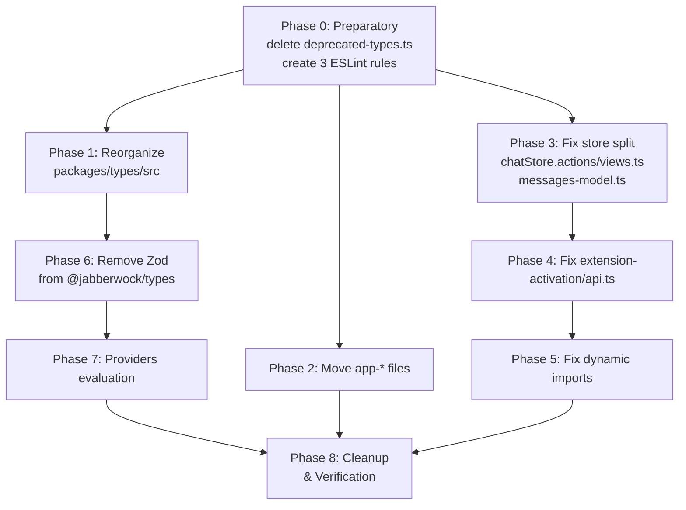

# Architecture Restructure v3 — ESLint Rules + Code Organization Plan

## Overview

This plan addresses all the issues identified during the architecture review. It consists of:

1. **4 ESLint custom rules** (3 new + 1 enhanced) to enforce architectural compliance:
    - `no-complex-folder-structure` (NEW) — max 7 files/folder, no folder-name-in-filename, no duplicate-basename-prefix
    - `no-dynamic-imports` (NEW) — forbid `import()` expressions
    - `no-root-level-split-store` (NEW) — forbid `*.actions.ts`, `*.views.ts`, `*.model.ts`, `*.properties.ts` at feature root (allowed inside subfolders like `events/actions/`)
    - `no-store-outside-store` (ENHANCED) — add check that model name matches a parent folder name
2. **Code reorganization** of `packages/types/src` into subdirectories
3. **File relocations** (app-_ files, messages-model.ts, chatStore._.ts)
4. **Zod removal** from `@jabberwock/types` and replacement with MST patterns
5. **Fix `extension-activation/api.ts`** EventEmitter violation
6. **Remove deprecated-types.ts**
7. **Evaluate providers/ folder** (hardcoded models vs API-fetched)

---

## A. ESLint Rules

### Rule 1: `no-complex-folder-structure` (NEW)

**Location:** `packages/config-eslint/rules/no-complex-folder-structure.js`

This rule combines 3 checks into one rule with toggles:

**Toggles (schema options):**

| Option                      | Type       | Default                                                                      | Description                                                 |
| --------------------------- | ---------- | ---------------------------------------------------------------------------- | ----------------------------------------------------------- |
| `maxFilesPerFolder`         | `number`   | `7`                                                                          | Max files in any non-ignored directory                      |
| `noFolderNameInFilename`    | `boolean`  | `true`                                                                       | Forbid filenames that contain their parent folder name      |
| `noDuplicateBasenamePrefix` | `boolean`  | `true`                                                                       | Forbid files that differ only by a suffix of same base name |
| `ignoredFolders`            | `string[]` | `["node_modules", ".turbo", "dist", ".git"]`                                 | Directories to skip entirely                                |
| `ignoredFiles`              | `string[]` | `["index.ts", "index.tsx", "index.js", "README.md", "*.test.*", "*.spec.*"]` | File patterns that don't count toward the max-files limit   |

#### Check A: `maxFilesPerFolder`

Count files in each directory. If count > threshold, report error.

#### Check B: `noFolderNameInFilename`

For each file, check if the basename (without extension) starts with a prefix matching the parent folder name:

- `events/event-constants.ts` → basename `event-constants` starts with `event-` → folder is `events`, file contains folder name → ERROR
- `events/constants.ts` → basename `constants` doesn't start with `event-` → OK
- Exception: `store.ts`, `store.tsx`, `index.ts`, `index.tsx` are always allowed
- Exception: test files (`*.spec.*`, `*.test.*`) are allowed

#### Check C: `noDuplicateBasenamePrefix`

For each directory, collect all basenames (without extensions). If there's a file `X.ts` and another file `X-Y.ts` (where `X` is a prefix followed by `-`), report error. This detects the pattern where `X` is acting as a category prefix that should be a subfolder instead.

**Examples that would error:**

```
events/
├── constants.ts          ← base name
├── constants-chat.ts     ← DUPLICATE: starts with "constants-"
├── constants-settings.ts ← DUPLICATE: starts with "constants-"
└── constants-flat.ts     ← DUPLICATE: starts with "constants-"
```

→ Error: "constants-chat.ts duplicates constants.ts prefix. Move to subfolder 'constants/' or rename."

```
settings/
├── global.ts             ← base name
├── global-schema.ts      ← DUPLICATE
├── global-composed.ts    ← DUPLICATE
├── global-constants.ts   ← DUPLICATE
├── global-state.ts       ← DUPLICATE
└── global-evals.ts       ← DUPLICATE
```

→ Error: "global-schema.ts duplicates global.ts prefix. Move to subfolder 'global/' or rename."

```
providers/
├── bedrock.ts            ← base name
├── bedrock-models-part1.ts ← DUPLICATE
├── bedrock-models-part2.ts ← DUPLICATE
...
```

→ Error: "bedrock-models-part1.ts duplicates bedrock.ts prefix. Move to subfolder 'bedrock/' or rename."

**Exceptions:**

- `index.ts` and `store.ts` are exempt (they're well-known convention patterns)
- Test files (`*.spec.*`, `*.test.*`) are exempt
- Only the FIRST level of duplication triggers an error (to avoid cascading)

**Registration in `base.js`:**

```javascript
import noComplexFolderStructure from "./rules/no-complex-folder-structure.js"

// In plugins.local.rules:
"no-complex-folder-structure": noComplexFolderStructure,

// In rules:
"local/no-complex-folder-structure": ["error", {
    maxFilesPerFolder: 7,
    noFolderNameInFilename: true,
    noDuplicateBasenamePrefix: true,
}],

// In eslint-comments/no-restricted-disable:
"local/no-complex-folder-structure",
```

---

### Rule 2: `no-dynamic-imports` (NEW)

**Location:** `packages/config-eslint/rules/no-dynamic-imports.js`

**Purpose:** Forbid `import()` expressions to ensure all imports are statically analyzable.

**Logic:**

```javascript
// Visit ImportExpression nodes (AST type for dynamic import())
// Also visit CallExpression where callee is "require" with a non-string-literal argument
```

**Registration in `base.js`:**

```javascript
import noDynamicImports from "./rules/no-dynamic-imports.js"

// In plugins.local.rules:
"no-dynamic-imports": noDynamicImports,

// In rules:
"local/no-dynamic-imports": "error",

// In eslint-comments/no-restricted-disable:
"local/no-dynamic-imports",
```

**Files that currently use dynamic imports (need refactoring):**

- `src/extension-activation/devtool.ts` — `import("@jabberwock/devtool")`, `import("mobx-state-tree")`, `import("@features/storeSingleton")`, `import("../features/...")`
- `src/extension-activation/intents.ts` — `import("@features/chat/task/events/handlers")`, `import("@features/settings/events/handlers")`, etc. (8 dynamic imports)
- `src/extension-activation/api.ts` — `import("@features/history/actions")`

**Replacement strategy:** Convert to static top-level imports. If lazy loading is truly needed (e.g., devtool which is optional), use webpack/turbo code splitting at build level, not inline `import()`.

---

### Rule 3: `no-root-level-split-store` (NEW — Architectural Compliance)

**Location:** `packages/config-eslint/rules/no-root-level-split-store.js`

**Purpose:** Forbid splitting MST store definitions into separate files with suffixes like `.actions`, `.views`, `.model`, `.properties` when they are at the **feature root level**.

Per `architectural-restructure-v2.md` naming conventions, these suffixes ARE valid inside proper subfolders:

| Subfolder          | Naming Pattern                | Example                                                                                 |
| ------------------ | ----------------------------- | --------------------------------------------------------------------------------------- |
| `events/actions/`  | `<imperative-verb>.ts`        | `sendAskResponse.ts`, `saveApiConfig.ts` — sends event via EventBridge, imperative verb |
| `events/handlers/` | `on-<event-name>-received.ts` | `on-ask-response-received.ts` — receives event, creates Intent                          |
| `actions/`         | `<imperative-verb>.ts`        | `respondToAsk.ts` — action creator, creates Intent locally                              |
| `handlers/`        | `on-<past-event>.ts`          | `on-task-started.ts` — intent handler, processes an Intent                              |
| `components/`      | `<ComponentName>.tsx`         | `MessageArea.tsx` — PascalCase React component                                          |

The problem is ONLY when these suffixes sit **directly next to `store.ts`** at the feature root:

```
features/chat/
├── store.ts                      ← OK (store file — MST model)
├── chatStore.actions.ts          ← ERROR: split store at feature root
│                                    Actions should be inline in store.ts
├── chatStore.views.ts            ← ERROR: split store at feature root
│                                    Views should be inline in store.ts
├── task/
│   └── store/
│       └── messages-model.ts     ← ALSO ERROR: *.model.ts at any depth
│                                    Should be task/messages/store.ts
```

**Valid patterns (NOT errors):**

```
features/chat/task/messages/
├── store.ts                      ← OK (store file)
├── events/
│   └── actions/
│       └── streamChunk.ts        ← OK (in events/actions/, imperative verb)
├── events/handlers/
│   └── on-message-received.ts    ← OK (in events/handlers/, event handler)
├── actions/
│   └── respondToAsk.ts           ← OK (in actions/, action creator)
├── handlers/
│   └── on-task-started.ts        ← OK (in handlers/, intent handler)
└── components/
    └── MessageArea.tsx           ← OK (in components/, React component)
```

**Toggles (schema options):**

| Option              | Type       | Default                                                                                                   | Description                                                                                              |
| ------------------- | ---------- | --------------------------------------------------------------------------------------------------------- | -------------------------------------------------------------------------------------------------------- |
| `forbiddenSuffixes` | `string[]` | `[".actions", ".views", ".model", ".properties"]`                                                         | Suffixes that trigger the error                                                                          |
| `allowedPaths`      | `string[]` | `["**/events/**", "**/handlers/**", "**/actions/**", "**/components/**", "**/hooks/**", "**/helpers/**"]` | Path patterns where these suffixes ARE allowed (map to conventions from architectural-restructure-v2.md) |

**Logic:**

```javascript
// 1. Get filename
// 2. Check if basename matches pattern: <name><forbiddenSuffix>.ts (e.g., chatStore.actions.ts)
// 3. Check if file path matches any allowedPaths pattern
// 4. If it has a forbidden suffix AND is not in an allowed path → error
```

This catches `chatStore.actions.ts` at the feature root while allowing `events/actions/sendStreamChunk.ts`.

**Registration in `base.js`:**

```javascript
import noRootLevelSplitStore from "./rules/no-root-level-split-store.js"

// In plugins.local.rules:
"no-root-level-split-store": noRootLevelSplitStore,

// In rules:
"local/no-root-level-split-store": "error",

// In eslint-comments/no-restricted-disable:
"local/no-root-level-split-store",
```

---

### Rule 4: Improve `no-store-outside-store` (ENHANCE EXISTING RULE)

**Current behavior:** Checks that `types.model(...)` is only called in `store.ts`/`store.tsx` files, and that store files are not inside a folder named `store`, and are at most 2 levels deep from `features/`.

**New check to add:** When `types.model("ModelName", {...})` is found, extract the model name (e.g., "Messages"), lowercase it, and check if **any parent directory** (at any depth) contains that word (case-insensitive, partial match). If no parent directory matches, report error.

**Examples:**

```
Path: src/features/chat/task/store/messages-model.ts
Code: types.model("Messages", { ... })
Parent dirs: chat, task, store
Check: Does any parent contain "messages"? → NO → ERROR
Fix: Move to src/features/chat/task/messages/store.ts
      Parent dirs: chat, task, messages → "messages" matches → OK
```

```
Path: src/features/chat/task/messages-list/store.ts
Code: types.model("Messages", { ... })
Parent dirs: chat, task, messages-list
Check: Does any parent contain "messages"? → "messages-list" contains "messages" → OK
```

```
Path: webview-ui/src/features/chat/store.tsx
Code: types.model("Chat", { ... })
Parent dirs: features, chat
Check: Does any parent contain "chat"? → "chat" matches → OK
```

**New messages to add to existing rule:**

```javascript
messages: {
    // existing messages...
    modelFolderMismatch:
        "MST model '{{modelName}}' has no parent folder containing '{{modelName}}' (case-insensitive). " +
        "Move this store to a folder whose name relates to the model.",
}
```

---

## B. Code Reorganization

The ESLint rules above (Section A) will automatically detect violations and guide the reorganization. No manual folder map is needed — run the rules and fix violations iteratively:

### B1. Reorganize `packages/types/src/` into Subdirectories

Current: ~75 files in a single folder. Target: max 7 files per folder.

- ESLint Rule 1 (`no-complex-folder-structure`) will flag folders exceeding `maxFilesPerFolder: 7`
- ESLint Rule 1 also detects `noFolderNameInFilename` (e.g., `events/event-constants.ts`) and `noDuplicateBasenamePrefix` (e.g., `constants.ts` + `constants-chat.ts`)
- Fix violations by moving files into subdirectories and renaming them per architectural-restructure-v2.md conventions

No manual folder map is provided — the ESLint rules will detect violations, and the developer should fix them one at a time following architectural-restructure-v2.md conventions.

**Known violations the rules will catch:**

- `packages/types/src/` — >7 files at root → max-files violation
- `event-constants.ts` in `events/` → no-folder-name-in-filename (rename to `constants.ts`)
- `constants-chat.ts`, `constants-settings.ts`, etc. → no-duplicate-basename-prefix (move to subfolders)
- `types-core.ts`, `types-settings.ts`, `constants-core.ts`, `constants-settings.ts` in `intents/` → no-duplicate-basename-prefix (move to subfolders)
- `global-*.ts` files → no-duplicate-basename-prefix (move to subfolders)
- `bedrock-models-part1..4` → no-duplicate-basename-prefix (move to `bedrock/` subfolder)
- `webview-message.ts`, `webview-message-types.ts` → no-folder-name-in-filename (rename/move to `webview/`)

---

### B2. Move app-\* Files to Proper Feature Folders

| Current File                          | Target Location                                                                                                                                                   | Reason                                                                          |
| ------------------------------------- | ----------------------------------------------------------------------------------------------------------------------------------------------------------------- | ------------------------------------------------------------------------------- |
| `webview-ui/src/app-content.tsx`      | `webview-ui/src/features/foundation/app-shell/content.tsx`                                                                                                        | Application shell / root composition                                            |
| `webview-ui/src/app-dialogs.tsx`      | `webview-ui/src/features/chat/notifications/dialogs.tsx` (or `chat/components/dialogs.tsx`)                                                                       | These are chat-specific dialogs (DeleteMessage, EditMessage, CheckpointRestore) |
| `webview-ui/src/app-message-utils.ts` | Split: message handling → feature-specific `events/handlers/` files. `useMessageHandler` → `webview-ui/src/features/foundation/events/hooks/useMessageHandler.ts` | Cross-cutting message handling                                                  |
| `webview-ui/src/app-types.ts`         | Delete. Move `DeleteMessageDialogState`/`EditMessageDialogState` to chat feature. Replace `tabsByMessageAction` with EventConstants imports                       | Types should be co-located with features                                        |
| `webview-ui/src/app-window-layer.tsx` | `webview-ui/src/features/foundation/window-manager/window-layer.tsx`                                                                                              | Window routing belongs in window-manager feature                                |

**Additionally:** `webview-ui/src/app-content.tsx` uses hardcoded tab routing in `switchTab`. Switch to using `EventConstants` / `IntentConstants` instead of string literals.

---

### B3. Fix `chatStore.actions.ts` / `chatStore.views.ts` Split

**Files affected:**

- `src/features/chat/chatStore.actions.ts` — DELETE (merge into store.ts)
- `src/features/chat/chatStore.views.ts` — DELETE (merge into store.ts)
- `src/features/chat/store.ts` — MODIFY (absorb actions and views)

**Before:**

```
src/features/chat/
├── chatStore.actions.ts     ← VIOLATION
├── chatStore.views.ts       ← VIOLATION
├── store.ts                 ← has ChatModelDefinition (properties only)
```

**After:**

```
src/features/chat/
├── store.ts                 ← has ChatModelDefinition with ALL properties, actions, views inline
```

---

### B4. Fix `messages-model.ts` Location

**Before:**

- `src/features/chat/task/store/messages-model.ts` — WRONG LOCATION

**After:**

- `src/features/chat/task/messages/store.ts` — CORRECT LOCATION

Per architectural-restructure-v2.md target structure (line 1520-1521):

```
task/messages/
├── store.ts                          ← MessagesModel MST (MOVED from task/store/)
├── events/
├── actions/
├── handlers/
├── components/
└── index.ts
```

---

### B5. Remove `deprecated-types.ts`

**Files to modify:**

1. DELETE `packages/types/src/deprecated-types.ts`
2. REMOVE re-export from `packages/types/src/index.ts` (line 164-166)

**Rationale:** No consumer imports `ProfileThresholds` by name — all consumers use `Record<string, number>` directly. Confirmed by codebase search.

---

### B6. Remove Zod from `@jabberwock/types`

**Scope:** ~25 files in `packages/types/src/` use zod, plus ~30 more across the monorepo.

**Strategy (per-package):**

| Package                | Files using Zod                                                                                                                                                                | Replacement Strategy                                                                                                                                                                                         |
| ---------------------- | ------------------------------------------------------------------------------------------------------------------------------------------------------------------------------ | ------------------------------------------------------------------------------------------------------------------------------------------------------------------------------------------------------------ |
| `packages/types/src/`  | ~25 files (payload-schemas, provider-schemas, global-settings-schema, telemetry-event-schema, events, messages, notification, model, mode, cli, todo, tool, mcp, vscode, etc.) | Replace with MST `types.refinement()`, `types.custom()`, or plain TypeScript type guards. Remove `zod` dependency from `packages/types/package.json`                                                         |
| `src/` (extension)     | ~15 files (settings, MCP, providers, workers, etc.)                                                                                                                            | Keep zod for NOW — only remove from `packages/types` first. Extension has its own validation needs that may require zod. **Question for user:** Remove zod from entire monorepo or just `@jabberwock/types`? |
| `packages/cloud/`      | ~5 files                                                                                                                                                                       | Keep for now (separate concern)                                                                                                                                                                              |
| `packages/devtool/`    | ~6 files                                                                                                                                                                       | Keep for now                                                                                                                                                                                                 |
| `apps/web-jabberwock/` | ~4 files                                                                                                                                                                       | Keep for now                                                                                                                                                                                                 |
| `apps/web-evals/`      | ~5 files                                                                                                                                                                       | Keep for now                                                                                                                                                                                                 |
| `packages/core/`       | 1 file                                                                                                                                                                         | Keep for now                                                                                                                                                                                                 |

**Phase 1 — Remove from `@jabberwock/types` only.** This is the core shared types package and should not depend on zod.

---

### B7. Fix `extension-activation/api.ts` EventEmitter

**Problem:** [`src/extension-activation/api.ts`](src/extension-activation/api.ts:79) creates an `EventEmitter` outside MST, merges API methods onto it via `Object.assign`, and provides `startNewTask`, `resumeTask`, etc. This violates rules #2 (no factories), #11 (EventBridge is sole IPC), #15 (no module-level state).

**Solution:** Move the API into a proper MST store with actions.

1. Create `src/features/api/store.ts` — MST model with actions matching the current API
2. Create `src/features/api/events/actions/` — event action creators for each API method
3. The IntentBus should handle dispatching, not `EventEmitter`
4. Remove `src/extension-activation/api.ts` after migration

**Current consumers of `buildApi()`:**

- Extension activation in `src/extension.ts` (line ~81-85)
- Test frameworks

These consumers need to import the MST store instead.

---

### B8. Fix `extension-activation/intents.ts` Dynamic Imports

**Problem:** [`src/extension-activation/intents.ts`](src/extension-activation/intents.ts:48-66) uses 8 dynamic `import()` calls to lazily load intent handler registrations.

**Solution:**

- Replace with static top-level imports
- All handler registration functions are at known paths — no reason for them to be dynamic
- This avoids runtime failures from import resolution errors

**Same for [`src/extension-activation/devtool.ts`](src/extension-activation/devtool.ts:18):**

- The `import("@jabberwock/devtool")` call is for an optional devtool package
- If devtool should remain optional, wrap the static import in a try/catch or use a feature flag at build level
- Alternatively, keep this one exception with an explicit ESLint disable comment

---

### B9. Fix `providers/` Folder (Hardcoded Models)

**Problem:** [`packages/types/src/providers/`](packages/types/src/providers/index.ts) has 49 files of hardcoded model definitions. For **dynamic providers** (openrouter, litellm, requesty, unbound, vercel-ai-gateway, jabberwock), these should be fetched from API at runtime, not hardcoded.

**For static providers** (anthropic, bedrock, deepseek, gemini, vertex, fireworks, mistral, etc.): Hardcoding is acceptable since there's no public API to enumerate these models. However:

1. Reorganize into provider subfolders (already covered in B1)
2. Consider moving model data out of `@jabberwock/types` and into a dedicated data package
3. The model split files (bedrock-models-part1..4) exist because of max-lines:200 — after reorganization into subfolders, the max-files-per-folder rule doesn't apply within provider subfolders

**Decision needed:** Should dynamic provider models be removed from `packages/types/src/providers/` and only kept as API-fetched data?

---

### B10. Verify and Fix Duplicate Type Declarations

**Confirmed duplicates to investigate:**

| Area                 | Files                                                                        | Action                                                                                                      |
| -------------------- | ---------------------------------------------------------------------------- | ----------------------------------------------------------------------------------------------------------- |
| Dialog state types   | `app-types.ts` vs chat feature types                                         | Remove from app-types.ts, import from chat feature                                                          |
| ExtensionMessage     | `packages/types/src/extension-message.ts` vs usage in `app-message-utils.ts` | Ensure app-message-utils imports from `@jabberwock/types`, not local                                        |
| Provider model types | `packages/types/src/model.ts` vs `packages/types/src/providers/*.ts`         | Consolidate — model.ts should define the Zod schema (or MST type), providers/ should provide data instances |
| API config types     | Settings store MST model vs `provider-schemas.ts`                            | Ensure MST store uses `latest` from provider-schemas                                                        |

---

## C. Implementation Phases

### Phase 0 — Preparatory (Safe, no functional changes)

1. DELETE `packages/types/src/deprecated-types.ts` and remove re-export from index.ts
2. DELETE `webview-ui/src/app-types.ts` — move dialog types to chat feature, replace `tabsByMessageAction` with EventConstants
3. CREATE ESLint rules: `no-complex-folder-structure`, `no-dynamic-imports`, `no-feature-store-split`
4. Register all 3 rules in `base.js`
5. Run lint to verify new rules detect violations

### Phase 1 — Reorganize `packages/types/src/` into subdirectories

1. Create subdirectory structure (events/, extension/, webview/, telemetry/, intents/, settings/, cloud/, messages/, models/)
2. Move files to their new locations
3. Update all imports in:
    - `packages/types/src/index.ts` (barrel file)
    - All consumers across the monorepo (search for `@jabberwock/types` imports)
4. Fix the `providers/` folder structure (create subfolders for multi-file providers)
5. Verify `pnpm check-types` passes

### Phase 2 — Move app-\* files to feature folders

1. Move `app-content.tsx` → `foundation/app-shell/content.tsx`
2. Create `foundation/events/hooks/useMessageHandler.ts` for `useMessageHandler`
3. Split `app-message-utils.ts` into feature-specific event handler files
4. Move `app-dialogs.tsx` → `chat/notifications/dialogs.tsx`
5. Move `app-window-layer.tsx` → `foundation/window-manager/window-layer.tsx`
6. Update all imports in `App.tsx` and other consumers
7. Verify `pnpm check-types` + `pnpm lint` pass

### Phase 3 — Fix store split violations

1. Merge `chatStore.actions.ts` and `chatStore.views.ts` into `store.ts`
2. Move `messages-model.ts` from `task/store/` to `task/messages/store.ts`
3. Update all imports
4. Verify `pnpm check-types` + `pnpm lint` pass

### Phase 4 — Fix `extension-activation/api.ts`

1. Create `src/features/api/store.ts` — MST model with all API methods as actions
2. Create `src/features/api/index.ts` — barrel
3. Update `src/extension.ts` to use the MST store instead of `buildApi()`
4. Remove `src/extension-activation/api.ts`
5. Verify `pnpm check-types` + `pnpm lint` pass

### Phase 5 — Fix dynamic imports

1. Replace dynamic imports in `intents.ts` with static imports
2. Handle `devtool.ts` dynamic import (keep with eslint-disable or move to build-level code splitting)
3. Remove dynamic import in `api.ts` (already handled in Phase 4)
4. Verify `pnpm check-types` + `pnpm lint` pass

### Phase 6 — Remove Zod from `@jabberwock/types`

1. For each file in `packages/types/src/` using zod, replace with:
    - MST `types.refinement()` for validation
    - MST `types.custom()` for custom serializer/deserializer
    - Plain TypeScript type guards (`isFoo(x): x is Foo`)
2. Remove `zod` from `packages/types/package.json` dependencies
3. Update `zod-to-json-schema` usage in scripts (or remove)
4. Verify `pnpm check-types` + `pnpm lint` pass

### Phase 7 — Providers folder evaluation

1. Remove dynamic provider models from hardcoded data (keep only static providers)
2. Verify API-fetched models still work correctly
3. Reorganize remaining static provider files into subfolders
4. Verify `pnpm check-types` + `pnpm lint` pass

### Phase 8 — Cleanup & Verification

1. Run full `pnpm lint` — all 18 packages, 0 errors, 0 warnings
2. Run full `pnpm check-types` — all 17 packages, 0 errors
3. Run turbo build to verify no bundling issues
4. Update `.serena/memories/` with new architecture state

---

## D. Risk Analysis

| Risk                                                                            | Impact                                                 | Mitigation                                                                                    |
| ------------------------------------------------------------------------------- | ------------------------------------------------------ | --------------------------------------------------------------------------------------------- |
| Reorganizing `packages/types/src/` breaks imports across the monorepo           | High — 75+ files moved, many consumers                 | Use search for all `from "@jabberwock/types"` to update barrel; add re-exports from new paths |
| Removing zod from `@jabberwock/types` breaks consumers that use `z.infer` types | High — breaking change for packages/cloud, src/, apps/ | Replace `z.infer<typeof X>` with explicit types before removing schemas                       |
| Moving app-\* files breaks webview-ui build                                     | Medium — 5 files moved, multiple consumers             | Update imports in App.tsx and test files                                                      |
| Merging chatStore.actions.ts/view.ts causes merge conflicts                     | Medium — these files are large                         | Do in a single focused pass, verify with `pnpm check-types`                                   |
| `no-complex-folder-structure` rule immediately errors on current state          | Low — rule is opt-in via config                        | Enable rule AFTER reorganization is complete                                                  |
| Dynamic import replacement breaks devtool (optional feature)                    | Medium — devtool is lazy-loaded for a reason           | Keep with eslint-disable comment + explicit explanation, or make it build-config-based        |

---

## E. Mermaid Diagram — Phase Dependencies



Phases 1, 2, 3 can run in parallel after Phase 0. Phase 4 depends on Phase 3. Phase 6 depends on Phase 1. Phases 5 and 7 can run independently.
