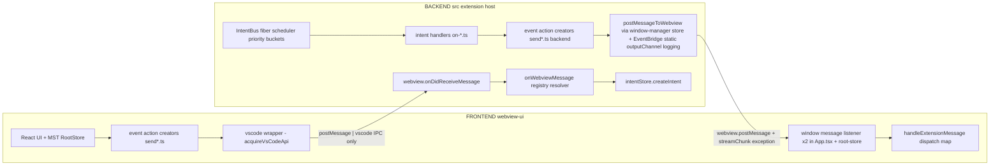
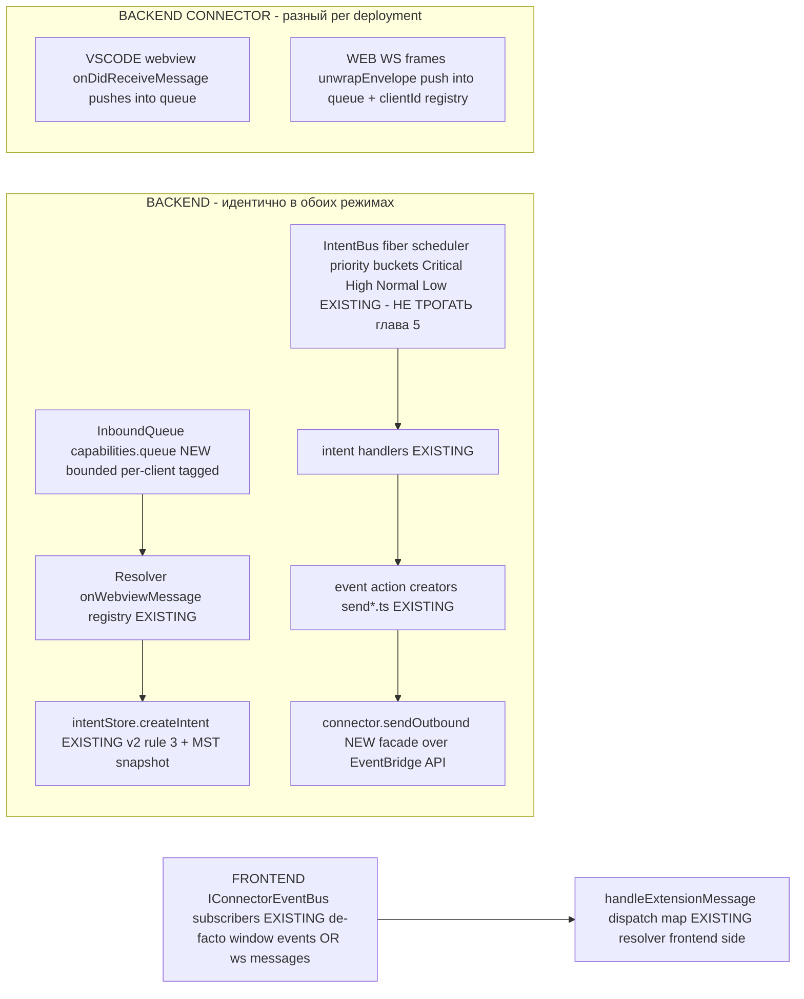
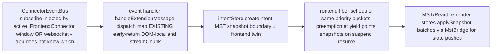
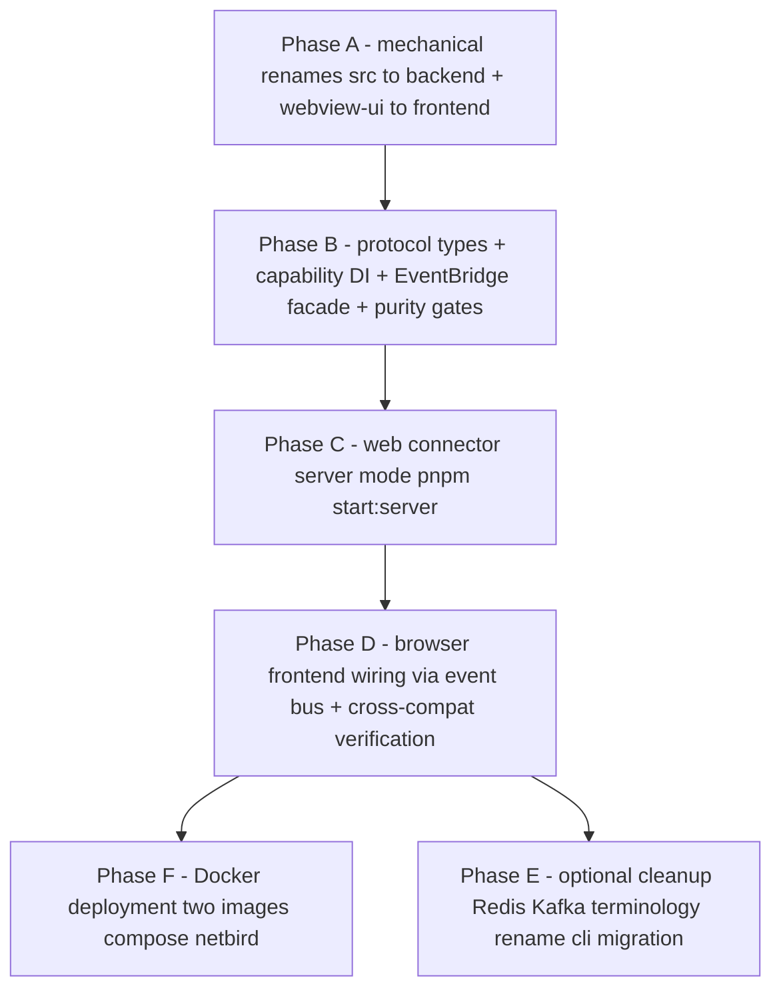

# Architecture v4 — Connector Abstraction и Dual-Mode Operation (VSCode Extension ↔ Standalone Node Server)

**Статус:** PLANNING ONLY. Документ не меняет исходный код; это финальный документ реализации v4. Все утверждения о текущем состоянии кода верифицированы через Serena LSP + RPG Encoder по состоянию на 2026-08-17/18 (commit `36ea32a8`).

**Ключевые решения документа:**

- **Connector / host adapter** — адаптер между ядром приложения и хостом; «provider» в этом репозитории означает только LLM model providers (§1.3). Топ-level папка `connectors/`, пакеты `@jabberwock/connector-vscode` / `@jabberwock/connector-web`.
- **Layout:** один workspace-пакет на хост, внутри — две стороны `frontend/` и `backend/`; один connector не может обслуживать обе стороны приложения (§3.1). Отдельной папки общего транспорта нет: протокольные типы живут в `packages/types/src/protocol`, WS-транспорт является частью `connector-web`.
- **Транспорт web mode:** WebSocket — единственный; body frame = существующие типы сообщений без изменений (§4.1, §6).
- **Fiber IntentBus** сохраняется как ядро коммуникации обеих сторон: приоритетные бакеты Critical/High/Normal/Low, preemption в yield points, MST snapshots на границах (глава 5).
- **Remote access:** self-hosted NetBird mesh — trust boundary; backend слушает только loopback или IP TUN-интерфейса NetBird (§9.5).

**Связанные планы:**

- [`plans/architectural-restructure-v2.md`](architectural-restructure-v2.md) — фундамент, который сохраняется: EventBridge как единственный IPC канал, action creator + handler на каждый event constant, всё состояние в MST, IntentBus с fiber-style priority dispatch (глава 5), streaming exception pattern.
- [`plans/architecture-restructure-v3-plan.md`](architecture-restructure-v3-plan.md) — ESLint правила и реорганизация: фазы 0–5 выполнены по коду (`deprecated-types.ts` удалён, `no-complex-folder-structure.js` / `no-dynamic-imports.js` в [`packages/config-eslint/rules/`](../packages/config-eslint/rules), динамические импорты заменены на статические). Не завершено: B6 (zod removal из `@jabberwock/types`) и B7 (`buildApi()` в [`src/extension-activation/modules/core/api.ts`](../src/extension-activation/modules/core/api.ts) создаёт `EventEmitter` + `Object.assign`).
- [`plans/providers-restructure.md`](providers-restructure.md) — реструктуризация LLM model providers под `src/api/providers/`; целевое состояние достигнуто по коду. Это другое понятие «provider» (§1.3(a)) — в v4 не переименовывается и не затрагивается терминологией connector'ов.

---

## 1. Goals / Non-Goals

### 1.1 Goals

| #   | Цель                                                                                                                                                                                                                                                                                                                                                                                                   |
| --- | ------------------------------------------------------------------------------------------------------------------------------------------------------------------------------------------------------------------------------------------------------------------------------------------------------------------------------------------------------------------------------------------------------ |
| G1  | Один кодбейс работает как (a) VSCode extension и (b) standalone Node server, запускаемый сервисом (`pnpm start:server`), с подключением из browser UI или по сети (smartwatch-клиент).                                                                                                                                                                                                                 |
| G2  | **Cross-compatibility:** сообщение от браузера через его connector принимается пайплайном идентично сообщению из VSCode webview и наоборот. Фронтенды шлют ОДИНАКОВЫЕ сообщения независимо от транспорта; frontend не связан с vscode после входа в pipeline.                                                                                                                                          |
| G3  | Топология на обеих сторонах одинакова: `backend -> connector (разный) -> queue -> resolver` / `frontend -> connector (разный) -> bus/queue -> resolver`. Всё, что идёт ПОСЛЕ connector'а, говорит одним унифицированным интерфейсом/протоколом.                                                                                                                                                        |
| G4  | Backend объявляет INTERFACE нужных ему возможностей (`{ hashMapMemory, queue, eventEmitter }` по примеру пользователя); host-среда инжектит реализации при старте (in-memory defaults для локального сервера; vscode-backed или Redis/Kafka — в других средах). То же на frontend.                                                                                                                     |
| G5  | Три топ-level папки: `backend/`, `frontend/`, **`connectors/`**. Имя «providers» не используется — оно зарезервировано за LLM model providers (§1.3(a)).                                                                                                                                                                                                                                               |
| G6  | **Полное декупирование backend'а:** `backend/` = чистое Node.js приложение. НОЛЬ импортов модуля `vscode`, ноль non-universal platform API. Единственное место, где разрешён импорт vscode — внутри `connectors/vscode`. Механизм принуждения: ESLint `no-restricted-imports` + аудит-скрипт (§8).                                                                                                     |
| G7  | **Полное декупирование frontend'а:** в app-level коде нет прямых `window.addEventListener("message", ...)`, нет raw postMessage к host, ничего browser-vscode-specific. Frontend bootstrap получает от своего connector инжектированную event-emitter абстракцию (`IConnectorEventBus`) — что физически стоит за ней (window или websocket) для приложения не важно (§4.5).                            |
| G8  | **Docker-развёртывание:** тот же агент работает в Docker с отдельными образами backend и frontend; браузер подключается через web connector (WebSocket + статика) и работает идентично vscode mode, за вычетом явно перечисленных vscode-only фич (§9.6). MCP access — полный в обоих режимах. Remote-доступ из локальной сети / 5G / другого города — first-class сценарий через NetBird mesh (§9.5). |

### 1.2 Non-Goals (v1)

- Мульти-тенантность / несколько workspace'ов в одном серверном процессе — один процесс = одна сессия backend (один MST root store).
- Реализация Redis/Kafka capability implementations — только интерфейсы + in-memory/file-backed defaults.
- Миграция `apps/cli` на новый web connector — CLI продолжает работать через vscode-shim mock (`ExtensionHost`) и unix socket IPC; унификация протоколов — follow-up.
- Удаление zod из `@jabberwock/types` (v3 B6) — отдельная задача, не блокирует v4.
- Переименование LLM model providers папки (`src/api/providers/`) и термина «provider» внутри backend'а в рамках v1 (§1.3(a), §9).

### 1.3 ⚠️ ДИЗАМБИГУАЦИЯ: три разных понятия, не путать

| #   | Понятие                                    | Где живёт сейчас                                                                                                                                                   | Что это                                                                                                                                       | Имя в v4                                                                                                                                                                                                                                                                                                                                               |
| --- | ------------------------------------------ | ------------------------------------------------------------------------------------------------------------------------------------------------------------------ | --------------------------------------------------------------------------------------------------------------------------------------------- | ------------------------------------------------------------------------------------------------------------------------------------------------------------------------------------------------------------------------------------------------------------------------------------------------------------------------------------------------------ |
| a   | **LLM model provider** (существующее)      | [`src/api/providers/`](../src/api/providers/) → станет `backend/src/api/providers/`                                                                                | Anthropic/OpenAI/Gemini/vscode-lm — хендлеры LLM API. План: [`providers-restructure.md`](providers-restructure.md), выполнен по коду          | **НЕ переименовывать, НЕ трогать.** Оставить как есть после механического rename папки (`src→backend`). 24+ папок, barrel-экспорты, кросс-провайдерные импорты через `@api/providers/*`. Единственное исключение: vscode-lm provider физически переезжает в `connectors/vscode/backend` (§10.2 L10), но остаётся «model provider» по смыслу и имени.   |
| b   | **Connector / host adapter** (НОВОЕ, v4)   | не существует — создаётся в топ-level папке `connectors/`                                                                                                          | Адаптер host-среды: vscode-webview или web/ws. Реализует унифицированный контракт отправки/приёма сообщений + инжект capabilities/event bus'а | Топ-level папка **`connectors/`**; пакеты **`@jabberwock/connector-vscode`**, **`@jabberwock/connector-web`** (по одному на хост, внутри — стороны `frontend/`+`backend/`, §3.1); интерфейсы `IBackendConnector` / `IFrontendConnector`; id — closed union `"vscode" \| "web"` (§3.2). В документации и комментариях — «connector» или «host adapter». |
| c   | **Webview provider handle** (историческое) | [`EventBridge`](../src/features/foundation/webview/EventBridge.ts), [`providerRegistry`](../src/features/foundation/webview/providerRegistry.ts), `ProviderHandle` | Ссылка на конкретный webview-инстанс (sidebar/editor) для postMessage и storage; ~100+ ссылок в коде (§2.3 L1, §4.2)                          | В v1 **НЕ переименовывать** — только задокументировать в glossary (§10.3). Опциональный cleanup после Phase D: кандидат на имя `WebviewSession`. Фаза E+.                                                                                                                                                                                              |

---

## 2. Текущее состояние: где живёт VSCode-связанность (верифицировано)

### 2.1 Карта швов backend (`src/`)

| Шов                              | Файл(ы)                                                                                                                                                                                                                                                                                                                                                                                                                                                                                                                                                                                                                                                       | Что делает vscode-specific                                                                                                                                                                                                                                                                                                                                                                                                                                                                                                             |
| -------------------------------- | ------------------------------------------------------------------------------------------------------------------------------------------------------------------------------------------------------------------------------------------------------------------------------------------------------------------------------------------------------------------------------------------------------------------------------------------------------------------------------------------------------------------------------------------------------------------------------------------------------------------------------------------------------------- | -------------------------------------------------------------------------------------------------------------------------------------------------------------------------------------------------------------------------------------------------------------------------------------------------------------------------------------------------------------------------------------------------------------------------------------------------------------------------------------------------------------------------------------- |
| **EventBridge**                  | [`src/features/foundation/webview/EventBridge.ts`](../src/features/foundation/webview/EventBridge.ts:26)                                                                                                                                                                                                                                                                                                                                                                                                                                                                                                                                                      | `class EventBridge extends EventEmitter<TaskProviderEvents> implements vscode.WebviewViewProvider`; static registry инстансов (`activeInstances`); ровно ДВЕ точки конструирования — [`extension.ts:71`](../src/extension.ts:71) (renderContext `"sidebar"`) и [`open-in-new-tab.ts:23`](../src/activate/registerCommands/open-in-new-tab.ts:23) (renderContext `"editor"`). `resolveWebviewView()` → window-manager; `postMessageToWebview(message)` делегирует в window-manager store. **Это текущий «backend connector» по факту.** |
| **providerRegistry**             | [`src/features/foundation/webview/providerRegistry.ts`](../src/features/foundation/webview/providerRegistry.ts)                                                                                                                                                                                                                                                                                                                                                                                                                                                                                                                                               | Module singleton: `setProvider/getProvider/clearProvider/hasProvider`. Единственная точка доступа к активному webview provider'у для non-event кода. После v4 — хранит active `IBackendConnector` (имя файла до Phase D cleanup, §1.3(c)).                                                                                                                                                                                                                                                                                             |
| **window-manager messaging**     | [`messaging.ts`](../src/features/foundation/window-manager/store/messaging.ts), [`webview-setup.ts`](../src/features/foundation/window-manager/store/webview-setup.ts)                                                                                                                                                                                                                                                                                                                                                                                                                                                                                        | `WebviewOutboundMessage` union; `postStateToWebview`; `resolveWebviewView()` — весь lifecycle webview: `localResourceRoots → "webview-ui/build"` (литерал в [`webview-setup.ts`](../src/features/foundation/window-manager/store/webview-setup.ts)), `onDidReceiveMessage(handler)` (входной канал!), HTML-генерация, подписки на active editor / theme. `refreshWorkspace` вызывает `vscode.commands.executeCommand("workbench.action.reloadWindow")`.                                                                                |
| **Входящий роутер («resolver»)** | [`on-webview-message.ts`](../src/features/foundation/webview/events/handlers/on-webview-message.ts)                                                                                                                                                                                                                                                                                                                                                                                                                                                                                                                                                           | Registry `Map<type, handler>` + `webviewMessageHandler(provider, message)` — каждый feature сам регистрирует обработчик своего типа. **Это «resolver» в топологии пользователя.**                                                                                                                                                                                                                                                                                                                                                      |
| **Streaming exception**          | [`sendStreamChunk.ts`](../src/features/api/events/actions/sendStreamChunk.ts)                                                                                                                                                                                                                                                                                                                                                                                                                                                                                                                                                                                 | Единственное место, где чанки идут мимо IntentBus/MST: `postMessageToWebview({type:"streamChunk", taskId, text})`. После v4 — тот же body уходит через `connector.sendOutbound()` (§8.3).                                                                                                                                                                                                                                                                                                                                              |
| **Extension activation**         | [`extension-activation/modules/core/`](../src/extension-activation/modules), [`services/ipc.ts`](../src/extension-activation/modules/services/ipc.ts)                                                                                                                                                                                                                                                                                                                                                                                                                                                                                                         | `core/api.ts` — `buildApi()`: EventEmitter + Object.assign (нарушение v3 B7, не исправлено); `intents.ts` — статические импорты регистрации IntentBus handlers; `devtool.ts` — devtool bridge через webview postMessage; `services/ipc.ts` — **IpcServer** (node-ipc unix socket): TaskCommand → createIntent. Уже существует второй «connector» для CLI/evals!                                                                                                                                                                        |
| **Прямые импорты vscode**        | ≈168 файлов в `src/`: статические `import * as vscode from "vscode"` + динамический [`require("vscode")`](../src/services/mcp/mcp-hub/notifications.ts:118) (невидим для static analysis — учтён аудитом) + type-only `import("vscode").ExtensionContext` / FileSystemWatcher в [`manager.services.ts`](../src/services/code-index/manager/manager.services.ts), [`mcp/core/types.ts`](../src/services/mcp/core/types.ts). Пиковая концентрация: foundation/webview, window-manager, extension-activation; также размазано по features (workspace access через [`getVscodeContext()`](../src/features/foundation/vscode/context.ts), commands, file watchers) | Полный маппинг каждого файла на destination — таблица §2.3. Browser-globals (`window`/`localStorage`/`document`) в `src/` отсутствуют (проверено аудитом) → инвариант «чистый Node.js» достижим без дополнительных capability-слотов.                                                                                                                                                                                                                                                                                                  |
| **Storage**                      | `context.globalState/workspaceState` через `getVscodeContext()`, `createBackendRootStore({globalStoragePath})`                                                                                                                                                                                                                                                                                                                                                                                                                                                                                                                                                | Memento-хранилище = текущий «hashMapMemory». В server mode нужен аналог (file-backed / Redis).                                                                                                                                                                                                                                                                                                                                                                                                                                         |

### 2.2 Карта швов frontend (`webview-ui/`)

| Шов                 | Файл(ы)                                                                                                                                                                                                                                                                                                                                                                                                                                                     | Что делает vscode-specific |
| ------------------- | ----------------------------------------------------------------------------------------------------------------------------------------------------------------------------------------------------------------------------------------------------------------------------------------------------------------------------------------------------------------------------------------------------------------------------------------------------------- | -------------------------- |
| **Отправка**        | ≈24 файла импортируют `vscode` из [`@jabberwock/devtool/webview`](../packages/devtool/src/webview/vscode.ts) — это `VSCodeAPIWrapper`: ЕДИНАЯ точка обёртки над глобальным `acquireVsCodeApi()` с fallback на localStorage. Все event action creators (`events/actions/send*.ts`) шлют через него.                                                                                                                                                          |
| **Приём**           | [`AppWithProviders`](../webview-ui/src/app-shell/App.tsx:16) — ДВА `window.addEventListener("message", ...)` (store listener + DOM-action handler); [`root-store/store.ts handleExtensionMessage`](../webview-ui/src/features/root-store/store.ts:202): early-return для DOM-акций и **`handleStreamChunk(message, chat)`** (streaming exception на frontend), затем dispatch по `handleExtensionMessageDispatchMap[type] → intentStore.createIntent(...)`. |
| **Hydration state** | Backend шлёт `{type:"state", ...}`; при отсутствии — webview сам запрашивает `{type:"requestState"}` через 500ms (App.tsx). Механизм уже существует и пригодится для reconnect в WS-режиме.                                                                                                                                                                                                                                                                 |

### 2.3 📋 ИНВЕНТАРИЗАЦИЯ: vscode touchpoints backend'а → destination после миграции

Верифицировано Serena LSP (`search_for_pattern` по `import * as vscode from "vscode"` + динамическим require + type-only импортам, выборочный анализ API-вызовов) и RPG Encoder (reference inventory EventBridge — §4.2), 2026-08-17/18. Таблица закрывает ВСЕ группы импортов; полный файл-в-файл список (≈168 файлов, включая динамический `require("vscode")` и type-only ссылки) генерируется артефактом аудита на шаге A0 (Phase A). Каждая строка = явный destination: либо DI slot из `BackendCapabilities` (§4.3), либо переезд в `connectors/vscode/backend`.

| #   | Группа                                               | Файлы (представители, кол-во)                                                                                                                                                                                                                                                                                                                                                                                                                                                                                                                                                    | vscode capability'и, которые реально используются                                                                                                                                                                                                                                  | Destination после миграции                                                                                                                                                                                                                                                                                                                                                                                                                                                                                                                                                                                                                                                                                                                         |
| --- | ---------------------------------------------------- | -------------------------------------------------------------------------------------------------------------------------------------------------------------------------------------------------------------------------------------------------------------------------------------------------------------------------------------------------------------------------------------------------------------------------------------------------------------------------------------------------------------------------------------------------------------------------------- | ---------------------------------------------------------------------------------------------------------------------------------------------------------------------------------------------------------------------------------------------------------------------------------- | -------------------------------------------------------------------------------------------------------------------------------------------------------------------------------------------------------------------------------------------------------------------------------------------------------------------------------------------------------------------------------------------------------------------------------------------------------------------------------------------------------------------------------------------------------------------------------------------------------------------------------------------------------------------------------------------------------------------------------------------------- |
| L1  | Webview IPC канал + lifecycle                        | `foundation/webview/EventBridge.ts`, `providerRegistry.ts`; `window-manager/store/{webview-setup,messaging,html-utils}.ts`; `events/handlers/on-webview-message.ts`; `api/events/actions/sendStreamChunk.ts` (7)                                                                                                                                                                                                                                                                                                                                                                 | `WebviewViewProvider`, `onDidReceiveMessage`, webview post/state push, HTML-генерация, localResourceRoots; **static outputChannel** — ~20 файлов пишут через `EventBridge.outputChannel?.appendLine(...)` (напр. api-config-store.profiles.ts ×4, on-settings-mcp ×7, on-cloud ×8) | Реализация `IBackendConnector` в **`connectors/vscode/backend/connector.ts`** + inbound → `capabilities.queue`. EventBridge становится transport-agnostic фасадом над connector surface (§4.2); static outputChannel заменяется на `capabilities.logger` (module-level slot). Resolver (`onWebviewMessage`) — без изменений.                                                                                                                                                                                                                                                                                                                                                                                                                       |
| L2  | Extension activation обвязка                         | [`extension.ts`](../src/extension.ts), `activate/**` (~10: CodeActionProvider, registerCommands/\*, handleUri, panel-store, open-in-new-tab, handleTask...), `utils/ui/focusPanel.ts` (≈13)                                                                                                                                                                                                                                                                                                                                                                                      | commands registration, code actions, URI handler, panels/tabs, focus; static'и EventBridge (`sideBarId`, `tabPanelId`) используются в registerWebviewViewProvider / createWebviewPanel                                                                                             | **Переезжает целиком в `connectors/vscode/backend/activation/**`** — это vscode-only «обвязка». VSIX entrypoint = bundle из connector'а; backend публикует только `startBackend()`+ hooks регистрации команд через типы`@jabberwock/types`. Жёсткое требование G6: в `backend/` activation-кода не остаётся.                                                                                                                                                                                                                                                                                                                                                                                                                                       |
| L3  | Storage / memento / secrets (фасад)                  | [`getVscodeContext()`](../src/features/foundation/vscode/context.ts) + ~30 потребителей: `utils/settings/access.ts`, `api/providers/fetchers/modelCache/{cache-storage,modelEndpointCache}.ts`, `window-manager/store/*` (state-utils, html-utils, messaging, webview-setup), `hist/actions/history-actions.ts`, `chat/tools/actions/buildToolDefinitions.ts`, `on-webview-launched/webview-api-config.ts`, `extension-activation/modules/core/core.ts`, `services/cloud.ts`, checkpoint/tts handlers, ~15 файлов settings-handlers (api-config, code-index, agents, context...) | `globalState/workspaceState` get/update, `secrets.get/store/delete`, extensionUri/Mode                                                                                                                                                                                             | **DI slots:** `capabilities.hashmapMemory` + `hostContext.secrets`. Фасад `getVscodeContext()` в Phase B становится тонкой обёрткой над DI-слотами — потребители не меняются до E+ (минимизация diff). В server mode те же слоты = file-backed JSON под `--data-dir` + env/file secrets. **Pull-forward (Phase C finalization):** the host-context consumer renames (module path `@features/foundation/vscode/context` -> `@features/foundation/host-context/context`, `getVscodeContext()` -> `getHostEnvironment()`, `initVscodeContext()` -> `installBackendState()`) were pulled forward from E+ and absorbed at phase-C finalization to keep the index self-consistent with the ICG-C1/C2/C-gamma work that already uses host-neutral naming. |
| L4  | Workspace root / folders access                      | [`utils/git/git.ts`](../src/utils/git/git.ts:44), code-index `orchestrator.helpers.ts`, `manager.factory.ts`, `chat/tools/c-l/ExecuteCommandTool.ts` (`asRelativePath`) (≈5)                                                                                                                                                                                                                                                                                                                                                                                                     | `workspace.workspaceFolders`, active editor → folder, relative paths                                                                                                                                                                                                               | **DI slot:** `hostContext.workspaceRoot`. Vscode mode = первый workspaceFolder из connector'а; server mode = аргумент `--workspace`. Active-editor эвристика — опциональный capability hook, вне scope v1.                                                                                                                                                                                                                                                                                                                                                                                                                                                                                                                                         |
| L5  | File system через `vscode.workspace.fs` / `Uri`      | code-index `cache-manager.ts`, `scanner-file-utils.ts`, `file-watcher.process.ts`; [`utils/io/{pathUtils,path,storage,export}.ts`](../src/utils/io) (≈8)                                                                                                                                                                                                                                                                                                                                                                                                                         | `workspace.fs.readFile/stat/writeFile`, `Uri.file/fsPath`                                                                                                                                                                                                                          | **Универсальный node:fs** — vscode.workspace.fs здесь лишь обёртка над fs. Рефакторинг на plain paths + `node:fs/promises`; корневые пути из `hostContext.{storageDir, workspaceRoot}`. DI не нужен (Node.js = runtime обеих сторон).                                                                                                                                                                                                                                                                                                                                                                                                                                                                                                              |
| L6  | File watchers                                        | [`WorkspaceTracker.ts`](../src/integrations/workspace/WorkspaceTracker.ts), mcp-hub `{watchers.ts, connection/{manager,lifecycle}.ts}`, code-index `file-watcher*.ts` (~4)                                                                                                                                                                                                                                                                                                                                                                                                       | `workspace.createFileSystemWatcher`, tabGroups (только WorkspaceTracker — см. L9)                                                                                                                                                                                                  | **DI slot:** `capabilities.fileWatchers?: IFileWatcherFactory`. Server mode: chokidar/native `fs.watch`; vscode mode: адаптер над createFileSystemWatcher внутри connector'а. Опциональный слот — фичи, которым watcher не критичен, деградируют до polling/one-shot scan.                                                                                                                                                                                                                                                                                                                                                                                                                                                                         |
| L7  | Settings через getConfiguration / env-proxy config   | [`ExecuteCommandTool.ts`](../src/features/chat/tools/c-l/ExecuteCommandTool.ts:32), `utils/network-proxy/{networkProxy.config,networkProxy.state}.ts`, `utils/settings/{autoImportSettings,migrateSettings}.ts` (≈5)                                                                                                                                                                                                                                                                                                                                                             | `workspace.getConfiguration(...)`, env proxy из settings                                                                                                                                                                                                                           | Settings уже живут в globalState memento → **hashmapMemory** через существующий settings-service; machine-level значения (proxy URL и т.п.) — `hostContext.env`. Точечный аудит на шаге B2 финализирует список ключей.                                                                                                                                                                                                                                                                                                                                                                                                                                                                                                                             |
| L8  | Logger / OutputChannel                               | [`utils/logger/outputChannelLogger.ts`](../src/utils/logger/outputChannelLogger.ts), devtool bridge callbacks, **static outputChannel EventBridge (~20 файлов)**                                                                                                                                                                                                                                                                                                                                                                                                                 | `window.createOutputChannel`                                                                                                                                                                                                                                                       | **DI slot:** `capabilities.logger`. Server mode: console/file logger; vscode mode: адаптер OutputChannel внутри connector'а. Все записи через один module-level логгер-слот — статическое поле на EventBridge удаляется (§4.2).                                                                                                                                                                                                                                                                                                                                                                                                                                                                                                                    |
| L9  | VSCode-only UI-интеграции (деградируют в browser)    | `integrations/terminal/*` (~5), `integrations/editor/*` (~6: DecorationController, DiffView\*, EditorUtils...), [`theme/getTheme.ts`](../src/integrations/theme/getTheme.ts), `diagnostics/diagnostics.ts`, `misc/{export-markdown,open-file}.ts`, WorkspaceTracker tabGroups                                                                                                                                                                                                                                                                                                    | terminals API, decorations, diff views в редакторе, theme tokens, diagnostics, open file in editor                                                                                                                                                                                 | **Переезжают в `connectors/vscode/backend/features/**`\*\* как feature-модули на унифицированном протоколе (сообщения те же event constants). В browser mode — graceful degradation по таблице §9.6; транспортно-агностическая логика этих фич (например, исполнение команд через node child_process) остаётся в backend'е чистой.                                                                                                                                                                                                                                                                                                                                                                                                                 |
| L10 | VS Code LM model provider                            | [`api/providers/vscode-lm/{handler,tokens-count→token-count,stream,tools}.ts`](../src/api/providers/vscode-lm/handler.ts:62), `transform/format/vscode-lm-format.ts` (5)                                                                                                                                                                                                                                                                                                                                                                                                         | `vscode.lm.selectChatModels`, LM streaming API                                                                                                                                                                                                                                     | **Переезжает в `connectors/vscode/backend/model-providers/vscode-lm/`** и регистрируется через bootstrap-опцию `extraModelProviders: ModelProvider[]`. Концептуально остаётся LLM model provider (§1.3(a)) — меняется только физическое расположение, т.к. импорт vscode запрещён в backend'е (G6). В server mode просто не регистрируется.                                                                                                                                                                                                                                                                                                                                                                                                        |
| L11 | MCP hub context/disposables/watchers                 | [`services/mcp/core/{McpHub,McpServerManager}.ts`](../src/services/mcp/core/McpHub.ts:78), `mcp-hub/**` (~9) + динамический require в [`notifications.ts:118`](../src/services/mcp/mcp-hub/notifications.ts:118)                                                                                                                                                                                                                                                                                                                                                                 | `ExtensionContext` (disposables, subscriptions), FileSystemWatcher для config-файлов MCP; runtime `require("vscode")` — невидим static analysis'у, ловится audit-скриптом паттерном `\brequire\(\s*["']vscode["']\s*\)`                                                            | **DI slots:** `hostContext.disposables?: Disposable[]` + `fileWatchers` (L6). Ядро MCP — чистый node (stdio/HTTP к серверам): в browser mode доступ полный (§9.6). Динамический require заменяется на DI-слот в Phase B2.                                                                                                                                                                                                                                                                                                                                                                                                                                                                                                                          |
| L12 | Checkpoints / time-machine UI-хвосты + уведомления   | [`ShadowCheckpointService.ts`](../src/services/checkpoints/ShadowCheckpointService.ts:85), `time-machine/actions/checkpoints*.ts`, `FileContextTracker.ts` (≈6); **~20+ файлов settings-handlers** с прямыми `vscode.window.showErrorMessage(...)` в on-settings-\* handlers                                                                                                                                                                                                                                                                                                     | `window.showErrorMessage`, Uri в git-пути, file stat                                                                                                                                                                                                                               | Уведомления → **pubsub topic `"notification.error"`**: backend публикует `{message, details?}` на pubsub; vscode connector фанит в webview (диалог/статус), web connector — frame клиенту. Git/shell операции уже node-native; пути — L5.                                                                                                                                                                                                                                                                                                                                                                                                                                                                                                          |
| L13 | Marketplace / modes-file-service IO                  | `services/marketplace/*` (~6), `features/settings/agents/modes-file-service/{crud,yaml,file-ops,mock}.ts`, settings context/system\* (≈12)                                                                                                                                                                                                                                                                                                                                                                                                                                       | `Uri.file`, workspace.fs для install-dir и yaml-файлов режимов                                                                                                                                                                                                                     | **node:fs** под `hostContext.storageDir/workspaceRoot` (L5). Логика установки/CRUD — чистая.                                                                                                                                                                                                                                                                                                                                                                                                                                                                                                                                                                                                                                                       |
| L14 | MST custom types с vscode-типами + type-only импорты | [`features/mst-custom-types.ts`](../src/features/mst-custom-types.ts); type-only `import("vscode").ExtensionContext` / FileSystemWatcher в [`manager.services.ts:27`](../src/services/code-index/manager/manager.services.ts), [`mcp/core/types.ts:66-70`](../src/services/mcp/core/types.ts)                                                                                                                                                                                                                                                                                    | vscode-типы в сериализуемых структурах MST и сигнатурах сервисов                                                                                                                                                                                                                   | Замена на serializable primitives (string paths вместо Uri); type-only ссылки — на capability-типы из `@jabberwock/types/protocol`. Адаптеры — в connector'ах. Точечный рефакторинг Phase B.                                                                                                                                                                                                                                                                                                                                                                                                                                                                                                                                                       |

**Итог аудита:** ни один touchpoint не остаётся без destination, включая динамический require и type-only импорты (L11/L14). DI-слоты сверх исходной четвёрки `{hashMapMemory, queue, eventEmitter}`: `hostContext.workspaceRoot`, `capabilities.fileWatchers?`, `hostContext.disposables?` — добавлены в §4.3 с пометкой «audit-driven».

### 2.4 📋 ИНВЕНТАРИЗАЦИЯ: window/postMessage usages frontend'а → event bus abstraction

Верифицировано Serena LSP (`search_for_pattern` по `window.addEventListener("message"` и `postMessage(` в `webview-ui/src/**`, 2026-08-17/18). ≈55 файлов. Ключевое разделение — **два класса трафика**, которые физически едут по одному каналу (DOM MessageEvent), но семантически разные:

| Класс                                                             | Что это                                                                                                                                                                                                           | Примеры                                | Судьба в v4                                                                                                                                                                                                                                                                                                                                   |
| ----------------------------------------------------------------- | ----------------------------------------------------------------------------------------------------------------------------------------------------------------------------------------------------------------- | -------------------------------------- | --------------------------------------------------------------------------------------------------------------------------------------------------------------------------------------------------------------------------------------------------------------------------------------------------------------------------------------------- |
| **A. Host-транспорт** (app ↔ extension host)                     | Всё, что должно дойти до backend'а или приходит от него: event constants (`send*.ts`), `requestState`, devtool bridge, mst-snapshot-batch                                                                         | ~35 файлов / ~90 call sites — см. ниже | **Переходит на инжектированный `IConnectorEventBus`** (§4.5): `bus.publish(msg)` вместо `vscode.postMessage`; `bus.subscribe(...)` вместо `window.addEventListener("message", ...)`. В vscode mode реализация bus'а = тот же postMessage + ОДИН window listener внутри connector'а; в web mode = WS frames. Приложение не знает разницы (G7). |
| **B. DOM-local** (UI ↔ UI внутри одного документа/iframe-дерева) | `{type:"action"}`, `{type:"pushWindow"}` между панелями, MCP iframe (`mcp-force-accept`), visibility-сообщения marketplace — обрабатываются early-return'ом `handleDomAction` в root-store и НЕ уходят на backend | ~20 файлов — см. ниже                  | Стандартный Web API, идентичен в vscode webview и browser (оба = браузер). **Не часть connector контракта.** В v1 сохраняются как есть; классификация зафиксирована здесь, чтобы Phase D не «переезжал» их на WS зря. Опциональный follow-up: вынести в отдельный app-level `domBus` — вне scope v4.                                          |

**Класс A (host-транспорт) — полный список:**

- Outbound (`vscode.postMessage`, ~90 call sites): [`bootstrap.tsx`](../webview-ui/src/bootstrap.tsx) devtool bridge callback; [`App.tsx`](../webview-ui/src/app-shell/App.tsx:16) postMessage cb + `requestState`; [`root-store/store.ts`](../webview-ui/src/features/root-store/store.ts) `postMsg` helper; event action creators — `chat/task/events/actions/register.ts`, `chat/task/messages/.../events/actions/register.ts` (11), `chat/notifications/store.ts` (10), `cloud/store.ts` (9), `history/store.ts` (8), `marketplace/store.ts` (11), `foundation/window-manager/store.tsx` (7), `task/store.ts` + task-header goals (≈12), `condenseContext.ts`, `summarizeConversation.ts`; settings: [`actions.ts pm helper`](../webview-ui/src/features/settings/settings-store/actions.ts); dndTextArea store (5).
- Inbound (`window.addEventListener("message")`): App.tsx ×2 listeners, root-store `initMessageListener()` → [`handleExtensionMessage`](../webview-ui/src/features/root-store/store.ts:202) (включая streaming early-return), bootstrap mst-snapshot-batch listener.

**Класс B (DOM-local):** select-dropdown, misc-say / execution-error / too-many-tools-warning (`settingsButtonClicked` `*`), message-area (`pushWindow`), checkpoint warning, TelemetryBanner, SkillsSettings/header-section/ModeSelectorContent/McpView postMessage; [`McpIframeRenderer.tsx`](../webview-ui/src/features/settings/mcp/McpIframeRenderer.tsx:17) + chat-received iframe `mcp-force-accept`; listeners: worktree-selector, share-button, useMessageHandlers (dndTextArea), file-changes-panel, feedback-say, useRowDisplay, content.tsx, OrganizationSwitcher, SettingsView navigation hook, OpenAICodexRateLimitDashboard, LiteLLM hook, CreateWorktreeModal, PromptsSettings, WorktreesView ×2 + DeleteWorktreeModal, code-index-popover-hooks ×3, status-badge, useModesViewState-ui, Marketplace (visibility/useStateManager/ItemCard/InstallModal), credit-balance hook, DismissibleUpsell.

**Критический класс багов для browser mode:** любой unrouted vscode API call ломает standalone web client — каждый site класса A покрывается `IConnectorEventBus`, а класс B зафиксирован allowlist'ом ДО начала Phase D (критерий C-3 §8.3).

### 2.5 Существующие «предшественники» server mode

1. **`apps/cli/src/agent/extension/host.ts`** — `ExtensionHost`: загружает собранный `dist/extension.js` с mocked vscode module (vscode-shim) и обменивается WebviewMessage через EventEmitter. Доказательство, что backend работает headless; но это mock-подход, а не connector abstraction.
2. **[`packages/ipc`](../packages/ipc/src)** — `IpcServer/IpcClient` на node-ipc (unix socket), протокол [`api/ipc.ts`](../packages/types/src/api/ipc.ts): zod-schemas `IpcMessage`, `TaskCommandName`, relay `TaskEvent`. Используется evals/CLI. **Прецедент envelope + clientId** — web connector переиспользует эти payload-типы (`TaskEvent`), а не изобретает новые.

### 2.6 Текущая топология (как есть)



Красная линия: **весь канал зажат между `vscode` API (backend) и `acquireVsCodeApi()`/window events (frontend)**. Всё остальное — уже transport-agnostic. После v4 красной линией становится граница connector'ов, а не vscode API (§8).

---

## 3. Целевая структура после реструктуризации

### 3.1 Топ-level layout и решение по гранулярности пакетов

```
Jabberwock/
├── backend/                      # БЫЛО src/. Чистое Node.js приложение: agent logic (MST, IntentBus, features). НОЛЬ импортов vscode (G6)
│   ├── package.json              # name "jabberwock" НЕ МЕНЯТЬ — vsce packaging и activation зависят от имени; contributes/manifest остаются здесь (§12 R7)
│   ├── esbuild.mjs               # bundle dist/extension.js из entry'а connector-vscode + server-agnostic core bundle (§7.2)
│   └── src/                      # внутренняя структура features/api/services... без изменений (v2 rules сохраняются); activate/** и extension.ts УБРАНЫ в connectors/vscode/backend (L2)
├── frontend/                     # БЫЛО webview-ui/. React UI, один для обоих режимов; platform-neutral через IConnectorEventBus (G7)
│   ├── package.json              # name "@jabberwock/frontend" — переименование выполняется в Phase A1
│   └── src/                      # + новый bootstrap с выбором IFrontendConnector и инжекцией event bus'а (§7.3, §4.5)
├── connectors/                   # НОВОЕ. Host adapters / transports — workspace-пакеты (по одному на хост), внутри каждой папки ДВЕ стороны:
│   ├── vscode/                   # @jabberwock/connector-vscode — ЕДИНСТВЕННОЕ место импорта "vscode" в репозитории
│   │   ├── backend/              #    IBackendConnector (webview lifecycle, storage-адаптеры), activation/** (БЫЛО src/activate + extension.ts),
│   │   │                         #    features/** (terminal/editor/theme — L9), model-providers/vscode-lm (L10); entry main.ts = VSIX bundle
│   │   └── frontend/             #    VscodeWebviewFrontendConnector: event bus поверх acquireVsCodeApi() + ОДИН window listener; browser-safe, ноль импортов "vscode"
│   └── web/                      # @jabberwock/connector-web — WebSocket-only транспорт (имя http не используется)
│       ├── backend/              #    WS server endpoint (/ws), clientId registry, static serving frontend/build, /healthz; entry main.ts = `pnpm start:server` (§7.2); bind только loopback/TUN-IP NetBird (§9.5)
│       └── frontend/             #    BrowserWsFrontendConnector для browser/watch клиентов (WS client + reconnect/hydration)
├── packages/                     # БЕЗ ИЗМЕНЕНИЙ структуры, кроме расширения @jabberwock/types подфолдером protocol/ (§3.2)
└── apps/, plans/, scripts/, tests/ ...  # без изменений в v1 (cli остаётся на vscode-shim mock)
```

**Почему один connector не может обслуживать обе стороны приложения — и почему layout `connectors/{vscode,web}/{frontend,backend}`:**

| Аспект           | Сторона backend (`*/backend/`)                                                                                             | Сторона frontend (`*/frontend/`)                                                                                                                                      |
| ---------------- | -------------------------------------------------------------------------------------------------------------------------- | --------------------------------------------------------------------------------------------------------------------------------------------------------------------- |
| Runtime процесса | Node.js (extension host / standalone server process)                                                                       | Browser context: vscode webview ИЛИ обычный browser tab — один и тот же bundle                                                                                        |
| Build pipeline   | esbuild → `dist/extension.js` (VSIX, external `"vscode"`) или `dist/server.js` (без vscode-external'а); tsconfig backend'а | vite → `frontend/build/**`; rollupOptions.external `["vscode"]`, optimizeDeps.exclude — код frontend'а физически не может исполнить импорт "vscode" в browser context |
| Purity правило   | Единственное место, где ДОПУСКАЕТСЯ `import * as vscode from "vscode"` (G6)                                                | Запрещены И импорты `"vscode"`, И raw window/postMessage к host вне connector'а (G7); разрешён только global `acquireVsCodeApi()` внутри реализации bus'а             |
| Зависимости      | `ws` (web), chokidar, node:fs — Node-only deps не должны попасть в webview bundle                                          | Только browser-safe код; zero Node builtins                                                                                                                           |

Одна папка/один модуль физически не может одновременно исполняться в Node-процессе и собираться в браузерный bundle с противоположными purity-правилами → стороны разделены подфолдерами `frontend/` / `backend/` внутри каждого connector'а. Стороны одного хост-пакета НЕ импортируют друг друга (ESLint boundary rule, §8.2); их связывают только типы из `@jabberwock/types/protocol`.

**Решение по гранулярности пакетов:** ОДИН workspace-пакет на хост — `connectors/vscode` → `@jabberwock/connector-vscode`, `connectors/web` → `@jabberwock/connector-web`; glob в pnpm-workspace.yaml = `"connectors/*"`. Обоснование:

1. Обе стороны одного connector'а разделяют протокольное знание (envelope, clientId-семантику) — colocated shared utils внутри пакета без дублирования; при этом build entries уже изолируют бандлы (esbuild entry = `backend/main.ts`, vite alias указывает на конкретный файл `frontend/connector.ts`), поэтому отдельность пакетов не даёт дополнительной гарантии.
2. Четыре пакета (`-vscode-backend/-vscode-frontend/-web-backend/-web-frontend`) удваивают package.json/tsconfig/eslint overhead без выигрыша: purity принуждается ESLint path-scoped правилами (§8.2), а не границей пакетов.
3. Пакетная граница остаётся там, где она нужна для G6/G7: backend/ и frontend/ (ядро) зависят только от `@jabberwock/types` — ни один из них никогда не импортирует конкретный connector напрямую; выбор реализации происходит в bootstrap'е (§7.1–§7.3).

**Судьба папки общего транспорта (`connectors/transport`):** отдельной папки нет, и она НЕ создаётся. Правило именования по содержимому: «внутри `connectors/` живут только host-адаптеры; общий код не прячется под именем connector'а». Конкретно:

- **Протокольные типы** (envelope, ConnectorId, IBackendConnector/IFrontendConnector/IConnectorEventBus, BackendCapabilities) → [`packages/types/src/protocol/`](../packages/types/src) — новый подфолдер, создаётся в Phase B1 (§3.2). Это не «транспорт», а контракт; он уже живёт рядом с `WebviewMessage`/event constants.
- **WS-транспорт** (server + client реализации) → часть соответствующих хост-пакетов: server — `connectors/web/backend`, WS-client — `connectors/web/frontend`. Транспорт не существует вне конкретного host'а, поэтому отдельного пакета нет смысла.

### 3.2 Судьба `packages/*` и место унифицированного протокола

| Package                                                                           | Судьба                                                                                                                                                                                                                                     |
| --------------------------------------------------------------------------------- | ------------------------------------------------------------------------------------------------------------------------------------------------------------------------------------------------------------------------------------------ |
| **`@jabberwock/types`**                                                           | **РАСШИРЯЕТСЯ**: новый подфолдер [`protocol/`](../packages/types/src) с envelope + capability интерфейсами (§4). Подтверждено аудитом: `packages/types/src/protocol/` на HEAD НЕ существует — это целевое состояние, создаётся в Phase B1. |
| `@jabberwock/ipc`                                                                 | Остается (unix socket для CLI/evals, v3-совместимость). В long-term его payload'ы уже совпадают с WS frames — унификация транспорта = follow-up вне v1.                                                                                    |
| `@jabberwock/vscode-shim`                                                         | Остаеться: нужен `apps/cli` и тестам (включая fake-connector unit tests §4.2). Web connector не мокет vscode, а просто его не импортирует.                                                                                                 |
| остальные (`core`, `cloud`, `telemetry`, `devtool`, `evals`, `config-*`, `build`) | Без изменений. Экспорт devtool/webview `VSCodeAPIWrapper` становится deprecated re-export'ом до Phase D (§8.2).                                                                                                                            |

**Решение: расширять существующий `@jabberwock/types` подфолдером `protocol/`.** Обоснование:

1. Оба конца уже зависят от него (workspace dep + tsconfig paths alias'ы в dev) — нулевая стоимость подключения.
2. Протокол = типы сообщений (`WebviewMessage`, event constants, `TaskEvent`), которые УЖЕ живут там; envelope и capability-интерфейсы логично рядом с ними.
3. Новый пакет потребовал бы отдельного build pipeline (tsup) и синхронизации версий — overhead без выигрыша в v1.
4. `protocol/` не нарушает правила v3 ESLint: это ещё один подфолдер наряду с `events/`, `webview/`, `api/`.

Содержимое нового [`packages/types/src/protocol/`](../packages/types/src):

```typescript
// protocol/envelope.ts — транспортная обёртка (см. §4.1)
export interface ConnectorEnvelope<T = unknown> { ... }

// protocol/backend-connector.ts
export type ConnectorId = "vscode" | "web"            // CLOSED union; расширение только отдельным PR'ом ради типобезопасности
export interface IBackendConnector { ... }           // контракт backend-стороны (§4.2)
export type BackendCapabilities = {...}              // DI объект host'а (§4.3)

// protocol/frontend-connector.ts
export interface IFrontendConnector { ... }          // контракт frontend-стороны (§4.4)
export interface IConnectorEventBus { ... }          // инжектируемый event emitter для app-level кода (§4.5)
```

### 3.3 Влияние на build config (полный список для Phase A + B4)

Все строки верифицированы по HEAD; «⚠️ фикс» = расхождение, найденное ревизией плана с реальным кодом.

| Конфиг                                                                                                                                                                                                  | Что менять                                                                                                                                                                                                                                                                                                                                                                                                                                                                                                                                                                         | Детали                                                                                                                                                                                                                                          |
| ------------------------------------------------------------------------------------------------------------------------------------------------------------------------------------------------------- | ---------------------------------------------------------------------------------------------------------------------------------------------------------------------------------------------------------------------------------------------------------------------------------------------------------------------------------------------------------------------------------------------------------------------------------------------------------------------------------------------------------------------------------------------------------------------------------- | ----------------------------------------------------------------------------------------------------------------------------------------------------------------------------------------------------------------------------------------------- |
| [`pnpm-workspace.yaml`](../pnpm-workspace.yaml:1)                                                                                                                                                       | `"src"` → `"backend"`, `"webview-ui"` → `"frontend"`, добавить `"connectors/*"`; **УДАЛИТЬ** комментарии «Should be apps/vscode» / «Should be apps/vscode-webview» (противоречат layout'у v4 — подтверждено: оба комментария существуют на HEAD)                                                                                                                                                                                                                                                                                                                                   | Заменить комментарием-ссылкой на v4 layout.                                                                                                                                                                                                     |
| Корневой [`package.json`](../package.json:18) scripts                                                                                                                                                   | Глобы `src/**` → `backend/src/**`, `webview-ui/src/**` → `frontend/src/**`; добавить `"start:server"` (§7.2); `changeset:version` копирует CHANGELOG в `src/CHANGELOG.md` — путь обновить; engines.node = 20.19.2, pnpm@10.8.1 (совпадает с `.nvmrc`)                                                                                                                                                                                                                                                                                                                              | `check-all/lint/test/build` идут через turbo по workspace-пакетам, сами не зависят от имён папок.                                                                                                                                               |
| [`frontend/package.json`](../webview-ui/package.json) name + clean script                                                                                                                               | `"@jabberwock/vscode-webview"` → **`"@jabberwock/frontend"`**; обновить все workspace-референсы; `clean`: `rimraf build ../apps/vscode-nightly/build/webview-ui ...` — целевой каталог nightly переименовать согласованно с §12 R2                                                                                                                                                                                                                                                                                                                                                 | Private пакет, референсы только внутри workspace. devDeps: `@types/vscode-webview` (не @types/vscode) — без изменений.                                                                                                                          |
| [`knip.json`](../knip.json) workspaces + ignore                                                                                                                                                         | Ключи `"src"` → `"backend"`, `"webview-ui"` → `"frontend"`; **⚠️ фикс:** entry `extension.ts` у workspace "src" станет stale после B4 (activation переезжает в connectors/vscode/backend) — на шаге A2 добавить workspace-записи для `connectors/*` с entry `backend/main.ts`, а на B4 обновить ignore-list пути (`src/activate/**`, `src/workers/countTokens.ts`, `src/extension/api.ts`)                                                                                                                                                                                         | Без этого knip после B4 будет помечать activation как unused.                                                                                                                                                                                   |
| [`turbo.json`](../turbo.json)                                                                                                                                                                           | Задачи ссылаются на имена пакетов (`@jabberwock/build#build`), не папки — **без изменений**, кроме `outputs: ["apps/vscode-nightly/build/**"]` (проверить nightly-пайплайн при rename webview build dir, R2)                                                                                                                                                                                                                                                                                                                                                                       | Подтверждено по HEAD.                                                                                                                                                                                                                           |
| [`backend/tsconfig.json`](../src/tsconfig.json) paths                                                                                                                                                   | Внутренние алиасы (`@features/*`, `@api/*`) — относительные от пакета, **без изменений**                                                                                                                                                                                                                                                                                                                                                                                                                                                                                           | Ключевое: имена alias'ов сохраняются → ни один import в исходниках не меняется при rename.                                                                                                                                                      |
| [`frontend/tsconfig.json`](../webview-ui/tsconfig.json) paths + include                                                                                                                                 | Все `"../src/..."` → `"../backend/src/..."`; `include: ["..", "../src/types"]` → backend-пути; alias'ы сохраняют имена, меняется только target                                                                                                                                                                                                                                                                                                                                                                                                                                     | ~15 строк.                                                                                                                                                                                                                                      |
| [`frontend/vite.config.ts`](../webview-ui/vite.config.ts) aliases + version read + outDir                                                                                                               | 8 cross-package алиасов: `@shared→../src/shared`, `@features→../src/features`, `@services→../src/services`, `@api→../src/api`, `@i18n→../src/i18n`, `@utils→../src/utils`, `@packageJson→../src/package.json`, `@integrations→../src/integrations` — все targets → `"../backend/src/..."`; чтение версии из литерала `path.join(__dirname,"..","src","package.json")` (PKG_NAME/VERSION define) → backend; **⚠️ фикс:** ночной outDir-литерал `"../apps/vscode-nightly/build/webview-ui/build"` + чтение `apps/vscode-nightly/package.nightly.json` — обновить явно в этом же шаге | Плюс новый dev-proxy `/ws` для standalone mode (Phase D). rollupOptions.external `["vscode"]` и optimizeDeps.exclude сохраняются. **Frontend сейчас бандлит backend-код через эти алиасы** → rename ломает все 8 путей, если пропустить строку. |
| [`backend/esbuild.mjs`](../src/esbuild.mjs) copyPaths + entry (файл в `src/`, НЕ корень репозитория — подтверждено; аналогично [`apps/vscode-nightly/esbuild.mjs`](../apps/vscode-nightly/esbuild.mjs)) | `"../webview-ui/audio"` → `"../frontend/audio"`; **entry VSIX-bundle переезжает в `connectors/vscode/backend/main.ts`** — esbuild собирает из connector'а, импортирующего backend core (L2); copyPaths из @jabberwock/build обновить                                                                                                                                                                                                                                                                                                                                               | Новый server bundle target (`dist/server.js`, без external "vscode") — Phase C (§7.2), не в Phase A.                                                                                                                                            |
| Литералы пути webview build (3 места + 1)                                                                                                                                                               | [`html-utils.ts`](../src/features/foundation/window-manager/store/html-utils.ts:16): `"webview-ui","build"`; `.vite-port` path там же; [`webview-setup.ts localResourceRoots`](../src/features/foundation/window-manager/store/webview-setup.ts); `open-in-new-tab.ts`; [`backend/.vscodeignore`](../src/.vscodeignore)                                                                                                                                                                                                                                                            | Вынести в ОДНУ константу (например, `WEBVIEW_BUILD_DIR` в shared config), значение `"frontend/build"`; проверить dev + installed-режимы при smoke test. ⚠️ Риск: логика `path.dirname(extensionUri.fsPath)` — см. §12 R1.                       |
| ESLint configs                                                                                                                                                                                          | [`backend/eslint.config.mjs`](../src/eslint.config.mjs) ignores `"webview-ui/build"` → `"frontend/build"`; конфиги переезжают вместе с папками, содержимое без изменений (правила v3 не трогаем). **Плюс НОВОЕ правило purity: `no-restricted-imports` на "vscode" для backend/** и frontend-паттерны (§8.2)\*\*                                                                                                                                                                                                                                                                   | Gate Phase A/B — см. §11.                                                                                                                                                                                                                       |

---

## 4. Connector Abstraction Design (ЯДРО ПЛАНА)

### 4.1 Унифицированный envelope и принцип «один протокол после шва»

**Принцип:** тело сообщения = существующие типы `WebviewMessage` / outbound-сообщения **без изменений**. Envelope добавляет только транспортные метаданные (клиент, версия) — pipeline их не видит. Это гарантирует G2: браузерное сообщение и webview'овское после unwrap идентичны байт в байте по семантике.

```typescript
// packages/types/src/protocol/envelope.ts  // НОВЫЙ подфолдер, создаётся Phase B1 (на HEAD отсутствует — подтверждено)
export const PROTOCOL_VERSION = 1 as const

/** Транспортная обёртка. Для vscode-webview транспорта envelope НЕ используется (identity) —
 *  postMessage шлёт тело напрямую, как сегодня. Для WS-транспорта каждый frame = JSON-encoded ConnectorEnvelope. */
export interface ConnectorEnvelope<TBody extends { type: string } = WebviewOutboundMessage> {
	protocolVersion: typeof PROTOCOL_VERSION
	clientId?: string // задан сервером при handshake; undefined в single-client vscode mode
	sentAt: number // epoch ms — для dedup/replay-логики, не обязателен к обработке v1
	body: TBody // ТОЧНО тот же тип, что ходит по postMessage сегодня (WebviewMessage / WebviewOutboundMessage)
}

export function unwrapEnvelope<T>(raw: unknown): { clientId?: string; body: T } // strict parse + throw на чужом protocolVersion
```

Почему не «переворачивать» существующие сообщения в envelope сразу (обёртка и для webview)? Потому что v2-правило #1 фиксирует `EventBridge.postMessage()` как канал, а ~все action creators/handlers уже типизированы под голые тела. Identity-envelope на vscode transport = нулевой риск регрессии; WS получает то же тело в frame'е — cross-compat по построению.

### 4.2 Контракты connector'ов и судьба EventBridge

```typescript
// packages/types/src/protocol/backend-connector.ts
export interface IBackendConnector {
	readonly id: ConnectorId // "vscode" | "web", closed union (§3.2)
	start(deps: BackendCapabilities, opts?: Record<string, unknown>): Promise<void> // vscode: webview lifecycle готов; web: WS listening на loopback/TUN-IP + static serving (если флаг)
	stop(): Promise<void>

	// OUTBOUND: broadcast всем клиентам или точечно. В vscode mode «клиент» = активный webview (sidebar/editor).
	sendOutbound(message: WebviewOutboundMessage | { type: string; [k: string]: unknown }, target?: ClientTarget): void

	// INBOUND: connector пушит входящие сообщения в InboundQueue (§4.6) — сам resolver не трогает.
	onInbound(handler: (clientId: string, body: WebviewMessage) => void): DisposableLike

	// Lifecycle-события клиента (connect/disconnect/hydrate-request) → capability pubsub topics (§4.3)
}

export type ClientTarget = { kind: "broadcast" } | { kind: "client"; clientId: string }
```

**Решение по EventBridge:** ОДИН транспортно-агностический класс `EventBridge` в backend core, конструируемый **исключительно из connector surface** — он никогда не принимает vscode Webview/ExtensionContext. Обоснование выбора «один класс поверх connector'а» против альтернатив:

1. ~58 файлов импортируют EventBridge (~100+ ссылок; reference inventory Serena/RPG, §2.3 L1) — полная замена на новый интерфейс = массовый rename без функциональной пользы в v1 (G2 не требует менять имена). Класс остаётся, меняется только то, что он знает о хосте: НОЛЬ vscode-типов.
2. В extension mode EventBridge УЖЕ является «vscode backend connector'ом» по факту (`resolveWebviewView`, инстансы, postMessage) — v4 переносит vscode-specific детали (webview lifecycle, HTML, localResourceRoots) в `connectors/vscode/backend/connector.ts`, а EventBridge сохраняет публичный API для backend'а.
3. В server mode тот же класс работает без изменений: bootstrap (§7.1) строит его поверх web connector — **двух реализаций не существует**, и это ответ на вопрос «ты же не будешь писать 2 EventBridge для vscode и standalone node, как это тестировать?»: тестируется ОДИН класс с fake-connector'ом (ниже).

**Целевая сигнатура конструктора (Phase B3):**

```typescript
// backend/src/features/foundation/webview/EventBridge.ts — после v4: ноль vscode-типов в файле
export class EventBridge extends EventEmitter<TaskProviderEvents> {
	// ЕДИНСТВЕННЫЙ источник знаний о хосте = connector surface + capabilities. НЕТ Webview, НЕТ ExtensionContext.
	constructor(readonly connector: IBackendConnector, readonly caps: BackendCapabilities) {}

	postMessageToWebview(message: WebviewOutboundMessage | {...}, target?: ClientTarget): void  // → this.connector.sendOutbound(...)
	// inbound подписывается в bootstrap'е: connector.onInbound((clientId, body) => queue.push({clientId, body})) (§4.6)
}

// Bootstrap sketch — ОБА хоста (заменяет две текущие точки конструирования):
//   vscode mode  (БЫЛО extension.ts:71 "sidebar" + open-in-new-tab.ts:23 "editor"):
const connector = new VscodeWebviewBackendConnector(context, outputChannel)      // connectors/vscode/backend/connector.ts — единственный файл с vscode-импортами в этой цепочке
await startBackend({ connector, capabilities })                                   // внутри: const bridge = new EventBridge(connector, caps); providerRegistry.setProvider(bridge)
//   web mode (connectors/web/backend/main.ts):
const connector = new WebWsServerConnector({ port, bindAddress /* loopback | TUN-IP NetBird */, staticDir? })
await startBackend({ connector, capabilities: fileBackedDefaults(...) })          // тот же EventBridge, другой транспорт — ноль дублирования логики

// Unit-test design (fake connector) — ответ на «как это тестировать»:
class FakeConnector implements IBackendConnector {   // в-memory: sendOutbound → outbox[], onInbound → сохранённый handler; pubsub/queue = in-memory defaults §4.3
	outbox: WebviewOutboundMessage[] = []
	inject(clientId, body)  // тест пушит входящее сообщение как от клиента
}
// Тесты EventBridge (один набор для обоих хостов): postMessageToWebview → outbox; inject("sidebar", {type:"newTask"...}) → queue drain → resolver; ask broadcast + first-response-wins (§6.4) — всё без vscode, без сети, детерминированно.
```

**Статический outputChannel (~20 файлов):** паттерн `EventBridge.outputChannel?.appendLine(...)` (api-config-store.profiles.ts ×4, on-settings-mcp ×7, on-cloud ×8 и др.) заменяется на module-level логгер-слот: `setBackendLogger(caps.logger)` в bootstrap'е + импорт `{ log }` из shared модуля. Статическое поле с vscode.OutputChannel удаляется — это прямое нарушение G6 (vscode-тип в backend core).

**Целевое разделение после Phase B:**

| Компонент                   | До v4                                                                                                                                                                  | После v4 (Phase B–C)                                                                                                                                                                                                                                                |
| --------------------------- | ---------------------------------------------------------------------------------------------------------------------------------------------------------------------- | ------------------------------------------------------------------------------------------------------------------------------------------------------------------------------------------------------------------------------------------------------------------- |
| `EventBridge` (backend/)    | vscode.WebviewViewProvider + postMessage + static registry + 2 точки конструирования с ExtensionContext/OutputChannel                                                  | Транспортно-агностический фасад: конструктор `(connector, caps)`; реализует публичный API (`postMessageToWebview`) через `connector.sendOutbound`; inbound → queue. Ноль vscode-типов (критерий C-1).                                                               |
| window-manager messaging.ts | vscode webview post/state push                                                                                                                                         | Оставляет state-building логику (buildEnrichedState), но отправляет через `connector.sendOutbound()`; `refreshWorkspace` → capability `hostCommands.reloadWindow?()`. Webview lifecycle (resolveWebviewView/HTML/localResourceRoots) — в connectors/vscode/backend. |
| providerRegistry            | singleton ProviderHandle + static'и getVisibleInstance/getFirstAvailableInstance (~58 файлов-импортёров EventBridge используют их для выборки инстанса sidebar/editor) | Singleton **active IBackendConnector** + registry клиентов; `getVisibleInstance`/`getFirstAvailableInstance` сохраняются как deprecated-обёртки над connector'ом до Phase E (минимизация diff ~58 файлов). Имя файла — до cleanup (§1.3(c)).                        |

### 4.3 Backend capabilities — DI-контейнер (пример пользователя `{hashMapMemory, queue, eventEmitter}`)

Полная поверхность интерфейса выведена из инвентаризации §2.3 L1–L14: каждый внешний API, который backend использует сегодня через vscode, представлен здесь слотом — при отключении от vscode ничего не ломается (критерий C-5).

```typescript
// packages/types/src/protocol/backend-connector.ts
export interface IHashmapMemory {
	// «hashMapMemory» из примера пользователя
	get<T>(key: string): Promise<T | undefined>
	set(key: string, value: unknown): Promise<void>
	delete(key: string): Promise<void>
	keys(prefix?: string): Promise<string[]> // prefix-scan — нужен для settings/profiles
}

export interface IMessageQueue {
	// «queue» из примера (входящий транспортный буфер)
	push(item: InboundItem): void // backpressure-безопасно; consumer = resolver (§4.6)
	drain(): AsyncIterable<InboundItem> // один consumer на процесс в v1
}

export interface IPubSub {
	// «eventEmitter» из примера — topics вместо ad-hoc EventEmitter'ов
	publish(topic: string, payload: unknown): void
	subscribe(topic: string, handler: (payload: unknown) => void): DisposableLike
	// Ключевые topics v1: "client.connected", "client.disconnected", "task.event.*" (relay TaskEvent из api/ipc.ts),
	// "notification.ask", "notification.ask.resolved" (§6.4 broadcast решения всем клиентам),
	// "notification.error" — замена vscode.window.showErrorMessage (~20+ call sites в on-settings-* handlers, L12):
	//   payload { message: string; details?: unknown } → vscode connector фанит в webview-диалог/статус, web connector — frame клиенту.
}

export interface IFileWatcherFactory {
	// audit-driven (§2.3 L6)
	watch(patterns: string[], opts?: { cwd?: string }): Promise<IFileWatcher> // node impl / vscode adapter в connector'е
}

export interface ISecretStore {
	// SecretStorage ↔ file/env под storageDir (default v1 — файл; env-override для Docker §9.4)
	get(key: string): Promise<string | undefined>
	store(key: string, value: string): Promise<void>
	delete(key: string): Promise<boolean>
}

export interface IHostContext {
	// то, что сегодня даёт vscode ExtensionContext
	readonly storageDir: string // globalStoragePath-аналог (--data-dir в server mode)
	readonly workspaceRoot: string // audit-driven (§2.3 L4; vscode: первый workspaceFolder; server: --workspace)
	disposables?: Disposable[] // audit-driven (§2.3 L11) — аналог context.subscriptions для MCP hub и т.п.
	secrets?: ISecretStore // SecretStorage ↔ file/env (default v1 — файл под storageDir, §9.4)
	hostCommands?: { reloadWindow?(): void; openExternal?(url: string): void } // no-op вне vscode
	env?: Record<string, string | undefined> // machine-level значения из settings L7 (proxy URL и т.п.) в server mode = process.env-override
}

export interface BackendCapabilities {
	// инжектится ОДИН раз при старте (§7.1) — acceptance gate: zero-host-API инвариант
	hashmapMemory: IHashmapMemory // default server mode: file-backed JSON под storageDir; later Redis
	queue: IMessageQueue // default: in-memory bounded queue (vscode mode — тот же, webview.onDidReceiveMessage пушит в него)
	pubsub: IPubSub // topics см. выше
	fileWatchers?: IFileWatcherFactory // audit-driven; опционально — фичи деградируют до one-shot scan (L6)
	hostContext: IHostContext
	logger?: { info(...a: unknown[]): void; warn(...a: unknown[]): void } // OutputChannel ↔ console/file (§4.2 static outputChannel → сюда)
}

export interface InboundItem {
	clientId: string
	body: WebviewMessage
	receivedAt: number
}
```

**Какие текущие vscode-coupled компоненты потребляют каждую capability:**

| Capability                    | Текущий потребитель (vscode-backed)                                                                                                                                                                                                                                                            | Server-mode default                                                                                                                                                                                                                    |
| ----------------------------- | ---------------------------------------------------------------------------------------------------------------------------------------------------------------------------------------------------------------------------------------------------------------------------------------------- | -------------------------------------------------------------------------------------------------------------------------------------------------------------------------------------------------------------------------------------- |
| `hashmapMemory`               | `context.globalState/workspaceState` через [`getVscodeContext()`](../src/features/foundation/vscode/context.ts): settings access, ProviderSettingsManager profiles (`currentApiConfigName`, apiConfiguration), codeIndex cache; `createBackendRootStore({globalStoragePath})`; ~30 файлов (L3) | File-backed JSON store под `--data-dir`; интерфейс позволяет позже подменить на Redis без изменения потребителей.                                                                                                                      |
| `queue`                       | Фактически нет явного — `webview.onDidReceiveMessage` → сразу handler; IpcServer TaskCommand'ы тоже синхронно в intentStore                                                                                                                                                                    | Bounded in-memory queue с clientId-тегами; consumer = единый inbound resolver (§4.6). Для Kafka/Redis — реализация `IMessageQueue` вне v1.                                                                                             |
| `pubsub` (eventEmitter)       | `EventBridge extends EventEmitter<TaskProviderEvents>`; telemetry provider events; devtool bridge callbacks (`registerDomResponseHandler`, frontendBridge); MCP hub notifications → webview; уведомления L12 (~20+ showErrorMessage call sites)                                                | Node EventEmitter-реализация по topics: web connector подписывается на `"task.event.*"` и фанит в WS clients; vscode mode — тот же поток, но sink = webview postMessage. Это делает **уведомления/asks** (§6) транспортно прозрачными. |
| `fileWatchers` (audit-driven) | L6: WorkspaceTracker, MCP config watchers, code-index file-watcher (~9 файлов)                                                                                                                                                                                                                 | chokidar/native fs.watch под workspaceRoot; vscode mode — адаптер createFileSystemWatcher внутри connector'а.                                                                                                                          |
| `hostContext`                 | ExtensionContext (storage paths, subscriptions/disposables), SecretStorage, commands (`reloadWindow`, openExternal); L4/L11                                                                                                                                                                    | CLI args: `--workspace <path> --data-dir <dir> [--port N]`; secrets из env/file; hostCommands = no-op'ы.                                                                                                                               |

Примечание по file IO (L5): чтение/запись файлов НЕ выносится в capability — обе стороны работают на Node.js, поэтому используется универсальный `node:fs/promises` с путями из `hostContext.{storageDir, workspaceRoot}`. Это и есть «zero non-universal platform APIs» для G6; browser-globals (`window/localStorage/document`) в backend отсутствуют (проверено аудитом) — дополнительных слотов не требуется.

### 4.4 Frontend connector interface + реализации

```typescript
// packages/types/src/protocol/frontend-connector.ts
export interface IFrontendConnector {
	readonly id: ConnectorId // тот же closed union "vscode" | "web", что у backend (§3.2)
	connect(opts?: Record<string, unknown>): Promise<void> // vscode: acquireVsCodeApi(); web/browser: WS handshake + state hydration
	disconnect(): void

	// ЕДИНАЯ точка отправки — все send*.ts action creators ходят сюда через event bus (§4.5).
	readonly eventBus: IConnectorEventBus // инжектируется в app-level код; заменяет import {vscode} from "@jabberwock/devtool/webview"

	// Hydration state — уже существует как сообщения type:"state"/"requestState", остаётся на уровне протокола, не connector'а.
}
```

Реализации (каждая в своём хост-пакете, frontend-side подфолдер):

- **`VscodeWebviewFrontendConnector`** (`connectors/vscode/frontend/connector.ts`, browser-safe — ноль импортов "vscode"): обёртка над существующим [`VSCodeAPIWrapper`](../packages/devtool/src/webview/vscode.ts) (единая точка `acquireVsCodeApi()` на HEAD, ~24 файла-импортёра wrapper'а) — логика 1:1, переезжает из devtool-пакета. Его event bus = ОДИН window "message" listener + `acquireVsCodeApi().postMessage` (§4.5).
- **`BrowserWsFrontendConnector`** (`connectors/web/frontend/connector.ts`): WebSocket к `/ws`; inbound frames → unwrapEnvelope → subscribers; outbound host-сообщения = envelope(body) в WS frame. Reconnect с exponential backoff + повторный `{type:"requestState"}` после переподключения — механизм уже есть в App.tsx, просто становится частью connector'а.

**Гарантия cross-compat (G2):** оба frontend-connector'а шлют ОДИН тип `WebviewMessage` с теми же event constants; backend не знает и не может узнать источник сообщения после unwrap (clientId — транспортная метка, resolver её игнорирует в v1). Тест на это закладывается в Phase D: один и тот же smoke-скрипт прогоняет события через webview transport и WS transport и сравнивает intent'ы в IntentStore.

### 4.5 Frontend event bus — инжектированный emitter (G7, контракт)

Требование пользователя дословно: _«вместо window.addEventListener('message', ...), я хочу видеть eventEmitter.subscribe или типа того; что там для frontend передано как event emitter — window или websocket — это не важно»._ Контракт фиксируется здесь.

```typescript
// packages/types/src/protocol/frontend-connector.ts
export type MessageFilter = { types?: string[] } | ((msg: InboundAppMessage) => boolean)

/** Инжектируемый event emitter для app-level кода frontend'а.
 *  Реализация зависит от connector'а; приложение НЕ знает, window это или websocket (G7). */
export interface IConnectorEventBus {
	// OUTBOUND: host-сообщения (event constants, requestState...) уходят на backend через транспорт connector'а.
	publish(message: WebviewMessage): void

	// INBOUND: подписка на сообщения от host + DOM-local трафик (§2.4 класс B), приходящие по тому же физическому каналу.
	subscribe(filter: MessageFilter, handler: (msg: InboundAppMessage) => void): DisposableLike
}
```

**Ключевое свойство — один физический канал, одна точка подписки.** В vscode webview и host-сообщения от extension'а, и DOM-local сообщения (`{type:"action"}` между панелями/iframe'ами) приходят как обычные DOM MessageEvent на window. Поэтому:

- Реализация bus'а в `VscodeWebviewFrontendConnector` держит **ровно один** `window.addEventListener("message", ...)` внутри connector'а и маршрутизирует события к подписчикам по filter (классификация host vs DOM-local = существующая логика early-return из [`handleExtensionMessage`](../webview-ui/src/features/root-store/store.ts:202), переезжающая в router bus'а).
- В `BrowserWsFrontendConnector` WS frames несут ТОЛЬКО host-протокол; DOM-local сообщения (`{type:"action"}` и т.п.) обрабатываются in-process loopback'ом внутри реализации bus'а — на провод они НЕ попадают (в browser mode нет «extension» в том же документе, а iframe-трафик остаётся стандартным Web API).
- Итог: **ноль** `window.addEventListener("message")` и raw postMessage к host вне `connectors/`; все ~90 outbound call sites (§2.4 класс A) вызывают один singleton bus'а.

**Before / After — текущая wiring vs новый connector-injected emitter:**

```tsx
// BEFORE: webview-ui/src/app-shell/App.tsx (как есть, §2.2) + bootstrap.tsx
import { vscode } from "@jabberwock/devtool/webview"   // ~24 файла импортируют этот wrapper — единая точка acquireVsCodeApi()

const postMessage = useCallback((msg: unknown) => vscode.postMessage(msg as WebviewMessage), [])
useEffect(() => {
	store.initMessageListener()                          // listener #1 → root-store handleExtensionMessage (window "message")
	return () => window.removeEventListener("message", store.handleExtensionMessage)
}, [store])
useEffect(() => {
	const h = createDomMessageHandler(postMessage, store, {...})
	window.addEventListener("message", h)                // listener #2 — DOM-акции + host-трафик вперемешку
	return () => window.removeEventListener("message", h)
}, [postMessage, store])

// AFTER: frontend/src/app-shell/App.tsx (Phase D)
import { useConnectorBus } from "../connector-bus"     // singleton, инжектирован bootstrap'ом из активного IFrontendConnector

const bus = useConnectorBus()                           // что за ним — window или websocket — App не знает и знать не должен
useEffect(() => {
	const d1 = store.initMessageListener(bus)           // тот же handleExtensionMessage-логик, но подписка через bus.subscribe(...)
	const h  = createDomMessageHandler((msg) => bus.publish(msg), store, {...})
	const d2 = bus.subscribe({ types: DOM_ACTION_TYPES }, (m) => h(m))   // filter вместо «слушать всё и фильтровать руками»
	return () => { d1.dispose(); d2.dispose() }
}, [bus, store])

// streaming exception (§8.3): streamChunk приходит на ту же подписку bus'а;
// handleStreamChunk early-return в root-store — БЕЗ ИЗМЕНЕНИЙ. Ни одного postMessage-вызова в app-level коде не остаётся.
```

Bootstrap wiring (Phase D, [`frontend/src/bootstrap.tsx`](../webview-ui/src)): `createFrontendConnector(env)` → `connector.connect()` → singleton модуль `connector-bus` + React context; devtool bridge callback и mst-snapshot-batch listener из текущего bootstrap'а переключаются на тот же bus.

### 4.6 Маппинг топологии пользователя `connector -> queue -> resolver` на существующие механизмы



| Элемент топологии пользователя | Что это в коде (backend)                                                                                                                      | Что это в коде (frontend)                                                                                             | Статус                                                                                                     |
| ------------------------------ | --------------------------------------------------------------------------------------------------------------------------------------------- | --------------------------------------------------------------------------------------------------------------------- | ---------------------------------------------------------------------------------------------------------- |
| `connector`                    | `IBackendConnector`: VscodeWebviewBackend / WebWsServer                                                                                       | `IFrontendConnector`: VscodeWebviewFrontend + event bus / BrowserWsFrontend + WS bus                                  | **НОВОЕ** (Phase B–D)                                                                                      |
| `queue`                        | capabilities.queue: входящий буфер с clientId; ПОСЛЕ него — существующий priority queue IntentBus (v2, не трогать)                            | подписки IConnectorEventBus → dispatch map (буфер de-facto уже есть в event loop браузера / WS reader'е)              | Частично новое (backend inbound buffer), частично existing                                                 |
| `resolver`                     | [`onWebviewMessage`](../src/features/foundation/webview/events/handlers/on-webview-message.ts) registry + per-feature handlers → createIntent | [`handleExtensionMessageDispatchMap`](../webview-ui/src/features/root-store/helpers.ts:59) → intentStore.createIntent | **EXISTING, без изменений** — просто начинает питаться от connector'а вместо прямого vscode/window события |

Ключевой вывод: v2-механика (event constants, action creators, handlers, IntentBus fiber scheduler с preemption/yield points, MST snapshots) остаётся нетронутой. Абстракция вставляется ТОЛЬКО на границе «транспорт ↔ resolver» — ровно там, где сегодня живёт vscode API и window events.

---

## 5. Fiber IntentBus: ядро коммуникации обеих сторон (сохраняется как есть)

**Вся коммуникация должна быть такой же молекулярной, fiber-ной.** Это требование фиксируется здесь как сохранённое целевое состояние: connector'ы питают pipeline ДО IntentBus; сам scheduler не знает о транспорте и в v4 НЕ ИЗМЕНЯЕТСЯ. Механика ниже верифицирована по HEAD (Serena LSP + RPG Encoder) — это текущее живое поведение, а не план.

### 5.1 Приоритетные бакеты и preemption (текущая реализация)

| Элемент                         | Где в коде                                                                                                                                                                                                                                                                                                          | Механика                                                                                                                                                                                                                                                                                                                                                   |
| ------------------------------- | ------------------------------------------------------------------------------------------------------------------------------------------------------------------------------------------------------------------------------------------------------------------------------------------------------------------- | ---------------------------------------------------------------------------------------------------------------------------------------------------------------------------------------------------------------------------------------------------------------------------------------------------------------------------------------------------------- |
| Priority buckets                | [`IntentConstants.ts:96-124`](../src/features/intents/IntentConstants.ts): `INTENT_PRIORITY` + enum `{ Critical: 0, High: 1, Normal: 2, Low: 3 }`                                                                                                                                                                   | Числа = порядок в PriorityQueue (меньше = раньше). Критические на HEAD: `task.cancel.requested`, `system.failure`; High: `user.message.received`, `ask.response.received`, `tool.execution.required`; Normal: `message.*.broadcast`, `notification.ask.*`; Low: `log.write`, `agent.request.failed`, `mcp.tool.result`.                                    |
| Priority lookup при dispatch    | [`bus.ts:118`](../src/features/intents/bus.ts): `const priority = INTENT_PRIORITY[intent.type] ?? IntentPriority.Normal`                                                                                                                                                                                            | Неизвестные типы дефолтятся в Normal — новые event constants не ломают scheduler.                                                                                                                                                                                                                                                                          |
| Scheduler injection в fiber ctx | [`bus.ts:71`](../src/features/intents/bus.ts): `(this.ctx as {scheduler?:{yield():Promise<void>}}).scheduler = { yield: this.yield.bind(this) }`                                                                                                                                                                    | Каждый handler получает `ctx.scheduler?.yield()` — точку безопасной preemption.                                                                                                                                                                                                                                                                            |
| Yield → suspend/resume          | [`bus.ts:185-191`](../src/features/intents/bus.ts): async `yield()` вызывает MST actions [`store.ts:108,113`](../src/features/intents/store.ts) `suspendIntent(fiber.id)` / `resumeIntent(...)`; контракт — [`context.ts:19-21`](../src/features/intents/context.ts) «handlers call this at safe preemption points» | **MST snapshot на каждой границе**: dispatchIntent (создание fiber), suspendIntent, resumeIntent. Состояние fiber'а сериализуемо в любой момент — это и есть атомарность молекулярной коммуникации.                                                                                                                                                        |
| Preempting intent               | PriorityQueue + FiberScheduler: новый Critical intent прерывает текущий fiber на ближайшем yield point; preempted fiber suspendится (snapshot) и resume-ится после завершения критического                                                                                                                          | **Abort/cancel = Critical intent, preemptующий streaming fibers mid-yield**: `task.cancel.requested` имеет приоритет 0 — отмена задачи обрывает стриминг на ближайшей yield-точке без потери консистентности (snapshot уже сделан). Проверка в Phase C3: cancel mid-stream отрабатывает через Critical bucket, preemption видна в IntentStore snapshot'ах. |

### 5.2 Топология пайплайна по сторонам (целевое состояние v4 — идентично текущему после шва)

**Backend pipeline:**

```mermaid
flowchart LR
    C1[connector inbound: vscode onDidReceiveMessage OR WS frame unwrapEnvelope] --> Q[capabilities.queue InboundItem clientId body receivedAt]
    Q --> R[resolvers onWebviewMessage registry per-feature handlers EXISTING]
    R --> CI[intentStore.createIntent MST snapshot boundary 1]
    CI --> PQ[MobX reaction feeds PriorityQueue INTENT_PRIORITY lookup default Normal]
    PQ --> FS[FiberScheduler dispatch by priority preemption at yield points suspend resume snapshots boundaries 2 and 3]
    FS --> H[handlers on-*-received.ts call ctx.scheduler.yield at safe points emit outbound via EventBridge action creators]
    H --> SO[connector.sendOutbound broadcast or targeted ClientTarget]
```



**Frontend pipeline:**



Обе стороны говорят одним протоколом (§4.1) и одной механикой (fiber + MST snapshots); различие — только в реализации connector'а до шва. Streaming exception (§8.3 C-4): чанки идут мимо IntentBus/MST на обеих сторонах, но доставляются через те же инжектированные поверхности (`connector.sendOutbound` / bus subscription) — никакого хардкод postMessage не остаётся.

---

## 6. Транспортный протокол web mode: WebSocket — единственный транспорт

**WebSocket — THE transport для web connector'а.** Один full-duplex канал на клиента; ask/response, cancel, stream и notifications идут по одному соединению симметрично webview-поведению. Обоснование выбора зафиксировано фактами о существующем протоколе:

1. **Streaming exception pattern** (v2 rule 14) отображается 1:1 на WS frames: frame `{type:"streamChunk", taskId, text}` — тот же body, что сегодня по postMessage; frontend `handleStreamChunk` early-return работает без изменений. Частота кадров не ограничена протоколом (WS frames ~O(1)).
2. **Multi-client** (браузер + smartwatch одновременно): per-connection clientId в handshake; broadcast fan-out на сервере по registry клиентов; ask'и идут всем, ответ обрабатывается один раз (§6.4). Trivialно масштабируется до N клиентов — одна точка подписки/публикации вместо dублирования reconnect/resume логики per-stream.
3. **Совместимость с существующим протоколом:** body frame = `WebviewMessage`/outbound message без изменений (§4.1); payload-типы `TaskEvent` из [`api/ipc.ts`](../packages/types/src/api/ipc.ts) переиспользуются для task-event relay (прецедент уже есть в IpcServer.broadcast).
4. **Зависимости/сложность сервера:** `ws` + статический файл сервинг (~200 строк кода connector'а); минимум surface area у процесса, исполняющего код агента (§9.3).

Минимальные REST-эндпоинты: `/healthz` (healthcheck контейнера §9.1) — единственный не-WS маршрут; статика `frontend/build` сервится nginx в двухконтейнерной топологии или самим connector'ом в simple mode (§9.3).

### 6.2 Формат WS frames и жизненный цикл соединения

```
CLIENT → SERVER:  { protocolVersion:1, clientId?, body: WebviewMessage }        // те же type-константы v2
SERVER → CLIENT:  { protocolVersion:1, clientId, sentAt, body: <outbound message> }   // state | streamChunk | notification.ask | task event ...

Handshake (первый frame клиента):  body = { type:"hello", clientKind:"browser"|"watch" }
Server отвечает:                   body = { type:"state", state:<полный snapshot hydration>, _hydration:true }
                                   — тот же механизм, что webview получает при resolveWebviewView (§2.2)
Reconnect:                        клиент шлёт hello повторно → server ре-гидрирует; streamChunk'и без taskId-mapping теряются (допустимо v1), UI восстанавливается из state snapshot + последующих broadcast'ов
```

### 6.3 Multi-client семантика asks/notifications — сводная таблица решений

Сценарий: браузер и smartwatch подключены одновременно, backend выдал `notification.ask` (tool approval).

| Решение                                               | Описание                                                                                                                                          | Статус v1                                                              |
| ----------------------------------------------------- | ------------------------------------------------------------------------------------------------------------------------------------------------- | ---------------------------------------------------------------------- |
| Broadcast ask всем клиентам + **first-response-wins** | Ask фанится всем; первый пришедший `{type:"askResponse"}` обрабатывается, остальные отбрасываются по `requestId` (поле уже есть в WebviewMessage) | **Принято как проектное решение — полное объяснение и сценарий: §6.4** |

Почему именно first-response-wins: предсказуемо для tool approval («кто успел — того и решение», как в реальных multi-user системах), нет молчаливого перезаписывания решений, все UI гарантированно сходятся к одному состоянию без ручного синхронизационного кода на клиентах.

Streaming fan-out: `streamChunk` broadcast'ится всем клиентам (каждый рендерит свой UI); сервер не дублирует чанки в MST — v2 exception pattern сохраняется как есть (§4.6), а на frontend доставляется через тот же инжектированный event bus, что и все остальные сообщения (§4.5) — никакого хардкод-вызова postMessage для стриминга нигде нет.

### 6.4 Ask claim semantics: first-response-wins (проектное решение)

**Сценарий.** К серверу одновременно подключено N клиентов (например, браузер на ноутбуке и smartwatch). Backend выполняет задачу и выдаёт `notification.ask` — например, запрос подтверждения tool approval («выполнить команду? да/нет»). Ask broadcast'ится **всем** клиентам: каждый видит один и тот же диалог с одним и тем же `requestId`.

Два пользователя одновременно нажимают разные кнопки: в браузере «Да», на smartwatch — «Нет». Что происходит по принятому правилу:

1. Каждый ответ несёт `requestId` того ask'а, на который он отвечает (поле уже есть в `WebviewMessage`).
2. Сервер обрабатывает **первый** пришедший `{type:"askResponse"}` для данного `requestId`: ask помечается как resolved с этим решением, backend продолжает работу ровно по нему («Да» или «Нет», кто успел первым). Гонки состояний нет: решение принимается один раз и только один.
3. Все последующие ответы на тот же `requestId` (в нашем примере — «Нет» со smartwatch) **игнорируются** как дубликаты. Клиенту, чей ответ опоздал, сервер шлёт ack `{type:"askResponseAck", requestId, status:"already-answered"}` — его UI закрывает диалог и показывает, что решение уже принято другим клиентом (без ошибки).
4. **Итоговое решение broadcast'ится ВСЕМ клиентам** через pubsub topic (`notification.ask.resolved` с тем же `requestId` + решением) — каждый UI независимо сходится к одному состоянию: все видят одно и то же принятое решение, даже тот клиент, который не голосовал вовсе (например, третий подключённый smartwatch).

Реализация: дедупликация = проверка `requestId` в resolver'е askResponse + broadcast решения. Тест D3 обязателен до sign-off: два WS-клиента одновременно (§11 Phase D).

---

## 7. Entry points и startup

### 7.1 Общий bootstrap backend'а (новый файл, Phase B)

```typescript
// backend/src/startup/bootstrap.ts   // ЕДИНАЯ точка старта для обоих режимов
export interface BackendStartupOptions { connector: IBackendConnector; capabilities: BackendCapabilities; extraModelProviders?: ModelProvider[] }

export async function startBackend(opts: BackendStartupOptions): Promise<void> {
	connector.start(capabilities, ...)          // транспорт поднят (webview готов / WS listening на loopback|TUN-IP)
	createBackendRootStore({ globalStoragePath: hostContext.storageDir })   // existing call, путь из capability
	await setupIntentBus(...)                  // existing — регистрация intent handlers без изменений (§2.1 intents.ts уже статический); fiber scheduler §5
	const bridge = new EventBridge(connector, capabilities)                 // ОДИН транспортно-агностический класс (§4.2), оба хоста
	providerRegistry.setProvider(bridge)      // active connector handle для legacy call sites до Phase E
	registerEventHandlers(...)                // onWebviewMessage registry подписывается на connector.onInbound → queue drain (§4.6)
	setBackendLogger(capabilities.logger ?? consoleLogger)                  // module-level логгер-слот вместо static outputChannel (§4.2, L8/L12)
	...cloud/devtool/agents services по флагам режима (devtool в server mode опционален через env); extraModelProviders регистрируются в model provider registry (§10.2 L10)
}
```

### 7.2 Два entrypoint'а

| Режим                         | Файл-вход                                                                                                                                                                                                                                                                                                                                                                                                                                                                                                                        | Команда                                                                                                                                                                                                               | Что происходит                                                                                                                                                                                                      |
| ----------------------------- | -------------------------------------------------------------------------------------------------------------------------------------------------------------------------------------------------------------------------------------------------------------------------------------------------------------------------------------------------------------------------------------------------------------------------------------------------------------------------------------------------------------------------------- | --------------------------------------------------------------------------------------------------------------------------------------------------------------------------------------------------------------------- | ------------------------------------------------------------------------------------------------------------------------------------------------------------------------------------------------------------------- |
| **VSCode extension**          | `connectors/vscode/backend/main.ts` (БЫЛО [`src/extension.ts`](../src/extension.ts:60) + `activate/**`, переезд — §10.2 L2): строит VscodeWebviewBackend connector (`context, outputChannel`) + capabilities из vscode context (globalState→hashmapMemory, OutputChannel→logger), вызывает `startBackend()`. Вся activation-обвязка (registerCommands, code actions, URI handler) живёт здесь как vscode-specific слой поверх общего ядра.                                                                                       | Без изменений: VSIX packaging (`vsce`), dev через F5/DebugMCP workflow проекта. Esbuild entry = main.ts connector'а (§3.3). Manifest `backend/package.json` (contributes/main) НЕ двигается — см. §12 R7.             | Extension host = один клиент; webview lifecycle внутри connectors/vscode/backend. Две точки конструирования EventBridge на HEAD (`extension.ts:71`, `open-in-new-tab.ts:23`) заменяются единым bootstrap'ом (§4.2). |
| **Standalone server** (НОВОЕ) | `connectors/web/backend/main.ts`: парсит args/env → строит capabilities defaults (file-backed hashmapMemory под `--data-dir`, in-memory queue, EventEmitter pubsub, fileWatchers на chokidar) + WebWsServer connector (`{ port, bindAddress: loopback \| TUN-IP NetBird }`) → `startBackend()`; WS endpoint `/ws`; статика из `frontend/build` (simple mode). Bundle: отдельный esbuild target в backend/esbuild.mjs (`dist/server.js`), external'ы БЕЗ `"vscode"` — автоматическое доказательство чистоты (§8.2, критерий C-2). | Корневой скрипт **`pnpm start:server`**; dev-реализация через tsx для main.ts + production-бандл после `pnpm build`. Опционально bin `jabberwock-server` — не блокирует (E+). Env: JABBERWOCK_SERVER_PORT / DATA_DIR. | Сервис на порту (default 3000, env override); bind только loopback или IP TUN-интерфейса NetBird (§9.5) — наружу из доверенного набора пиров не подключиться по построению. Docker-карта: §9.2/§9.3.                |

### 7.3 Frontend bootstrap и сервинг статики в server mode

- [`frontend/src/bootstrap.tsx`](../webview-ui/src) выбирает `IFrontendConnector` по окружению: `typeof acquireVsCodeApi === "function"` → VscodeWebviewFrontend, иначе BrowserWsFrontend (URL из env/define при сборке или auto-detect same-origin `/ws`). После выбора — инжекция event bus'а в singleton + React context (§4.5).
- В server mode статика сервится nginx (двухконтейнерная топология §9.3) либо самим web connector'ом (`frontend/build/index.html` + assets, флаг simple mode); HMR в dev — vite dev-server с proxy `/ws → :3000`.
- `html-utils.ts` (webview HTML генерация) остаётся только внутри connectors/vscode/backend; browser получает обычный index.html.

### 7.4 Devtool MCP per mode

| Режим            | Devtool                                                                                                                                                                                                                                         | Изменения                                                                                                                                                                 |
| ---------------- | ----------------------------------------------------------------------------------------------------------------------------------------------------------------------------------------------------------------------------------------------- | ------------------------------------------------------------------------------------------------------------------------------------------------------------------------- |
| VSCode extension | Без изменений: stdio proxy `mcp-entry.ts` + devtools server (port из settings, default 60060), frontendBridge шлёт через webview postMessage.                                                                                                   | Ноль — Phase B лишь перенаправляет frontendBridge.postMessageToWebview в connector.sendOutbound; на frontend'е devtool bridge callback переключается на event bus (§4.5). |
| Server mode      | Тот же `@jabberwock/devtool` backend-мост, но frontendBridge постит через WS (devtool DOM-запросы идут тем же каналом, что и обычные сообщения — они уже типизированы как webview messages). Подключение devtools UI: browser на том же origin. | Реализуется в Phase D как часть BrowserWsFrontendConnector; отключается флагом по умолчанию (dev-only), чтобы не тащить devtool-код в production server bundle.           |

---

## 8. Полное декупирование от VSCode — жёсткое требование и критерии соответствия

**Hard constraint (G6 + G7):** после v4 vscode API существует ровно в одном месте репозитория — внутри `connectors/vscode/backend`. Обе стороны приложения к нему не имеют доступа:

- **`backend/` = чистое Node.js приложение.** Ноль импортов модуля `vscode`, ноль non-universal platform APIs (всё, что есть в node runtime и стандартных Web API для frontend'а — универсально; vscode engine API — нет). Динамические `require("vscode")` (на HEAD: [`notifications.ts:118`](../src/services/mcp/mcp-hub/notifications.ts:118)) и type-only импорты (`import("vscode").ExtensionContext`) тоже запрещены.
- **`frontend/` = platform-neutral app-level код.** Нет прямых `window.addEventListener("message", ...)`, нет raw postMessage к host, ничего browser-vscode-specific. Единственный контакт с «окружением» — инжектированный `IConnectorEventBus` (§4.5) и стандартные Web API для DOM-local трафика (класс B §2.4).

### 8.1 Базовые линии аудита (что чиним по фазам)

- Backend: ≈168 файлов с импортом/require'ом vscode — полный маппинг на destinations в таблице **§2.3** (L1–L14); каждая строка имеет явный destination, «без адреса» ни одного touchpoint'а нет.
- Frontend: ≈55 файлов с window/postMessage usages — классификация host vs DOM-local и список call sites в таблице **§2.4**.

### 8.2 Механизм принуждения (enforceable)

| Механизм                                                                       | Где                                                                                                                                                                                                                                                                                                                                                                                                                 | Что ловит                                                                                                                                                                     | Gate                                                                                                                                                                                                     |
| ------------------------------------------------------------------------------ | ------------------------------------------------------------------------------------------------------------------------------------------------------------------------------------------------------------------------------------------------------------------------------------------------------------------------------------------------------------------------------------------------------------------- | ----------------------------------------------------------------------------------------------------------------------------------------------------------------------------- | -------------------------------------------------------------------------------------------------------------------------------------------------------------------------------------------------------- |
| ESLint `no-restricted-imports` на `"vscode"`                                   | [`backend/eslint.config.mjs`](../src/eslint.config.mjs) — правило действует для ВСЕХ файлов пакета backend (после Phase A конфиг переезжает вместе с падкой); аналогично в frontend-конфиге запрет импорта `@jabberwock/devtool/webview` вне bootstrap/connector-bus; **path-scoped boundary rule:** стороны одного connector'а не импортируют друг друга (`connectors/*/frontend/**` ↔ `connectors/*/backend/**`) | Любой новый или оставшийся импорт vscode в backend/\*\* и devtool-webview wrapper'а в app-level коде frontend'а                                                               | Входит в `pnpm lint`, т.е. в **`pnpm check-all`** — CI-блокирующий с Phase B (Phase A — baseline: правило включается со списком текущих нарушений как allowlist, который только уменьшается по фазам)    |
| Аудит-скрипт `scripts/audit-platform.mjs` + корневой скрипт `"audit:platform"` | Корень репозитория; паттерны: backend — `\bvscode\b` в импортах и глобальных обращениях, **`\brequire\(\s*["']vscode["']\s*\)`** (динамические require невидимы static analysis'у), type-only `import("vscode")`; frontend — `window.addEventListener("message"`, raw `.postMessage(` вне connector-реализаций, `acquireVsCodeApi`                                                                                  | То, что ESLint не покрывает точно: window-listener'ы и postMessage в app-level коде frontend'а; false-positive исключения через явный allowlist с комментарием (класс B §2.4) | Запускается как отдельный шаг gate Phase A/B/D/F; exit code 0 = соответствие G6/G7. Артефакт отчёта коммитится на каждом шаге фазы — видно монотонное уменьшение нарушений (baseline A0 → пусто к B4/C1) |
| Esbuild-проверка server bundle                                                 | [`backend/esbuild.mjs`](../src/esbuild.mjs) target `dist/server.js` **без** external `"vscode"` и без alias'а на vscode-shim                                                                                                                                                                                                                                                                                        | Если какой-то модуль backend'а всё ещё тянет vscode — сборка падает с unresolved module. Автоматическое доказательство чистоты для server mode (Phase C, шаг C1)              | Gate Phase C                                                                                                                                                                                             |

### 8.3 Критерии соответствия (compliance criteria — проверяемо и измеримо; acceptance gates)

| #   | Критерий                                                                                                                                                                                                                                                                                                                          | Как проверяется                                                                                                                                  |
| --- | --------------------------------------------------------------------------------------------------------------------------------------------------------------------------------------------------------------------------------------------------------------------------------------------------------------------------------- | ------------------------------------------------------------------------------------------------------------------------------------------------ |
| C-1 | В `backend/**` ноль импортов `"vscode"` (включая динамические require и type-only); единственный пакет с таким импортом в репозитории — `connectors/vscode/backend`; EventBridge не содержит vscode-типов (§4.2)                                                                                                                  | ESLint gate + отчёт audit:platform (список файлов пуст)                                                                                          |
| C-2 | Server bundle собирается без vscode external'а и запускается headless (`pnpm start:server`, curl /healthz, WS hello→state)                                                                                                                                                                                                        | Gate Phase C (§11) — esbuild падает при нарушении C-1 в server-reachable графе импортов                                                          |
| C-3 | В app-level коде `frontend/src/**` (кроме bootstrap/connector-bus и задокументированного класса B §2.4) нет `window.addEventListener("message")`, raw postMessage к host, импорта devtool-webview wrapper'а; **каждый site класса A покрыт IConnectorEventBus** — unrouted vscode API call не может сломать standalone web client | audit:platform + ESLint; allowlist = только класс B с построчным обоснованием (зафиксирован ДО начала D)                                         |
| C-4 | Streaming exception доставляется через тот же инжектированный event bus (backend — `connector.sendOutbound`, frontend — подписка bus'а); хардкод postMessage для streamChunk отсутствует в обеих сторонах app-level кода                                                                                                          | Код-ревью по §2.3 L1 + audit:platform; runtime-проверка Phase D (streamChunk виден и в webview, и в browser)                                     |
| C-5 | Все 14 групп backend touchpoints (§2.3) имеют реализованный destination; все call sites класса A frontend'а (§2.4) ходят через bus — **zero-host-API инвариант: каждый внешний API из инвентаризаций B/C представлен capability-слотом или connector surface**                                                                    | Чеклист по строкам таблиц §2.3/§2.4 закрывается в Phase B (backend) и D (frontend); отчёт audit:platform пуст для классов, вышедших из allowlist |

### 8.4 Что НЕ считается нарушением purity

- `node:*` модули в backend'е — это и есть «чистый Node.js» по определению G6.
- Стандартные Web API (DOM, fetch, WebSocket client) во frontend'е — универсальны для webview и browser; DOM-local трафик класса B (§2.4).
- Типы из `@jabberwock/types`/protocol — транспортно нейтральные по построению.

---

## 9. Docker deployment (G8): тот же агент, отдельные образы backend/frontend + NetBird remote access

Цель: запустить **тот самый** agent в Docker и работать через браузер идентично vscode mode (за вычетом явно перечисленных vscode-only фич §9.6), с полным MCP access'ом. Развёртывание = два образа (+ self-hosted netbird) + docker-compose; dev-режим `pnpm start:server` остаётся основным способом локальной разработки, Docker — production/self-hosted путь.

### 9.1 Layout образов (multi-stage sketch)

Базовые образы выровнены по закреплённой версии репозитория: **Node v20.19.2** ([`.nvmrc`](../.nvmrc), engines.node в корневом package.json) + corepack/pnpm@10.8.1 — не node:22 (конфликт с lockfile/engines).

**Backend image (`docker/backend.Dockerfile`):**

```dockerfile
# stage 1: deps + build
FROM node:20.19.2-slim AS build
RUN corepack enable && corepack prepare pnpm@10.8.1 --activate
WORKDIR /repo
COPY pnpm-lock.yaml package.json ./
COPY packages/ packages/            # workspace-зависимости (types, ipc, devtool...)
COPY backend/package.json connectors/*/package.json frontend/package.json ./  # manifest'ы для frozen install
RUN pnpm install --frozen-lockfile --filter jabberwock...
COPY . .
RUN pnpm build                       # turbo: собирает dist/server.js + зависимости (НЕ extension bundle — он не нужен в контейнере)

# stage 2: runtime
FROM node:20.19.2-slim AS runtime
ENV NODE_ENV=production
WORKDIR /app
COPY --from=build /repo/node_modules ./node_modules   # либо pnpm deploy --filter jabberwock для self-contained дерева (решение на шаге F1)
COPY --from=build /repo/backend/dist/server.js ./dist/
RUN useradd -m appuser && mkdir -p /data/workspace /data/state && chown -R appuser /app /data
USER appuser
EXPOSE 3000
HEALTHCHECK CMD node -e "fetch('http://127.0.0.1:3000/healthz').then(r=>process.exit(r.ok?0:1)).catch(()=>process.exit(1))"
ENTRYPOINT ["node", "/app/dist/server.js"]
CMD ["--workspace","/data/workspace","--data-dir","/data/state","--port","3000","--bind","tun"]   # --bind: loopback (default) | tun (§9.5)
```

**Frontend image (`docker/frontend.Dockerfile`):**

```dockerfile
# stage 1: build статики (тот же vite-билд, что и в webview mode — один frontend для всех режимов)
FROM node:20.19.2-slim AS build
RUN corepack enable && corepack prepare pnpm@10.8.1 --activate && workdir /repo
COPY . .
ARG VITE_WS_URL=auto                # "auto" = same-origin :3000/ws; либо явный ws://<netbird-peer-ip>:3000 для кросс-хостовой развёртки (§9.5)
ENV VITE_WS_URL=$VITE_WS_URL
RUN pnpm install --frozen-lockfile && pnpm build   # frontend/build

# stage 2: nginx static serving + runtime config injection
FROM nginx:alpine AS runtime
COPY docker/frontend/nginx.conf /etc/nginx/conf.d/default.conf     # gzip/brotli, SPA fallback на index.html
COPY --from=build /repo/frontend/build /usr/share/nginx/html
COPY docker/frontend/config.js.template /docker-entrypoint-dockerfiles/templates/  # envsubst: window.__JABBERWOCK_CONFIG__ = { wsUrl }
EXPOSE 80
```

### 9.2 Как `pnpm start:server` маппится в container entrypoint

| Аспект                               | Dev (хост)                                                               | Docker backend-контейнер                                                                                                                                      |
| ------------------------------------ | ------------------------------------------------------------------------ | ------------------------------------------------------------------------------------------------------------------------------------------------------------- |
| Команда/entrypoint                   | `pnpm start:server` → tsx `connectors/web/backend/main.ts --workspace .` | `ENTRYPOINT ["node","dist/server.js"]`, CMD = те же аргументы main.ts (§7.2) — один и тот же код, только production-бандл вместо tsx                          |
| Workspace                            | текущий каталог репозитория                                              | volume mount: `-v $(pwd):/data/workspace` (агент работает с реальным кодом хоста) или baked-in repo для изолированных задач                                   |
| Data dir / storage (`hashmapMemory`) | `--data-dir ./.jabber-server` по умолчанию                               | `/data/state` + named volume — settings/profiles/secrets переживают пересборку образа; secrets-хранилище = file под `/data/state` (default v1, §4.3)          |
| Порт / bind                          | 3000 (env override), default loopback                                    | `EXPOSE 3000`; **bind только loopback или TUN-IP NetBird** (§9.5); publish на хосте `-p 3000:3000` — для локального доступа с того же хоста, наружу не торчит |

### 9.3 Network topology: два контейнера + netbird, одна user-defined сеть

**Топология:** `frontend` (nginx :80 → статика + config.js), `backend` (:3000 WS + /healthz) и **self-hosted `netbird`** (§9.5) на одной user-defined сети compose'а. Браузер загружает UI с frontend-контейнера, а WebSocket открывает **напрямую** в backend (URL из injected config §9.4: локально — `ws://<host>:3000/ws`, удалённо — адрес NetBird peer).

Обоснование выбора двух контейнеров (против single-container):

1. Точное соответствие постановке пользователя: «отдельные образы для backend и frontend».
2. Независимые rebuild'ы/масштабирование: правка UI не требует пересборки agent-образа и наоборот; nginx отдаёт статику быстрее node http server (gzip/brotli из коробки).
3. Чистое разделение ответственности по §8: backend-образ вообще не содержит `frontend/build` — меньше surface area у процесса, который исполняет код агента.

Single-container вариант (backend сам сервит статикой через web connector) **остаётся поддержанным** как «simple mode» для локального self-hosting'а без compose (`docker run jabberwock-backend:latest --serve-static`) — тот же web connector уже умеет static serving (§7.2), поэтому это не требует нового кода, только аргумент флага на шаге F3.

```yaml
# docker-compose.yml (sketch)
services:
    netbird: # self-hosted mesh-сервер = trust boundary remote access'а (§9.5)
        image: hub.netbird.io/netbird/netbird:v0.46.x # версия фиксируется на шаге F3 по актуальной stable
        restart: unless-stopped
        volumes: ["nb-config:/etc/netbird"]
        environment: { NB_MGMT_HOST: netbird } # management API для issue'а ключей пиров (env-секрет)

    backend:
        build: { context: ., dockerfile: docker/backend.Dockerfile }
        ports: ["127.0.0.1:3000:3000"] # publish только на loopback хоста — наружу не торчит (§9.5)
        volumes: ["./workspace:/data/workspace", "jw-state:/data/state"]
        environment:
            JABBERWOCK_SERVER_PORT: "3000"
            JABBERWOCK_BIND: tun # слушать IP TUN-интерфейса NetBird (default loopback)
        depends_on: [netbird]

    frontend:
        build: { context: ., dockerfile: docker/frontend.Dockerfile }
        ports: ["8080:80"] # статика доступна локально; удалённый клиент получает UI через NetBird peer-адрес backend'а (wsUrl §9.4) или reverse-proxy на mesh
        depends_on: [backend] # UI может открыться раньше WS-ready; bootstrap ретраит hello с backoff (§6.2)

volumes: { jw-state: {}, nb-config: {} }
```

### 9.4 Runtime config для browser-клиента (WS URL)

Один и тот же frontend-образ должен работать на любом хосте/порту → WS URL не хардкодится в бандл, а инжектится runtime'ом: nginx отдаёт `config.js` из envsubst-template (`window.__JABBERWOCK_CONFIG__ = { wsUrl }`) перед index.html; bootstrap (§7.3) читает его с fallback на same-origin `/ws`. Типичные значения: локально — `auto`; LAN/5G/город через mesh — адрес NetBird peer backend'а (например, `wss://<peer-ip>:3000/ws` при TLS-терминации reverse-proxy'ом на хосте). Dev-режим без Docker — vite define + proxy, как и раньше.

### 9.5 Remote access: self-hosted NetBird mesh = trust boundary (LAN / 5G / другой город)

**Дизайн:** доступ к агенту из локальной сети, с мобильного на 5G или из другого города обеспечивается **self-hosted [NetBird](https://github.com/netbirdio/netbird)** — WireGuard-based mesh-сервером. Пиров сетевой набор (peers) и есть доверенный круг: подключение возможно ТОЛЬКО для пиров, добавленных в self-hosted management; извне этого набора подключиться невозможно по построению (нет открытых портов, нет public IP у backend'а).

| Аспект                             | Механика                                                                                                                                                                                                                                      |
| ---------------------------------- | --------------------------------------------------------------------------------------------------------------------------------------------------------------------------------------------------------------------------------------------- |
| Bind-политика backend'а            | Сервер слушает **только loopback или IP TUN-интерфейса NetBird** (`--bind loopback\|tun`, §9.2); публичные/LAN-интерфейсы не используются по умолчанию — наружу из доверенного набора нет пути к WS-порту                                     |
| LAN (тот же хост / локальная сеть) | `127.0.0.1:3000` через published loopback-порт compose'а (§9.3); либо peer на том же host — тот же mesh, ноль дополнительных портов                                                                                                           |
| 5G mobile / другой город           | Клиент (ноут/телефон) поднимает netbird client → получает TUN IP в mesh → WS к `ws://<peer-ip>:3000/ws` backend'а; UI-статика — через тот же peer или reverse-proxy на хосте. First-class сценарий: config.js wsUrl = адрес пиров (§9.4)      |
| TLS для удалённых соединений       | WireGuard уже шифрует весь трафик mesh (end-to-end); дополнительный wss-терминал — опциональный reverse-proxy на хосте, вне scope v1 (WireGuard-шифрование покрывает требование «maximum security posture»)                                   |
| Управление пирами                  | Self-hosted management API: добавление/удаление peer'ов = добавление/отзыв доступа; ключи хранятся в `nb-config` volume. Отзыв пира мгновенно отрезает его доступ (закрытие WireGuard-туннеля) — без state на стороне backend'а               |
| Что НЕ меняется в приложении       | Ноль: WS-протокол, envelope (§4.1), multi-client ask semantics (§6.3/§6.4) идентичны локальному режиму; NetBird прозрачен для connector'ов (это L3-транспорт под WebSocket). Origin-check web connector'а настраивается по wsUrl из config.js |

### 9.6 Какие фичи vscode-only и как они деградируют в browser mode

| Фича (vscode-only, §2.3 L9/L10)                           | Поведение в browser/Docker mode                                                                                                                       |
| --------------------------------------------------------- | ----------------------------------------------------------------------------------------------------------------------------------------------------- |
| Integrated terminal panel для команд агента               | Команды исполняются backend'ом через node child_process как и раньше; вывод рендерится текстовыми блоками прямо в чате (без интерактивного терминала) |
| Editor decorations / inline diff views в редакторе VSCode | Diff/изменения файлов показываются встроенной file-changes панелью web UI (уже существует во frontend'е); подсветка в редакторе — нет                 |
| Open-in-new-tab, webview tabs, focus panel                | Нет аналога; навигация внутри единого browser-UI                                                                                                      |
| Code actions на выделении / URI handler `jabberwock://`   | Недоступны (нет host'а); задачи создаются из UI как обычно                                                                                            |
| VS Code LM model provider (`vscode.lm`)                   | Не регистрируется (§2.3 L10) — используются HTTP-провайдеры (Anthropic/OpenAI/...), доступ к которым у агента полный                                  |
| `reloadWindow`, OutputChannel, diagnostics в редакторе    | no-op / console+file logger; диагностика задач видна в UI как уведомления pubsub'а (§4.3 L12)                                                         |

**НЕ деградирует (полный паритет):** весь agent pipeline (MST/IntentBus/features), **fiber IntentBus целиком** (глава 5 — scheduler не знает о транспорте), **MCP access — полный** (hub работает в node-процессе backend'а, stdio/HTTP к MCP-серверам не зависят от host'а; config-file watchers через `fileWatchers` capability §4.3 L6/L11), settings/profiles/secrets (hashmapMemory + file secrets под `/data/state`), streaming (§6.3), multi-client asks (§6.4).

---

## 10. Что НЕ меняется / что переезжает / glossary

### 10.1 UNCHANGED (явно фиксируется — пользователь удовлетворён backend logic)

| Компонент                                                                                                                                                                                                                                                                                                                                                                                                                                                                                                              | Почему не трогаем                                                                                                                                                                                                                                                                                                 |
| ---------------------------------------------------------------------------------------------------------------------------------------------------------------------------------------------------------------------------------------------------------------------------------------------------------------------------------------------------------------------------------------------------------------------------------------------------------------------------------------------------------------------- | ----------------------------------------------------------------------------------------------------------------------------------------------------------------------------------------------------------------------------------------------------------------------------------------------------------------- |
| MST stores: `backendroot/store.ts`, все feature store'ы, snapshots discipline (v2 rule 4/26)                                                                                                                                                                                                                                                                                                                                                                                                                           | Ядро agent state; connector abstraction не касается мутаций.                                                                                                                                                                                                                                                      |
| **IntentBus fiber scheduler**: [`src/features/intents/bus.ts`](../src/features/intents/bus.ts) + frontend twin — priority buckets Critical=0/High=1/Normal=2/Low=3, preemption в yield points (`ctx.scheduler?.yield()`), MST snapshots на dispatch/suspend/resume (глава 5, верифицировано по HEAD: [`bus.ts:71`](../src/features/intents/bus.ts) scheduler injection, [`bus.ts:118`](../src/features/intents/bus.ts) priority lookup, [`store.ts:108-113`](../src/features/intents/store.ts) suspend/resume actions) | Пользовательское требование: сохранить. Connector'ы питают queue ДО IntentBus; сам scheduler не знает о транспорте. Abort/cancel = Critical intent (task.cancel.requested), preemptующий streaming fibers mid-yield (§5.1).                                                                                       |
| Event constants / action creators / handlers структура v2 (rules 1–3, 10–13, 15–19)                                                                                                                                                                                                                                                                                                                                                                                                                                    | Resolver-слой остаётся тем же — меняется только источник входящих сообщений.                                                                                                                                                                                                                                      |
| Streaming exception pattern (`sendStreamChunk` → direct post; `handleStreamChunk` early-return на FE)                                                                                                                                                                                                                                                                                                                                                                                                                  | Сохраняется как есть (§4.6), но **перевыражен через абстракцию**: backend шлёт чанки через `connector.sendOutbound()`, frontend получает их по инжектированному event bus'у (§4.5, критерий C-4 §8.3). Никакого хардкод postMessage в app-level коде не остаётся; семантика (мимо MST/IntentBus) — без изменений. |
| LLM model providers [`backend/src/api/providers/`](../src/api/providers/) (24+ папок, результат plans/providers-restructure.md)                                                                                                                                                                                                                                                                                                                                                                                        | Не переименовывать (§1.3(a)); только механический переезд с `src→backend`. Исключение по расположению: vscode-lm provider физически в `connectors/vscode/backend` (§10.2 L10), концептуально — тот же model provider.                                                                                             |
| `packages/*` структура (§3.2, кроме расширения types/protocol), `apps/cli` + vscode-shim mock-подход в v1                                                                                                                                                                                                                                                                                                                                                                                                              | Вне scope G1–G8 для первого релиза dual mode.                                                                                                                                                                                                                                                                     |

### 10.2 MOVE / RENAME / DELETE таблица (сводка по фазам)

| Объект                                                                                                                                                                                                                                                                                                     | Действие                                                                                                                                                                                                                                                | Фаза                                                                  |
| ---------------------------------------------------------------------------------------------------------------------------------------------------------------------------------------------------------------------------------------------------------------------------------------------------------- | ------------------------------------------------------------------------------------------------------------------------------------------------------------------------------------------------------------------------------------------------------- | --------------------------------------------------------------------- |
| `src/` → `backend/`, `webview-ui/` → `frontend/`; пакет frontend'а → `@jabberwock/frontend`; комментарий «Should be apps/vscode» в pnpm-workspace.yaml — удалить; knip.json workspace-записи + ignore-list обновить (§3.3)                                                                                 | git mv + все конфиг-референсы §3.3                                                                                                                                                                                                                      | A                                                                     |
| vscode webview lifecycle (resolveWebviewView, html-utils, localResourceRoots) из window-manager                                                                                                                                                                                                            | Переезжает в `connectors/vscode/backend/connector.ts`; window-manager оставляет state-building                                                                                                                                                          | B                                                                     |
| **`src/extension.ts` + `src/activate/**`\*\* (~13 файлов, L2)                                                                                                                                                                                                                                              | → `connectors/vscode/backend/activation/**`; esbuild VSIX entry = main.ts connector'а; backend публикует startBackend + hooks (§7.2). Критично для G6/C-1. Manifest `backend/package.json` (contributes/main `"./dist/extension.js"`) НЕ двигается — R7 | B (шаг B4)                                                            |
| **vscode-only feature-модули** L9 (terminal/editor/theme/diagnostics integrations)                                                                                                                                                                                                                         | → `connectors/vscode/backend/features/**` на унифицированном протоколе; транспортно-агностическая логика остаётся в backend'е чистой                                                                                                                    | B–C (по мере необходимости для server bundle, C1 esbuild это выловит) |
| **vscode-lm model provider** L10                                                                                                                                                                                                                                                                           | → `connectors/vscode/backend/model-providers/`, регистрация через bootstrap opts `extraModelProviders` (§7.1)                                                                                                                                           | B/C                                                                   |
| Динамический require("vscode") ([notifications.ts:118](../src/services/mcp/mcp-hub/notifications.ts:118)) + type-only vscode-типы (L14)                                                                                                                                                                    | Замена на DI-слот / capability-типы из protocol (§2.3 L11/L14); audit-скрипт ловит паттерн require'а                                                                                                                                                    | B2                                                                    |
| `VSCodeAPIWrapper` из devtool-пакета (~24 файла-импортёра)                                                                                                                                                                                                                                                 | → event bus реализация внутри VscodeWebviewFrontendConnector в connectors/vscode/frontend (devtool экспорт оставить как deprecated re-export до Phase D)                                                                                                | C/D                                                                   |
| **~90 frontend call sites класса A** (§2.4): send\*.ts, stores, bootstrap listeners; 2× window listener'а App.tsx + root-store initMessageListener → handleExtensionMessage ([store.ts:202](../webview-ui/src/features/root-store/store.ts))                                                               | Переключение на `bus.publish` / `bus.subscribe`; имена функций и event constants не меняются; DOM-local класс B — без изменений (allowlist audit'а)                                                                                                     | D                                                                     |
| EventBridge call sites (~58 файлов, ~100+ ссылок): static outputChannel pattern (~20 файлов), getVisibleInstance/getFirstAvailableInstance consumers, 2 точки конструирования ([extension.ts:71](../src/extension.ts:71), [open-in-new-tab.ts:23](../src/activate/registerCommands/open-in-new-tab.ts:23)) | Миграция на transport-agnostic EventBridge `(connector, caps)` (§4.2) — ПОЧАСОВАЯ, не big-bang; static outputChannel → `capabilities.logger` (module-level slot); legacy accessors сохраняются как deprecated до Phase E                                | B–E                                                                   |
| `buildApi()` EventEmitter+Object.assign ([api.ts](../src/extension-activation/modules/core/api.ts))                                                                                                                                                                                                        | Завершение v3 B7 в рамках Phase C: API становится набором intent action creators, доступных и через WS commands — убивает двух зайцев (v3 debt + server command surface)                                                                                | C                                                                     |
| `IpcServer` unix socket channel                                                                                                                                                                                                                                                                            | Остается для CLI/evals; НЕ удалять. Long-term унификация с WS frames = follow-up                                                                                                                                                                        | —                                                                     |

### 10.3 Glossary (обязателен к вставке в AGENTS.md при старте Phase A)

- **Connector / host adapter** — реализация `IBackendConnector`/`IFrontendConnector`; топ-level папка `connectors/`, пакеты `@jabberwock/connector-vscode`, `@jabberwock/connector-web`. Внутри каждого пакета стороны `backend/` (Node runtime, единственное место импорта "vscode" для vscode-пакета) и `frontend/` (browser-safe bundle). Стороны не импортируют друг друга.
- **Model provider** — LLM API хендлер; `backend/src/api/providers/` (+ vscode-lm физически в connectors/vscode/backend). Не путать с connector'ом (§1.3(a)).
- **Webview session (бывш. ProviderHandle)** — инстанс webview'а в vscode mode; rename отложен на E+ (§1.3(c)).
- **IConnectorEventBus** — инжектируемый event emitter frontend app-level кода: `publish(msg)` / `subscribe(filter, handler)`. Реализация = window (vscode connector) или websocket + in-process loopback для DOM-local трафика (web connector). Приложение не знает разницы (§4.5).
- **Fiber IntentBus** — ядро коммуникации обеих сторон: priority buckets Critical=0/High=1/Normal=2/Low=3, preemption в yield points (`ctx.scheduler?.yield()`), MST snapshots на dispatchIntent/suspendIntent/resumeIntent; abort/cancel = Critical intent (глава 5).
- **NetBird mesh** — self-hosted WireGuard-based trust boundary для remote access'а: backend слушает только loopback или TUN-IP пиров (§9.5); LAN/5G/другой город — first-class сценарии.
- **Purity rules** — G6/G7 §8: ноль vscode в backend/\*\* и app-level frontend'е; механизмы принуждения ESLint no-restricted-imports + `pnpm audit:platform` (включая динамические require) + esbuild server bundle без vscode external'а.
- **Host-context rename (pull-forward to Phase C)** — host-neutral rename of the context facade: module path `@features/foundation/vscode/context` -> `@features/foundation/host-context/context`, `getVscodeContext()` -> `getHostEnvironment()`, `initVscodeContext()` -> `installBackendState()`. Originally scheduled for E+ (consumers unchanged until E+); pulled forward and absorbed at phase-C finalization so the index stays self-consistent with the ICG-C1/C2/C-gamma work that already uses host-neutral naming (§2.3 L3).

---

## 11. Migration phases (dependency-safe порядок)

Каждая фаза завершается gate: **`pnpm check-all`** (lint + check-types + test, 0 errors). Runtime-верификация ТОЛЬКО после **`pnpm build --force`** (turbo cache bust — правило проекта), по discipline devtool+DebugMCP для UI-аспектов.



F и E независимы друг от друга (не пересекаются по файлам) — порядок после D произвольный; remote access в F обеспечивается NetBird-топологией §9.5, отдельной auth-фазы не требуется.

### Phase A — Механические renames (без изменения логики)

| Шаг | Действие                                                                                                                                                                                                                                                                                                                                                                                                                                                                                                                                       | Gate                                           |
| --- | ---------------------------------------------------------------------------------------------------------------------------------------------------------------------------------------------------------------------------------------------------------------------------------------------------------------------------------------------------------------------------------------------------------------------------------------------------------------------------------------------------------------------------------------------- | ---------------------------------------------- |
| A0  | **Baseline purity audit:** создать `scripts/audit-platform.mjs` + скрипт `"audit:platform"`; сгенерировать отчёт по текущим ≈168 vscode-импортам backend'а (включая динамический require и type-only) и ≈55 window/postMessage usages frontend'а (таблицы §2.3/§2.4 = верифицированный baseline Serena/RPG). Включить ESLint `no-restricted-imports` на "vscode" в конфиге backend **с allowlist** всех текущих нарушений — отсюда список только уменьшается                                                                                   | Отчёт закоммичен; lint проходит с allowlist'ом |
| A1  | `git mv src backend`, `git mv webview-ui frontend`; rename пакета `"@jabberwock/vscode-webview"` → **`"@jabberwock/frontend"`** + все workspace-референсы; создать каркасы `connectors/{vscode,web}/package.json` (`@jabberwock/connector-vscode`, `@jabberwock/connector-web`) с подфолдерами `{frontend,backend}` (§3.1)                                                                                                                                                                                                                     | —                                              |
| A2  | Обновить ВСЕ конфиг-референсы по чеклисту §3.3 (workspace yaml **включая удаление комментария «Should be apps/vscode»** + добавление `"connectors/*"`, root scripts/globs, knip.json workspaces+ignore (§3.3 ⚠️), tsconfig paths обоих пакетов, vite aliases ×8 + version read path + nightly outDir literal, esbuild copyPaths+entry-подготовка в `src/esbuild.mjs` и `apps/vscode-nightly/esbuild.mjs`, литералы `"webview-ui/build"` → константа `WEBVIEW_BUILD_DIR="frontend/build"`, eslint ignores, .vscodeignore, nightly clean script) | —                                              |
| A3  | Проверить скрипты в [`scripts/`](../scripts), `.github`-независимые локальные хуки (husky/lint-staged globs), `ellipsis.yaml`, devcontainer/.mcp_endpoint на пути к папкам; **вставить glossary §10.3 в AGENTS.md**                                                                                                                                                                                                                                                                                                                            | —                                              |

**Gate:** `pnpm check-all`; затем `pnpm build --force` + запуск extension в VSCode: smoke через devtool (`get_store_state`) что webview hydrate'ится и task стартует; `pnpm audit:platform` = baseline без изменений. **Критерий успеха: ноль изменений в .ts-исходниках кроме путей** (diff по коду = только конфиги).

### Phase B — Protocol types + capability DI + EventBridge facade + backend purity

| Шаг | Действие                                                                                                                                                                                                                                                                                                                                                                                                                                                                                                                                                                                                                               | Gate                                                                                                                                                                                 |
| --- | -------------------------------------------------------------------------------------------------------------------------------------------------------------------------------------------------------------------------------------------------------------------------------------------------------------------------------------------------------------------------------------------------------------------------------------------------------------------------------------------------------------------------------------------------------------------------------------------------------------------------------------- | ------------------------------------------------------------------------------------------------------------------------------------------------------------------------------------ |
| B1  | `packages/types/src/protocol/*` (**новый подфолдер**, на HEAD отсутствует): envelope, ConnectorId closed union `"vscode" \| "web"`, IBackendConnector, IFrontendConnector, **IConnectorEventBus**, BackendCapabilities (включая audit-driven слоты: workspaceRoot, fileWatchers?, disposables? — §4.3), InboundItem. Barrel-экспорт из index.ts.                                                                                                                                                                                                                                                                                       | check-types both sides                                                                                                                                                               |
| B2  | В backend: создать in-memory реализации capabilities; `providerRegistry` начинает хранить active IBackendConnector; window-manager messaging шлёт через connector.sendOutbound (в extension mode транспорт = обёртка над текущим webview postMessage — поведение идентично). **Параллельно:** построчное закрытие allowlist'а purity для групп L3–L8, L12–L14 (§2.3) через DI-слоты; точечный аудит settings-ключей (L7); mst-custom-types без vscode-типов + type-only импорты → capability-типы (L14); динамический require("vscode") в notifications.ts:118 → DI-слот (L11).                                                        | pnpm check-all + build --force + devtool smoke: state push, streamChunk, ask dialog работают как до фазы; audit:platform — allowlist уменьшен по L3–L8/L12–L14                       |
| B3  | EventBridge → транспортно-агностический класс (§4.2): конструктор `(connector, caps)`, ноль vscode-типов в файле; vscode lifecycle (resolveWebviewView/html/localResourceRoots) выносится в `connectors/vscode/backend/connector.ts`; static outputChannel (~20 файлов) → module-level логгер-слот над capabilities.logger. onDidReceiveMessage пушит InboundItem в capabilities.queue; drain-конsumer вызывает существующий resolver (`webviewMessageHandler`). **Unit tests на FakeConnector** (§4.2): postMessageToWebview→outbox, inject→queue→resolver, ask broadcast + first-response-wins — один набор тестов для обоих хостов. | pnpm check-all + build --force + runtime: полный цикл newTask → streamChunk → askResponse через devtool store+UI (3 слоя верификации по правилам проекта)                            |
| B4  | **Переезд activation'а:** `src/extension.ts` + `src/activate/**` → `connectors/vscode/backend/activation/**`; esbuild VSIX entry = main.ts connector'а; vscode-lm provider (L10) и feature-модули L9, необходимые для сборки extension bundle — в connectors. **Обновить knip.json** (§3.3 ⚠️: workspace-записи `connectors/*`, ignore-list пути). После шага: **allowlist purity пуст**.                                                                                                                                                                                                                                              | pnpm check-all + build --force + packaged smoke (`pnpm install:vsix`): R1 проверяется ОБА режима; F5 debug workflow работает (R7); audit:platform exit 0 по backend'у (критерий C-1) |

**Критерий успеха:** extension mode работает идентично; **в `backend/** ноль импортов vscode — критерии C-1/C-5 §8.3\*\*, проверка ESLint + audit:platform, а не визуальный поиск.

### Phase C — Web connector + server mode

| Шаг | Действие                                                                                                                                                                                                                                                                                                                                                          | Gate                                                                                                                                                                                         |
| --- | ----------------------------------------------------------------------------------------------------------------------------------------------------------------------------------------------------------------------------------------------------------------------------------------------------------------------------------------------------------------- | -------------------------------------------------------------------------------------------------------------------------------------------------------------------------------------------- |
| C1  | `connectors/web/backend/`: WS endpoint `/ws` (§6.2 frames), clientId registry, static serving frontend/build (флаг для single-container simple mode §9.3), /healthz; bind loopback\|tun (§7.2); capabilities defaults (file-backed hashmapMemory под --data-dir, chokidar fileWatchers). Bundle target server.js в backend/esbuild.mjs **без external "vscode"**. | check-types + build: сборка проходит БЕЗ vscode-модуля — автоматическая проверка чистоты (критерий C-2)                                                                                      |
| C2  | `startBackend()` bootstrap (§7.1); main.ts connector-vscode переписан как адаптер поверх него (поведение не меняется). Корневой скрипт **`pnpm start:server`** (опционально bin — E+).                                                                                                                                                                            | pnpm check-all + build --force; запуск сервера: curl /healthz OK, WS hello→state handshake работает node-скриптом.                                                                           |
| C3  | Command surface через WS: TaskCommandName'ы из [`api/ipc.ts`](../packages/types/src/api/ipc.ts) принимаются как обычные WebviewMessage body (newTask/cancel/resume/sendMessage); завершение v3 B7 — buildApi() заменяется intent action creators, доступными и по сети.                                                                                           | Runtime-скрипт: newTask → получение streamChunk frames + task events; cancel mid-stream отрабатывает через Critical priority bucket (§5.1) (проверить preemption в IntentStore snapshot'ах). |

**Критерий успеха:** `pnpm start:server` поднимает сервис, headless-клиент на node/ws прогоняет полный цикл задачи. Extension mode при этом не деградирует (regression smoke A3/B3 повторяется). Критерии C-1/C-2 §8.3 подтверждены механизмами, а не ревью кода.

### Phase D — Browser frontend wiring через event bus + cross-compat

| Шаг  | Действие                                                                                                                                                                                                                                                                                                                                                                                                                                                                            | Gate                                                                                                                                                                                              |
| ---- | ----------------------------------------------------------------------------------------------------------------------------------------------------------------------------------------------------------------------------------------------------------------------------------------------------------------------------------------------------------------------------------------------------------------------------------------------------------------------------------- | ------------------------------------------------------------------------------------------------------------------------------------------------------------------------------------------------- |
| B→D1 | `frontend/src/bootstrap.tsx`: выбор IFrontendConnector по окружению (§7.3) + инжекция IConnectorEventBus в singleton/React context; **все ~90 call sites класса A** (§2.4: send\*.ts, stores, devtool bridge callback, mst-snapshot-batch listener) переключаются на `bus.publish` / `bus.subscribe`; App.tsx — два window-listener'а заменяются подписками bus'а (before/after §4.5). DOM-local класс B не трогается (allowlist audit'а с обоснованием, зафиксирован ДО начала D). | pnpm check-all + build --force: extension webview работает идентично (regression через devtool 3 слоя); **audit:platform по frontend'у — критерий C-3** (нарушения только в allowlisted классе B) |
| D2   | BrowserWsFrontendConnector в connectors/web/frontend; vite proxy /ws для standalone dev. Devtool bridge по WS (§7.4, off by default). **Streaming через bus:** проверить, что streamChunk рендерится и в webview, и в browser без единого postMessage-вызова (критерий C-4).                                                                                                                                                                                                        | Открываем http://localhost:PORT в браузере: hydration state OK, UI рендерится из того же MST snapshot'а что webview; стриминг виден live.                                                         |
| D3   | **Cross-compat verification (G2):** единый smoke-скрипт шлёт набор event constants через оба транспорта и сравнивает созданные intent'ы backend IntentStore + frontend store snapshots; ask broadcast → first-response-wins (§6.4) проверяется двумя WS clients одновременно: первый ответ побеждает, опоздавшему — ack already-answered, решение broadcast'ится всем (все UI сходятся).                                                                                            | Скрипт в tests/ (не UI); результаты — артефакт фазы.                                                                                                                                              |

**Критерий успеха:** браузерный клиент и webview-клиент взаимозаменяемы на уровне протокола; smartwatch-сценарий = любой второй WS client с тем же body-форматом; frontend app-level код platform-neutral (C-3/C-4).

### Phase F — Docker deployment (§9)

| Шаг | Действие                                                                                                                                                                                                                                                                                                                                                       | Gate                                                                                                                                                                                                                                                                                                           |
| --- | -------------------------------------------------------------------------------------------------------------------------------------------------------------------------------------------------------------------------------------------------------------------------------------------------------------------------------------------------------------- | -------------------------------------------------------------------------------------------------------------------------------------------------------------------------------------------------------------------------------------------------------------------------------------------------------------- |
| F1  | `docker/backend.Dockerfile` multi-stage по §9.1: base **node:20.19.2-slim** + corepack pnpm@10.8.1 (выровнено с .nvmrc/engines); pnpm deploy vs node_modules-copy решить на этом шаге (критерий — размер/воспроизводимость); non-root user, volumes /data/{workspace,state}, healthcheck; entrypoint = dist/server.js с аргументами `pnpm start:server` (§9.2) | `docker build -f docker/backend.Dockerfile .`; контейнер стартует headless: curl /healthz OK + WS hello→state node-скриптом из хоста (аналог C2-gate в изоляции)                                                                                                                                               |
| F2  | `docker/frontend.Dockerfile` по §9.1: vite build с ARG VITE_WS_URL; nginx stage + config.js envsubst-template (§9.4); SPA fallback, gzip/brotli                                                                                                                                                                                                                | `docker compose up frontend`: index.html отдаётся, config.js содержит корректный wsUrl для окружения сборки                                                                                                                                                                                                    |
| F3  | **NetBird mesh** по §9.5: self-hosted netbird service в compose (фиксация версии образа), backend `JABBERWOCK_BIND=tun` + published loopback-порт; проверка bind-политики: WS недоступен с публичного/LAN интерфейса, доступен только через TUN/loopback                                                                                                       | **End-to-end:** `docker compose up` → браузер на :8080 работает идентично Phase D2 (hydration, newTask, стриминг live, ask dialog с two-client дедупом §6.4); MCP-сервер из workspace поднимается и отвечает в browser mode; после остановки/перезапуска контейнера состояние восстанавливается из /data/state |
| F3b | **Remote access verification (first-class):** netbird client на втором хосте → WS к peer-IP backend'а через mesh: LAN, 5G mobile, другой город — один и тот же сценарий; отзыв пира = мгновенный loss of access (§9.5)                                                                                                                                         | Скрипт/ручной чеклист в README §запуск; результаты — артефакт фазы                                                                                                                                                                                                                                             |

**Критерий успеха:** тот же агент в Docker через браузер — полный паритет с vscode mode за вычетом таблицы §9.6; оба образа пересобираются независимо; remote access работает только для пиров mesh'а. Кодовые изменения фазы проходят `pnpm check-all` + `pnpm build --force`.

### Phase E — Опциональный cleanup (после sign-off v1)

Redis/Kafka реализации capabilities за теми же интерфейсами; rename `ProviderHandle`→WebviewSession и удаление deprecated re-export'ов (§1.3(c)); миграция apps/cli с vscode-shim mock на web connector (follow-up план); опциональный wss reverse-proxy для удалённых клиентов поверх WireGuard-шифрования mesh'а.

---

## 12. Риски и митигация

| #          | Риск                                                                                                                                                                                                                                                                                             | Влияние                                                                                                                                                 | Митигация                                                                                                                                                                                                                                                                                                                                                                                                                                  |
| ---------- | ------------------------------------------------------------------------------------------------------------------------------------------------------------------------------------------------------------------------------------------------------------------------------------------------ | ------------------------------------------------------------------------------------------------------------------------------------------------------- | ------------------------------------------------------------------------------------------------------------------------------------------------------------------------------------------------------------------------------------------------------------------------------------------------------------------------------------------------------------------------------------------------------------------------------------------ |
| R1         | Логика `localResourceRoots = path.dirname(extensionUri.fsPath) + "/webview-ui/build"` в [`webview-setup.ts`](../src/features/foundation/window-manager/store/webview-setup.ts): при rename нужно проверить ОБА режима (dev из repo root и installed extension), иначе webview не загрузит ассеты | Высокий — сломанный UI после Phase A                                                                                                                    | Вынести путь в константу `WEBVIEW_BUILD_DIR` (§3.3) + явный smoke test packaged VSIX (`pnpm install:vsix`) сразу после Phase A, до начала B; повторная проверка на gate B4 (R7).                                                                                                                                                                                                                                                           |
| R2         | Скрытые референсы на пути `src/` / `webview-ui/` (scripts/\*.mjs, nightly pipeline — outDir literal в vite.config.ts и clean script frontend'а, .env.sample, ellipsis.yaml) — не все видны из tsconfig/eslint                                                                                    | Средний — сломанные скрипты сборки                                                                                                                      | Чеклист A2/A3 покрывает каждый известный референс (§3.3); финальный grep по конфиг-файлам в самом конце Phase A как отдельный шаг; `pnpm build --force` ловит большинство (R6).                                                                                                                                                                                                                                                            |
| R3         | ≈168 файлов с прямым импортом/require'ом vscode: часть из них — легитимная host-обвязка (commands, file watchers), а не IPC                                                                                                                                                                      | Средний — риск «вытащить» в capabilities то, что должно остаться vscode-only                                                                            | Таблица §2.3 закрывает КАЖДУЮ группу явным destination'ом (DI slot или connectors/vscode/backend) — whitelist подхода; purity принуждается механизмами §8.2, а не ревью: esbuild server bundle без vscode external'а падает при нарушении на C1.                                                                                                                                                                                           |
| R4         | Multi-client ask-гонки (§6.3/§6.4) при реализации first-response-wins с опозданием второго ответа                                                                                                                                                                                                | Низкий/средний — двойное применение tool approval                                                                                                       | Дедуп по requestId в resolver'е + ack already-answered опоздавшему + broadcast решения всем клиентам; тест D3 (два WS-клиента одновременно) обязателен до sign-off (сценарий §6.4).                                                                                                                                                                                                                                                        |
| R5         | Корпоративные прокси без поддержки WebSocket upgrade / NAT на стороне клиента (smartwatch за 5G/NAT) могут блокировать прямой WS-канал                                                                                                                                                           | Низкий для v1: доступ возможен только из доверенного набора пиров, а не через произвольный интернет; локальный dev не зависит от корпоративных proxy'ов | NetBird mesh (§9.5): клиент поднимает WireGuard-tunnel к self-hosted management и ходит в backend по TUN-интерфейсу — трафик обходит HTTP-proxy/NAT без upgrade на публичном пути, шифрование end-to-end; bind политика (loopback/TUN-only) исключает прямой доступ извне доверенного набора. Прямой WS через корпоративный прокси остаётся сценарием «локальная сеть + разрешённый proxy» — проверяется в F3b при реальном развёртывании. |
| R6         | Turbo cache подаст stale артефакты после rename папок (имена пакетов не меняются, но пути outputs изменились)                                                                                                                                                                                    | Средний — ложное «работает»                                                                                                                             | Строгое правило проекта: `pnpm build --force` перед КАЖДЫМ runtime-проверкой; дополнительно `pnpm clean` в конце Phase A.                                                                                                                                                                                                                                                                                                                  |
| R7 (НОВОЕ) | Переезд activation'а в connectors/vscode/backend (B4): VSIX packaging, vsce manifest paths и F5-debug workflow могут зависеть от расположения extension.ts/package.json внутри src/                                                                                                              | Высокий — сломанная сборка VSIX или debug-сессия после B4                                                                                               | На шаге A1 заранее проверить `vsce` config и launch-config'и на пути к entry; gate B4 включает packaged smoke (`pnpm install:vsix`) + F5 devtool-прогон ДО закрытия фазы. Если vsce требует manifest в корне backend/ — main.ts connector'а остаётся entry, а package.json (contributes) не двигается из backend/.                                                                                                                         |
| R8 (НОВОЕ) | Event bus классификация host vs DOM-local (§4.5): если filter по types устроит неправильно — часть DOM-трафика уйдёт в WS или наоборот потеряется early-return'ом                                                                                                                                | Средний — «пропавшие» UI-сообщения только в одном из режимов                                                                                            | Класс B зафиксирован allowlist'ом §2.4 ДО начала D; тест D3 прогоняет и host, и DOM-local сценарии (settingsButtonClicked, pushWindow, mcp-force-accept) через ОБА транспорта; audit:platform ловит новые raw postMessage вне allowlist'а.                                                                                                                                                                                                 |

---

## 13. Ключевые решения (сводка) и открытые вопросы

### 13.1 Принятые проектные решения

| #   | Решение                                                                                                                                                                                                                                                                                                                                    | Где зафиксировано        |
| --- | ------------------------------------------------------------------------------------------------------------------------------------------------------------------------------------------------------------------------------------------------------------------------------------------------------------------------------------------ | ------------------------ |
| D-1 | Транспорт web mode — **WebSocket, единственный**; body frame = существующие типы сообщений без изменений; streaming exception отображается 1:1 на WS frames. Минимальный REST только `/healthz` + статика (nginx/simple mode)                                                                                                              | §6, §7.2, R5             |
| D-2 | Имя команды standalone сервера — **`pnpm start:server`** (+ env JABBERWOCK_SERVER_PORT/DATA_DIR; опциональный bin `jabberwock-server` — E+)                                                                                                                                                                                                | §7.2, Phase C/F          |
| D-3 | Топ-level layout: `backend/`, `frontend/`, **`connectors/{vscode,web}/{frontend,backend}`**; один workspace-пакет на хост (`@jabberwock/connector-vscode`, `@jabberwock/connector-web`), glob `"connectors/*"`; отдельной папки общего транспорта нет — протокольные типы в `packages/types/src/protocol`, WS-транспорт внутри connector'а | §3.1, §3.2               |
| D-4 | Имя пакета frontend'а: **`@jabberwock/frontend`** (Phase A1)                                                                                                                                                                                                                                                                               | §3.1, §3.3/A1            |
| D-5 | Union id'ов connector'ов — closed union `"vscode" \| "web"` (`ConnectorId`, оба интерфейса); расширение только отдельным PR'ом ради типобезопасности                                                                                                                                                                                       | §3.2/§4.2/§4.4           |
| D-6 | Ask claim semantics: **first-response-wins** + ack `already-answered` опоздавшему + broadcast решения всем клиентам через pubsub topic; тест — два WS-клиента (D3)                                                                                                                                                                         | §6.3, §6.4, R4           |
| D-7 | Remote access = **self-hosted NetBird mesh**: backend слушает только loopback или TUN-IP пиров; LAN/5G/другой город — first-class сценарии; trust boundary = набор пиров management'а                                                                                                                                                      | §9.3, §9.4, §9.5, F3/F3b |
| D-8 | EventBridge — ОДИН транспортно-агностический класс в backend core: конструктор `(connector, caps)`, ноль vscode-типов; bootstrap `new EventBridge(connector)` для обоих хостов; unit tests на FakeConnector (один набор тестов для обоих режимов); static outputChannel → capabilities.logger                                              | §4.2, B3                 |
| D-9 | Fiber IntentBus сохраняется без изменений: priority buckets Critical=0/High=1/Normal=2/Low=3, preemption в yield points, MST snapshots на dispatch/suspend/resume; abort/cancel = Critical intent (task.cancel.requested) preemptует streaming fibers mid-yield. Connector'ы питают pipeline ДО scheduler'а                                | глава 5, §10.1, C3-gate  |

### 13.2 Открытые вопросы

Материальных открытых вопросов не осталось: все пункты закрыты решениями D-1…D-9 выше (включая remote access — NetBird mesh как THE design, §9.5). Единственные решения на уровне реализации, отложенные по плану до соответствующего шага: **pnpm deploy vs node_modules-copy** в backend Docker image (шаг F1; критерий — размер/воспроизводимость) и точная версия образа netbird (F3, фиксация актуальной stable).

---

## Приложение. Ревизия плана (найдено → исправлено)

Нейтральная сводка расхождений между черновиком плана и верифицированным состоянием кода на HEAD; каждое «Найдено» закрыто конкретным разделом финального документа. Аудит выполнен исключительно через Serena LSP + RPG Encoder (без grep/read_file по исходникам).

| #   | Найдено при аудите (HEAD `36ea32a8`)                                                                                                                                                                                                                                                                                                                                                                                                                                                                                     | Исправление в документе                                                                                                                                                                                                                                                                                                                 |
| --- | ------------------------------------------------------------------------------------------------------------------------------------------------------------------------------------------------------------------------------------------------------------------------------------------------------------------------------------------------------------------------------------------------------------------------------------------------------------------------------------------------------------------------ | --------------------------------------------------------------------------------------------------------------------------------------------------------------------------------------------------------------------------------------------------------------------------------------------------------------------------------------- |
| 1   | Подсчёт backend-импортов: план указывал ~167 файлов; фактически ≈**168**, включая невидимый static analysis'у динамический `require("vscode")` в [`src/services/mcp/mcp-hub/notifications.ts:118`](../src/services/mcp/mcp-hub/notifications.ts) и type-only `import("vscode").ExtensionContext` / FileSystemWatcher ([manager.services.ts](../src/services/code-index/manager/manager.services.ts), [mcp/core/types.ts](../src/services/mcp/core/types.ts))                                                             | §2.1, §2.3 L11/L14: все три формы импорта в инвентаризации; audit-скрипт получает явный паттерн `\brequire\(\s*["']vscode["']\s*\)` (§8.2); замена require'а на DI-слот — шаг B2                                                                                                                                                        |
| 2   | Frontend: план указывал ~23 файла wrapper'а; фактически ≈**24**; подтверждена единая точка `acquireVsCodeApi()` в [`packages/devtool/src/webview/vscode.ts`](../packages/devtool/src/webview/vscode.ts) (обёртка на строках 31–32)                                                                                                                                                                                                                                                                                       | §2.2, §4.4: счёт ≈24; VSCodeAPIWrapper переезжает целиком в VscodeWebviewFrontendConnector как единая точка bus'а (§10.2)                                                                                                                                                                                                               |
| 3   | EventBridge «~100+ call sites» уточнён reference inventory (Serena find_referencing_symbols): **≈58 файлов-импортёров / ~100+ ссылок**; выявлены паттерны, не описанные в черновике: static `EventBridge.outputChannel?.appendLine(...)` в ~20 файлах; ровно ДВЕ точки конструирования ([extension.ts:71](../src/extension.ts:71) "sidebar", [open-in-new-tab.ts:23](../src/activate/registerCommands/open-in-new-tab.ts:23)); consumers `getVisibleInstance`/`getFirstAvailableInstance`; static'и sideBarId/tabPanelId | §4.2 переписан: ОДИН транспортно-агностический EventBridge `(connector, caps)`; bootstrap sketch для обоих хостов (заменяет обе точки конструирования); static outputChannel → module-level логгер над capabilities.logger (§10.2 L8/L12); legacy accessors — deprecated до E                                                           |
| 4   | Fiber-механика: в черновике упоминалась вскользь; верифицировано, что IntentBus на HEAD уже fiber-style (не FIFO): buckets `{Critical:0, High:1, Normal:2, Low:3}` ([IntentConstants.ts:96-124](../src/features/intents/IntentConstants.ts)), scheduler injection [bus.ts:71](../src/features/intents/bus.ts), priority lookup `?? Normal` [bus.ts:118](../src/features/intents/bus.ts), yield→suspend/resume MST actions ([store.ts:108,113](../src/features/intents/store.ts))                                         | Поднято в отдельную prominent главу 5 (present tense): таблица механики + per-side pipeline topology diagrams; abort/cancel = Critical intent preemptует streaming fibers mid-yield (§5.1); сохранение зафиксировано в §10.1 и gate C3                                                                                                  |
| 5   | Docker: план указывал `node:22-slim`; репозиторий закрепляет **Node v20.19.2** ([`.nvmrc`](../.nvmrc), engines.node, pnpm@10.8.1) — конфликт с lockfile/engines                                                                                                                                                                                                                                                                                                                                                          | §9.1: оба образа на `node:20.19.2-slim` + corepack prepare pnpm@10.8.1; F1-gate повторяет проверку                                                                                                                                                                                                                                      |
| 6   | Envelope: план ссылался на [`packages/types/src/protocol`](../packages/types/src) как существующий подфолдер; фактически **отсутствует** (ни protocolVersion, ни sentAt нигде в src/packages/types)                                                                                                                                                                                                                                                                                                                      | §3.2/§4.1/B1 явно помечены: новый подфолдер создаётся Phase B1 — целевое состояние, не текущее                                                                                                                                                                                                                                          |
| 7   | knip.json: entry `extension.ts` у workspace "src" станет stale после переезда activation'а (B4) — в черновике шаг обновления отсутствовал; ignore-list пути (`src/activate/**`, `src/workers/countTokens.ts`) тоже затронуты rename'ом                                                                                                                                                                                                                                                                                   | §3.3 строка knip.json помечена «⚠️ фикс»: workspace-записи для `connectors/*` (entry backend/main.ts) добавляются на A2, ignore-list обновляется на B4 (§10.2, gate B4)                                                                                                                                                                 |
| 8   | vite.config.ts: ночной outDir-литерал `"../apps/vscode-nightly/build/webview-ui/build"` + чтение `package.nightly.json` не были явно в чеклисте rename; все **8** cross-package алиасов бандлят backend-код (rename ломает каждый)                                                                                                                                                                                                                                                                                       | §3.3 строка vite.config.ts: 8 алиасов перечислены поимённо, outDir literal + nightly json — явный пункт того же шага A2 (§10.2 R2)                                                                                                                                                                                                      |
| 9   | Layout черновика был плоским `connectors/{vscode,http}` без разделения сторон; требование: один connector не может обслуживать обе стороны приложения (разные runtime/build targets/purity-правила — таблица §3.1); имя http заменено на web                                                                                                                                                                                                                                                                             | §3.1: layout `connectors/{vscode,web}/{frontend,backend}` + явное обоснование по 4 аспектам; решение по гранулярности пакетов (один workspace-пакет на хост) с тремя пунктами обоснования; судьба папки общего транспорта зафиксирована правилом именования по содержимому (§3.1, D-3); id union `"vscode" \| "web"` во всех контрактах |
| 10  | Черновик содержал сравнительную таблицу REST+SSE/GraphQL и фолбэк-решения (включая формулировку R5) — против требования «WebSocket = THE transport»                                                                                                                                                                                                                                                                                                                                                                      | §6 переписан: WebSocket единственный, обоснование через факты о существующем протоколе; таблица вариантов удалена целиком; R5 переформулирован под WS-only + NetBird дизайн (§12); streaming exception зафиксирована как 1:1 отображение на frames                                                                                      |
| 11  | Черновик содержал открытый вопрос Q6 (localhost bind / static token) и связанные env-комментарии в compose — против требования «NetBird = THE design» без rejection wording                                                                                                                                                                                                                                                                                                                                              | §9.5: self-hosted NetBird mesh как trust boundary; backend bind только loopback/TUN-IP (§7.2, §9.3); LAN/5G/город — first-class сценарии (F3b verification gate); compose обновлён (netbird service, JABBERWOCK_BIND=tun, published loopback-only порт); Q6 удалён из открытых вопросов (§13.2)                                         |
| 12  | Тон черновика: Rev-2 history block, аннотации RESOLVED/Q#/✅/«отклонено» — против требования «финальный документ реализации без change-history framing»                                                                                                                                                                                                                                                                                                                                                                  | Документ переписан целиком как целевое состояние фактами; решения собраны в §13.1 таблицей D-1…D-9 (без истории); header содержит только статус + ключевые решения                                                                                                                                                                      |

---

_Документ завершает планирование v4. Следующий шаг после approval — Phase A0+A1 (purity baseline audit + механические renames), делегируется в Code mode с чеклистом §3.3 и таблицами-базлайнами §2.3/§2.4._
