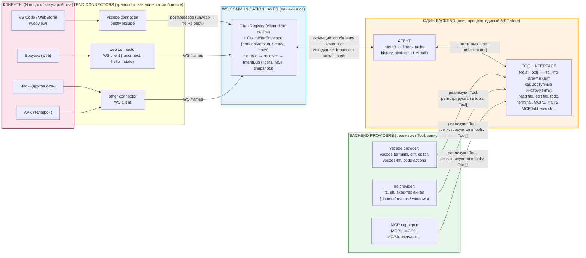
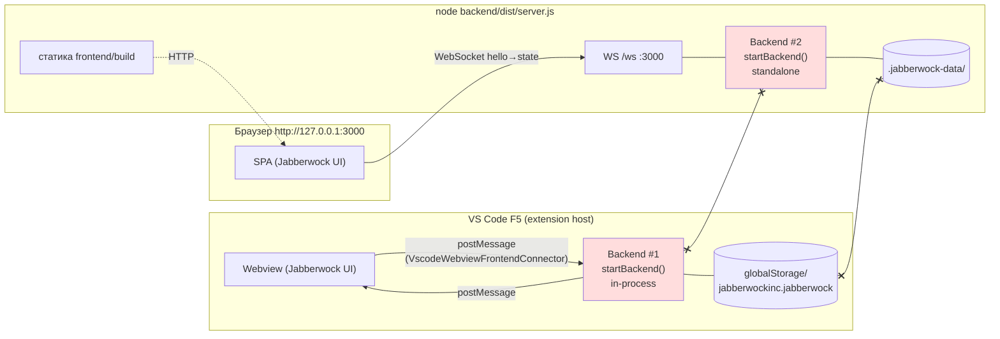
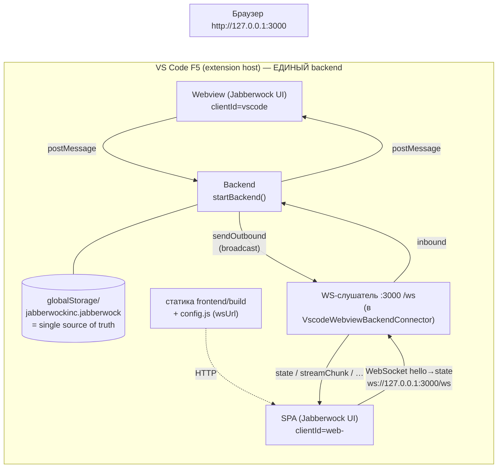
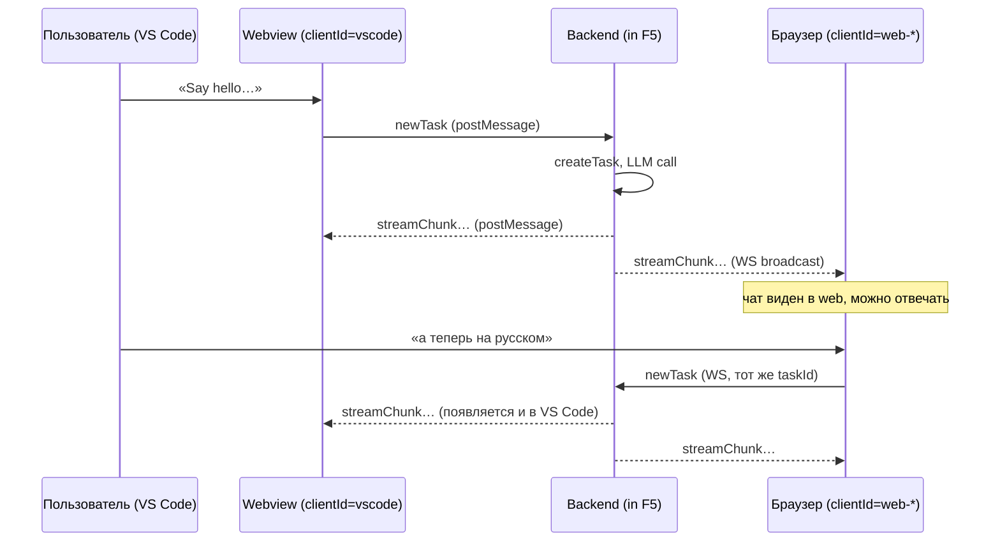

# Единый state: web и VS Code поверх одного backend

**Статус:** PLANNING ONLY. Код не меняется.
**Дата:** 2026-09-20
**Связано с:** [`architecture-v4-connector-abstraction.md`](architecture-v4-connector-abstraction.md) (v4), [`testing-debug.md`](testing-debug.md) (найдённое расхождение)

---

## 1. Проблема (найдено в ходе функционального тестирования)

Требование: **backend = single source of truth**. Стор общий для web и VS Code:
запись в history, созданная в web, должна быть видна в VS Code и наоборот;
чат можно начать в VS Code и продолжить в web (и наоборот). Потери информации
при коммуникации между entry points быть не должно.

Факт, подтверждённый на диске и в сторах:

|                            | Web                                                                     | VS Code (F5)                                                                  |
| -------------------------- | ----------------------------------------------------------------------- | ----------------------------------------------------------------------------- |
| Процесс backend'а          | `node backend/dist/server.js --serve-static` (standalone-сервер, :3000) | in-process `startBackend()` в extension host'е                                |
| Хранилище state            | `.jabberwock-data/` (tasks, hashmap-memory, secrets, snapshot)          | `globalStorage/jabberwockinc.jabberwock/` (15 task-директорий, свой snapshot) |
| History на момент проверки | 1 чат («Say hello…»)                                                    | **пусто**                                                                     |
| Провайдер llama.cpp        | полный конфиг, id `llama-cpp-local`                                     | **пустой** (`apiProvider:""`, `baseUrl:""`), id `x4rg48m81dd`                 |

Чат из web **не виден** в VS Code и наоборот. Это не баг реализации v4 — v4-план
описывает **два режима** (G1: «один кодбейс работает как (a) extension **и** (b)
standalone server»), и в режиме (a) backend живёт в extension host'е, в режиме (b) —
в standalone-процессе. Но режим «web и vscode **одновременно** ходят в один backend»
в v4-плане не описан. Этот документ его и описывает.

### Почему «VS Code = тонкий клиент standalone-сервера» не подходит

vscode-only фичи (терминал, diff-вью, editor-декорации, vscode-lm provider,
code actions, devtool) живут в **in-process backend'е extension host'а**.
Делать F5 «тонким клиентом» внешнего сервера — значит переписывать весь
vscode-коннектор и терять (или тащить через WS) эти фичи. Это противоречит v4:
vscode-коннектор — **хост** backend'а, а не его клиент.

---

## 1.1 Целевая топология (формулировка пользователя)

Исходная схема пользователя:

```
web         => web connector       \
vscode      => vscode connector    =>  ws communication layer  <=  backend (единый стор, вся логика etc)
other...    => other connector     /                                        \  vscode backend provider/connector
                                                                           \  os backend (file system, git etc)
```

Та же схема, расчерченная:



Как читать:

1. **Клиент → frontend connector** — каждый клиент знает только свой
   транспорт (браузер/часы/APK — WS, vscode/webstorm — postMessage).
2. **Frontend connector → ws communication layer** — все транспорты сходятся
   в один шов: `ClientRegistry` (кто подключён) + `ConnectorEnvelope`
   (унифицированный формат) + `queue → resolver → IntentBus`. **После шва
   backend не знает и не может узнать**, откуда пришло сообщение (G2).
3. **Layer ↔ Backend** — входящие: сообщения клиентов → логика агента и
   единый store; исходящие: broadcast всем подключённым клиентам + push
   (поэтому сторы на всех девайсах идентичны).
4. **Backend ↔ Tool interface ↔ Provider'ы** — агент видит только
   `tools: Tool[]` и вызывает `tool.execute()`; provider'ы хоста (vscode /
   os / MCP) реализуют `Tool` и регистрируются в реестре. «Где запущено»
   влияет только на то, какие provider'ы зарегистрированы.

Маппинг этой схемы на код:

| Элемент схемы                     | Что это в коде                                                                                          | Статус                                             |
| --------------------------------- | ------------------------------------------------------------------------------------------------------- | -------------------------------------------------- |
| web connector                     | `BrowserWsFrontendConnector` (клиент) + `WebWsServer` (серверная сторона)                               | Есть, но зашита только в standalone-entry          |
| vscode connector                  | `VscodeWebviewFrontendConnector` + `VscodeWebviewBackendConnector` (postMessage)                        | Есть, WS-слушателя **нет**                         |
| ws communication layer            | единый пайплайн `connector → queue → resolver → IntentBus` (v4 §4.6/§5.2), envelope `ConnectorEnvelope` | Есть (G3), общий для обоих транспортов             |
| backend (единый стор, вся логика) | **один** инстанс `startBackend()` + MST root store                                                      | Сейчас **два** инстанса — это и есть баг топологии |
| vscode backend provider/connector | capabilities в `connectors/vscode/backend` (terminal, editor, theme, vscode-lm)                         | Есть                                               |
| os backend (fs, git)              | host-agnostic сервисы в `backend/` (FileBackedHashmapMemory, git, ripgrep…)                             | Есть                                               |

**Единственный недостающий элемент** — один backend-процесс, обслуживающий оба клиентских
коннектора одновременно. Всё остальное в схеме уже реализовано.

### 1.2 Целевая модель (подтверждено пользователем)

Один и тот же агент живёт в backend. С ним можно общаться из любого количества
клиентов одновременно: web, VS Code, WebStorm, часы в другой сети, APK на
телефоне. Backend — **интерфейс, ожидающий tools** (MCP-серверы, agent tools:
edit, read, todo, terminal…). Хост (vscode / webstorm / filesystem-приложение
на windows/ubuntu/macos) запускает его и подставляет свои tools через
backend-provider'ов (capabilities). Где запущен — так и работает.

(Полная расчерченная диаграмма — в §1.1.)

**Позиция Tool interface:** `Tool` — это единый интерфейс, а `tools: Tool[]` —
реестр доступных инструментов. Provider'ы (vscode, os, MCP-серверы)
**реализуют** этот интерфейс и регистрируются в реестре; **агент** видит только
`tools: Tool[]` и не знает, кто реализация:

Ключевая идея: **любой tool заменяем**. `terminal`, `fs`, `git`, `edit file` —
это не «встроенные функции backend'а», а **способности (capabilities)**, у
каждой из которых может быть несколько **взаимозаменяемых реализаций**:
встроенная (internal) или внешняя (external, MCP). Примеры:

| Способность | Встроенная реализация | Внешняя реализация (пример)                   |
| ----------- | --------------------- | --------------------------------------------- |
| `edit file` | прямой write в fs     | **serena mcp** (LSP-aware edit)               |
| `git`       | shell `git`           | **gitkraken** (CLI/API)                       |
| `terminal`  | local shell хоста     | remote shell / docker                         |
| `read file` | прямой read в fs      | serena mcp                                    |
| `todo`      | встроенный store      | **md-todo-mcp** (внешний, со своим iframe UI) |

Агенту это **полностью не видно**: он видит один `tools: Tool[]` и вызывает
`tool.execute()`. Кто реализация — решает связывание (binding), которое делает
provider' по настройкам хоста.

```ts
interface Tool {
	name: string            // "read file", "edit file", "todo", "terminal", "git", …
	description: string
	execute(input: unknown, ctx: ToolContext): Promise<ToolResult>

	// ── Реализация (видно только provider'ам, не агенту) ──
	// ЛЮБОЙ tool может быть internal ИЛИ external — терминал, fs, git,
	// edit, todo… Всё заменяемо.
	implementation:
		| { kind: "internal" }
		  // прямой вызов в процессе backend'а (default)
		| { kind: "external"
			transport: {
				type: "stdio" | "http" | "sse" | "vscode-extension"
				connectionString?: string   // URL / socket / путь к бинарнику
				auth?: { type: "none" | "token" | "oauth"; … }
			}
		  }
		  // MCP-сервер: на этой машине (stdio/HTTP, как md-todo-mcp),
		  // в vscode-extension (serena mcp), или удалённый (connection
		  // string + auth). Коммуникация — post/JSON-RPC, не прямой вызов.

	// ── Опциональный UI (MCP Apps / SEP-1865) ──
	// Tool может нести UI-компонент: iframe-вью, который клиент рендерит
	// рядом с результатом. Пример: md-todo-mcp — свой iframe UI.
	// Агент UI не видит и не рендерит — рендерит клиент (webview/браузер),
	// получив UI-описание вместе с ToolResult.
	ui?: {
		kind: "iframe"
		source: string              // URL / data-uri / resource из MCP
		mimeType: string
	}
}

tools: Tool[]             // реестр: агент итерит по нему, вызывает execute()
```

- **Агент ↔ Tool interface** — агент вызывает `tool.execute()`, видит только
  имена и описания. `implementation`/`ui` ему **не видны**: встроенный `git`
  и post в gitkraken, встроенный `edit` и serena mcp — для агента
  выглядят одинаково.
- **Provider'ы ↔ Tool interface** — каждый провайдер хоста кладёт в реестр
  **связанные** реализации. Windows и ubuntu дают разные терминалы —
  интерфейс их унифицирует, специфика живёт в реализации provider'а.
  «Где запущено» влияет только на то, какие provider'ы зарегистрированы
  и какие внешние реализации доступны.
- **Заменяемость** — один и тот же `name` может иметь несколько
  реализаций; выбор (встроенная / serena / gitkraken / …) — это
  настройка, а не код. Сменить `edit file` с встроенного на serena mcp —
  поменять binding, агент и клиенты не меняются.
- **UI конфигурации tools (в перспективе)** — в дальнейшем в UI будет
  экран, где для агента конфигурируются доступные tools и их реализации
  (default vscode edit / кастомный с AST replacement / serena / …).
  Binding живёт в общем сторе backend'а (single source of truth) — поэтому
  он настраивается из любого клиента (web, vscode, …) и виден всем.
  Это НЕ закрытое место: реестр `tools: Tool[]` + bindings — обычные
  данные стора, UI их просто читает/пишет.
  **В текущей итерации UI для tools не делаем** — как есть; модель
  данных (binding как данные, а не код) проектируется с учётом этого.
- **UI у инструмента** — по модели MCP Apps / [MCP Apps Extension
  (SEP-1865)](https://blog.modelcontextprotocol.io/posts/2026-01-26-mcp-apps/):
  tool может нести iframe-UI (пример: `md-todo-mcp` со своим iframe UI).
  UI рендерит **клиент** (webview/браузер) по описанию из `tool.ui` +
  ToolResult; backend только проксирует.

**Гарантия консистентности сторов:**

- Все клиенты берут данные **только** с backend (single source of truth).
  LocalStorage/локальные кэши — не источник состояния.
- Каналы доставки: WS-стрим (push) + `fetch` — handshake `hello → state`
  отдаёт **полный snapshot** hydration'а при каждом (re)connect. Это и есть
  страховка от потерянных сообщений: даже если сеть рванулась и чанки
  потеряны, клиент после reconnect получает полное состояние и сходится к нему.
- Критерий: **сторы всех подключённых клиентов на 100% идентичны**
  (с поправкой на окно синхронизации ~10 с при обрывах сети).
  Идентичны по содержимому: history, settings/proвайдеры, чаты, задачи.
  (Физически — разные инстансы MST-сторов на каждом клиенте, наполненные
  одинаковыми snapshots.)

**Что из этого уже есть в коде:**

- `ClientRegistry` (multi-client, clientId per device) — в `WebWsServer`;
- `hello → state` handshake с `_hydration:true` — в `WebWsServer`;
- reconnect с exponential backoff + re-hydration — в `BrowserWsFrontendConnector`;
- broadcast fan-out (streamChunk, ask first-response-wins §6.4 v4) — в `WebWsServer`;
- capability-провайдеры хоста — `BackendCapabilities` в `packages/types`.

**Чего нет:** WS-слушатель в vscode-коннекторе (см. §4.1) — без него «один
backend на все клиенты» физически невозможен, т.к. vscode-клиент ходит в
свой in-process backend, а все остальные — в standalone.

## 2. Как сейчас (topology «AS IS»)



**Два backend'а, два хранилища, ноль общего.** Точка расщепления —
[`frontend/src/connector-bus.ts`](../frontend/src/connector-bus.ts):
`env "vscode"` → postMessage в extension host; `env "web"` → WebSocket в
standalone-сервер. Каждый транспорт ведёт в **свой** backend.

---

## 3. Как планируется (topology «TO BE»)

**Принцип:** в dev-топологии **один** backend — тот, что живёт в extension host'е
(F5). Браузер становится **ещё одним клиентом** этого backend'а по WebSocket —
ровно то, что v4 уже предусматривает для «подключения по сети (smartwatch-клиент)»
(G1) и transport-agnostic frontend (G2/G3). Standalone-сервер остаётся для
production/Docker (режим (b) из G1), где VS Code не участвует.



Оба клиента (webview и браузер) — **равные клиенты одного backend'а**:
один MST root store, одна history, одни провайдеры. Чат, начатый в VS Code,
виден в браузере и продолжается там; и наоборот.



---

## 4. Что конкретно меняется (по файлам)

### 4.1 Backend-сторона vscode-коннектора — добавить WS-слушатель

[`connectors/vscode/backend/connector.ts`](../connectors/vscode/backend/connector.ts)
(`VscodeWebviewBackendConnector`):

- В `start(deps)` поднять HTTP+WS-сервер на loopback-порту (по умолчанию 3000,
  override флагом/настройкой). Протокольный слой **переиспользовать из**
  [`connectors/web/backend/ws/web-ws-server.ts`](../connectors/web/backend/ws/web-ws-server.ts)
  (`WebWsServer` + `ClientRegistry`): hello → state handshake,
  `ConnectorEnvelope`, clientId-регистр, reconnect/re-hydration.
- **Вынести общий WS-протокол** (envelope-unwrap, handshake, registry) в общий
  модуль (кандидаты: `packages/ipc` или `packages/types/src/protocol` + новый
  `packages/ws-protocol`), чтобы `WebWsServer` (production) и vscode-коннектор
  (dev) использовали **одну** реализацию. Дублировать протокол нельзя.
- `sendOutbound(message, target)`: сейчас — только `sendViaView` (webview).
  Станет: webview (postMessage) **+** WS-клиенты (broadcast или targeted по
  `ClientTarget`). Входящие с WS — в те же `onInbound`-хендлеры (bootstrap уже
  пушит их в capabilities.queue — ничего менять в пайплайне не нужно, G2/G3).
- `getState` для hello-хендшейка — тот же snapshot, что webview получает
  через `postStateToWebview` (как в standalone-сервере, Phase C2).

### 4.2 Статика SPA в dev

Браузеру нужен HTML/JS. Варианты:

- **A (предпочитаю):** vscode-коннектор раздаёт `frontend/build` на том же
  HTTP-сервере (переиспользовать `StaticFileServer` из
  [`connectors/web/backend/static/file-server.ts`](../connectors/web/backend/static/file-server.ts))
    - маленький `config.js` с `window.__JABBERWOCK_CONFIG__ = { wsUrl }`
      (механизм уже есть в `BrowserWsFrontendConnector`, plan §9.4).
      Тогда dev = «запустил F5 → открыл http://127.0.0.1:3000», отдельного
      `node backend/dist/server.js` не нужно.
- **B:** отдельный статический сервер (`vite preview` / `serve`) раздаёт
  `frontend/build`, wsUrl в config.js — `ws://127.0.0.1:3000` (WS уже на
  extension host'е). Проще, но два процесса в dev.

### 4.3 Frontend — почти ничего

`BrowserWsFrontendConnector` уже принимает явный `wsUrl`
(`options.wsUrl` → `window.__JABBERWOCK_CONFIG__.wsUrl` → same-origin `/ws`).
В dev-статике config.js указывает на WS extension host'а.
`connector-bus.ts` не трогаем: web-ветка уже создаёт `BrowserWsFrontendConnector`.

### 4.4 Standalone-сервер (production/Docker) — не трогаем

Режим (b) из G1 остаётся как есть: `pnpm start:server`, свой state, свой WS.
Там VS Code не участвует, «единый state» не требуется.

### 4.5 Чистка

- Убрать из dev-процесса `node backend/dist/server.js --serve-static`
  (скрипт `/tmp/jw-web-launch.sh` больше не нужен; web-тесты идут через F5).
- `launch.json`: добавить аргумент/настройку для порта WS (если не хардкодим 3000).

---

## 5. Риски и ограничения

| Риск                                                              | Оценка                                      | Митигация                                                                                                                                                |
| ----------------------------------------------------------------- | ------------------------------------------- | -------------------------------------------------------------------------------------------------------------------------------------------------------- |
| vscode-only фичи (терминал, diff, vscode-lm) недоступны браузеру  | Ожидаемо, то же, что в web-режиме v4 (§9.6) | Не фиксим — фичи деградируют, чат работает                                                                                                               |
| F5 перезапускается → WS-клиенты обрываются                        | Средний                                     | У `BrowserWsFrontendConnector` уже есть exponential backoff + re-hydration по hello                                                                      |
| Конфликт порта 3000 (standalone-сервер ещё запущен)               | Низкий                                      | В dev standalone не запускаем; порт настраиваем                                                                                                          |
| Broadcast дублирует доставку webview'у (postMessage + WS)         | Низкий                                      | Webview ходит ТОЛЬКО через postMessage (clientId=vscode), WS — только внешние клиенты; broadcast в `sendOutbound` идёт по разным транспортам, дублей нет |
| Devtool (60060/60061) — отдельный канал, не путать с WS backend'а | Низкий                                      | Не трогаем                                                                                                                                               |
| Состояние web-сервера в `.jabberwock-data/` станет мусором        | Низкий                                      | Удаляем/архивируем после миграции; новый state — в globalStorage                                                                                         |

**Совместимость с v4:** не нарушает G1–G8. v4 требует, чтобы после connector'а
всё было унифицировано (G3) — мы добавляем ещё один клиент в тот же
унифицированный пайплайн. Purity-правила (G6/G7) не нарушаем: WS-слушатель
живёт в `connectors/vscode/backend` (единственное место для vscode-импортов),
frontend не узнаёт про транспорт (G7).

---

## 6. Шаги реализации (порядок)

1. **Вынести общий WS-протокол** из `connectors/web/backend/ws/` в общий пакет
   (envelope, handshake, `ClientRegistry`). `WebWsServer` переиспользует его.
2. **`VscodeWebviewBackendConnector`:** поднять WS+HTTP (статика + config.js) в
   `start()`; `sendOutbound` → webview + WS; inbound WS → `onInbound`.
3. **Dev-прогон:** F5 → браузер `http://127.0.0.1:3000` → hello → state.
   Проверить: state в браузере == state в webview (devtool `get_store_state`).
4. **Функциональный тест 2.1–2.7 в обоих entry points** с попарным сравнением
   сторов (web ↔ vscode ↔ backend) и записей чатов (по
   [`testing-debug.md`](testing-debug.md)).
5. **Отключить** standalone-сервер из dev-процесса; задокументировать новый dev-flow.
6. `pnpm check-all`.

## 7. Критерии готовности

- [ ] В dev запущен ровно один backend (в extension host'е).
- [ ] History, созданная в VS Code, видна в браузере без перезагрузки (и наоборот).
- [ ] Чат можно начать в VS Code и продолжить в браузере (и наоборот).
- [ ] Провайдеры: созданный в одном entry point виден в другом.
- [ ] Сторы ВСЕХ подключённых клиентов (vscode, web, и любой N-й клиент) на
      100% идентичны (по ключевым путям: `history.items`, `settings.apiConfig`,
      `chat.*`), backend содержит те же сообщения. Допустимое окно
      рассинхронизации — ~10 с при обрывах сети; после reconnect (hello→state)
      рассинхронизация исчезает.
- [ ] Reconnect-сценарий: рвануть сеть/закрыть вкладку → reconnect → стор
      клиента сходится к snapshot'у backend'а (fetch-фолбэк работает).
- [ ] Standalone-сервер (production) продолжает работать без изменений.
- [ ] `pnpm check-all` зелёный.
