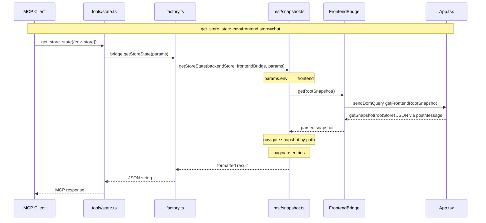

# Devtool Package Refactoring Plan (v2)

## Current Problems

1. **`bridge-factory.ts`** (685 lines) — too big, mixes DOM, console, diagnostics, and MST store operations
2. **`bridge.ts`** vs **`bridge-factory.ts`** — confusing naming (interface vs factory)
3. **Loose root files**: `command-registry.ts`, `model.ts`, `transport.ts`, `ws-mcp-server.ts`, `interceptor.ts`, `react-entry.ts` — clutter
4. **`App.tsx`** has ~300 lines of devtool-specific store logic (`resolveStoreByName`, `paginateArray`, `getActionNames`, `handleStoreAction`)
5. **`react/`** module naming is confusing — overlaps with `dom/` conceptually
6. **Store operations** for frontend go through `sendDomQuery` → webview handlers instead of local MST module
7. **`react-entry.ts`** is an unnecessary separate entry point — `index.ts` can export everything

## Target Architecture

```
packages/devtool/src/
├── bridge.ts                     # ExtensionBridge interface
├── factory.ts                    # createDevtoolBridge (thin orchestrator, ~150 lines)
├── index.ts                      # SINGLE entry point — exports everything
│
├── mst/                          # MST store operations
│   ├── types.ts                  # FrontendBridge, BackendStore, DevtoolModel
│   ├── snapshot.ts               # getStoreState + pagination + path navigation
│   ├── search.ts                 # searchState + recursive traversal
│   └── actions.ts                # get/filter/search/count actions + time-travel
│
├── server/                       # WebSocket server (moved from root)
│   ├── ws-mcp-server.ts          # WsMcpServer class
│   └── transport.ts              # WebSocketServerTransport
│
├── webview/                      # Browser-side code (renamed from react/)
│   ├── DevtoolProvider.tsx       # main webview-side MCP tool handler
│   ├── console.ts                # webview console bridge (renamed from webviewConsoleBridge.ts)
│   ├── vscode.ts                 # VS Code API wrapper
│   ├── sourceMap.ts              # MERGED from sourceMapInitializer.ts + sourceMapUtils.ts
│   ├── LocatorBridge.tsx         # Alt+Click source navigation
│   ├── store.ts                  # DevToolsStore MST
│   └── diagnostic-dashboard/     # webview diagnostic panel
│       ├── diagnostic-dashboard.tsx
│       ├── diagnostic-dashboard.css
│       └── __types__/aliases.d.ts
│
├── utils/
│   ├── command-registry.ts       # VS Code command discovery (moved from root)
│   └── interceptor.ts            # Message interception for testing (moved from root)
│
├── diagnostics/                  # KEEP as-is (self-contained module)
├── dom/                          # KEEP as-is (remove NO-OP store handlers)
├── tools/                        # KEEP as-is (thin MCP wrappers)
└── client.ts                     # KEEP (WebSocket client for external consumers)
```

## Files to Create

| File                                             | Purpose                                                         |
| ------------------------------------------------ | --------------------------------------------------------------- |
| `packages/devtool/src/mst/types.ts`              | FrontendBridge, BackendStore, DevtoolModel interfaces           |
| `packages/devtool/src/mst/snapshot.ts`           | getStoreState with pagination + path navigation                 |
| `packages/devtool/src/mst/search.ts`             | Recursive snapshot search, unified for both envs                |
| `packages/devtool/src/mst/actions.ts`            | All action operations (get, filter, search, count, time-travel) |
| `packages/devtool/src/factory.ts`                | createDevtoolBridge (replaces bridge-factory.ts)                |
| `packages/devtool/src/server/transport.ts`       | Moved from root                                                 |
| `packages/devtool/src/server/ws-mcp-server.ts`   | Moved from root                                                 |
| `packages/devtool/src/utils/command-registry.ts` | Moved from root                                                 |
| `packages/devtool/src/utils/interceptor.ts`      | Moved from root                                                 |
| `packages/devtool/src/webview/console.ts`        | Renamed from webviewConsoleBridge.ts                            |
| `packages/devtool/src/webview/sourceMap.ts`      | Merged from sourceMapInitializer.ts + sourceMapUtils.ts         |

## Files to Delete

| File                                       | Reason                                       |
| ------------------------------------------ | -------------------------------------------- |
| `packages/devtool/src/bridge-factory.ts`   | Replaced by factory.ts + mst/\*              |
| `packages/devtool/src/react-entry.ts`      | Unnecessary — index.ts is single entry point |
| `packages/devtool/src/command-registry.ts` | Moved to utils/                              |
| `packages/devtool/src/model.ts`            | Merged into mst/types.ts                     |
| `packages/devtool/src/transport.ts`        | Moved to server/                             |
| `packages/devtool/src/ws-mcp-server.ts`    | Moved to server/                             |
| `packages/devtool/src/interceptor.ts`      | Moved to utils/                              |

## Files to Modify

| File                                | Change                                                     |
| ----------------------------------- | ---------------------------------------------------------- |
| `packages/devtool/src/bridge.ts`    | May add/get types from mst/types.ts                        |
| `packages/devtool/src/index.ts`     | Update all import paths + add webview exports              |
| `packages/devtool/src/dom/index.ts` | Remove 8 NO-OP store handlers                              |
| `packages/devtool/package.json`     | Remove `./react` export, add `./webview` export            |
| `packages/devtool/src/webview/*`    | All files get import path updates for merged sourceMap.ts  |
| `webview-ui/src/App.tsx`            | Replace 300-line handleStoreAction with 3 generic handlers |
| `src/extension.ts`                  | Create frontendBridge, pass to createDevtoolBridge         |

## Files to Move

| From                            | To                               |
| ------------------------------- | -------------------------------- |
| `react/DevtoolProvider.tsx`     | `webview/DevtoolProvider.tsx`    |
| `react/LocatorBridge.tsx`       | `webview/LocatorBridge.tsx`      |
| `react/store.ts`                | `webview/store.ts`               |
| `react/vscode.ts`               | `webview/vscode.ts`              |
| `react/webviewConsoleBridge.ts` | `webview/console.ts`             |
| `react/sourceMapInitializer.ts` | `webview/sourceMap.ts` (merge)   |
| `react/sourceMapUtils.ts`       | `webview/sourceMap.ts` (merge)   |
| `react/diagnostic-dashboard/*`  | `webview/diagnostic-dashboard/*` |
| `command-registry.ts`           | `utils/command-registry.ts`      |
| `interceptor.ts`                | `utils/interceptor.ts`           |
| `model.ts`                      | `mst/types.ts`                   |
| `transport.ts`                  | `server/transport.ts`            |
| `ws-mcp-server.ts`              | `server/ws-mcp-server.ts`        |

## Execution Order

1. Create `mst/types.ts` (FrontendBridge, BackendStore, DevtoolModel)
2. Create `mst/snapshot.ts` (extract getStoreState logic)
3. Create `mst/search.ts` (extract searchState logic)
4. Create `mst/actions.ts` (extract all action operations)
5. Create `factory.ts` (thin orchestrator); delete `bridge-factory.ts`
6. Move loose files: `utils/command-registry.ts`, `utils/interceptor.ts`, `server/transport.ts`, `server/ws-mcp-server.ts`, merge `model.ts` → `mst/types.ts`
7. Update `dom/index.ts` — remove 8 NO-OP store handlers
8. Rename `react/` → `webview/` (move + merge sourceMap files)
9. Update `index.ts` — add new exports, remove react-entry references
10. Update `package.json` — remove `./react`, add `./webview`
11. Update `webview-ui/src/App.tsx` — replace handleStoreAction with 3 generic handlers
12. Update `src/extension.ts` — create frontendBridge and pass to createDevtoolBridge
13. Verify compilation

## Data Flow


