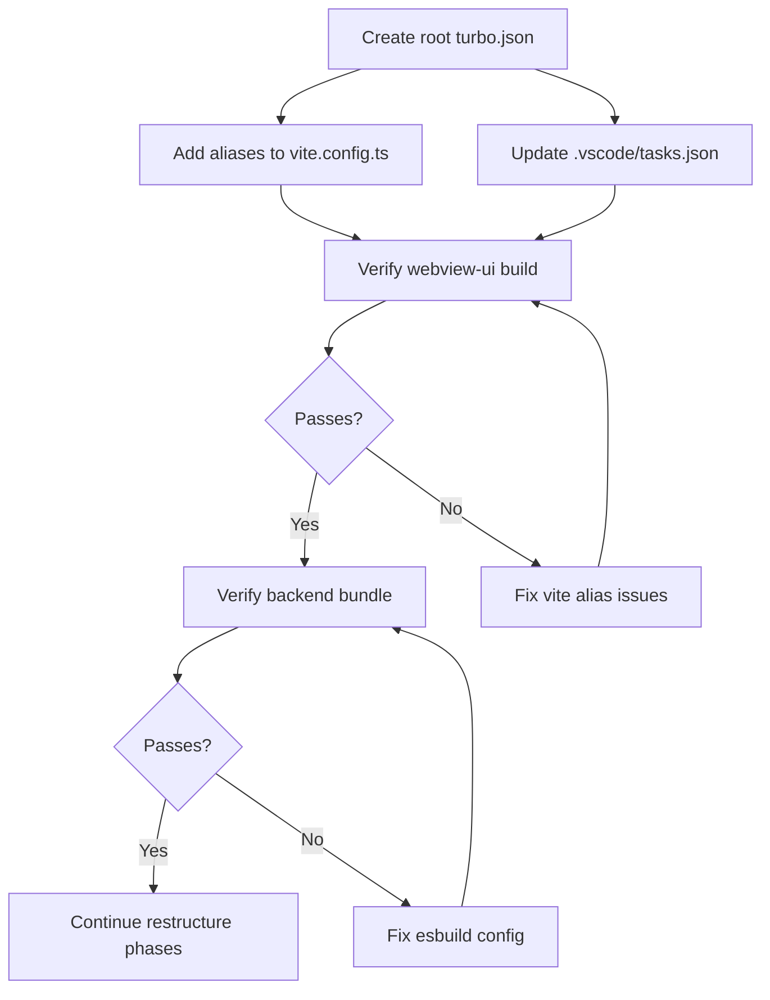

# Fix Build Errors After Architectural Restructure v2

## Current State

After partially applying the [`architectural-restructure-v2.md`](./architectural-restructure-v2.md) plan, the project has 3 distinct build errors:

1. `npx turbo watch:tsc` — **"Could not find turbo.json or turbo.jsonc"**
2. `npx turbo watch:bundle` — same error
3. `vite` build — **`Rollup failed to resolve import "@intentConstants"`**

---

## Root Cause Analysis

### 🟥 Error 1 & 2: No root `turbo.json`

**The chain:**

- `.vscode/tasks.json` tasks [`watch:tsc`](../.vscode/tasks.json:61) and [`watch:bundle`](../.vscode/tasks.json:40) run `npx turbo watch:tsc` / `npx turbo watch:bundle` from the **project root**.
- There is **no `turbo.json` at the project root level**.
- Both [`src/turbo.json`](../src/turbo.json:3) and [`webview-ui/turbo.json`](../webview-ui/turbo.json:3) have `"extends": ["//"]` — they expect a root config.
- Turbo cannot discover workspace-level configs without a root config.

**The scripts DO exist — they're just unreachable through turbo:**

| Script         | Defined in                                                 | Command                                                     |
| -------------- | ---------------------------------------------------------- | ----------------------------------------------------------- |
| `watch:tsc`    | [`src/package.json`](../src/package.json:457)              | `cd .. && tsc --noEmit --watch --project src/tsconfig.json` |
| `watch:bundle` | [`src/package.json`](../src/package.json:456)              | `pnpm bundle --watch`                                       |
| `build:watch`  | [`webview-ui/package.json`](../webview-ui/package.json:12) | `vite build --watch`                                        |

**Fix options:**

1. **Create root `turbo.json`** — define pipeline tasks that delegate to workspaces
2. **Change VS Code tasks** to use `pnpm --filter jabberwock watch:tsc` and `pnpm --filter jabberwock watch:bundle` instead of `npx turbo ...`
3. **Both** — create root `turbo.json` for future turbo usage, and fix VS Code tasks now

**Recommended: Option 3** — create root `turbo.json` and fix VS Code tasks.

### 🟥 Error 3: Missing Vite resolve aliases

**The chain:**

- [`webview-ui/tsconfig.json`](../webview-ui/tsconfig.json:23-34) defines 10 path aliases:
    - `@/*` → `./src/*`
    - `@src/*` → `./src/*`
    - `@shared/*` → `../src/shared/*`
    - `@jabberwock/types` → `../../packages/types/src/index.ts`
    - `@jabberwock/core/browser` → `../../packages/core/src/browser.ts`
    - `@jabberwock/devtool/react` → `../../packages/devtool/src/react-entry.ts`
    - `@eventConstants` → `../../packages/types/src/event-constants`
    - `@intentConstants` → `./src/features/intents/IntentConstants`
    - `@features/*` → `../src/features/*`
    - `@utils/*` → `../src/utils/*`
- [`webview-ui/vite.config.ts`](../webview-ui/vite.config.ts:126-131) `resolve.alias` only has 3:
    - `@` → `./src`
    - `@src` → `./src`
    - `@shared` → `../src/shared`
- **Missing: `@intentConstants`, `@jabberwock/types`, `@jabberwock/core/browser`, `@jabberwock/devtool/react`, `@eventConstants`, `@features/*`, `@utils/*`**
- TypeScript (`tsc`) resolves these aliases fine, but **Vite/Rollup doesn't know about them** at bundle time
- 10+ files in `webview-ui/src/features/` import from `@intentConstants` — they all fail

**Files that use `@intentConstants`:**

- `webview-ui/src/features/root-store.ts`
- `webview-ui/src/features/history/events/handlers/index.ts`
- `webview-ui/src/features/intents/IntentConstants.ts`
- `webview-ui/src/features/foundation/events/handlers/index.ts`
- `webview-ui/src/features/diagnostics/events/handlers/index.ts`
- `webview-ui/src/features/marketplace/events/handlers/index.ts`
- `webview-ui/src/features/cloud/events/handlers/index.ts`
- `webview-ui/src/features/chat/events/handlers/index.ts`
- `webview-ui/src/features/settings/events/handlers/index.ts`
- `webview-ui/src/features/chat/task/events/handlers/index.ts`

---

## Execution Plan

### Step 1: Create root `turbo.json`

Create [`turbo.json`](../turbo.json) at the project root with pipeline definitions that:

- Define the `watch:tsc` task → delegates to `src/` workspace
- Define the `watch:bundle` task → delegates to `src/` workspace
- Define the `build`, `build:nightly`, `bundle`, `vsix` tasks from existing workspace configs
- Follow Turborepo v2 conventions (the `turbo` version is `^2.5.6`)

**Expected structure:**

```jsonc
{
	"$schema": "https://turbo.build/schema.json",
	"tasks": {
		"build": {
			"dependsOn": ["^build"],
		},
		"build:nightly": {},
		"bundle": {
			"dependsOn": ["^build"],
		},
		"vsix": {
			"dependsOn": ["bundle"],
		},
		"watch:bundle": {
			"dependsOn": ["@jabberwock/build#build", "@jabberwock/types#build"],
			"cache": false,
			"persistent": true,
		},
		"watch:tsc": {
			"cache": false,
			"persistent": true,
		},
	},
}
```

### Step 2: Add missing aliases to `webview-ui/vite.config.ts`

Add all TypeScript path aliases to the [`resolve.alias`](../webview-ui/vite.config.ts:126) block in `vite.config.ts`. This is the **critical fix** — without it, Vite cannot resolve `@intentConstants` and other aliases.

**New alias object:**

```typescript
alias: {
  "@": resolve(__dirname, "./src"),
  "@src": resolve(__dirname, "./src"),
  "@shared": resolve(__dirname, "../src/shared"),
  "@intentConstants": resolve(__dirname, "./src/features/intents/IntentConstants"),
  "@eventConstants": resolve(__dirname, "../../packages/types/src/event-constants"),
  "@jabberwock/types": resolve(__dirname, "../../packages/types/src/index.ts"),
  "@jabberwock/core/browser": resolve(__dirname, "../../packages/core/src/browser.ts"),
  "@jabberwock/devtool/react": resolve(__dirname, "../../packages/devtool/src/react-entry.ts"),
  "@features/*": resolve(__dirname, "../src/features/*"),
  "@utils/*": resolve(__dirname, "../src/utils/*"),
}
```

### Step 3: Update `.vscode/tasks.json`

Change the `watch:tsc` and `watch:bundle` tasks to run through pnpm with workspace filter instead of via turbo (or run them directly), ensuring they work properly after the root `turbo.json` is in place.

**Changes:**

- `watch:tsc`: `pnpm --filter jabberwock watch:tsc` (runs `cd .. && tsc --noEmit --watch --project src/tsconfig.json` from `src/` directory)
- `watch:bundle`: `pnpm --filter jabberwock watch:bundle` (runs `pnpm bundle --watch` from `src/` directory)
- OR keep `npx turbo watch:tsc` / `npx turbo watch:bundle` once root `turbo.json` is created

### Step 4: Verify builds

After applying Steps 1-3:

1. **Run** `pnpm --filter @jabberwock/vscode-webview build` — should succeed (tsc + vite build)
2. **Run** `pnpm --filter jabberwock bundle` — should succeed (esbuild bundle)
3. **Run** the VS Code `watch:tsc` / `watch:bundle` / `watch:webview` tasks — should all start without errors

### Step 5: Check for remaining issues

Once the build passes, verify:

- Any remaining Vite import resolution issues (if more aliases are used)
- Backend esbuild config may also need path aliases if `@features/*` or `@utils/*` are used in files bundled by esbuild
- Check if `esbuild.mjs` has proper alias/plugin configuration for path resolution

### Step 6: Continue architectural restructure (Phase 1+)

After the build is green, continue migrating according to the plan phases in [`architectural-restructure-v2.md`](./architectural-restructure-v2.md):

- **Phase 1** — Frontend Intents Layer + IntentConstants ✅ (already done)
- **Phase 2** — Backend `events.ts` → `events/` folders 🟡 (partially done — `src/features/events.ts` aggregates from subfolders but some features may still need migration)
- **Phase 3** — Frontend `events/` folders 🟡 (partially done)
- **Phase 4+** — Continue dependency-safe migration

---

## Dependency-Safe Execution Order



---

## Files to Modify

| File                                                        | Change                            | Risk                             |
| ----------------------------------------------------------- | --------------------------------- | -------------------------------- |
| [`turbo.json`](../turbo.json) (new, root)                   | Create root turbo pipeline config | Low — only affects turbo CLI     |
| [`webview-ui/vite.config.ts`](../webview-ui/vite.config.ts) | Add missing resolve aliases       | Medium — critical for vite build |
| [`.vscode/tasks.json`](../.vscode/tasks.json)               | Fix watch task commands           | Low — only affects VS Code tasks |
