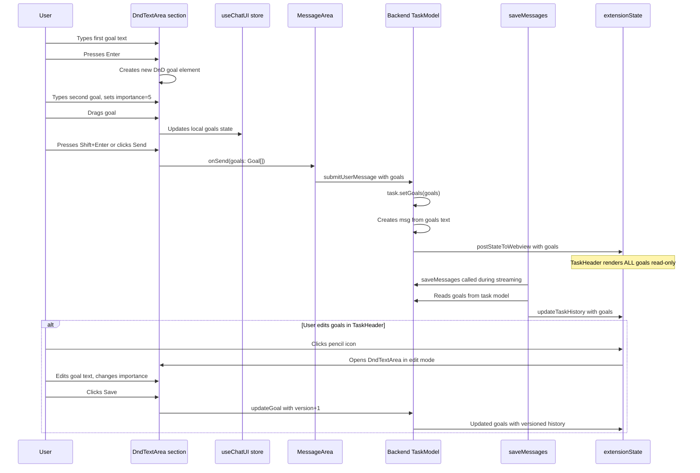

# Goals Architecture v3 — Complete Separation of User Intent from Agent Output

## Problem Summary

The task preview (header showing user's message) gets corrupted because two data streams share the same [`currentTaskItem.task`](webview-ui/src/features/chat/topic/view.tsx:117) field:

1. **User message** (correct source) — Set once at task creation in [`on-new-requested.ts:54-58`](../src/features/chat/task/handlers/on-new-requested.ts:54)
2. **Agent messages** (incorrect overwrite) — [`taskMetadata()`](../src/features/chat/task/messages/actions/saveMessages.ts:120) picks the first non-api_req message text (reasoning/text), then [`updateTaskHistory()`](../src/features/history/actions/index.ts:130) sends it to frontend, which overwrites at [`history/events/handlers/index.ts:34-38`](../webview-ui/src/features/history/events/handlers/index.ts:34)

## Solution: `goals` — Full Separation of User Intent

**`goals`** is a separate array on the task model that:

- Is ONLY populated from user input, NEVER from agent output
- Drives the task preview / header display — **ALL goals shown visually**
- Has **versioned history** (not a single `replacedBy`, but a `version` counter that increments with each edit)
- Each goal has **importance/priority** (1-5)
- Is distinct from `todos` (which both user and agent can edit)
- Supports **@ mentions** for cross-referencing goals in messages

---

## Data Model

### New Types (in [`packages/types/src/history.ts`](../packages/types/src/history.ts))

```typescript
export interface Goal {
	id: string // stable identifier across versions
	text: string // goal text
	ts: number // timestamp (ms) when this version was created
	version: number // increments on each edit; id+version uniquely identifies this version
	importance?: number // 1-5, higher = more important
	order: number // display order in the list
}

// Zod schema
export const goalSchema = z.object({
	id: z.string(),
	text: z.string(),
	ts: z.number(),
	version: z.number(),
	importance: z.number().min(1).max(5).optional(),
	order: z.number(),
})
```

### Extended `HistoryItem`

The task has **two** separate `Goal[]` arrays:

| Field                  | Purpose                                                         |
| ---------------------- | --------------------------------------------------------------- |
| `goals: Goal[]`        | **Current active goals** — only the latest version of each goal |
| `goalsHistory: Goal[]` | **Full audit trail** — every version of every goal ever created |

There is **no** `GoalHistoryEntry` type. Both arrays contain the same `Goal` type. The distinction is semantic:

- `goals` = latest version per goal ID (what's currently active)
- `goalsHistory` = ALL versions (for agent to detect stale data)

```typescript
export const historyItemSchema = z.object({
	id: z.string(),
	// ...existing fields...
	task: z.string(), // kept for backward compat, computed from goals[0].text
	goals: z.array(goalSchema).optional(), // NEW: current active goals (latest versions)
	goalsHistory: z.array(goalSchema).optional(), // NEW: full versioned audit trail
})
```

---

## Architecture Overview

```mermaid
graph TB
    subgraph "Data Model"
        GOALS[goals: Goal[] <br/> current active - latest versions]
        HISTORY[goalsHistory: Goal[] <br/> full audit trail - ALL versions]
        TODOS[todos: TodoItem[]]
        TASK[task: string - backward compat]
    end

    subgraph "Source of Truth"
        USER[User Only]
        AGENT[Agent Never Touches goals]
        BOTH[User + Agent can edit todos]
    end

    GOALS --> USER
    TASK --> |computed from goals[0].text| GOALS
    TODOS --> BOTH

    subgraph "Storage"
        MST[TaskModel MST store<br/>src/features/chat/task/store.ts]
        HIST[HistoryItem<br/>packages/types/src/history.ts]
        EXT[extensionState.currentTaskItem<br/>frozen MST state]
    end

    GOALS --> MST
    GOALS --> HIST
    HISTORY --> HIST
    MST --> |postStateToWebview| EXT

    subgraph "Frontend Components"
        SECTIONS[sections/dndTextArea/ <br/> Full DnD textarea with goals]
        HEADER[TaskHeader <br/> read-only goals + edit pencil]
        CMP[components/ui/ <br/> shared UI primitives]
        MENTIONS[ContextMention <br/> @Goal #N support]
    end

    SECTIONS --> |imports from| CMP
    HEADER --> |edit mode opens| SECTIONS
    HEADER --> |shows ALL goals| GOALS
    MENTIONS --> |references| GOALS
    SECTIONS --> |creates/edits| GOALS

    subgraph "Edit Flow"
        EDIT[User edits goal]
        OLD[Old version pushed to goalsHistory]
        NEW[New version stays in goals with version+1]
        EDIT --> OLD
        EDIT --> NEW
    end
```

---

## Directory Structure (New Files)

```
webview-ui/src/
├── components/                              # NEW: Shared reusable UI primitives
│   └── ui/
│       ├── button.tsx                       # migrated from foundation/ui
│       ├── input.tsx                        # shared input component
│       ├── select.tsx                       # shared select component
│       ├── textarea.tsx                     # shared textarea component
│       ├── tooltip.tsx                      # migrated from foundation/ui
│       └── container.tsx                    # migrated from foundation/ui
│
├── sections/                                # NEW: Page-level sections
│   └── dndTextArea/                         # MOVED + extended from features/chat/text-area/
│       ├── view.tsx                         # Main DnD TextArea (was in features/chat/text-area/view.tsx)
│       ├── draggable-goal-item.tsx          # NEW: DraggableGoalItem component
│       ├── mention/                         # MOVED from features/chat/text-area/mention/
│       │   └── mention.tsx
│       ├── utils/                           # MOVED from features/chat/text-area/utils/
│       │   └── context-mentions.ts
│       └── index.ts                         # Re-exports
│
└── features/                                # EXISTING: feature-scoped code
    └── chat/
        ├── store.tsx                        # Chat-level state (useChatUI)
        ├── task/
        │   ├── store.ts                     # TaskModel (goals, todos, messages)
        │   ├── components/
        │   │   ├── task-header.tsx           # MOVED from topic/view.tsx — TaskHeader component
        │   │   └── message-area.tsx          # Existing — imports DndTextArea from @sections/dndTextArea
        │   └── ...
        ├── text-area/                       # DELETED entirely (moved to sections/dndTextArea/)
        └── topic/                           # DELETED entirely (moved to task/components/task-header.tsx)
```

**tsconfig.json aliases to add:**

```json
{
	"compilerOptions": {
		"paths": {
			// ...existing aliases...
			"@components/*": ["./src/components/*"],
			"@sections/*": ["./src/sections/*"]
		}
	}
}
```

---

## New UI Components

### 1. `sections/dndTextArea/view.tsx` — Full DnD Goal Textarea

This section **ENTIRELY MOVES + extends** the current [`webview-ui/src/features/chat/text-area/`](../webview-ui/src/features/chat/text-area/) into `sections/dndTextArea/` (then deletes the old `features/chat/text-area/`). It must preserve **ALL** existing functionality:

**Existing features to KEEP:**

- ✅ `enhancePrompt` — wand icon
- ✅ `image selector` — image upload
- ✅ `mention system` — @mention context menu (files, folders, git, modes, commands)
- ✅ `file drop` — drag-and-drop files in
- ✅ `paste handling` — URL paste, image paste
- ✅ `mode selector` — mode dropdown
- ✅ `API config selector` — API config dropdown
- ✅ `auto-approve dropdown`
- ✅ `highlight layer` — syntax highlighting overlay
- ✅ `history navigation` — up/down arrow through history
- ✅ `stop/queue` — streaming controls
- ✅ `Thumbnails` — selected images preview
- ✅ `placeholder text` — bottom placeholder
- ✅ All keyboard shortcuts and navigation

**New features to ADD:**

- ✨ `Enter` — creates new DnD goal element below the current one
- ✨ `Shift+Enter` or click send — submits ALL goals
- ✨ Each goal is a **draggable container** with drag handle (⠿)
- ✨ Each goal has an **importance selector** (1-5 stars)
- ✨ Each goal can be **deleted** via X button
- ✨ Goal-level `textarea` auto-grows individually
- ✨ `+ Add goal` button at bottom
- ✨ Goal count badge on send button

**Component tree:**

```
DndTextArea (section root)
├── ContextMenu (existing — unchanged)
├── DndProvider backend={HTML5Backend}
│   ├── GoalItem (draggable) × N
│   │   ├── Drag handle (⠿)
│   │   ├── Auto-growing textarea
│   │   ├── Importance selector (1-5) ← @components/ui/select
│   │   └── Delete button (×) ← @components/ui/button
│   └── + Add goal button ← @components/ui/button
├── Highlight layer (existing — unchanged)
├── Bottom action row
│   ├── Mode selector (existing)
│   ├── API config selector (existing)
│   ├── Auto-approve dropdown (existing)
│   ├── Enhance prompt (existing)
│   ├── Image selector (existing)
│   ├── Send / Stop button ← @components/ui/button
│   └── Goal count badge
└── Thumbnails (existing — unchanged)
```

**Key imports from `@components`:**

```typescript
import { Button } from "@components/ui/button"
import { Container } from "@components/ui/container"
import { Select } from "@components/ui/select"
import { StandardTooltip } from "@components/ui/tooltip"
```

### 2. TaskHeader — Read-only + Edit Toggle (in `features/chat/task/components/task-header.tsx`)

**Read-only mode (default):** Shows ALL goals as visually separated cards:

```tsx
{
	goals.map((goal, idx) => (
		<div key={goal.id} className="flex items-start gap-2 p-2 rounded border">
			<span className="text-xs font-mono shrink-0">#{idx + 1}</span>
			<div className="flex-1 min-w-0">
				<Mention text={goal.text} />
			</div>
			{goal.importance && (
				<span className="text-xs shrink-0" title={`${goal.importance}/5`}>
					{"★".repeat(goal.importance)}
					{"☆".repeat(5 - goal.importance)}
				</span>
			)}
		</div>
	))
}
```

**Edit mode:** When pencil icon is clicked, the TaskHeader switches the goals display to the `DndTextArea` section in edit mode, allowing:

- Add/remove goals
- Reorder via drag-and-drop
- Change importance
- Edit text
- Save creates updated goal versions: old version pushed to `goalsHistory`, new version stays in `goals` with `version + 1`

**Pencil icon:**

```tsx
<button onClick={() => setIsEditingGoals(!isEditingGoals)}>
	<Pencil className="w-4 h-4" />
</button>
```

### 3. @ Mentions for Goals

Extend the existing system at [`context-mentions.ts`](../webview-ui/src/features/chat/text-area/utils/context-mentions.ts):

**New type:**

```typescript
ContextMenuOptionType.Goal = "goal"
```

**In `getContextMenuOptions()`**, add goals from `rootStore.extensionState.currentTaskItem?.goals`:

```typescript
const currentGoals = currentTaskItem?.goals ?? []
const goalItems = currentGoals.map((goal) => ({
	type: ContextMenuOptionType.Goal,
	value: `Goal #${goal.order + 1}`,
	label: `Goal #${goal.order + 1}`,
	description: goal.text.slice(0, 60),
}))
```

**In `insertMention()`**, handle `Goal` type to insert `@Goal #N`.

**In [`mention.tsx`](../webview-ui/src/features/chat/text-area/mention/mention.tsx)**, parse `@Goal #N` and render with tooltip showing:

- Goal number
- Full text
- Importance (stars)
- Version info (if edited multiple times)

---

## Data Flow



---

## Implementation Steps

### [Backend] Step 1: Types — [`packages/types/src/history.ts`](../packages/types/src/history.ts)

- Add `Goal` interface + `goalSchema` zod schema:
    - `id: string` — stable identifier across versions
    - `text: string` — goal text
    - `ts: number` — timestamp ms when this version was created
    - `version: number` — increments on each edit; `id + version` uniquely identifies this version
    - `importance?: number` — 1-5
    - `order: number` — display order
- Add `goals: z.array(goalSchema).optional()` to `historyItemSchema` — current active goals
- Add `goalsHistory: z.array(goalSchema).optional()` to `historyItemSchema` — full audit trail

### [Backend] Step 2: Task Model — [`src/features/chat/task/store.ts`](../src/features/chat/task/store.ts)

```typescript
// Fields
goals: types.optional(types.array(types.frozen<Goal>()), [])          // current active
goalsHistory: types.optional(types.array(types.frozen<Goal>()), [])   // full audit trail

// Actions
setGoals(goals: Goal[]): void
saveToHistory(goal: Goal): void   // pushes old version to goalsHistory
updateGoal(id: string, partial: Partial<Goal>): void   // saveToHistory(old), then update in goals with version+1
reorderGoals(fromIndex: number, toIndex: number): void
addGoal(text: string, importance?: number): string  // returns id
removeGoal(id: string): void      // pushes full goal to goalsHistory, removes from goals
```

### [Backend] Step 3: Initialize goals on task creation

- [`on-new-requested.ts:54-58`](../src/features/chat/task/handlers/on-new-requested.ts) — Create `Goal[]` from user input, pass to `postStateToWebview`
- [`startTask.ts:40-75`](../src/features/chat/task/actions/startTask.ts) — Call `task.setGoals(goals)` after `agentBroadcast`

### [Backend] Step 4: Fix [`saveMessages.ts:120,150-151`](../src/features/chat/task/messages/actions/saveMessages.ts)

- Read goals from task instance via `getTask(id).goals`
- Use `goals[0]?.text` instead of picking message text
- Pass both `goals` + `goalsHistory` arrays into `historyItem`

### [Frontend] Step 5: Fix history handler — [`history/events/handlers/index.ts:34-38`](../webview-ui/src/features/history/events/handlers/index.ts)

- Merge incoming `goals` with existing instead of overwriting
- Preserve `currentTaskItem.goals` and `currentTaskItem.goalsHistory` when history item doesn't have them
- When history item has goals, merge: add new goals, update existing by id+version

### [Frontend] Step 6: Create `components/ui/` directory + add path aliases

- Create `webview-ui/src/components/ui/`
- Add path aliases in [`webview-ui/tsconfig.json`](../webview-ui/tsconfig.json):
    - `"@components/*": ["./src/components/*"]`
    - `"@sections/*": ["./src/sections/*"]`
- Migrate shared primitives: `button.tsx`, `container.tsx`, `tooltip.tsx` (from `foundation/ui/`)
- Add new primitives: `select.tsx`, `textarea.tsx`, `input.tsx`

### [Frontend] Step 7: Add `react-dnd` dependencies

- Add to `webview-ui/package.json`: `react-dnd` ^16.0.1, `react-dnd-html5-backend` ^16.0.1

### [Frontend] Step 8: Create `sections/dndTextArea/` — MOVED + Extended TextArea

- **MOVE** existing files from `features/chat/text-area/` into `sections/dndTextArea/`:
    - `view.tsx` → `sections/dndTextArea/view.tsx`
    - `mention/mention.tsx` → `sections/dndTextArea/mention/mention.tsx`
    - `utils/context-mentions.ts` → `sections/dndTextArea/utils/context-mentions.ts`
    - (all other files in those dirs follow the same pattern)
- **ADD NEW** files:
    - `draggable-goal-item.tsx` — `useDrag()`/`useDrop()` wrapper (DnD logic from keystone, no variable logic)
    - `index.ts` — re-exports `DndTextArea` section
- **MODIFY** `view.tsx` to add DnD goal features (preserving ALL existing functionality):
    - Goal splitting (Enter)
    - Submit all (Shift+Enter)
    - DnD reordering
    - Importance selector each goal
    - Delete per goal
    - Goal count badge
- **DELETE** `features/chat/text-area/` entirely (no files left behind)
- Update ALL imports in `view.tsx` to use `@components/ui/` instead of relative paths to `foundation/ui/`
- Update ALL imports in moved files (`mention.tsx`, `context-mentions.ts`) to resolve relative paths correctly

### [Frontend] Step 9: Create + Update TaskHeader — [`features/chat/task/components/task-header.tsx`](../webview-ui/src/features/chat/task/components/task-header.tsx)

- **MOVE** existing TaskHeader from `features/chat/topic/view.tsx` → `features/chat/task/components/task-header.tsx`
- **DELETE** `features/chat/topic/` directory entirely (also removes `store.ts` if unused, or move to task store)
- Update import in `message-area.tsx` from `@src/features/chat/topic/view` to new path
- Read `currentTaskItem.goals` instead of just `task`
- Show ALL goals as visually separated cards in expanded state (read-only by default)
- Add pencil icon for toggling edit mode
- **Edit mode**: Replace the read-only goals display with the same `DndTextArea` component (imported from `@sections/dndTextArea`) pre-populated with existing goals
- Same `DndTextArea` component is shared between:
    - `MessageArea` (for creating new goals when sending messages)
    - `TaskHeader` (for editing existing goals via pencil toggle)
- On save in edit mode: old versions pushed to `goalsHistory`, new versions stay in `goals` with `version + 1`

### [Frontend] Step 10: Wire `DndTextArea` into MessageArea — [`message-area.tsx`](../webview-ui/src/features/chat/task/messages/components/message-area.tsx)

- Replace old import of `DynamicTextArea` with `DndTextArea` from `@sections/dndTextArea`
- Update `handleSendMessage` to accept `Goal[]`
- Pass goals through to `submitUserMessage`

### [Frontend] Step 11: Extend @ Mention System for Goals (inside `sections/dndTextArea/`)

- [`sections/dndTextArea/utils/context-mentions.ts`](../webview-ui/src/sections/dndTextArea/utils/context-mentions.ts):
    - Add `Goal` to `ContextMenuOptionType` enum: `Goal = "goal"`
    - Add goals to context menu in `getContextMenuOptions()` (from `extensionState.currentTaskItem?.goals`)
    - Handle `Goal` type in `insertMention()` to insert `@Goal #N`
- [`sections/dndTextArea/mention/mention.tsx`](../webview-ui/src/sections/dndTextArea/mention/mention.tsx):
    - Parse `@Goal #N` pattern in `mentionRegexGlobal`
    - Render with tooltip showing: Goal number, full text, importance (stars), version count

---

## Key Principles

1. **Separation**: `goals` is ONLY from user input. Agent output NEVER touches `goals`.
2. **Versioned history**: Use `version: number` counter (not `replacedBy`), increments on each edit. Old version pushed to `goalsHistory[]`, new version stays in `goals[]` with `version + 1`. `id + version` uniquely identifies a specific version.
3. **Agent stale data detection**: Agent compares `goals` at request time vs current `goalsHistory`. If goal g2 had version=1 at request time but now version=3, agent knows data is stale.
4. **Backward compat**: [`HistoryItem.task`](../packages/types/src/history.ts) kept, computed from `goals[0].text`.
5. **Single source of truth**: Goals live on MST TaskModel, synced via `currentTaskItem.goals`.
6. **Full textarea replacement**: `sections/dndTextArea` replaces the old textarea completely — nothing lost, everything gained.
7. **Read-only by default**: TaskHeader shows goals read-only. Pencil toggles edit mode using same DnD textarea.
8. **Reusable primitives**: `components/ui/` for shared UI components imported via `@components` alias.
9. **DnD-only logic**: Only drag-and-drop + splitting from keystone reference. No variable logic.
